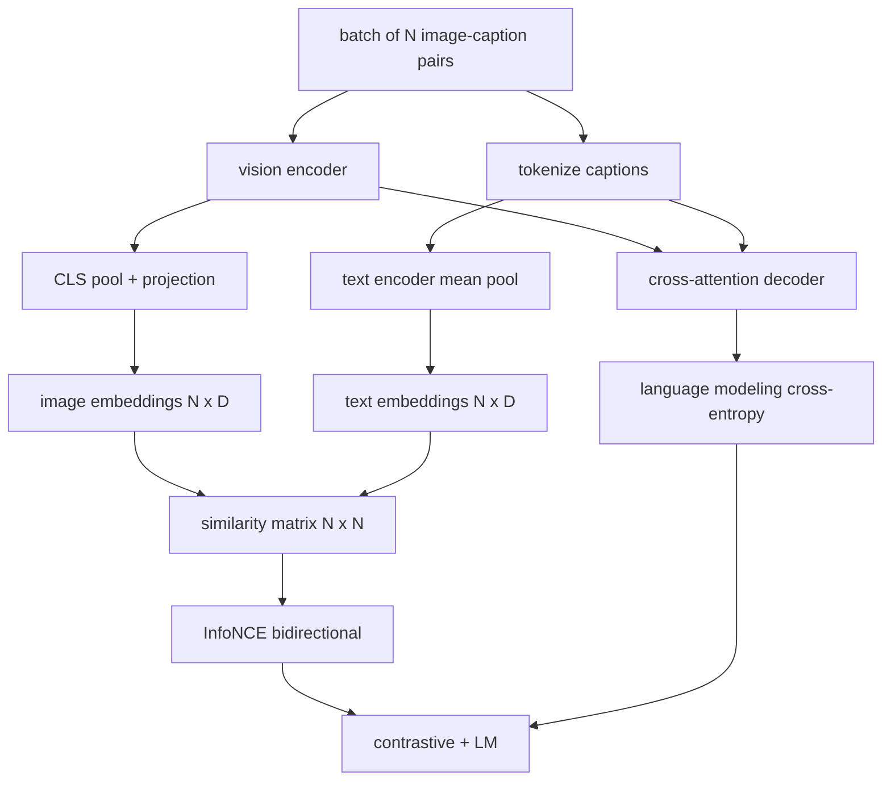

# Vision-Language Pretraining | 视觉-语言预训练

> The encoder, projection, and decoder are wired. Now train them together. Two objectives drive learning: a contrastive image-text loss (InfoNCE) that pulls matching pairs together in the joint embedding space, and a language modeling loss that asks the decoder to caption each image. Combined, they teach the network both to find the right image for a caption and to write a caption for the image.

> **【中文解读】** 编码器、投影层、解码器都接好了，本课把它们一起训练。两个目标驱动学习：对比图文损失（InfoNCE）在联合嵌入空间把配对拉拢；语言建模损失要求解码器为每张图写描述。两者合起来，网络既学会"按描述找对图"，也学会"看图写描述"——多模态视觉路线的收官。

> **【拓展：单技能 vs 双技能→CLIP 与 GPT-4V 的分工被一个多目标统一】** 只会排序的 CLIP 不会写描述；会写描述的 GPT-4V 得另配检索头排序。CoCa、BLIP、SigLIP 一脉用多目标预训练一次拿到双技能。本课的组合损失（对比 + LM）正是 CoCa 的模式，也是 LLaVA 第二阶段（解冻 LM 加 LM 损失）的模式——60 课对应第一阶段，本课对应第二阶段。

> 🔗 **【前置】** 学本课前请先掌握：59 课（ViT 编码器）、60 课（投影层与余弦对齐）、61 课（交叉注意力解码器）——本课把它们组装进一个 `MultimodalModel`；Track B 的交叉熵与训练循环基础（30-37）。

**Type:** Build | **类型:** 构建
**Languages:** Python | **语言:** Python
**Prerequisites:** Phase 19 lessons 30-37 (Track B foundations) | **前置知识:** Phase 19 · 30-37（Track B 基础）
**Time:** ~90 minutes | **时间:** 约 90 分钟

## Learning Objectives | 学习目标

- Implement InfoNCE contrastive loss across a batch of image-caption pairs.
  中文翻译：跨一批图像-描述配对实现 InfoNCE 对比损失。
- Compose contrastive loss with autoregressive language modeling loss.
  中文翻译：把对比损失与自回归语言建模损失组合起来。
- Synthesize a 200-pair mock image-caption corpus with no real dataset download.
  中文翻译：合成 200 对模拟图文语料，无需下载真实数据集。
- Run a 50-step demo training loop and observe both losses decreasing.
  中文翻译：跑一个 50 步的 demo 训练循环，观察两个损失同步下降。

## The Problem | 问题引入

> **【中文解读】** 视觉-语言模型需要两种技能：排序（给描述，从一堆图里挑对图）与生成（给图，写描述）。只预训一种技能等于只有半个系统——CLIP 会排序不会写描述；GPT-4V 会写描述但排序要另配检索头。InfoNCE 管排序半边：N 对配对当正样本、`N^2 - N` 个错配当负样本，对 `(N, N)` 相似度矩阵跑交叉熵。LM 损失管生成半边：以图像为条件的标准下一词元预测。两个损失都可微，共享编码器、投影器、解码器权重。

A vision-language model needs two skills. It must rank: given a caption, find the right image among many. It must generate: given an image, write a caption. Pretraining the model on one skill alone gives you half a system. CLIP nailed ranking but cannot caption. GPT-4V can caption but uses a separate retrieval head for ranking. Multi-objective pretraining gets both in one pass.

> 视觉-语言模型需要两种技能。它必须会排序：给定一条描述，从许多图中找到对的图。它必须会生成：给定一张图，写出一条描述。只对一种技能做预训练得到的是半个系统。CLIP 拿下了排序但不会写描述。GPT-4V 会写描述但排序要另用检索头。多目标预训练一次拿到两者。

InfoNCE handles the ranking half. For a batch of N pairs, the model treats the N matching pairs as positives and the `N^2 - N` mismatched pairs as negatives, then runs a cross-entropy loss on the resulting `(N, N)` similarity matrix. The LM loss handles the generation half: standard next-token prediction conditioned on the image. Both losses are differentiable and can share the encoder, projector, and decoder weights.

> InfoNCE 负责排序那一半。对一批 N 个配对，模型把 N 个匹配对当正样本、`N^2 - N` 个错配对当负样本，然后对得到的 `(N, N)` 相似度矩阵跑交叉熵损失。LM 损失负责生成那一半：以图像为条件的标准下一词元预测。两个损失都可微，且能共享编码器、投影器和解码器权重。

## The Concept | 核心概念



### InfoNCE in one paragraph | 一段话讲清 InfoNCE

> 💡 **【类比】** InfoNCE 像一场"照片配字幕"抢答赛：N 张照片、N 句字幕混在桌上，裁判（交叉熵）要求第 `i` 句字幕的第一名必须是第 `i` 张照片（按行对角），反过来第 `i` 张照片的第一名也必须是第 `i` 句字幕（按列对角）。温度 `tau` 是裁判的严格程度：太严（tau 小）只盯着最像的错误配对吹哨，训练噪声大；太松（tau 大）全场打分都差不多，梯度消失。CLIP 干脆把 `tau` 也当参数学。

Stack the N image embeddings as rows and the N text embeddings as rows. L2-normalize both. Compute the `N x N` matrix `S = I T^T / tau` where `tau` is a learned temperature. The diagonal entries are the matching pairs; off-diagonal entries are negatives. Apply cross-entropy with the target `argmax` running down the diagonal: row `i` should have its highest entry in column `i`. Do the same symmetrically along columns. The total is the average of the two. This is the CLIP loss in eight lines.

> 把 N 个图像嵌入按行堆叠，N 个文本嵌入也按行堆叠。两者都做 L2 归一化。计算 `N x N` 矩阵 `S = I T^T / tau`，其中 `tau` 是可学习的温度。对角线元素是匹配对；非对角线元素是负样本。施加交叉熵，目标 `argmax` 沿对角线排列：第 `i` 行的最高分应落在第 `i` 列。再沿列对称做一遍。总数取两者平均。这就是八行代码写完的 CLIP 损失。

### Temperature matters | 温度很重要

The temperature `tau` controls how peaked the softmax is. Too small (e.g. `tau = 0.01`) and the gradient comes only from the very hardest negative, training is noisy. Too large and the softmax flattens and gradient vanishes. CLIP learns `tau` as a parameter; the demo here does the same.

> 温度 `tau` 控制 softmax 有多尖。太小（如 `tau = 0.01`）时梯度只来自最困难的负样本，训练噪声大。太大时 softmax 变平、梯度消失。CLIP 把 `tau` 作为参数学习；本课的 demo 也是这么做的。

### Language modeling loss | 语言建模损失

The decoder consumes image memory tokens via cross-attention and predicts the next text token at every position. Loss is standard cross-entropy with the next-position target. Padding positions are masked out of the loss.

> 解码器经交叉注意力消费图像记忆词元，并在每个位置预测下一个文本词元。损失是以下一位置为标准的标准交叉熵。填充位置被从损失中掩掉。

### Combining the losses | 组合损失

`total = contrastive + lm_weight * lm` where `lm_weight` is a scalar (often 1.0). The two losses share gradients into the encoder and projection; only the decoder receives LM-loss gradient. This is the multi-task recipe that CoCa, BLIP, and SigLIP-style models all use, with various weightings.

> `total = contrastive + lm_weight * lm`，其中 `lm_weight` 是标量（常取 1.0）。两个损失把梯度共享进编码器和投影层；只有解码器接收 LM 损失的梯度。这就是 CoCa、BLIP、SigLIP 式模型都在用的多任务配方，只是权重各有不同。

| Component | Loss surface | Affects |
|-----------|--------------|---------|
| InfoNCE | Pair ranking in the joint space | Encoder + projection + text head |
| LM | Token prediction conditioned on image | Encoder + projection + decoder |
| Combined | Multi-task | Whole stack |

### Why 50 steps is enough for a demo | 为什么 50 步对 demo 足够

> **【中文解读】** 模拟语料是随机图 + 随机描述 id 的 200 对合成集。batch 16 跑 50 步 SGD，两个损失肉眼可见下降——即使绝对值高于真实数据模型的水平。demo 的目的是确认梯度管线端到端畅通，且加 LM 损失不会破坏对比目标的稳定性。真实模型训几百万步，动力学相同。

The mock corpus is a synthetic 200-pair set with random images and random caption ids. After 50 SGD steps with batch size 16, both losses drop visibly even if the absolute values stay above what a real-data model would achieve. The point of the demo is to confirm the gradient plumbing works end to end and that adding the LM loss does not destabilize the contrastive objective.

> 模拟语料是由随机图像和随机描述 id 组成的 200 对合成集。batch 大小 16 跑 50 步 SGD 后，两个损失都肉眼可见地下降，即使绝对值仍高于真实数据模型能达到的水平。demo 的重点是确认梯度管线端到端工作，且加入 LM 损失不会破坏对比目标的稳定性。

```figure
ch-infonce-diagonal
```

## Build It | 动手实现

> **【中文解读】** `code/main.py` 把 59-61 课的部件组装进 `MultimodalModel`（小 ViT + MLP 投影器 + 文本侧均值池化编码器 + 交叉注意力解码器），加上 `info_nce_loss`（双向 CLIP 式对比损失）、`lm_loss`（带掩码的下一词元交叉熵）、`make_mock_corpus`（200 对确定性配对）。训练循环 50 步、batch 16、Adam、可学习 log-温度，每 5 步打印双损失——对比损失从 `ln(16)=2.77` 向 2.4 走，LM 损失从随机基线 `ln(512)≈6.24` 向 4.7 走，证明梯度接对了。

`code/main.py` implements:

- `MultimodalModel`, combining a small ViT encoder, the MLP projector, a tiny text-side encoder (mean-pool over embedded ids), and the cross-attention decoder from lesson 61.
- `info_nce_loss(image_emb, text_emb, temperature)`, the bidirectional CLIP-style contrastive loss.
- `lm_loss(logits, target_ids, padding_id)`, masked next-token cross-entropy.
- `make_mock_corpus(seed, n_pairs)`, returning 200 deterministic (image, caption_ids) pairs.
- A training loop running 50 steps with batch size 16, Adam optimizer, and a learned log-temperature parameter. Both losses are printed every 5 steps.

Run it:

```bash
python3 code/main.py
```

Output: contrastive loss drops from about `ln(16) = 2.77` toward 2.4; LM loss drops from a random-uniform baseline of `ln(512) ≈ 6.24` toward about 4.7. Both decreases prove the gradient is wired correctly. Real models train for millions of steps; the dynamics are the same.

> 输出：对比损失从约 `ln(16) = 2.77` 降到 2.4 附近；LM 损失从随机均匀基线 `ln(512) ≈ 6.24` 降到约 4.7。两个下降都证明梯度接对了。真实模型训练几百万步；动力学是相同的。

## Use It | 用框架实现

> **【中文解读】** 本课的损失配方就是生产里的那一套：CLIP（仅对比）、CoCa（对比 + 描述 LM，正是本课模式）、BLIP/BLIP-2（对比 + LM + 图文匹配三头）、SigLIP（把 InfoNCE 换成 sigmoid 逐对损失，角色不变）、LLaVA（两阶段：60 课对应第一阶段对齐，本课对应第二阶段加 LM 损失解冻 LM）。

This is the same loss recipe shipped in:

- **CLIP (2021).** Image-text contrastive only, with a separate frozen-encoder caption probe.
  中文翻译：**CLIP（2021）。** 仅图文对比，另配一个冻结编码器的描述探针。
- **CoCa (2022).** Image-text contrastive plus image-captioning LM loss in one model. The exact pattern this lesson builds.
  中文翻译：**CoCa（2022）。** 图文对比加图像描述 LM 损失合入一个模型。正是本课搭建的模式。
- **BLIP (2022) and BLIP-2.** Contrastive plus LM plus image-text matching head. Three losses combined.
  中文翻译：**BLIP（2022）与 BLIP-2。** 对比加 LM 加图文匹配头。三个损失组合。
- **SigLIP (2023).** Switches InfoNCE for a sigmoid pair loss; same contrastive role, different functional form.
  中文翻译：**SigLIP（2023）。** 把 InfoNCE 换成 sigmoid 逐对损失；对比角色相同，函数形式不同。
- **LLaVA family.** Two-stage training where stage one is alignment (cosine on a frozen LM) and stage two adds LM loss with an unfrozen LM. Lesson 60 maps to stage one; this lesson maps to stage two.
  中文翻译：**LLaVA 家族。** 两阶段训练：第一阶段对齐（冻结 LM 上做余弦），第二阶段解冻 LM 加 LM 损失。60 课对应第一阶段；本课对应第二阶段。

## Tests | 测试

`code/test_main.py` covers:

- InfoNCE loss is symmetric across image/text rows
  中文翻译：InfoNCE 损失在图像/文本行之间对称。
- InfoNCE loss returns 0 when the similarity matrix is a perfect diagonal of large positive numbers
  中文翻译：当相似度矩阵是大正数的完美对角阵时，InfoNCE 损失返回 0。
- LM loss correctly masks padding positions
  中文翻译：LM 损失正确掩掉填充位置。
- model forward pass produces both losses without errors
  中文翻译：模型前向无错地产出两个损失。
- 5-step training loop reduces the combined loss
  中文翻译：5 步训练循环降低组合损失。

Run them:

```bash
python3 -m unittest code/test_main.py
```

## Exercises | 练习题

1. Replace InfoNCE with SigLIP-style sigmoid pair loss and compare convergence on the mock corpus.
   中文翻译：把 InfoNCE 换成 SigLIP 式 sigmoid 逐对损失，在模拟语料上比较收敛速度。

2. Add a hard-negative mining step: every other batch, select the hardest off-diagonal pair from the previous batch and append it. Train and inspect whether contrastive loss drops faster.
   中文翻译：加一步困难负样本挖掘：每隔一批，从上一批里挑最困难的非对角配对追加进来。训练并观察对比损失是否降得更快。

3. Add an image-text matching binary head on top of the joint embedding (true/false: do these match?) for a third loss, replicating BLIP's three-head setup.
   中文翻译：在联合嵌入之上加一个图文匹配二分类头（对/错：这俩配对吗？）作为第三个损失，复刻 BLIP 的三头设置。

4. Replace the mock corpus with caption-id sequences drawn from a Markov chain whose transition matrix is conditioned on image hash. The captioning loss should drop further because there is actual learnable signal.
   中文翻译：把模拟语料换成由马尔可夫链生成的描述 id 序列，其转移矩阵以图像哈希为条件。描述损失应降得更多，因为存在真正可学的信号。

5. Train the same model with `lm_weight = 0` and again with `lm_weight = 1`. Compare contrastive loss; the LM loss should not regress the ranking objective.
   中文翻译：分别用 `lm_weight = 0` 和 `lm_weight = 1` 训练同一模型。比较对比损失；LM 损失不应使排序目标退化。

## Key Terms | 术语速查表

> **【中文解读】** 五个词：InfoNCE（噪声对比估计——相似度矩阵上的交叉熵）、Temperature（温度——控制对比 softmax 尖锐度的标量）、Hard negative（困难负样本——模型觉得难分的非对角配对）、LM loss（LM 损失——描述侧的标准下一词元交叉熵）、Joint embedding space（联合嵌入空间——投影后图文向量共同居住的共享空间）。

| Term | What it means |
|------|---------------|
| InfoNCE | Noise contrastive estimation: cross-entropy on a similarity matrix |
| Temperature | Scalar that controls how peaked the contrastive softmax is |
| Hard negative | An off-diagonal pair the model finds confusing, useful for sampling |
| LM loss | Standard next-token cross-entropy on the captioning side |
| Joint embedding space | The shared space where image and text vectors live after projection |

## Further Reading | 延伸阅读

- CLIP paper for the original contrastive recipe.
  中文翻译：CLIP 论文——对比配方的原点。
- CoCa paper for contrastive plus captioning in one model.
  中文翻译：CoCa 论文——对比与描述合入一个模型。
- SigLIP paper for the sigmoid pair-loss variant and why it scales better.
  中文翻译：SigLIP 论文——sigmoid 逐对损失变体及其更易扩展的原因。
