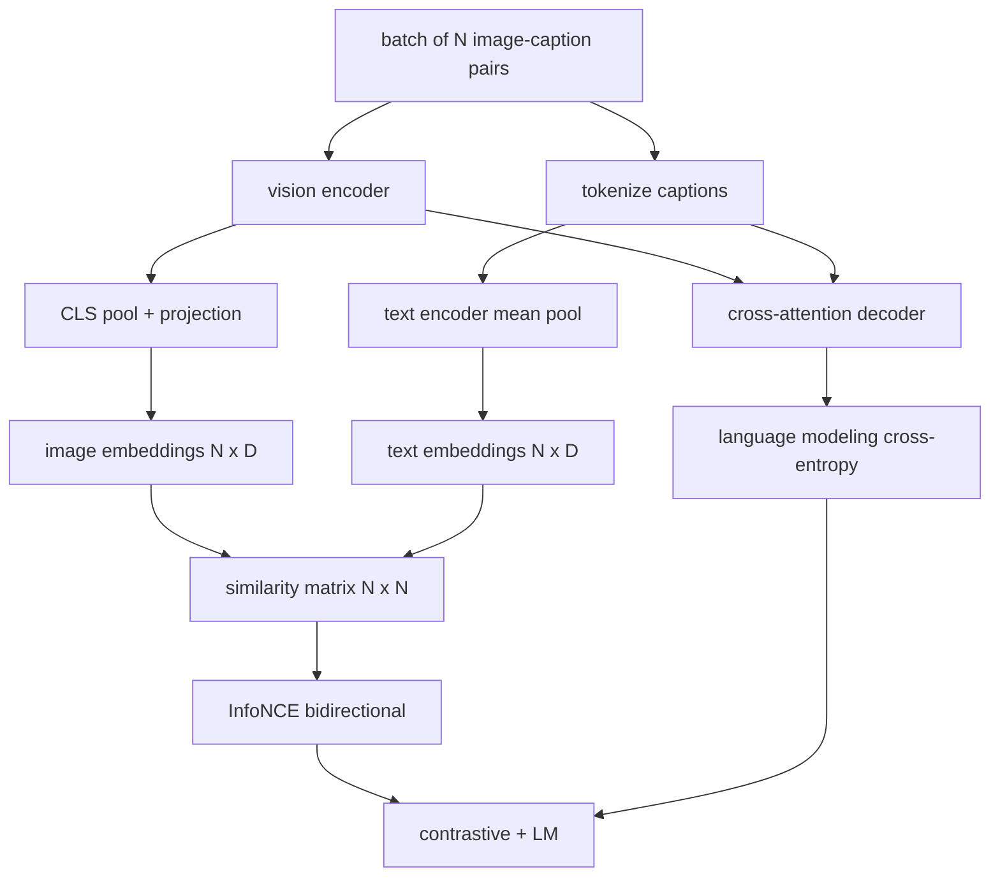

# 视觉-语言预训练

> 编码器、投影层、解码器都接好了，现在把它们放在一起训练。两个目标驱动学习：对比图文损失（InfoNCE）在联合嵌入空间把配对拉拢；语言建模损失要求解码器为每张图写描述。组合起来，网络既学会按描述找对图，也学会看图写描述。

> **【中文解读】** 本课是多模态视觉路线的收官：把 59 课编码器、60 课投影器、61 课解码器组装进一个 `MultimodalModel`，用"对比 + LM"双目标在合成语料上联合训练。学完你应能实现 InfoNCE、组合两种损失、造模拟语料，并在 50 步 demo 里看到双损失同步下降。

> **【拓展：单技能 vs 双技能→CLIP 与 GPT-4V 的分工被一个多目标统一】** 只会排序的 CLIP 不会写描述；会写描述的 GPT-4V 得另配检索头排序。CoCa、BLIP、SigLIP 一脉用多目标预训练一次拿到双技能。本课的组合损失（对比 + LM）正是 CoCa 的模式，也是 LLaVA 第二阶段（解冻 LM 加 LM 损失）的模式——60 课对应第一阶段，本课对应第二阶段。

> 🔗 **【前置】** 学本课前请先掌握：59 课（ViT 编码器）、60 课（投影层与余弦对齐）、61 课（交叉注意力解码器）——本课把它们组装进一个 `MultimodalModel`；Track B 的交叉熵与训练循环基础（30-37）。

**类型：** 构建
**语言：** Python
**前置条件：** Phase 19 · 30-37（Track B 基础）
**预计用时：** 约 90 分钟

## 学习目标

- 跨一批图像-描述配对实现 InfoNCE 对比损失。
- 把对比损失与自回归语言建模损失组合起来。
- 合成 200 对模拟图文语料，无需下载真实数据集。
- 跑一个 50 步的 demo 训练循环，观察两个损失同步下降。

## 问题引入

> **【中文解读】** 排序 + 生成，缺一就是半个系统。InfoNCE 管排序（N 对正样本、`N^2 - N` 个负样本、`(N, N)` 相似度矩阵上的交叉熵）；LM 损失管生成（以图像为条件的下一词元预测）。两个损失共享编码器、投影器、解码器权重。

视觉-语言模型需要两种技能。它必须会排序：给定一条描述，从许多图中找到对的图。它必须会生成：给定一张图，写出一条描述。只对一种技能做预训练得到的是半个系统。CLIP 拿下了排序但不会写描述。GPT-4V 会写描述但排序要另用检索头。多目标预训练一次拿到两者。

InfoNCE 负责排序那一半。对一批 N 个配对，模型把 N 个匹配对当正样本、`N^2 - N` 个错配对当负样本，然后对得到的 `(N, N)` 相似度矩阵跑交叉熵损失。LM 损失负责生成那一半：以图像为条件的标准下一词元预测。两个损失都可微，且能共享编码器、投影器和解码器权重。

## 核心概念



### 一段话讲清 InfoNCE

> 💡 **【类比】** InfoNCE 像一场"照片配字幕"抢答赛：N 张照片、N 句字幕混在桌上，裁判（交叉熵）要求第 `i` 句字幕的第一名必须是第 `i` 张照片（按行对角），反过来第 `i` 张照片的第一名也必须是第 `i` 句字幕（按列对角）。温度 `tau` 是裁判的严格程度：太严（tau 小）只盯着最像的错误配对吹哨，训练噪声大；太松（tau 大）全场打分都差不多，梯度消失。

把 N 个图像嵌入按行堆叠，N 个文本嵌入也按行堆叠。两者都做 L2 归一化。计算 `N x N` 矩阵 `S = I T^T / tau`，其中 `tau` 是可学习的温度。对角线元素是匹配对；非对角线元素是负样本。施加交叉熵，目标 `argmax` 沿对角线排列：第 `i` 行的最高分应落在第 `i` 列。再沿列对称做一遍。总数取两者平均。这就是八行代码写完的 CLIP 损失。

### 温度很重要

温度 `tau` 控制 softmax 有多尖。太小（如 `tau = 0.01`）时梯度只来自最困难的负样本，训练噪声大。太大时 softmax 变平、梯度消失。CLIP 把 `tau` 作为参数学习；本课的 demo 也是这么做的。

### 语言建模损失

解码器经交叉注意力消费图像记忆词元，并在每个位置预测下一个文本词元。损失是以下一位置为标准的标准交叉熵。填充位置被从损失中掩掉。

### 组合损失

> **【中文解读】** `total = contrastive + lm_weight * lm`。对比损失把梯度送进编码器、投影器和文本头；LM 损失额外覆盖解码器。这就是 CoCa、BLIP、SigLIP 一脉的多任务配方，只是权重各有不同。

`total = contrastive + lm_weight * lm`，其中 `lm_weight` 是标量（常取 1.0）。两个损失把梯度共享进编码器和投影层；只有解码器接收 LM 损失的梯度。这就是 CoCa、BLIP、SigLIP 式模型都在用的多任务配方，只是权重各有不同。

| 组件 | 损失面 | 影响 |
|------|--------|------|
| InfoNCE | 联合空间中的配对排序 | 编码器 + 投影器 + 文本头 |
| LM | 以图像为条件的词元预测 | 编码器 + 投影器 + 解码器 |
| 组合 | 多任务 | 整个栈 |

### 为什么 50 步对 demo 足够

模拟语料是由随机图像和随机描述 id 组成的 200 对合成集。batch 大小 16 跑 50 步 SGD 后，两个损失都肉眼可见地下降，即使绝对值仍高于真实数据模型能达到的水平。demo 的重点是确认梯度管线端到端工作，且加入 LM 损失不会破坏对比目标的稳定性。

```figure
ch-infonce-diagonal
```

## 动手实现

> **【中文解读】** 代码组装 `MultimodalModel`（小 ViT + MLP 投影器 + 文本均值池化编码器 + 61 课交叉注意力解码器），实现 `info_nce_loss`（双向 CLIP 式）、`lm_loss`（掩码下一词元交叉熵）、`make_mock_corpus`（200 对确定性配对）。训练循环 50 步、batch 16、Adam、可学习 log-温度，每 5 步打印双损失。

`code/main.py` 实现了：

- `MultimodalModel`：组合小 ViT 编码器、MLP 投影器、微型文本侧编码器（对嵌入 id 做均值池化）和 61 课的交叉注意力解码器。
- `info_nce_loss(image_emb, text_emb, temperature)`：双向 CLIP 式对比损失。
- `lm_loss(logits, target_ids, padding_id)`：带掩码的下一词元交叉熵。
- `make_mock_corpus(seed, n_pairs)`：返回 200 对确定性的（图像, 描述 id）配对。
- 一个训练循环：50 步、batch 大小 16、Adam 优化器、可学习 log-温度参数。两个损失每 5 步打印一次。

运行：

```bash
python3 code/main.py
```

输出：对比损失从约 `ln(16) = 2.77` 降到 2.4 附近；LM 损失从随机均匀基线 `ln(512) ≈ 6.24` 降到约 4.7。两个下降都证明梯度接对了。真实模型训练几百万步；动力学是相同的。

## 用框架实现

本课的损失配方就是生产里交付的那一套：

- **CLIP（2021）。** 仅图文对比，另配一个冻结编码器的描述探针。
- **CoCa（2022）。** 图文对比加图像描述 LM 损失合入一个模型。正是本课搭建的模式。
- **BLIP（2022）与 BLIP-2。** 对比加 LM 加图文匹配头。三个损失组合。
- **SigLIP（2023）。** 把 InfoNCE 换成 sigmoid 逐对损失；对比角色相同，函数形式不同。
- **LLaVA 家族。** 两阶段训练：第一阶段对齐（冻结 LM 上做余弦），第二阶段解冻 LM 加 LM 损失。60 课对应第一阶段；本课对应第二阶段。

## 测试

`code/test_main.py` 覆盖：

- InfoNCE 损失在图像/文本行之间对称。
- 当相似度矩阵是大正数的完美对角阵时，InfoNCE 损失返回 0。
- LM 损失正确掩掉填充位置。
- 模型前向无错地产出两个损失。
- 5 步训练循环降低组合损失。

运行：

```bash
python3 -m unittest code/test_main.py
```

## 练习题

1. 把 InfoNCE 换成 SigLIP 式 sigmoid 逐对损失，在模拟语料上比较收敛速度。

2. 加一步困难负样本挖掘：每隔一批，从上一批里挑最困难的非对角配对追加进来。训练并观察对比损失是否降得更快。

3. 在联合嵌入之上加一个图文匹配二分类头（对/错：这俩配对吗？）作为第三个损失，复刻 BLIP 的三头设置。

4. 把模拟语料换成由马尔可夫链生成的描述 id 序列，其转移矩阵以图像哈希为条件。描述损失应降得更多，因为存在真正可学的信号。

5. 分别用 `lm_weight = 0` 和 `lm_weight = 1` 训练同一模型。比较对比损失；LM 损失不应使排序目标退化。

## 术语速查表

| 术语 | 含义 |
|------|------|
| InfoNCE | 噪声对比估计：相似度矩阵上的交叉熵 |
| Temperature（温度） | 控制对比 softmax 尖锐度的标量 |
| Hard negative（困难负样本） | 模型觉得难分的非对角配对，适合用于采样 |
| LM loss（LM 损失） | 描述侧的标准下一词元交叉熵 |
| Joint embedding space（联合嵌入空间） | 投影后图像与文本向量共同居住的共享空间 |

## 延伸阅读

- CLIP 论文——对比配方的原点。
- CoCa 论文——对比与描述合入一个模型。
- SigLIP 论文——sigmoid 逐对损失变体及其更易扩展的原因。
