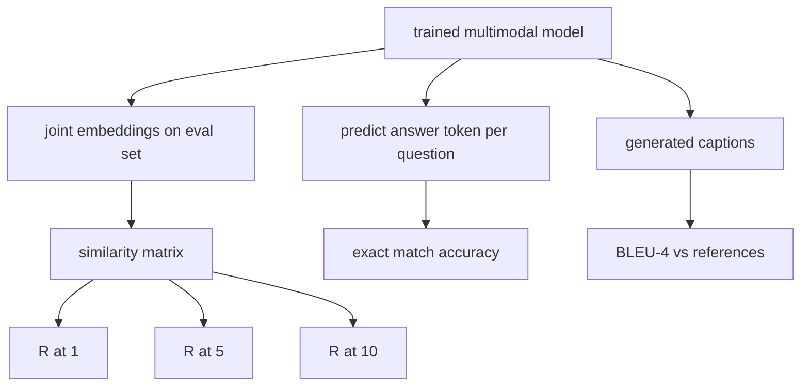

# Multimodal Evaluation | 多模态评测

> Training is half the loop. The other half is measurement. This lesson builds three evaluation surfaces from primitives: image-caption retrieval reported as R@1, R@5, R@10; visual question answering reported as exact match accuracy; and image captioning reported as BLEU-4. Each metric is a function over the model's outputs and a synthetic eval suite that runs in seconds.

> **【中文解读】** 训练只是闭环的一半，另一半是度量。本课从原语出发搭建三个评测面：图文检索（报告 R@1、R@5、R@10）、视觉问答（报告精确匹配准确率）、图像描述生成（报告 BLEU-4）。每个指标都是"模型输出之上的一个函数"，再配一个几秒钟就能跑完的合成评测集。学完本课你应能用纯 Python 亲手实现多模态评测的三大标准指标，而不把它们当成黑盒工具。

> **【拓展：多模态评测生态】** 这三个指标正是学界与工业界的标准汇报口径：CLIP 式图文检索用 R@K 报告，VQA v2 用（软）精确匹配报告问答，MS-COCO 描述生成赛道用 BLEU-4/CIDEr 排名。本课的函数签名与这些基准的官方评测脚本同构——把合成评测集换成真实数据文件，指标函数一行都不用改。

> 🔗 **【前置】** 学本课前请先完成 Phase 19 · 58-62（视觉路线基础：视觉编码器分块、Vision Transformer 编码器、模态对齐投影层、交叉注意力融合、视觉-语言预训练）——本课直接加载第 62 课的多模态模型做训练前后对比评测；另需余弦相似度与 n-gram 精确率的概念基础。

**Type:** Build | **类型:** 构建
**Languages:** Python | **语言:** Python
**Prerequisites:** Phase 19 lessons 58-62 (Track E foundations: encoder, transformer, projection, cross-attention fusion, pretraining) | **前置知识:** Phase 19 · 58-62（视觉路线基础：编码器、Transformer、投影层、交叉注意力融合、预训练）
**Time:** ~90 minutes | **时间:** 约 90 分钟

## Learning Objectives | 学习目标

- Compute Recall@K from a similarity matrix between image and caption embeddings.
  中文翻译：从图像与描述文本嵌入之间的相似度矩阵计算 Recall@K。
- Compute exact-match VQA accuracy from a model that maps (image, question) pairs to a fixed answer vocabulary.
  中文翻译：基于把（图像，问题）对映射到固定答案词表的模型，计算视觉问答的精确匹配准确率。
- Compute BLEU-4 from generated and reference token sequences without any external library.
  中文翻译：不依赖任何外部库，从生成序列与参考 token 序列计算 BLEU-4。
- Run all three evals against a synthetic suite built on top of the trained model from lesson 62.
  中文翻译：在基于第 62 课训练模型构建的合成评测套件上运行全部三项评测。

## The Problem | 问题引入

> **【中文解读】** 本节回答"训练损失收敛了，为什么还不能宣布模型完工"。训练损失只度量训练分布上的拟合，不度量模型能否在留出批次里排对图文对、能否答对问题、能否写出人类能接受的描述。多模态领域的标准做法是三个评测面各用各的指标：检索用 R@K、问答用精确匹配、描述生成用 BLEU-4。每个指标都是一个薄函数——亲手实现它们，数学才具体，评测面才真正在你的掌控之下。

The temptation is to declare a multimodal model finished when the training loss plateaus. Training loss measures fit on the training distribution; it does not measure whether the model can rank pairs in a held-out batch, answer a question, or write a caption a human would accept. Three eval surfaces are standard:

> 训练损失一进入平台期，人们就忍不住宣布多模态模型完工。训练损失度量的是在训练分布上的拟合；它不度量模型能否在一个留出批次里排对图文对、能否回答一个问题、能否写出一段人类愿意接受的描述。标准的做法是三个评测面：

- **Retrieval (R@1, R@5, R@10).** Build the joint embedding for a query caption; rank every image in the eval pool by cosine; report whether the matching image lands in the top 1, top 5, top 10. Symmetric (image-to-text) form runs the same way.
  中文翻译：**检索（R@1、R@5、R@10）。** 为查询描述构建联合嵌入；把评测池里的每张图按余弦相似度排序；报告匹配图像是否落在前 1、前 5、前 10。对称形式（图找文）按同样方式运行。
- **Visual question answering (exact match).** Given (image, question), the model outputs an answer token. Exact match is one-bit per sample: did the predicted answer equal the reference answer? Average over the eval set.
  中文翻译：**视觉问答（精确匹配）。** 给定（图像，问题），模型输出一个答案 token。精确匹配是每样本一比特：预测答案是否等于参考答案？在评测集上取平均。
- **Captioning (BLEU-4).** Generate a caption. Compute the geometric mean of 1-gram through 4-gram precisions against reference captions, with a brevity penalty. Multi-reference is the standard form (one image, several reference captions).
  中文翻译：**描述生成（BLEU-4）。** 生成一段描述；对照参考描述计算 1-gram 到 4-gram 精确率的几何平均，并施加简短惩罚。多参考是标准形式（一张图、多段参考描述）。

Each metric is a thin function. The lesson builds them all in code so the math is concrete and the surface stays under your control. Real benchmark suites (MS-COCO, VQA v2, GQA, OK-VQA) plug into the same function shapes.

> 每个指标都是一个薄函数。本课把它们全部用代码实现，让数学变得具体、让评测面处于你的掌控之下。真实基准套件（MS-COCO、VQA v2、GQA、OK-VQA）可以直接插进同样的函数形状。

## The Concept | 核心概念

> **【中文解读】** 三条评测路径共用一个已训练模型：检索路径算出 N×N 余弦相似度矩阵后看对角线落在前 K 名的比例；问答路径逐条读出答案 token 做精确匹配；描述生成路径对生成序列算带简短惩罚的 4-gram 精确率几何平均。三者全部可以在几秒内于内存中的合成套件上完成，这让你能快速迭代，而不是每改一次就等一晚上的评测。



### Recall@K from a similarity matrix

Build the `(N, N)` cosine similarity matrix between image and caption embeddings. For each row, sort the columns by descending similarity. Recall@K is the fraction of rows where the diagonal column index lies within the top K positions. Symmetric Recall@K (caption-to-image) is computed on the transposed matrix. Both numbers are reported. For an N=100 eval, R@1 = 0.6 means 60 of the 100 captions retrieved their correct image as the top match.

> 在图像嵌入与描述嵌入之间构建 `(N, N)` 余弦相似度矩阵。对每一行，把各列按相似度降序排列。Recall@K 就是"对角线列索引落在前 K 个位置"的行所占的比例。对称的 Recall@K（文找图）在转置矩阵上计算。两个方向的数字都要报告。对 N=100 的评测，R@1 = 0.6 意味着 100 条描述中有 60 条把正确图像检索为第一名。

### VQA exact match

For each (image, question, answer), encode the image, embed the question, fuse via the decoder, and read out the next token. The predicted token id is compared to the reference id; correct if equal. Average over the eval set. Real VQA datasets ship with multiple human-annotated answers per question and use a soft-accuracy formula (1.0 if at least 3 of 10 annotators agree, scaled below); the lesson uses single-answer exact match for clarity.

> 对每条（图像，问题，答案）：编码图像、嵌入问题、经解码器融合、读出下一个 token。预测 token id 与参考 id 比较，相等即正确，在评测集上取平均。真实 VQA 数据集每个问题带多个人工标注答案，并使用软准确率公式（10 个标注者中至少 3 人一致记 1.0，更低则按比例缩放）；本课为了清晰起见使用单答案精确匹配。

### BLEU-4

```text
BLEU-4 = BP * exp(mean(log p1, log p2, log p3, log p4))
```

Where `p_n` is the modified n-gram precision (clipped count of generated n-grams that appear in any reference, divided by total generated n-grams), and `BP` is the brevity penalty:

> 其中 `p_n` 是修正后的 n-gram 精确率（生成 n-gram 中出现在任一参考里的裁剪计数，除以生成的 n-gram 总数），`BP` 是简短惩罚：

```text
BP = 1                if generated length > reference length
   = exp(1 - r/g)     otherwise, where r is reference length and g is generated
```

Smoothing is needed for small samples where some `p_n` is zero. The implementation uses Chen and Cherry "method 1" (add 1 to numerator and denominator for any zero count), which is the safest default for low-count regimes.

> 小样本下某些 `p_n` 可能为零，需要平滑。实现采用 Chen 与 Cherry 的"方法 1"（对任何零计数，分子分母各加 1）——这是低计数场景下最安全的默认选择。

### Synthetic eval suite

> **【中文解读】** 评测套件沿用第 62 课的合成语料模式、换一个留出种子在内存中生成 50 个样本，三条列表分别服务检索、问答、描述生成。关键纪律是"数据模型从未见过"：种子与训练语料不相交，指标才有意义。随机基线表给了判断标准——50 步训练后的指标不必高，但必须高于随机基线，这正是演示程序检查的内容。

A 50-sample eval suite is built in memory from the same mock corpus pattern used in lesson 62, with a held-out seed. Three lists make up the suite:

> 一个 50 样本的评测套件在内存中构建，沿用第 62 课的合成语料模式，但使用留出的种子。套件由三条列表组成：

- `pairs`: 50 (image, caption_ids) pairs for retrieval.
  中文翻译：`pairs`：50 个用于检索的（图像，描述 id）对。
- `vqa`: 50 (image, question_ids, answer_id) triples.
  中文翻译：`vqa`：50 个（图像，问题 id，答案 id）三元组。
- `caps`: 50 (image, [reference_caption_ids, ...]) entries with up to 3 references per image.
  中文翻译：`caps`：50 个（图像，[参考描述 id 列表]）条目，每张图最多 3 条参考。

The suite is deterministic from the seed and held out from the training corpus, so the metrics are computed on data the model never saw. Persisting the suite to JSON is left as an exercise (see below).

> 套件由种子确定性地生成，并与训练语料留出分离，因此指标是在模型从未见过的数据上计算的。把套件持久化为 JSON 留作练习（见下文）。

| Metric | Range | Random baseline (N=50) |
|--------|-------|------------------------|
| R@1 | 0 to 1 | 0.02 (1 / N) |
| R@5 | 0 to 1 | 0.10 |
| R@10 | 0 to 1 | 0.20 |
| VQA EM | 0 to 1 | 1 / vocab |
| BLEU-4 | 0 to 1 | small but nonzero |

For a 50-step training run on synthetic data, the metrics are not expected to be high; they are expected to be above the random baseline, which is what the demo checks.

> 对合成数据上的 50 步训练而言，指标不要求高；要求的是高于随机基线——这正是演示程序检查的内容。

```figure
ch-recall-window
```

## Build It | 动手实现

> **【中文解读】** `code/main.py` 把三个指标实现成可独立测试的纯函数，再提供 `build_eval_suite` 与 `evaluate` 串起整个评测循环。演示加载第 62 课的全新初始化模型先评一次，训练 50 步后再评一次，打印前后对比——让你亲眼看到指标从接近随机涨到体现模型学到的信号。

`code/main.py` implements:

- `recall_at_k(sim_matrix, k)`, returning a float in `[0, 1]` for both directions.
  中文翻译：`recall_at_k(sim_matrix, k)`，两个方向都返回 `[0, 1]` 内的浮点数。
- `vqa_exact_match(predictions, references)`, returning the mean over `int` equality.
  中文翻译：`vqa_exact_match(predictions, references)`，返回整数相等结果的均值。
- `bleu4(generated, references, smoothing=True)`, with multi-reference support.
  中文翻译：`bleu4(generated, references, smoothing=True)`，支持多参考。
- `build_eval_suite(seed, n_samples, vocab_size, max_len)`, returning three deterministic eval lists.
  中文翻译：`build_eval_suite(seed, n_samples, vocab_size, max_len)`，返回三条确定性的评测列表。
- `evaluate(model, suite)`, which runs all three metrics and returns a `dict` of numbers.
  中文翻译：`evaluate(model, suite)`，运行全部三项指标并返回一个数字 `dict`。
- A demo that loads a freshly-initialized multimodal model from lesson 62, evaluates it, then trains it for 50 steps and evaluates again, printing the before/after metrics.
  中文翻译：一个演示：加载第 62 课全新初始化的多模态模型，先评测，再训练 50 步后重新评测，打印前后指标对比。

Run it:

> 运行：

```bash
python3 code/main.py
```

Output: the before/after metric table shows retrieval improving from near-random toward the model's learned signal, VQA improving above random, and BLEU-4 improving (the synthetic structure is enough for a 4-gram precision lift).

> 输出：前后指标对比表显示检索从接近随机提升到体现模型学到的信号，VQA 提升到随机之上，BLEU-4 也在提升（合成结构足以带来 4-gram 精确率的抬升）。

## Use It | 用框架实现

> **【中文解读】** 本节把三个指标对接到真实基准：MS-COCO 5K 验证集、Flickr30K、ImageNet 零样本都是同一个相似度矩阵上的 R@K 问题；VQA v2、GQA、OK-VQA 用同样的精确匹配形状（VQA v2 换成软准确率）；描述生成赛道在 BLEU-4 之外再加 CIDEr、METEOR。要迁移到真实基准，只需把 `build_eval_suite` 换成真实数据加载器，函数体一行不改——数学与基准无关。

Each metric maps directly onto a production benchmark:

> 每个指标都直接对应一个生产级基准：

- **Retrieval.** MS-COCO 5K val, Flickr30K, ImageNet zero-shot are all R@K problems on the same similarity matrix. Replace the synthetic eval with the real files and the function signature is unchanged.
  中文翻译：**检索。** MS-COCO 5K 验证集、Flickr30K、ImageNet 零样本都是同一相似度矩阵上的 R@K 问题。把合成评测换成真实文件，函数签名不变。
- **VQA.** VQA v2, GQA, OK-VQA use the same exact-match shape (with soft-acc instead of single-answer EM for VQA v2).
  中文翻译：**视觉问答。** VQA v2、GQA、OK-VQA 用同样的精确匹配形状（VQA v2 用软准确率取代单答案精确匹配）。
- **BLEU-4.** MS-COCO captioning, NoCaps, Flickr30K captioning all use BLEU-4 plus CIDEr and METEOR. Adding CIDEr is one more function.
  中文翻译：**BLEU-4。** MS-COCO 描述生成、NoCaps、Flickr30K 描述生成都在 BLEU-4 之外加用 CIDEr 和 METEOR。加 CIDEr 只是再多写一个函数。

For real benchmarks, swap `build_eval_suite` for a real loader and keep the function bodies. The math is benchmark-agnostic.

> 对接真实基准时，把 `build_eval_suite` 换成真实加载器、保留函数体即可。数学与基准无关。

## Tests | 测试

`code/test_main.py` covers:

- recall@k returns 1.0 on a perfect identity similarity matrix and 0.0 on a flipped one for k < N
  中文翻译：完美恒等相似度矩阵上 recall@k 返回 1.0；k < N 时翻转矩阵上返回 0.0
- recall@k respects `k <= N` upper bound
  中文翻译：recall@k 遵守 `k <= N` 上界
- bleu4 returns 1.0 when generated equals one of the references exactly
  中文翻译：生成序列与某条参考完全一致时 bleu4 返回 1.0
- bleu4 returns 0.0 on disjoint vocabulary
  中文翻译：词表不相交时 bleu4 返回 0.0
- vqa exact match equals the fraction of equal pairs
  中文翻译：VQA 精确匹配等于相等对的比例
- build_eval_suite returns the expected number of pairs, vqa items, and caption entries
  中文翻译：build_eval_suite 返回预期数量的检索对、问答条目和描述条目

Run them:

> 运行测试：

```bash
python3 -m unittest code/test_main.py
```

## Exercises | 练习题

1. Add CIDEr to the captioning metrics. CIDEr uses TF-IDF weighting on n-grams, which rewards informative tokens.
   中文翻译：给描述生成指标加上 CIDEr。CIDEr 对 n-gram 使用 TF-IDF 加权，奖励信息量大的 token。

2. Implement soft-accuracy VQA: multiple human answers per question, accuracy is `min(human_count / 3, 1)` if any matches. Replicates VQA v2.
   中文翻译：实现软准确率 VQA：每个问题多个人工答案，若有匹配则准确率为 `min(human_count / 3, 1)`。复刻 VQA v2。

3. Add a NaN-safe variant of `bleu4` that handles empty generated sequences without crashing.
   中文翻译：给 `bleu4` 加一个 NaN 安全变体，处理空生成序列时不崩溃。

4. Compute mean reciprocal rank (MRR) alongside R@K. MRR is sensitive to where the correct item lands beyond the top K; R@K is sensitive to whether it lands in the top K.
   中文翻译：在 R@K 之外计算平均倒数排名（MRR）。MRR 敏感于正确项落在前 K 之外的什么位置；R@K 敏感于它是否落进前 K。

5. Run the eval on the model at five checkpoints during training (step 0, 10, 20, 30, 40, 50) and plot the learning curve. Confirm the metric trajectories track the loss trajectory.
   中文翻译：在训练的多个检查点（第 0、10、20、30、40、50 步）评测模型并绘制学习曲线。确认指标轨迹与损失轨迹一致。

## Key Terms | 术语速查表

| Term | What it means |
|------|---------------|
| R@K | Fraction of queries where the correct match lands in the top K results |
| Exact match | The simplest VQA scoring: predicted answer equals reference |
| BLEU-4 | Geometric mean of 1- to 4-gram precisions, with brevity penalty |
| Multi-reference | A captioning metric accepts several reference captions per image |
| Held-out | The eval set is sampled from a seed disjoint from the training corpus |

## Further Reading | 延伸阅读

- VQA v2 paper for the soft-accuracy formula and dataset statistics.
  中文翻译：VQA v2 论文——软准确率公式与数据集统计。
- CIDEr paper for TF-IDF-weighted n-gram captioning.
  中文翻译：CIDEr 论文——TF-IDF 加权 n-gram 的描述生成评测。
- BLEU original (Papineni et al., 2002) for the smoothing variants.
  中文翻译：BLEU 原始论文（Papineni 等，2002）——平滑变体。
- MS-COCO captioning eval scripts for the canonical reference implementation.
  中文翻译：MS-COCO 描述生成评测脚本——权威参考实现。
