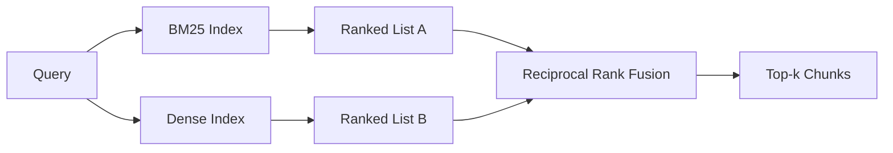

# Hybrid Retrieval with BM25 and Dense Embeddings | 混合检索：BM25 与稠密向量

> Lexical and semantic retrieval fail on opposite query distributions. Hybrid retrieval with reciprocal rank fusion does not interpolate, it votes - and the vote wins on every query class.

> **【中文解读】** 词面检索与语义检索在相反的查询分布上翻车：字面标识符查询（如 `AbortMultipartOnFail`）BM25 秒中、稠密检索排错；改述查询（"上传取消了怎么处理"）正好反过来。混合检索用倒数排名融合（RRF）把两份排序列表"投票"合并——不是分数插值。本课从 Robertson/Sparck Jones 公式从零实现 BM25，再实现稠密检索与 RRF，三种查询类型全赢。

> **【拓展：混合检索的生产版图】** 混合检索是 2025-2026 年生产 RAG 的默认形态：Elasticsearch/OpenSearch 原生 BM25，pgvector/Milvus/Qdrant 提供稠密索引，Vespa 与 Weaviate 把 RRF 做成一等公民接口。本课实现的 `1/(k+rank)` 公式出自 Cormack、Clarke、Buettcher 2009 年 SIGIR 论文，k=60 的默认值从此成为行业惯例。学完本课，你读任何一家向量数据库的 hybrid search 文档都不再有黑盒。

> 🔗 **【前置】** 学本课前请先掌握：Phase 11 · 04（嵌入）、06（RAG 基础）——向量检索与余弦相似度；Phase 19 Track B 基础（20-29 课）；第 64 课（分块策略）——本课检索的块由它切出。术语约定：hybrid retrieval=混合检索、dense=稠密、lexical=词面、RRF=倒数排名融合。

**Type:** Build | **类型:** 构建
**Languages:** Python | **语言:** Python
**Prerequisites:** Phase 11 lessons 04 (embeddings), 06 (RAG); Phase 19 Track B foundations (lessons 20-29); Phase 19 lesson 64 (chunking strategies) | **前置知识:** Phase 11 · 04（嵌入）、06（RAG）；Phase 19 Track B 基础（20-29 课）；Phase 19 · 64（分块策略）
**Time:** ~90 minutes | **时间:** 约 90 分钟

## Learning Objectives | 学习目标
- Implement BM25 from scratch from the Robertson and Sparck Jones formulation, with field weighting, document length normalization, and tunable k1 and b.
  中文翻译：按 Robertson 与 Sparck Jones 公式从零实现 BM25，带字段加权、文档长度归一化和可调的 k1、b。
- Build a dense retriever on top of a deterministic mock embedding so the loop runs offline.
  中文翻译：在确定性 mock 嵌入之上构建稠密检索器，让整条回路离线运行。
- Implement reciprocal rank fusion exactly as Cormack, Clarke, and Buettcher published it in 2009, and explain why it dominates score-weighted interpolation.
  中文翻译：严格按照 Cormack、Clarke、Buettcher 2009 年发表的公式实现倒数排名融合（RRF），并解释它为什么优于分数加权插值。
- Tune the RRF k constant and the per-modality weights and read the trade-offs on a small fixture corpus.
  中文翻译：调 RRF 的 k 常数与各模态权重，在小固定语料上读出权衡。

## The Problem | 问题引入

> **【中文解读】** 本节的核心洞见：两种检索器的强弱由查询分布决定，而生产系统的查询分布两类都有。字面标识符查询是 BM25 的主场——词面命中即可；改述查询是稠密检索的主场——语义接近即可。选择不是静态的，合并步骤才是必须做对的地方。

Lexical search wins when the query carries a literal identifier the corpus contains verbatim. A query for `AbortMultipartOnFail` returns the right Go function via BM25 in microseconds. The same query, embedded, sits at the boundary of three similarity clusters and a dense retriever ranks the wrong file first.

> 词面检索在"查询携带语料中逐字存在的字面标识符"时获胜。查询 `AbortMultipartOnFail` 用 BM25 微秒级就返回正确的 Go 函数。同一查询做嵌入后落在三个相似度聚类的交界处，稠密检索器把错误的文件排在第一。

Dense search wins when the query is paraphrased away from the corpus's literal tokens. A user asking "how do we handle cancelled uploads" never typed the word abort or multipart. BM25 returns the documentation chunk on "uploading large files" because that page contains the word uploads. Dense retrieval finds the abort function whose summary mentions cancellation.

> 稠密检索在"查询被改述、脱离语料字面 token"时获胜。问"我们怎么处理被取消的上传"的用户从未输入 abort 或 multipart 这两个词。BM25 返回"上传大文件"的文档块，只因为那页含有 uploads 一词；稠密检索却能找到摘要里提到 cancellation 的 abort 函数。

The choice between the two is not a static one. The query distribution is the variable. A production RAG system handles both classes from the same endpoint, so retrieval has to handle both at once. That is hybrid retrieval. The merge step is the part that has to be right.

> 二选一不是静态决定，查询分布才是变量。生产 RAG 系统在同一个端点上要同时服务两类查询，所以检索必须同时拿下两者——这就是混合检索。必须做对的是合并那一步。

## The Concept | 核心概念

> **【中文解读】** BM25 一段话：对每个查询词求"IDF × 饱和词频 × 长度归一化"再求和，k1=1.5、b=0.75 是论文默认值，字段加权在索引期用乘数实现。稠密检索一段话：嵌入 + 余弦排序，算法本身只有两行。RRF 一段话：对每个候选累加 1/(k+rank)，k=60 让深名次仍有投票权。为什么不用分数插值？因为 BM25 分数无界、余弦有界，两者线性组合要逐语料调 α 且一重建索引就失效；排名在模态间天然可比。



### BM25 in one paragraph

BM25 scores a query-document pair by summing, over query terms, an inverse document frequency factor multiplied by a saturating term-frequency factor that includes a length-normalization correction. Two knobs. `k1` controls term-frequency saturation; the default 1.5 is the published recommendation and you should not move it without a benchmark. `b` controls how much document length matters; the default 0.75 says longer documents are penalized, but not linearly.

> BM25 给"查询-文档"对打分的方式是：对每个查询词，把逆文档频率因子乘以带长度归一化修正的饱和词频因子，然后求和。两个旋钮：`k1` 控制词频饱和，默认 1.5 是论文推荐值，没有基准数据别动它；`b` 控制文档长度的权重，默认 0.75 表示长文档受罚但不呈线性。

The IDF formula uses the smoothed Robertson and Sparck Jones definition, which is `log((N - df + 0.5) / (df + 0.5) + 1)`. The plus-one inside the log keeps the IDF positive when a term appears in more than half the corpus. This matters in small corpora where stopwords are technically rare.

> IDF 公式用平滑的 Robertson 与 Sparck Jones 定义：`log((N - df + 0.5) / (df + 0.5) + 1)`。log 里的加一保证当某个词出现在超过一半语料中时 IDF 仍为正。这在小语料里很要紧——停用词在小语料里"技术上算稀有"。

Field weighting lets you tell BM25 that a match on the symbol name counts more than a match in the body. Implementation is a multiplier on the term counts during indexing, not at scoring time. That keeps the math identical and avoids a separate score per field.

> 字段加权让你告诉 BM25：符号名上的命中比正文里的命中更值钱。实现方式是索引期对词频计数乘一个系数，而不是在打分期——数学保持不变，也免去逐字段单独打分。

### Dense retrieval in one paragraph

Embed each chunk into a fixed-dimension vector with an embedding model. At query time, embed the query, cosine-rank every chunk by similarity, and return the top-k. The model is the variable that decides quality. The retrieval algorithm itself is two lines: dot product and sort.

> 用嵌入模型把每个块嵌入成固定维度的向量。查询时：嵌入查询、按余弦相似度给所有块排序、返回前 k。决定质量的是模型；检索算法本身只有两行：点积和排序。

This lesson uses a deterministic hash-based embedding so you can read the fusion math without a network call. The hash sums token-keyed offsets into a 96-dimensional vector and normalizes. The cosine ranks are deterministic across runs, which is what the test suite requires.

> 本课用确定性的哈希嵌入，让你不开网络请求就能读懂融合数学。哈希把 token 键控的偏移求和成 96 维向量再归一化。余弦排名跨运行确定，这正是测试套件的要求。

### Reciprocal rank fusion, the published formula

Two ranked lists. For each candidate that appears in either list, sum its reciprocal-rank contributions. The 2009 paper used `1 / (k + rank)` with k equal to 60 as the default. Sort by total score. That is the whole algorithm.

> 两份排序列表。对出现在任一列表中的每个候选，累加它的倒数排名贡献。2009 年论文用 `1 / (k + rank)`、k 默认 60。按总分排序。算法到此为止。

The published constant k = 60 is not arbitrary. With k = 60 the rank-1 contribution is 1 / 61 and the rank-10 contribution is 1 / 70. The contribution decays slowly so deep candidates still vote. Smaller k makes the top results dominate. Larger k flattens the contribution curve.

> 论文常数 k = 60 不是随手取的。k = 60 时第 1 名贡献 1/61，第 10 名贡献 1/70——衰减缓慢，深名次仍有投票权。k 越小头部越独大；k 越大贡献曲线越平。

Two tunable knobs in our implementation. The `k` constant. A pair of per-modality weights so you can boost BM25 or dense when you have prior evidence one is better on your corpus. Multiplying the rank contribution by the weight is the simplest principled implementation; it preserves the rank-decay shape and stays scale-free.

> 我们的实现里有两个可调旋钮：`k` 常数，和一对模态权重——当你有先验证据表明某个模态在你的语料上更强时，可以给它加权。把排名贡献乘以权重是最简单且有原则的实现：既保留排名衰减形状，又保持尺度无关。

### Why fusion beats score-weighted interpolation

BM25 scores are unbounded and corpus-dependent. Cosine similarities are bounded in -1 to 1. A linear combination `alpha * bm25 + (1 - alpha) * cosine` requires per-corpus alpha tuning and breaks every time you reindex. The rank-based fusion does not. Two ranks are comparable across modalities. The published RRF baseline beats score-interpolation in every public TREC track since 2010.

> BM25 分数无界且随语料变化；余弦相似度限制在 -1 到 1。线性组合 `alpha * bm25 + (1 - alpha) * cosine` 需要逐语料调 α，而且每次重建索引都会失效。基于排名的融合不会——两个排名在模态间天然可比。2010 年以来所有公开 TREC 赛道上，RRF 基线都赢过分数插值。

This is the same argument you hear about RankFusion vs RRF in Vespa and Weaviate documentation. They came to the same conclusion: stay rank-based unless you have very strong evidence to interpolate scores.

> 这与你在 Vespa 和 Weaviate 文档里听到的 RankFusion 与 RRF 之争是同一个论证。它们殊途同归：除非有非常强的证据支持分数插值，否则保持基于排名。

```figure
rrf-fusion
```

## Build It | 动手实现

> **【中文解读】** `code/main.py` 的模块清单：正则分词器、带字段加权的 `BM25Index`（k1、b 可调）、与第 64 课同款的确定性 mock 嵌入与 `DenseIndex`、带模态权重的 `rrf`、以及把它们组合起来的 `HybridRetriever`。演示跑三条查询，各自命中一个检索器的强项与弱项，打印两种模态的排名和融合后的排名——融合不是折中，是每一类查询都赢的系统。

`code/main.py` implements:

- `tokenize(text)` - a fast regex tokenizer.
  中文翻译：`tokenize(text)`——快速正则分词器。
- `BM25Index` - field-weighted, with `add` and `search` and tunable k1, b.
  中文翻译：`BM25Index`——带字段加权，提供 `add` 与 `search`，k1、b 可调。
- `mock_embed`, `DenseIndex` - the same deterministic embedding as lesson 64 so chunks are comparable.
  中文翻译：`mock_embed`、`DenseIndex`——与第 64 课相同的确定性嵌入，保证块可比。
- `rrf(rankings, k, weights)` - the published fusion with multi-modality weights.
  中文翻译：`rrf(rankings, k, weights)`——论文版融合，支持多模态权重。
- `HybridRetriever` - combines BM25 and dense.
  中文翻译：`HybridRetriever`——组合 BM25 与稠密检索。
- A demo `main()` that loads a small fixture corpus, runs three queries that target each retriever's strength and weakness, and prints the rankings each modality produced plus the fused list.
  中文翻译：一个演示 `main()`：加载小固定语料，跑三条分别命中各检索器强项与弱项的查询，打印每种模态产生的排名以及融合后的列表。

Run it:

> 运行：

```bash
python3 code/main.py
```

Read the demo output side by side. The literal identifier query lands at BM25 rank 1, dense rank 4, RRF rank 1. The paraphrased query lands at BM25 rank 6, dense rank 1, RRF rank 1. The ambiguous query lands at BM25 rank 3, dense rank 3, RRF rank 1. The fusion is not a tie-breaker; it is the system that wins on every query class.
  中文翻译：并排读演示输出：字面标识符查询落在 BM25 第 1、稠密第 4、RRF 第 1；改述查询落在 BM25 第 6、稠密第 1、RRF 第 1；歧义查询落在 BM25 第 3、稠密第 3、RRF 第 1。融合不是平局裁决器，而是每一类查询都赢的系统。

## Tuning the knobs | 调参

> **【中文解读】** 五个旋钮一张表：k1（词频饱和）、b（长度惩罚）、RRF k（深名次投票权）、BM25 权重与稠密权重（语料先验）。上调下调各有明确时机，但结论只有一条——用第 68 课的评测线束在留出查询集上调参，不要凭直觉。

| Knob | Default | Move it up when | Move it down when |
|------|---------|----------------|------------------|
| BM25 k1 | 1.5 | Terms repeat in documents and you want frequency to matter more | Documents are short and term repetition is noise |
| BM25 b | 0.75 | Long documents really do say less per word | Document length is uncorrelated with topic |
| RRF k | 60 | Deep candidates should keep voting | The top-1 should dominate |
| BM25 weight | 1.0 | Your corpus contains literal identifiers and queries match them | Your queries are user-paraphrased |
| Dense weight | 1.0 | Queries are paraphrased | Queries are literal |

Tune by re-running lesson 68's eval harness on your held-out query set, not by intuition.

> 调参靠在留出查询集上重跑第 68 课的评测线束，不靠直觉。

## Failure modes the demo will hide | 演示藏不住的失败模式

> **【中文解读】** 三条隐蔽失败：词表外 token——BM25 的 IDF 对查询独有词贡献为零，稠密嵌入却会"幻觉"出一个向量，返回看似可信实则错误的邻居（融合能吸收它，前提是按文档而非按块去重）；停用词支配——对 "the" 查询 BM25 给出全语料均匀排名，要么在索引器里过滤停用词；两模态同冠军——小语料里 BM25 与稠密的第 1 名相同，RRF 输出不变，这不是失败但会让融合"隐形"，评测里加一对对抗查询验证融合真的在工作。

**Out-of-vocabulary tokens.** BM25's IDF is computed from the corpus, so terms only in the query contribute zero. Dense embeddings hallucinate a vector for the same term. On out-of-corpus identifiers the dense modality returns plausible-looking but wrong neighbors. The fusion absorbs this because BM25 returns nothing and the rank contribution drops out, but only if you de-duplicate by document, not by chunk.

> **词表外 token。** BM25 的 IDF 从语料计算，只出现在查询里的词贡献为零；稠密嵌入却会给同一个词"幻觉"出一个向量。对语料外标识符，稠密模态返回看似可信实则错误的邻居。融合能吸收这一点，因为 BM25 什么也不返回、其排名贡献直接缺席——但前提是你按文档去重而不是按块去重。

**Stop-token domination.** BM25 against the word "the" produces a uniform ranking over the corpus. Filter stop tokens in the indexer or accept that high-IDF terms dominate naturally.

> **停用词支配。** 用 "the" 查 BM25 会得到全语料的均匀排名。在索引器里过滤停用词，或者接受高 IDF 词自然占主导。

**Identical content across modalities.** If your corpus is small enough that the top-1 of BM25 is also the top-1 of dense, RRF gives you the same top-1 with the same neighbors. That is correct behavior, not a failure, but it makes the fusion look invisible. Add an adversarial query pair in your eval to verify the fusion is actually working.

> **跨模态内容相同。** 如果语料小到 BM25 的第 1 名也是稠密的第 1 名，RRF 给你同样的第 1 名和同样的邻居。这是正确行为而非失败，但会让融合看起来"隐形"。在评测里加一对对抗查询，验证融合真的在工作。

## Use It | 用框架实现

> **【中文解读】** 生产形态四条：BM25 进程内索引（瓶颈是词频字典不是向量）；稠密向量进独立存储（本课用扁平列表，生产用 HNSW）；两种查询并行跑，融合是对并集的常数时间合并；把每个命中的模态持久化，让下游重排序器看见是谁投的票。

Production patterns:

- Index BM25 in process; the bottleneck is the term-frequency dictionary, not the vectors.
  中文翻译：BM25 在进程内索引；瓶颈是词频字典，不是向量。
- Index dense vectors in a separate store (in this lesson we use a flat list; in production you would use HNSW).
  中文翻译：稠密向量索引到独立存储（本课用扁平列表，生产会用 HNSW）。
- Run both queries in parallel; the fusion is a constant-time merge over the union.
  中文翻译：两种查询并行运行；融合是对并集的常数时间合并。
- Persist the modality of each retrieved hit so a downstream reranker can see which modality voted for it.
  中文翻译：持久化每个检索命中的模态，让下游重排序器看见是哪个模态投的票。

## Ship It | 产出物

Lesson 66 takes the fused top-k from this lesson and reranks with a cross-encoder. Lesson 68 evaluates the entire pipeline with precision, recall, MRR, and nDCG. The hybrid retriever in this lesson is the first stage of the end-to-end system in lesson 69.

> 第 66 课拿本课融合出的前 k 名用交叉编码器重排序。第 68 课用精确率、召回率、MRR、nDCG 评测整条流水线。本课的混合检索器是第 69 课端到端系统的第一级。

## Exercises | 练习题

1. Replace `mock_embed` with a real model from your provider. Re-run the demo and report how the dense-only ranking changes on the paraphrased query.
   中文翻译：把 `mock_embed` 换成你供应商的真实模型。重跑演示，报告改述查询上纯稠密排名的变化。
2. Add a third modality: chunk summaries indexed separately and fused as a third ranked list. Measure the gain.
   中文翻译：加第三种模态：单独索引的块摘要，作为第三份排序列表参与融合。度量增益。
3. Sweep RRF k across 10, 30, 60, 100, 200. Plot the recall@k curve from lesson 68. Report the value of k where the curve peaks on your corpus.
   中文翻译：把 RRF k 扫过 10、30、60、100、200。绘制第 68 课口径的 recall@k 曲线。报告曲线在你语料上达到峰值的 k。
4. Implement BM25F properly (per-field length normalization rather than the multiplier trick) and compare on a corpus where symbol matches matter most.
   中文翻译：正规实现 BM25F（逐字段长度归一化而非乘数技巧），在符号命中最重要的语料上对比。

## Key Terms | 术语速查表

| Term | What people say | What it actually means |
|------|-----------------|------------------------|
| BM25 | "Lexical search" | Probabilistic ranking with idf x saturating tf x length normalization |
| RRF | "Rank fusion" | Sum of 1 / (k + rank) across ranked lists; k = 60 default |
| k1 | "TF saturation" | Controls how fast a repeated term stops adding more score |
| b | "Length penalty" | 0 means ignore document length, 1 means full normalization |
| Field weighting | "Symbol boost" | Repeat tokens during indexing to boost matches in that field |
| Rank-based vs score-based fusion | "Why RRF beats linear" | Ranks are comparable across modalities; scores are not |

## Further Reading | 延伸阅读

- Cormack, Clarke, Buettcher, "Reciprocal Rank Fusion outperforms Condorcet and individual rank learning methods", SIGIR 2009
  中文翻译：RRF 原始论文（SIGIR 2009）——`1/(k+rank)` 与 k=60 的出处。
- Robertson, Walker, Beaulieu, Gatford, Payne, "Okapi at TREC-3" (the original BM25 paper)
  中文翻译：Okapi at TREC-3——BM25 原始论文（k1、b 默认值的出处）。
- [Vespa: Hybrid Retrieval with BM25 and Embeddings](https://docs.vespa.ai/en/tutorials/hybrid-search.html)
  中文翻译：Vespa 混合检索教程——生产级 BM25 + 嵌入混合方案。
- [Weaviate: Hybrid Search](https://weaviate.io/developers/weaviate/search/hybrid)
  中文翻译：Weaviate 混合搜索文档——RRF 的另一种生产实现。
- Phase 11 lesson 06 - RAG fundamentals
  中文翻译：Phase 11 · 06——RAG 基础。
- Phase 19 lesson 64 - chunkers whose output is indexed here
  中文翻译：Phase 19 · 64——其输出被本课索引的分块器。
- Phase 19 lesson 66 - cross-encoder reranker that consumes the fused top-k
  中文翻译：Phase 19 · 66——消费融合前 k 名的交叉编码器重排序器。
