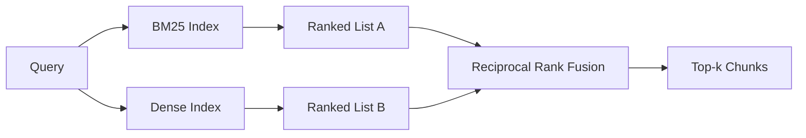

# 混合检索：BM25 与稠密向量

> 词面检索与语义检索在相反的查询分布上翻车。用倒数排名融合（RRF）做混合检索不是插值，而是投票——而且这个投票在每一类查询上都赢。

> **【中文解读】** 本课是 RAG 深入路线的第二课，解决"单一检索器必然偏科"的问题。字面标识符查询（如 `AbortMultipartOnFail`）BM25 秒中、稠密检索排错；改述查询（"上传取消了怎么处理"）正好反过来。混合检索把两份排序列表交给 RRF 投票合并。本课从 Robertson/Sparck Jones 公式从零实现 BM25（含字段加权、长度归一化、k1/b 可调），再用确定性 mock 嵌入搭稠密检索器，最后按 2009 年 SIGIR 论文原样实现 RRF——三种查询类型全赢。

> **【拓展：混合检索的生产版图】** 混合检索是 2025-2026 年生产 RAG 的默认形态：Elasticsearch/OpenSearch 原生 BM25，pgvector/Milvus/Qdrant 提供稠密索引，Vespa 与 Weaviate 把 RRF 做成一等公民接口。学完本课，你读任何一家向量数据库的 hybrid search 文档都不再有黑盒。

> 🔗 **【前置】** 学本课前请先掌握：Phase 11 · 04（嵌入）、06（RAG 基础）——向量检索与余弦相似度；Phase 19 Track B 基础（20-29 课）；第 64 课（分块策略）——本课检索的块由它切出。术语约定：hybrid retrieval=混合检索、dense=稠密、lexical=词面、RRF=倒数排名融合。

**类型：** 构建
**语言：** Python
**前置知识：** Phase 11 · 04（嵌入）、06（RAG）；Phase 19 Track B 基础（20-29 课）；Phase 19 · 64（分块策略）
**预计用时：** 约 90 分钟

## 学习目标

- 按 Robertson 与 Sparck Jones 公式从零实现 BM25，带字段加权、文档长度归一化和可调的 k1、b。
- 在确定性 mock 嵌入之上构建稠密检索器，让整条回路离线运行。
- 严格按照 Cormack、Clarke、Buettcher 2009 年发表的公式实现倒数排名融合（RRF），并解释它为什么优于分数加权插值。
- 调 RRF 的 k 常数与各模态权重，在小固定语料上读出权衡。

## 问题引入

> **【中文解读】** 两种检索器的强弱由查询分布决定，而生产系统的查询分布两类都有。合并步骤才是必须做对的地方。

词面检索在"查询携带语料中逐字存在的字面标识符"时获胜。查询 `AbortMultipartOnFail` 用 BM25 微秒级就返回正确的 Go 函数。同一查询做嵌入后落在三个相似度聚类的交界处，稠密检索器把错误的文件排在第一。

稠密检索在"查询被改述、脱离语料字面 token"时获胜。问"我们怎么处理被取消的上传"的用户从未输入 abort 或 multipart 这两个词。BM25 返回"上传大文件"的文档块，只因为那页含有 uploads 一词；稠密检索却能找到摘要里提到 cancellation 的 abort 函数。

二选一不是静态决定，查询分布才是变量。生产 RAG 系统在同一个端点上要同时服务两类查询，所以检索必须同时拿下两者——这就是混合检索。必须做对的是合并那一步。

## 核心概念

> **【中文解读】** BM25：对每个查询词求"IDF × 饱和词频 × 长度归一化"再求和；稠密检索：嵌入 + 余弦排序，算法只有两行；RRF：对每个候选累加 1/(k+rank)，k=60 让深名次仍有投票权。为什么不用分数插值？BM25 分数无界、余弦有界，线性组合要逐语料调 α 且一重建索引就失效；排名在模态间天然可比。



### 一段话说清 BM25

BM25 给"查询-文档"对打分的方式是：对每个查询词，把逆文档频率因子乘以带长度归一化修正的饱和词频因子，然后求和。两个旋钮：`k1` 控制词频饱和，默认 1.5 是论文推荐值，没有基准数据别动它；`b` 控制文档长度的权重，默认 0.75 表示长文档受罚但不呈线性。

IDF 公式用平滑的 Robertson 与 Sparck Jones 定义：`log((N - df + 0.5) / (df + 0.5) + 1)`。log 里的加一保证当某个词出现在超过一半语料中时 IDF 仍为正。这在小语料里很要紧——停用词在小语料里"技术上算稀有"。

字段加权让你告诉 BM25：符号名上的命中比正文里的命中更值钱。实现方式是索引期对词频计数乘一个系数，而不是在打分期——数学保持不变，也免去逐字段单独打分。

### 一段话说清稠密检索

用嵌入模型把每个块嵌入成固定维度的向量。查询时：嵌入查询、按余弦相似度给所有块排序、返回前 k。决定质量的是模型；检索算法本身只有两行：点积和排序。

本课用确定性的哈希嵌入，让你不开网络请求就能读懂融合数学。哈希把 token 键控的偏移求和成 96 维向量再归一化。余弦排名跨运行确定，这正是测试套件的要求。

### 倒数排名融合：论文原版公式

两份排序列表。对出现在任一列表中的每个候选，累加它的倒数排名贡献。2009 年论文用 `1 / (k + rank)`、k 默认 60。按总分排序。算法到此为止。

论文常数 k = 60 不是随手取的。k = 60 时第 1 名贡献 1/61，第 10 名贡献 1/70——衰减缓慢，深名次仍有投票权。k 越小头部越独大；k 越大贡献曲线越平。

我们的实现里有两个可调旋钮：`k` 常数，和一对模态权重——当你有先验证据表明某个模态在你的语料上更强时，可以给它加权。把排名贡献乘以权重是最简单且有原则的实现：既保留排名衰减形状，又保持尺度无关。

### 为什么融合赢过分数加权插值

BM25 分数无界且随语料变化；余弦相似度限制在 -1 到 1。线性组合 `alpha * bm25 + (1 - alpha) * cosine` 需要逐语料调 α，而且每次重建索引都会失效。基于排名的融合不会——两个排名在模态间天然可比。2010 年以来所有公开 TREC 赛道上，RRF 基线都赢过分数插值。

这与你在 Vespa 和 Weaviate 文档里听到的 RankFusion 与 RRF 之争是同一个论证。它们殊途同归：除非有非常强的证据支持分数插值，否则保持基于排名。

```figure
rrf-fusion
```

## 动手实现

> **【中文解读】** 演示跑三条查询，各自命中一个检索器的强项与弱项，打印两种模态的排名和融合后的排名——融合不是折中，是每一类查询都赢的系统。

`code/main.py` 实现：

- `tokenize(text)`——快速正则分词器。
- `BM25Index`——带字段加权，提供 `add` 与 `search`，k1、b 可调。
- `mock_embed`、`DenseIndex`——与第 64 课相同的确定性嵌入，保证块可比。
- `rrf(rankings, k, weights)`——论文版融合，支持多模态权重。
- `HybridRetriever`——组合 BM25 与稠密检索。
- 一个演示 `main()`：加载小固定语料，跑三条分别命中各检索器强项与弱项的查询，打印每种模态产生的排名以及融合后的列表。

运行：

```bash
python3 code/main.py
```

并排读演示输出：字面标识符查询落在 BM25 第 1、稠密第 4、RRF 第 1；改述查询落在 BM25 第 6、稠密第 1、RRF 第 1；歧义查询落在 BM25 第 3、稠密第 3、RRF 第 1。融合不是平局裁决器，而是每一类查询都赢的系统。

## 调参

> **【中文解读】** 五个旋钮各有明确的上调/下调时机，但结论只有一条——用第 68 课的评测线束在留出查询集上调参，不要凭直觉。

| 旋钮 | 默认值 | 何时调大 | 何时调小 |
|------|---------|-----------------|-------------------|
| BM25 k1 | 1.5 | 文档中词会重复且希望词频更重要 | 文档很短、词重复是噪声 |
| BM25 b | 0.75 | 长文档真的每词信息量更低 | 文档长度与主题无关 |
| RRF k | 60 | 希望深名次继续投票 | 希望第 1 名独大 |
| BM25 权重 | 1.0 | 语料含字面标识符且查询会命中 | 查询是用户改述的 |
| 稠密权重 | 1.0 | 查询是改述的 | 查询是字面的 |

调参靠在留出查询集上重跑第 68 课的评测线束，不靠直觉。

## 演示藏不住的失败模式

> **【中文解读】** 三条隐蔽失败：词表外 token 让稠密模态返回"看似可信实则错误"的邻居；停用词查询让 BM25 给出均匀排名；两模态同冠军让融合看起来"隐形"。上线前逐一排查。

**词表外 token。** BM25 的 IDF 从语料计算，只出现在查询里的词贡献为零；稠密嵌入却会给同一个词"幻觉"出一个向量。对语料外标识符，稠密模态返回看似可信实则错误的邻居。融合能吸收这一点，因为 BM25 什么也不返回、其排名贡献直接缺席——但前提是你按文档去重而不是按块去重。

**停用词支配。** 用 "the" 查 BM25 会得到全语料的均匀排名。在索引器里过滤停用词，或者接受高 IDF 词自然占主导。

**跨模态内容相同。** 如果语料小到 BM25 的第 1 名也是稠密的第 1 名，RRF 给你同样的第 1 名和同样的邻居。这是正确行为而非失败，但会让融合看起来"隐形"。在评测里加一对对抗查询，验证融合真的在工作。

## 用框架实现

> **【中文解读】** 生产形态：BM25 进程内、稠密进独立向量库（HNSW）、两路并行、命中模态持久化给下游重排序器。

生产模式：

- BM25 在进程内索引；瓶颈是词频字典，不是向量。
- 稠密向量索引到独立存储（本课用扁平列表，生产会用 HNSW）。
- 两种查询并行运行；融合是对并集的常数时间合并。
- 持久化每个检索命中的模态，让下游重排序器看见是哪个模态投的票。

## 产出物

第 66 课拿本课融合出的前 k 名用交叉编码器重排序。第 68 课用精确率、召回率、MRR、nDCG 评测整条流水线。本课的混合检索器是第 69 课端到端系统的第一级。

## 练习题

1. 把 `mock_embed` 换成你供应商的真实模型。重跑演示，报告改述查询上纯稠密排名的变化。
2. 加第三种模态：单独索引的块摘要，作为第三份排序列表参与融合。度量增益。
3. 把 RRF k 扫过 10、30、60、100、200。绘制第 68 课口径的 recall@k 曲线。报告曲线在你语料上达到峰值的 k。
4. 正规实现 BM25F（逐字段长度归一化而非乘数技巧），在符号命中最重要的语料上对比。

## 术语速查表

| 术语 | 人们怎么说 | 实际含义 |
|------|-----------------|------------------------|
| BM25 | "词面搜索" | 概率式排序：IDF × 饱和词频 × 长度归一化 |
| RRF | "排名融合" | 各排序列表上 1 / (k + rank) 求和；k 默认 60 |
| k1 | "词频饱和" | 控制重复词多久停止加分 |
| b | "长度惩罚" | 0 表示忽略文档长度，1 表示完全归一化 |
| 字段加权 | "符号加权" | 索引期重复 token 以提升该字段的命中 |
| 基于排名 vs 基于分数的融合 | "RRF 为什么赢线性" | 排名跨模态可比；分数不可比 |

## 延伸阅读

- Cormack, Clarke, Buettcher, "Reciprocal Rank Fusion outperforms Condorcet and individual rank learning methods", SIGIR 2009 — RRF 原始论文，`1/(k+rank)` 与 k=60 的出处
- Robertson, Walker, Beaulieu, Gatford, Payne, "Okapi at TREC-3" — BM25 原始论文（k1、b 默认值的出处）
- [Vespa: Hybrid Retrieval with BM25 and Embeddings](https://docs.vespa.ai/en/tutorials/hybrid-search.html) — 生产级 BM25 + 嵌入混合方案
- [Weaviate: Hybrid Search](https://weaviate.io/developers/weaviate/search/hybrid) — RRF 的另一种生产实现
- Phase 11 · 06 — RAG 基础
- Phase 19 · 64 — 其输出被本课索引的分块器
- Phase 19 · 66 — 消费融合前 k 名的交叉编码器重排序器
