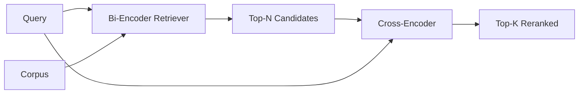

# Cross-Encoder Reranker | 交叉编码器重排序

> A bi-encoder embeds query and document independently. A cross-encoder concatenates them and reads both at once. The cross-encoder is the smartest reader and the slowest. Used as a second stage on the bi-encoder's top-k, it pays for itself.

> **【中文解读】** 双编码器（bi-encoder）分别嵌入查询和文档、按余弦排序——快但粗糙；交叉编码器（cross-encoder）把两者拼成一条序列一起读——精确但慢到无法全库跑。解法是两段式流水线：便宜的双编码器先召回 top-N，昂贵的交叉编码器把 N 精排到 top-K。本课用 PyTorch 从零搭一个迷你交叉编码器，量出"延迟换质量"的拐点。

> **【拓展：重排序器的生产版图】** 生产中最常用的交叉编码器是 `ms-marco-MiniLM-L-6-v2`（约 22M 参数，单卡可跑、p95 可控）；离线或首页精排常用更大的 `bge-reranker-v2-m3`（568M 参数）。Cohere Rerank、Voyage Rerank 把这一层做成 API。本课的两段式"检索 + 重排序"形状与 LangChain/LlamaIndex 的 retriever-reranker 链完全同构。

> 🔗 **【前置】** 学本课前请先掌握：Phase 11 · 06（RAG）、07（进阶 RAG）——召回与精排的分工；Phase 19 Track B 基础（20-29 课）；第 65 课（混合检索）——本课消费它融合出的 top-k。术语约定：reranker=重排序器、cross-encoder=交叉编码器、bi-encoder=双编码器。

**Type:** Build | **类型:** 构建
**Languages:** Python | **语言:** Python
**Prerequisites:** Phase 11 lesson 06 (RAG), Phase 11 lesson 07 (advanced RAG); Phase 19 Track B foundations (lessons 20-29); Phase 19 lesson 65 (hybrid retrieval feeding this stage) | **前置知识:** Phase 11 · 06（RAG）、07（进阶 RAG）；Phase 19 Track B 基础（20-29 课）；Phase 19 · 65（为本级供给候选的混合检索）
**Time:** ~90 minutes | **时间:** 约 90 分钟

## Learning Objectives | 学习目标
- Distinguish a bi-encoder retriever from a cross-encoder reranker by their input shape, parameter count, and per-query cost.
  中文翻译：从输入形状、参数量、单查询成本三个维度区分双编码器检索器与交叉编码器重排序器。
- Implement a small cross-encoder from scratch as a transformer block that consumes a packed (query, document) sequence and emits a single relevance scalar.
  中文翻译：从零实现一个小型交叉编码器：一个 transformer 块，吃进打包的（查询，文档）序列，吐出单个相关性标量。
- Wire a two-stage retrieve-then-rerank pipeline: retrieve top-N with a cheap retriever, rerank N to top-K with the cross-encoder, return K.
  中文翻译：接通"先检索后重排序"的两段式流水线：便宜检索器取 top-N，交叉编码器把 N 精排到 top-K，返回 K。
- Measure the latency-vs-quality trade-off on a small fixture corpus and pick the right N for a given latency budget.
  中文翻译：在小固定语料上度量"延迟换质量"的权衡，并按给定延迟预算选出合适的 N。

## The Problem | 问题引入

> **【中文解读】** 本节是全课的论证骨架，四步推理值得背下来：(1) 双编码器必须"盲压缩"——文档嵌入时看不到查询，两个同主题文档的向量几乎一样，答对的那篇和答错的那篇分不开；(2) 交叉编码器让查询和文档的每个 token 互相注意，精度天花板高；(3) 但它每个（查询，文档）对都要跑一次前向，千万文档的库就是千万次前向，预算内跑不动；(4) 所以分段——双编码器管召回、交叉编码器管精排，总质量=交叉编码器的质量、上限=双编码器在 N 处的召回。

A bi-encoder maps query and document into the same vector space and ranks by cosine. The two encodings never see each other. The model has to compress everything useful about a document into a single vector, blind to the query. This is fast - one embedding per document at index time and one per query at query time - and it is the only way to rank at corpus scale.

> 双编码器把查询和文档映射进同一向量空间并按余弦排序。两个编码互相看不见。模型必须把文档的一切有用信息压缩进单个向量，而且对查询是盲的。这很快——索引期每文档一次嵌入、查询期每查询一次嵌入——也是唯一能在全库规模上排序的方式。

The cost is precision. Two documents that have the same overall topic can have nearly identical embeddings even when one of them answers the query and the other does not. The bi-encoder cannot tell them apart.

> 代价是精度。两篇整体主题相同的文档可以有几乎一样的嵌入，哪怕其中一篇能回答查询、另一篇不能。双编码器分不开它们。

A cross-encoder solves this by reading the query and the document together. The model receives `[query] [SEP] [document]` as a single sequence, runs full attention across the join, and produces one relevance scalar. Every token of the document can attend to every token of the query. The model decides the score with full context.

> 交叉编码器通过"一起读"解决这一问题。模型接收 `[query] [SEP] [document]` 作为单条序列，在拼接处跑完整注意力，产出一个相关性标量。文档的每个 token 都能注意到查询的每个 token。模型是在完整上下文里打分。

The cost is throughput. Where the bi-encoder embeds once and queries forever, the cross-encoder runs once per (query, document) pair. For a 10-million-document corpus that is 10 million forward passes per query. Unrunnable in a request budget.

> 代价是吞吐。双编码器嵌入一次就能永远查询；交叉编码器每个（查询，文档）对都要跑一次。对千万文档的库，每个查询就是一千万次前向——在请求预算内跑不动。

The solution is staging. Use the bi-encoder to retrieve the top-N. Use the cross-encoder to rerank the N to a top-K. N is small (50 to 200) and the cross-encoder's quality lift is concentrated where it matters. The total latency stays in the request budget. The total quality is the cross-encoder's quality, capped by the bi-encoder's recall at N.

> 解法是分段。用双编码器检索 top-N，用交叉编码器把 N 精排成 top-K。N 很小（50 到 200），交叉编码器的质量提升集中在要紧处。总延迟留在请求预算内，总质量=交叉编码器的质量、上限=双编码器在 N 处的召回。

## The Concept | 核心概念

> **【中文解读】** 标准打包是 `[CLS] query [SEP] document [SEP]`，CLS 位置（或均值池化）接一个线性头输出相关性标量。生产甜点位是 22M 参数量级（`ms-marco-MiniLM-L-6-v2`），更小的模型质量掉得比省下的延迟快。延迟-质量曲线上永远有一个 20-50 候选的"拐点"，过拐点就是白付钱；而 N 同时是质量上限——交叉编码器救不回双编码器在 N 处就没召回的答案。



### The cross-encoder's input shape

The standard packing is `[CLS] query_tokens [SEP] document_tokens [SEP]`. The CLS-position output is fed into a single linear head that outputs the relevance scalar. Some implementations use mean-pooling instead of CLS; the difference is small. The point is that the model produces one number per pair.

> 标准打包是 `[CLS] query_tokens [SEP] document_tokens [SEP]`。CLS 位置的输出接一个单线性头，输出相关性标量。有些实现用均值池化取代 CLS；差别不大。关键在于：模型对每个（查询，文档）对产出一个数字。

A 22M-parameter cross-encoder (the published `ms-marco-MiniLM-L-6-v2` weight class) is the typical production point. Smaller models lose quality faster than they save latency. Larger models (e.g. `bge-reranker-v2-m3` at 568M parameters) are reserved for offline reranking or for first-page reranking where K is small.

> 22M 参数的交叉编码器（公开发布的 `ms-marco-MiniLM-L-6-v2` 量级）是典型的生产落点。更小的模型质量下降得比省下的延迟更快。更大的模型（如 568M 参数的 `bge-reranker-v2-m3`）留给离线重排序或 K 很小的首页精排。

### Why this lesson trains a tiny one

A real cross-encoder is a finetuned encoder transformer. In production you load a checkpoint and run it. In this lesson the goal is to show you the shape of the model and the shape of the latency-quality curve, not to train a state-of-the-art ranker. So we build a small `nn.Module` with one transformer block, multi-head attention (4 heads by default), and one regression head. It is initialized deterministically from a seed so the demo is reproducible without weights on disk.

> 真实的交叉编码器是微调过的编码器 transformer。生产中你加载检查点直接跑。本课的目标是展示模型的形状和延迟-质量曲线的形状，不是训练一个 SOTA 排序器。所以我们构建一个小的 `nn.Module`：一个 transformer 块、多头注意力（默认 4 头）、一个回归头。它由种子确定性初始化，无需磁盘权重即可复现演示。

The toy model learns the right shape from the fixture corpus: relevant query-document pairs have higher predicted scores than irrelevant pairs. The end-to-end pipeline reranks the bi-encoder's output and the rerank's top-k correlates with the gold labels.

> 玩具模型从固定语料学到正确的形状：相关查询-文档对的预测分数高于不相关对。端到端流水线重排序双编码器的输出，重排序后的 top-k 与金标标签相关。

### Latency vs quality

The two-stage pipeline has one tunable: N. Sweep N from 5 to 100 on a held-out query set and you get the curve.

> 两段式流水线只有一个可调量：N。在留出查询集上把 N 从 5 扫到 100，你就得到这条曲线。

| N | Recall@1 of stage 2 | Cross-encoder forward passes per query | Latency |
|---|--------------------|---------------------------------------|---------|
| 5 | 0.62 | 5 | low |
| 20 | 0.81 | 20 | medium |
| 50 | 0.86 | 50 | high |
| 100 | 0.86 | 100 | very high |

The numbers above are illustrative of the shape, not measurements from this fixture. The shape is real. There is always a knee around 20 to 50 candidates where the rerank lift saturates. Past the knee you are paying for nothing.

> 上表数字展示的是形状，不是本固定语料的实测值。形状是真的：拐点总在 20-50 个候选附近，过了拐点重排序提升饱和，再多的候选就是白付钱。

Pick N from the eval curve plus the latency budget. The cross-encoder cannot raise recall above the bi-encoder's recall at N, so a low N caps quality, not just latency.

> 依据评测曲线加延迟预算选 N。交叉编码器无法把召回抬到双编码器在 N 处的召回之上，所以 N 太低限制的不只是延迟，还有质量上限。

```figure
rerank-funnel
```

## Build It | 动手实现

> **【中文解读】** `code/main.py` 用 PyTorch 实现迷你 `CrossEncoder`（词嵌入 + 单 transformer 块 + 均值池化回归头）、确定性打包器 `tokenize_pair`、一轮监督训练的 `train_tiny`、生产接口 `rerank` 与 `pipeline`。演示打印双编码器 top-N、交叉编码器 top-K 与各阶段耗时——交叉编码器单次更慢但从不上全库，总延迟留在预算内，还把双编码器排第二第三的正确答案顶到第一。

`code/main.py` implements:

- `CrossEncoder` - a small `torch.nn.Module`: token embedding, one transformer block with multi-head attention and feedforward, mean-pooled head producing one scalar.
  中文翻译：`CrossEncoder`——小型 `torch.nn.Module`：token 嵌入、一个带多头注意力与前馈的 transformer 块、产出单个标量的均值池化头。
- `tokenize_pair(query, document)` - packs the two strings into a single id sequence with type ids that mark the boundary, deterministic and stdlib.
  中文翻译：`tokenize_pair(query, document)`——把两个字符串打包成带边界 type id 的单条 id 序列，确定性、纯标准库。
- `train_tiny(pairs)` - one pass of supervised training on a hand-labeled (query, document, relevance) triple list, so the model produces sensible scores on the fixture.
  中文翻译：`train_tiny(pairs)`——在手工标注的（查询，文档，相关性）三元组列表上做一轮监督训练，让模型在固定语料上产出合理分数。
- `rerank(query, candidates, top_k)` - the production interface.
  中文翻译：`rerank(query, candidates, top_k)`——生产接口。
- `pipeline(query, retriever, top_n, top_k)` - the two-stage flow.
  中文翻译：`pipeline(query, retriever, top_n, top_k)`——两段式流程。
- A demo `main()` that loads the corpus from lesson 65's pattern, retrieves top-N, reranks to top-K, prints both lists side by side, and reports the latency of each stage.
  中文翻译：一个演示 `main()`：按第 65 课的模式加载语料、检索 top-N、重排序到 top-K、并排打印两份列表并报告各阶段延迟。

Run it:

> 运行：

```bash
python3 code/main.py
```

The output shows the bi-encoder's top-N, the cross-encoder's top-K, and a timing summary. The cross-encoder takes longer per call but does not run on the full corpus. The two-stage total stays within the request budget while picking the answer that the bi-encoder ranked second or third.

> 输出显示双编码器的 top-N、交叉编码器的 top-K 和计时摘要。交叉编码器单次调用更慢，但从不在全库上运行。两段式总延迟留在请求预算内，同时把双编码器排到第二、第三的正确答案挑了出来。

## Failure modes the demo will hide | 演示藏不住的失败模式

> **【中文解读】** 五条生产级陷阱：交叉编码器不对称——查询永远放前面，接反了召回崩塌；N=K 时重排序器只能加权不能重排，提升看起来为零（N 至少取 K 的三倍）；训练对混入评测查询会让重排序"看起来魔法"；22M 参数 float32 就是 88MB，承诺 p95 前先算内存；批处理是硬要求——N 个候选一次前向，不批处理延迟乘 N。

**Cross-encoder is not symmetric.** `rerank(q, d)` and `rerank(d, q)` are different scores. Always feed the query first. If you accidentally swap, recall collapses.

> **交叉编码器不对称。** `rerank(q, d)` 与 `rerank(d, q)` 分数不同。查询永远放前面。不小心接反，召回崩塌。

**N is too low to expose the bug.** If you set N = K, the cross-encoder cannot reorder; it can only reweight. The lift looks zero. Pick N at least three times K.

> **N 太低暴露不了问题。** 若 N = K，交叉编码器无法重排、只能重新加权，提升看起来为零。N 至少取 K 的三倍。

**Training data leaks into the eval.** If the hand-labeled training pairs include the eval queries, the rerank looks magical. Strictly separate train and eval, even on a fixture.

> **训练数据漏进评测。** 若手工标注的训练对包含评测查询，重排序看起来魔法附体。严格分离训练与评测，哪怕在固定语料上。

**Production weights are dense.** A 22M-parameter cross-encoder is 88MB at float32. Plan the model server's memory before promising sub-100ms p95.

> **生产权重是稠密的。** 22M 参数的交叉编码器 float32 下就是 88MB。承诺 sub-100ms p95 之前，先规划模型服务器的内存。

**Batching matters.** A real cross-encoder runs the N candidates in one batch. This lesson does that in `_batch_encode`, which builds the batched id and type-id tensors with `torch.tensor(...)` and runs one forward pass. Skip batching and the latency multiplies by N.

> **批处理很关键。** 真实的交叉编码器把 N 个候选放进一个批次。本课在 `_batch_encode` 里就是这么做的：用 `torch.tensor(...)` 构建批式 id 与 type-id 张量、跑一次前向。不做批处理，延迟乘以 N。

## Use It | 用框架实现

> **【中文解读】** 三条生产纪律：双编码器、交叉编码器、N 三者绑定版本——动任何一个都让评测失效；按（查询，文档 id）哈希缓存重排序输出，缓存命中就是免费的延迟削减；记录 rank-1 分数——top-1 分数低于语料特定阈值说明是域外命中，让 LLM 以"我不确定"回应。

Production patterns:

- Pin the bi-encoder, cross-encoder, and N together. Changing any one invalidates the eval.
  中文翻译：把双编码器、交叉编码器和 N 绑定在一起。动任何一个都让评测失效。
- Cache the reranker's output by (query, document_id) hash. The same query against a stable corpus reranks to the same order; cache hits buy you a free latency cut.
  中文翻译：按（查询，文档 id）哈希缓存重排序器输出。同一查询对稳定语料重排序出相同顺序；缓存命中白送一次延迟削减。
- Log the rank-1 cross-encoder score. A query whose top-1 score is below a corpus-specific threshold is an out-of-domain hit; surface it to the LLM as "I am not confident".
  中文翻译：记录交叉编码器的 rank-1 分数。top-1 分数低于语料特定阈值的查询是域外命中；以"我不确定"的形式呈现给 LLM。

## Ship It | 产出物

Lesson 68 evaluates this two-stage pipeline end to end. Lesson 69 wires this reranker behind the hybrid retriever from lesson 65 and in front of the answer generator. The reranker is the second stage of the end-to-end system.

> 第 68 课端到端评测这条两段式流水线。第 69 课把这个重排序器接在第 65 课混合检索器之后、答案生成器之前。重排序器是端到端系统的第二级。

## Exercises | 练习题

1. Sweep N from 5 to 50 and plot recall@1 of the reranked output. Find the knee on this fixture.
   中文翻译：把 N 从 5 扫到 50，绘制重排序输出的 recall@1。找到本固定语料上的拐点。
2. Train the cross-encoder for ten epochs instead of one. Measure the score-margin between positive and negative pairs at each epoch.
   中文翻译：把交叉编码器从一轮训练改成十轮。度量每轮正负样本对的分数间隔。
3. Replace mean-pooling with a CLS-token head. Compare convergence on this fixture.
   中文翻译：把均值池化换成 CLS token 头。对比本固定语料上的收敛情况。
4. Add a second cross-encoder head that predicts a binary "is this answer in the document" label. Use both heads at inference; one to rank, one to threshold.
   中文翻译：加第二个交叉编码器头，预测"答案是否在文档里"的二元标签。推理时两个头并用：一个排序、一个定阈值。
5. Replace the deterministic mock bi-encoder with the one from lesson 65 and chain the two stages. Measure the change in top-K versus bi-encoder alone.
   中文翻译：把确定性 mock 双编码器换成第 65 课的实现并串联两段。度量 top-K 相对纯双编码器的变化。

## Key Terms | 术语速查表

| Term | What people say | What it actually means |
|------|-----------------|------------------------|
| Bi-encoder | "Vector retriever" | Encodes query and doc independently; cosine ranks them |
| Cross-encoder | "Reranker" | Encodes (query, doc) jointly; outputs one relevance scalar |
| Two-stage pipeline | "Retrieve and rerank" | Cheap retriever returns N, expensive reranker keeps K |
| N (candidate budget) | "Rerank pool" | The number of candidates the cross-encoder scores per query |
| Mean-pooling head | "Mean of last hidden" | Average the encoder's last-layer outputs into one vector |

## Further Reading | 延伸阅读

- Nogueira, Cho, "Passage Re-ranking with BERT", 2019 - the canonical cross-encoder ranker paper
  中文翻译：Nogueira 与 Cho，"Passage Re-ranking with BERT"（2019）——交叉编码器排序器的开山论文。
- Reimers, Gurevych, "Sentence-BERT: Sentence Embeddings using Siamese BERT-Networks", 2019 - on bi-encoders vs cross-encoders
  中文翻译：Reimers 与 Gurevych，"Sentence-BERT"（2019）——双编码器与交叉编码器之辨。
- [SentenceTransformers Cross-Encoders documentation](https://www.sbert.net/examples/applications/cross-encoder/README.html)
  中文翻译：SentenceTransformers 交叉编码器文档——生产级用法。
- [BGE Reranker v2 model card](https://huggingface.co/BAAI/bge-reranker-v2-m3)
  中文翻译：BGE Reranker v2 模型卡——568M 参数大重排序器。
- Phase 19 lesson 65 - the hybrid retriever feeding this rerank stage
  中文翻译：Phase 19 · 65——为本级供给候选的混合检索器。
- Phase 19 lesson 68 - the eval that measures the lift this rerank delivers
  中文翻译：Phase 19 · 68——度量本次重排序带来提升的评测。
