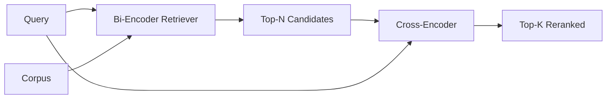

# 交叉编码器重排序

> 双编码器分别嵌入查询和文档；交叉编码器把它们拼起来一起读。交叉编码器是最聪明的读者，也是最慢的。作为双编码器 top-k 之上的第二级使用，它物有所值。

> **【中文解读】** 本课是 RAG 深入路线的第三课。双编码器（bi-encoder）快而粗糙：文档嵌入时看不到查询，同主题的两篇文档向量几乎一样；交叉编码器（cross-encoder）精确而慢：每个（查询，文档）对都要跑一次前向，全库跑不动。解法是两段式流水线——便宜的双编码器召回 top-N，昂贵的交叉编码器精排到 top-K。本课用 PyTorch 从零搭迷你交叉编码器，量出"延迟换质量"的拐点。

> **【拓展：重排序器的生产版图】** 生产中最常用的交叉编码器是 `ms-marco-MiniLM-L-6-v2`（约 22M 参数，单卡可跑、p95 可控）；离线或首页精排常用更大的 `bge-reranker-v2-m3`（568M 参数）。Cohere Rerank、Voyage Rerank 把这一层做成 API。本课的两段式形状与 LangChain/LlamaIndex 的 retriever-reranker 链完全同构。

> 🔗 **【前置】** 学本课前请先掌握：Phase 11 · 06（RAG）、07（进阶 RAG）——召回与精排的分工；Phase 19 Track B 基础（20-29 课）；第 65 课（混合检索）——本课消费它融合出的 top-k。术语约定：reranker=重排序器、cross-encoder=交叉编码器、bi-encoder=双编码器。

**类型：** 构建
**语言：** Python
**前置知识：** Phase 11 · 06（RAG）、07（进阶 RAG）；Phase 19 Track B 基础（20-29 课）；Phase 19 · 65（为本级供给候选的混合检索）
**预计用时：** 约 90 分钟

## 学习目标

- 从输入形状、参数量、单查询成本三个维度区分双编码器检索器与交叉编码器重排序器。
- 从零实现一个小型交叉编码器：一个 transformer 块，吃进打包的（查询，文档）序列，吐出单个相关性标量。
- 接通"先检索后重排序"的两段式流水线：便宜检索器取 top-N，交叉编码器把 N 精排到 top-K，返回 K。
- 在小固定语料上度量"延迟换质量"的权衡，并按给定延迟预算选出合适的 N。

## 问题引入

> **【中文解读】** 四步论证值得背下来：双编码器必须"盲压缩"导致精度受限；交叉编码器全注意力看两边、精度天花板高；但它逐对前向、吞吐撑不住全库；所以分段——总质量=交叉编码器的质量、上限=双编码器在 N 处的召回。

双编码器把查询和文档映射进同一向量空间并按余弦排序。两个编码互相看不见。模型必须把文档的一切有用信息压缩进单个向量，而且对查询是盲的。这很快——索引期每文档一次嵌入、查询期每查询一次嵌入——也是唯一能在全库规模上排序的方式。

代价是精度。两篇整体主题相同的文档可以有几乎一样的嵌入，哪怕其中一篇能回答查询、另一篇不能。双编码器分不开它们。

交叉编码器通过"一起读"解决这一问题。模型接收 `[query] [SEP] [document]` 作为单条序列，在拼接处跑完整注意力，产出一个相关性标量。文档的每个 token 都能注意到查询的每个 token。模型是在完整上下文里打分。

代价是吞吐。双编码器嵌入一次就能永远查询；交叉编码器每个（查询，文档）对都要跑一次。对千万文档的库，每个查询就是一千万次前向——在请求预算内跑不动。

解法是分段。用双编码器检索 top-N，用交叉编码器把 N 精排成 top-K。N 很小（50 到 200），交叉编码器的质量提升集中在要紧处。总延迟留在请求预算内，总质量=交叉编码器的质量、上限=双编码器在 N 处的召回。

## 核心概念

> **【中文解读】** 标准打包 `[CLS] query [SEP] document [SEP]`，CLS 位置（或均值池化）接线性头输出相关性标量。延迟-质量曲线永远有一个 20-50 候选的"拐点"，过拐点就是白付钱；而 N 同时是质量上限——交叉编码器救不回双编码器在 N 处就没召回的答案。



### 交叉编码器的输入形状

标准打包是 `[CLS] query_tokens [SEP] document_tokens [SEP]`。CLS 位置的输出接一个单线性头，输出相关性标量。有些实现用均值池化取代 CLS；差别不大。关键在于：模型对每个（查询，文档）对产出一个数字。

22M 参数的交叉编码器（公开发布的 `ms-marco-MiniLM-L-6-v2` 量级）是典型的生产落点。更小的模型质量下降得比省下的延迟更快。更大的模型（如 568M 参数的 `bge-reranker-v2-m3`）留给离线重排序或 K 很小的首页精排。

### 为什么本课训练一个迷你的

真实的交叉编码器是微调过的编码器 transformer。生产中你加载检查点直接跑。本课的目标是展示模型的形状和延迟-质量曲线的形状，不是训练一个 SOTA 排序器。所以我们构建一个小的 `nn.Module`：一个 transformer 块、多头注意力（默认 4 头）、一个回归头。它由种子确定性初始化，无需磁盘权重即可复现演示。

玩具模型从固定语料学到正确的形状：相关查询-文档对的预测分数高于不相关对。端到端流水线重排序双编码器的输出，重排序后的 top-k 与金标标签相关。

### 延迟 vs 质量

两段式流水线只有一个可调量：N。在留出查询集上把 N 从 5 扫到 100，你就得到这条曲线。

| N | 第二级 Recall@1 | 每查询交叉编码器前向次数 | 延迟 |
|---|--------------------|---------------------------------------|---------|
| 5 | 0.62 | 5 | 低 |
| 20 | 0.81 | 20 | 中 |
| 50 | 0.86 | 50 | 高 |
| 100 | 0.86 | 100 | 很高 |

上表数字展示的是形状，不是本固定语料的实测值。形状是真的：拐点总在 20-50 个候选附近，过了拐点重排序提升饱和，再多的候选就是白付钱。

依据评测曲线加延迟预算选 N。交叉编码器无法把召回抬到双编码器在 N 处的召回之上，所以 N 太低限制的不只是延迟，还有质量上限。

```figure
rerank-funnel
```

## 动手实现

> **【中文解读】** 演示打印双编码器 top-N、交叉编码器 top-K 与各阶段耗时——交叉编码器单次更慢但从不上全库，总延迟留在预算内，还把双编码器排第二第三的正确答案顶到第一。

`code/main.py` 实现：

- `CrossEncoder`——小型 `torch.nn.Module`：token 嵌入、一个带多头注意力与前馈的 transformer 块、产出单个标量的均值池化头。
- `tokenize_pair(query, document)`——把两个字符串打包成带边界 type id 的单条 id 序列，确定性、纯标准库。
- `train_tiny(pairs)`——在手工标注的（查询，文档，相关性）三元组列表上做一轮监督训练，让模型在固定语料上产出合理分数。
- `rerank(query, candidates, top_k)`——生产接口。
- `pipeline(query, retriever, top_n, top_k)`——两段式流程。
- 一个演示 `main()`：按第 65 课的模式加载语料、检索 top-N、重排序到 top-K、并排打印两份列表并报告各阶段延迟。

运行：

```bash
python3 code/main.py
```

输出显示双编码器的 top-N、交叉编码器的 top-K 和计时摘要。交叉编码器单次调用更慢，但从不在全库上运行。两段式总延迟留在请求预算内，同时把双编码器排到第二、第三的正确答案挑了出来。

## 演示藏不住的失败模式

> **【中文解读】** 五条生产级陷阱：不对称性、N=K 陷阱、训练数据泄漏、稠密权重的内存账、批处理缺失。上线前逐一对照。

**交叉编码器不对称。** `rerank(q, d)` 与 `rerank(d, q)` 分数不同。查询永远放前面。不小心接反，召回崩塌。

**N 太低暴露不了问题。** 若 N = K，交叉编码器无法重排、只能重新加权，提升看起来为零。N 至少取 K 的三倍。

**训练数据漏进评测。** 若手工标注的训练对包含评测查询，重排序看起来魔法附体。严格分离训练与评测，哪怕在固定语料上。

**生产权重是稠密的。** 22M 参数的交叉编码器 float32 下就是 88MB。承诺 sub-100ms p95 之前，先规划模型服务器的内存。

**批处理很关键。** 真实的交叉编码器把 N 个候选放进一个批次。本课在 `_batch_encode` 里就是这么做的：用 `torch.tensor(...)` 构建批式 id 与 type-id 张量、跑一次前向。不做批处理，延迟乘以 N。

## 用框架实现

> **【中文解读】** 三条生产纪律：三个组件绑定版本、按对哈希缓存输出、记录 rank-1 分数做域外检测。

生产模式：

- 把双编码器、交叉编码器和 N 绑定在一起。动任何一个都让评测失效。
- 按（查询，文档 id）哈希缓存重排序器输出。同一查询对稳定语料重排序出相同顺序；缓存命中白送一次延迟削减。
- 记录交叉编码器的 rank-1 分数。top-1 分数低于语料特定阈值的查询是域外命中；以"我不确定"的形式呈现给 LLM。

## 产出物

第 68 课端到端评测这条两段式流水线。第 69 课把这个重排序器接在第 65 课混合检索器之后、答案生成器之前。重排序器是端到端系统的第二级。

## 练习题

1. 把 N 从 5 扫到 50，绘制重排序输出的 recall@1。找到本固定语料上的拐点。
2. 把交叉编码器从一轮训练改成十轮。度量每轮正负样本对的分数间隔。
3. 把均值池化换成 CLS token 头。对比本固定语料上的收敛情况。
4. 加第二个交叉编码器头，预测"答案是否在文档里"的二元标签。推理时两个头并用：一个排序、一个定阈值。
5. 把确定性 mock 双编码器换成第 65 课的实现并串联两段。度量 top-K 相对纯双编码器的变化。

## 术语速查表

| 术语 | 人们怎么说 | 实际含义 |
|------|-----------------|------------------------|
| 双编码器 | "向量检索器" | 独立编码查询与文档；按余弦排序 |
| 交叉编码器 | "重排序器" | 联合编码（查询，文档）；输出单个相关性标量 |
| 两段式流水线 | "检索加重排" | 便宜检索器返回 N，昂贵重排序器保留 K |
| N（候选预算） | "重排池" | 交叉编码器每查询打分的候选数量 |
| 均值池化头 | "末层隐状态取平均" | 把编码器末层输出平均成一个向量 |

## 延伸阅读

- Nogueira, Cho, "Passage Re-ranking with BERT", 2019 — 交叉编码器排序器的开山论文
- Reimers, Gurevych, "Sentence-BERT: Sentence Embeddings using Siamese BERT-Networks", 2019 — 双编码器与交叉编码器之辨
- [SentenceTransformers Cross-Encoders 文档](https://www.sbert.net/examples/applications/cross-encoder/README.html) — 生产级用法
- [BGE Reranker v2 模型卡](https://huggingface.co/BAAI/bge-reranker-v2-m3) — 568M 参数大重排序器
- Phase 19 · 65 — 为本级供给候选的混合检索器
- Phase 19 · 68 — 度量本次重排序带来提升的评测
