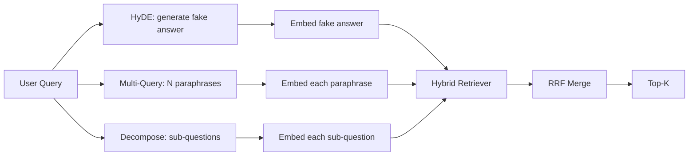

# 查询改写：HyDE、多查询与分解

> 用户敲下的查询不是检索器想要的查询。改写在检索之前弥合这道鸿沟，让索引看到更接近答案长相的东西。

> **【中文解读】** 本课是 RAG 深入路线的第四课。三种改写器互补分工：HyDE 让 LLM 先写一篇"假想答案文档"、用它的嵌入去检索——假想文档用语料的口吻写就，向量天然落在正确答案附近；多查询把一条查询改写成 N 条改述、各自检索后用 RRF 合并；查询分解把复合问题拆成子问题分别检索。本课用一个确定性 Mock LLM 让三种改写器全部离线跑通，并在同一固定语料上三向对比。

> **【拓展：查询改写在生产 RAG 中的位置】** 查询改写是"检索前优化"的统称：HyDE 出自 Gao 等人 2023 年论文；多查询改写随微软 GraphRAG 与 RAG-Fusion 流行；子查询分解是 DSPy 多跳问答的标配。LlamaIndex 的 query transformations、LangChain 的 MultiQueryRetriever 都是这一层的成品件。本课之后，65-66 课的"检索 + 重排序"前面就差这最后一块拼图。

> 🔗 **【前置】** 学本课前请先掌握：Phase 11 · 04（嵌入）、06（RAG）；Phase 19 Track B 基础（20-29 课）；第 64、65 课——改写器输出的查询由第 65 课的混合检索器执行，融合用的是同一套 RRF。术语约定：query rewriting=查询改写、HyDE 保留原文、multi-query=多查询、decomposition=（查询）分解。

**类型：** 构建
**语言：** Python
**前置知识：** Phase 11 · 04（嵌入）、06（RAG）；Phase 19 Track B 基础（20-29 课）；Phase 19 · 64、65
**预计用时：** 约 90 分钟

## 学习目标

- 实现假想文档嵌入（HyDE）：生成一个假答案、嵌入它、用这个向量而非查询向量去检索。
- 实现多查询扩展：把一条查询改写成 N 条改述、各自检索、用倒数排名融合合并并集。
- 实现查询分解：把复杂问题拆成子问题、逐子问题检索、合并。
- 在固定语料上三向对比三种改写器，并解释每种策略何时获胜。
- 接一个产出确定性、贴合固定语料结果的 mock LLM，让改写回路离线运行。

## 问题引入

> **【中文解读】** 查询与文档不共享名词短语时，BM25 落空、双编码器排错；若答案连 top-N 都进不了，重排序器根本看不到它。所以改写必须发生在检索之前。

用户输入"上传失败且预算耗尽时我们团队怎么办？"。语料里有篇文档写着 "AbortMultipartOnFail aborts an in-flight S3 multipart upload and decrements the per-bucket retry budget when the upload fails"。查询与文档不共享任何名词短语。BM25 落空。双编码器把文档排到第三或第四，因为查询向量落在嵌入空间中偏爱"取消任务"文档而非"中止上传"文档的区域。第 66 课的两段式重排序在答案还在 top-N 里时能救回来，但如果它连 top-N 都没进，重排序器根本看不到它。

修复方法是在查询碰到检索器之前改写它。2023 年论文 "Precise Zero-Shot Dense Retrieval without Relevance Labels"（Gao 等）提出了 HyDE：让 LLM 写出一篇能回答该查询的文档，嵌入这篇假想文档，用它的嵌入作为检索向量。假想文档之所以落在嵌入空间的正确区域，是因为它用语料的口吻写就；查询向量则不是。

两个表亲技术与 HyDE 搭档。多查询扩展（微软 GraphRAG 用的术语）生成查询的 N 条改述、逐条检索再合并。分解（因 2024 年斯坦福 DSPy 工作中的"子查询分解"而流行）把"上传失败且预算耗尽时我们团队怎么办"拆成两个问题："上传失败时会发生什么"和"重试预算耗尽时会发生什么"。两次检索、一次合并，答案的两块都可达。

本课实现全部三种技术，并在同一固定语料上运行对比。

## 核心概念

> **【中文解读】** 记忆锚点：HyDE 换向量、多查询换措辞、分解换问题集——三者产出都汇入同一个混合检索器 + RRF 合并。



### HyDE 详解

HyDE 用 LLM 写出的假想文档向量替换用户的查询向量。提示词很短：

```
You are a domain expert. Write a one-paragraph passage that answers the question
below. Use the same vocabulary and phrasing the documentation in this domain would
use. Do not refuse. Do not say you do not know.

Question: {user_query}

Passage:
```

LLM 的回答作为事实答案是错的，因为 LLM 不了解你的语料。但这没关系——检索器不在乎事实正确性，只在乎 token 分布。假想段落里会出现 "abort"、"multipart"、"bucket"、"budget" 这些词，因为关于这个主题的文档段落就该这么写。嵌入这段文字，向量就落在真实段落附近。

生产中把假想文档限制在两三句话。更长的假想文档收集更多噪声，更短的又丢失 HyDE 需要的词面信号。

### 多查询扩展详解

生成用户查询的 N 条改述。最简单的提示词：

```
Rewrite the following question in {N} different ways. Each rewrite must preserve
the original intent. Number them 1 to {N}. Do not add explanations.
```

对每条改述检索 top-k，用 RRF（第 65 课的同一算法）合并 N 份排序列表。便宜、可并行、确定性。

当用户的措辞只是众多等价问法之一、且任一改述都可能问得更好时，多查询获胜。当所有改述同样糟糕——因为原查询就以同样的方式糟糕——时，多查询落败。

### 分解详解

单次检索满足不了多面问题。分解让 LLM 把问题拆成子问题，系统逐子问题检索。提示词：

```
The following question may require information from multiple distinct topics.
Decompose it into a list of sub-questions. Each sub-question must be answerable
independently. If the question is already atomic, return it unchanged.

Question: {user_query}
```

逐子问题检索，合并。分解适合含连接词、多从句比较或两个不相关主题的问题；对原子问题是错误工具——那时分解器的职责是原样返回这一个问题，而不是发明假子问题。

### 三者为何并存

三者互补。HyDE 弥合查询与语料的 token 落差；多查询覆盖改述方差；分解覆盖多主题查询。生产系统三者都跑，并按查询选择策略（第 69 课的端到端系统展示了选择器）。

## 模拟 LLM

> **【中文解读】** 本课全程离线：Mock LLM 是一张以用户查询为键的查找表，未知查询走确定性兜底。重要的是 mock 的形状而非数据：生产中把 mock 换成真实模型调用，检索器一行不改。

本课离线运行。mock LLM 是一张以用户查询为键的小查找表，外加一个处理未见查询的兜底。查找表包含：

- 对每个固定语料查询：一篇写好的假想段落、三条改述、一份分解。
- 对未知查询：一个确定性变换——取查询的内容词、经同义词映射扩展、返回结果。

重要的是 mock 的形状，不是数据。生产中把 mock 换成真实模型调用，检索器不变。

```figure
cd-hyde-vector
```

## 动手实现

> **【中文解读】** 检索器形状复用第 65 课的混合 BM25 + 稠密，融合还是那套 RRF——唯一的新形状是改写器接口，而它很小。演示在固定语料上跑三种改写器，打印各自把金标答案文档排到第几。

`code/main.py` 实现：

- `MockLLM`——上文描述的确定性替身。
- `HyDERewriter`——调用 LLM 写假想文档，以 `RewriteResult` 返回改写输出，内含假想文本与检索器应使用的查询。
- `MultiQueryRewriter`——调用 LLM 生成 N 条改述，返回查询列表。
- `DecomposeRewriter`——调用 LLM 做分解，返回子问题。
- `retrieve_with_rewriter`——接收一个改写器与一个检索器，运行改写并融合结果。
- 一个演示：在固定语料上运行三种改写器，打印哪种策略最先返回金标答案文档。

检索器形状复用第 65 课（混合 BM25 + 稠密）。融合是同一套 RRF。唯一的新形状是改写器接口，而它很小。

运行：

```bash
python3 code/main.py
```

输出是逐策略排名加最终摘要。HyDE 在措辞错配查询上获胜；多查询在改述方差查询上获胜；分解在多主题查询上获胜；兜底（无改写器）至少在三者之一上落败。

## 演示藏不住的失败模式

> **【中文解读】** 四条生产陷阱：HyDE 幻觉标识符压垮 BM25、弱模型改述趋同、分解过度拆分、延迟成倍增加。上线前逐一对照。

**HyDE 把语料专属标识符幻觉错。** 模型编造一个函数名。假想文档在正确文档上的 BM25 分崩塌，因为编造的名字成了高权重 token 却不在索引里。限制假想文档长度，并在融合中调低 BM25 权重。

**多查询改述全部趋同。** 弱模型产出三条近乎相同的改述。N 次检索返回同一 top-k，RRF 合并不比单次检索好。给改写提示词加显式的多样性指令，并用 Jaccard 检测重复。

**分解过度拆分。** 分解器把原子问题也变成列表。各次检索都返回同一文档但排名下降，合并结果比原始更差。fan-out 之前先做一道"这些子问题是否足够不同"的检查。

**延迟成倍增加。** HyDE 一次 LLM 调用；多查询一次 LLM 调用生成 N 条改述再加 N 次检索；分解一次 LLM 调用做分解再加 M 次检索。检索可以并行；LLM 调用才是延迟地板。

## 用框架实现

> **【中文解读】** 生产纪律：按查询特征选策略、按查询哈希缓存改写输出、三路并行再 RRF 融合。

生产模式：

- 按查询长度做逐查询策略选择：短的原子查询走多查询，复杂多从句查询走分解，行话密集查询走 HyDE。
- 按查询哈希缓存改写器输出。大量查询是重复的。
- 三路并行运行并用 RRF 把三份结果融合为一。成本是三次 LLM 调用加一次融合；质量是三种策略覆盖面的并集。

## 产出物

第 69 课把这一改写级接在第 65 课检索器与第 66 课重排序器之前。第 68 课评测改写器给检索召回带来的提升。

## 练习题

1. 实现 RAG-Fusion（多查询的 2024 变体）：改写器的改述刻意追求多样，再由重排序步（第 66 课）选出最终列表。
2. 加第四种策略：后退提示（让 LLM 给出更一般的问题、先按它检索、再收窄）。在固定语料上对比。
3. 给分解器加一个"问题是否原子"的头，训练它识别原子查询。度量前后过度拆分率。
4. 把 mock LLM 换成真实模型调用。在你的技术栈上度量每种策略的延迟。
5. 给每条改写加置信度分数。丢弃低于阈值的改写。度量对召回的影响。

## 术语速查表

| 术语 | 人们怎么说 | 实际含义 |
|------|-----------------|------------------------|
| HyDE | "假文档检索" | LLM 写答案；嵌入它并以此检索，取代查询 |
| 多查询 | "改述扩展" | 查询的 N 条改写；检索 N 次按 RRF 合并 |
| 分解 | "子查询拆分" | 多主题查询拆成子问题分别检索 |
| 原子查询 | "单主题" | 不发明假子问题就无法再拆 |
| 后退（step-back） | "抽象化查询" | 先问更一般的问题、检索、再收窄 |

## 延伸阅读

- Gao, Ma, Lin, Callan, "Precise Zero-Shot Dense Retrieval without Relevance Labels" (HyDE), 2023 — 假想文档嵌入的出处
- Microsoft Research, "Multi-Query Expansion for Retrieval" — 多查询扩展
- Stanford DSPy, "Subquery Decomposition for Multi-Hop QA" — 多跳问答的子查询分解
- [LlamaIndex query transformations 文档](https://docs.llamaindex.ai/en/stable/optimizing/advanced_retrieval/query_transformations/) — 本课三种改写器的成品件
- Phase 11 · 07 — 进阶 RAG 模式
- Phase 19 · 65 — 本改写器下游的检索器
- Phase 19 · 68 — 度量改写器提升的评测
