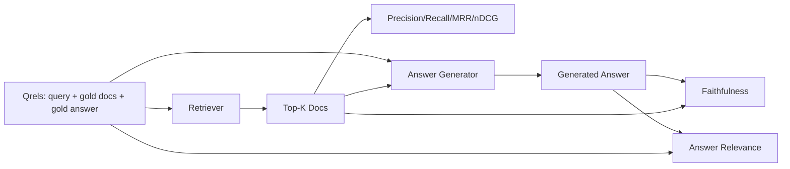

# RAG Evaluation: Precision, Recall, MRR, nDCG, Faithfulness, Answer Relevance | RAG 评测：精确率、召回率、MRR、nDCG、忠实度、答案相关性

> If you cannot grade your retrieval and your answer at the same time, you cannot ship the system. The two are not the same metric and the same prompt fails on different axes.

> **【中文解读】** 本课是 RAG 深入路线（64-69）的收尾评测课：用一份固定 qrels（查询 + 金标文档 + 金标答案）同时给检索和生成两端打分。检索端四个指标——精确率@k、召回率@k、MRR、nDCG@k——评"找没找到、排没排对"；生成端两个指标——忠实度与答案相关性——评"答案是否落地有据、是否切题"。六个指标全部按字面定义从零实现，LLM 裁判用确定性 mock 替代，评测全程离线、可复现。

> **【拓展：RAG 评测生态→Ragas 三件套】** 工业界流行的 Ragas 框架把 RAG 评测拆成几乎相同的维度：faithfulness（忠实度）、answer relevancy（答案相关性）、context precision/recall（上下文精确率/召回率），与本课六指标一一对应。区别在于 Ragas 的裁判是真 LLM，本课用 token 重叠的 mock 裁判换来了确定性与零成本。把本课的 mock 换成真实模型调用，就得到一个迷你 Ragas——这也是"先手写再换库"这条课程主线的又一次演练。

> 🔗 **【前置】** 学本课前请先掌握：(1) Phase 11 · 06（RAG 基础）与 · 10（评测框架）；(2) Phase 19 Track B 基础（20-29 课）；(3) 本路线前四课——64 分块、65 混合检索、66 重排序、67 查询改写——本课的指标正是给这四个组件定位故障的仪表盘。

**Type:** Build | **类型:** 动手构建
**Languages:** Python | **语言:** Python
**Prerequisites:** Phase 11 lessons 06 (RAG), 10 (evaluation); Phase 19 Track B foundations (lessons 20-29); Phase 19 lessons 64, 65, 66, 67 | **前置知识:** Phase 11 · 06（RAG）、10（评测）；Phase 19 Track B 基础（20-29 课）；Phase 19 · 64、65、66、67
**Time:** ~90 minutes | **时间:** 约 90 分钟

## Learning Objectives | 学习目标
- Compute four retrieval metrics from gold qrels: precision@k, recall@k, MRR (mean reciprocal rank), and nDCG@k.
  中文翻译：从金标 qrels 计算四个检索指标：precision@k、recall@k、MRR（平均倒数排名）和 nDCG@k。
- Compute two answer-grade metrics: faithfulness (every claim grounded in retrieved context) and answer relevance (the answer addresses the question).
  中文翻译：计算两个答案层指标：忠实度（每条论断都以检索上下文为依据）和答案相关性（答案切合问题）。
- Build a fixture qrels file (queries, gold doc ids, gold answer text) that the eval reads end to end.
  中文翻译：构建一个固定 qrels 文件（查询、金标文档 id、金标答案文本），让评测端到端读得起来。
- Read the metric values to diagnose where a pipeline is failing: retrieval, ranking, generation, or grounding.
  中文翻译：读懂指标数值，诊断流水线在哪一层失败：检索、排序、生成还是落地依据。

## The Problem | 问题引入

> **【中文解读】** RAG 系统至少有四个可独立出错的部件：分块器、检索器、重排序器、生成器。用户只报告"答案错了"，但病灶可能在任何一环。没有分阶段指标就无法定位——这就是本课用六个指标把流水线切成可观测段落的原因。

A RAG system has at least four moving parts: chunker, retriever, reranker, generator. Any of them can be the cause of a wrong answer. Without per-stage metrics you are flying blind.

> RAG 系统至少有四个活动部件：分块器、检索器、重排序器、生成器。任何一个都可能是错误答案的源头。没有分阶段指标，你就是在盲飞。

A user reports a wrong answer. Is it because the chunker cut the answer span? Is it because the retriever did not include the chunk in top-k? Is it because the reranker pushed the right chunk past position one? Is it because the generator ignored the chunk and made something up? You cannot tell from the answer alone. You need:

> 用户报告了一个错误答案。是分块器切断了答案片段？是检索器没把正确分块送进 top-k？是重排序器把正确分块挤出了第一位？还是生成器无视分块自己编了一个？光看答案无法判断。你需要：

- Retrieval metrics to grade what came out of the retriever.
  中文翻译：检索指标，给检索器的产出打分。
- Ranking metrics to grade where the right chunk sat in the order.
  中文翻译：排序指标，给正确分块在序列中的位置打分。
- Faithfulness to grade whether the generator stayed inside the retrieved context.
  中文翻译：忠实度，检查生成器是否守在检索上下文之内。
- Answer relevance to grade whether the answer addresses the question at all.
  中文翻译：答案相关性，检查答案到底有没有回应问题。

This lesson builds all six on top of a fixture qrels file. The eval is offline and deterministic; in production you swap the mock LLM-as-judge for a real one.

> 本课在一份固定 qrels 文件之上构建全部六个指标。评测离线且确定性；生产环境中把 mock LLM 裁判换成真模型即可。

## The Concept | 核心概念

> **【中文解读】** 六个指标分两层看。检索层看 top-k 列表：精确率=retrieved 里有多少是金标，召回率=金标有多少进了 top-k，MRR=第一个相关文档排多前，nDCG=带分级相关性的排序质量。生成层看最终答案：忠实度=每条论断是否有检索上下文支撑，答案相关性=答案是否回应了问题。两个生成层指标相互独立——忠实但不切题、切题但编造，是两类不同的病，要用不同的药。



### Precision@k

Of the top-k documents the retriever returned, what fraction are in the gold set? If gold has three documents and the top-3 returns two of them and one wrong one, precision@3 is 2 / 3. Use precision when the cost of an irrelevant retrieved chunk is high (the generator wastes tokens on it, or the chunk poisons the answer).

> 在检索器返回的 top-k 文档里，有多大比例属于金标集合？若金标有 3 篇文档而 top-3 命中其中 2 篇外加 1 篇错的，precision@3 = 2/3。当"检索回一个无关分块"的代价高时（生成器浪费 token，或该分块污染答案）用精确率。

### Recall@k

Of the gold documents, what fraction are in the top-k? If gold has three documents and the top-5 contains all three, recall@5 is 1.0. Use recall when the cost of a missed answer is high (you would rather see one extra wrong chunk than miss the answer chunk entirely).

> 在金标文档里，有多大比例进了 top-k？若金标有 3 篇而 top-5 全部包含，recall@5 = 1.0。当"错过答案"的代价高时用召回率（宁可多看一个错误分块，也不要彻底错过答案分块）。

In production RAG the metric people usually quote is recall@k. Generation can drop irrelevant chunks easily; it cannot invent an answer from a chunk it never saw.

> 生产 RAG 中人们最常引用的指标是 recall@k。生成端丢掉无关分块很容易；但它无法凭空回答一个从未见过的分块里的问题。

### MRR (Mean Reciprocal Rank)

For each query, find the position of the first relevant document in the ranked list. The reciprocal rank is 1 / position. Mean across the query set. MRR is a single-number summary of how well the retriever puts the best answer at the top.

> 对每个查询，找出排序列表中第一个相关文档的位置。倒数排名 = 1 / 位置。对整个查询集取平均。MRR 用一个数字概括"检索器把最佳答案放到最前面的能力"。

MRR weights position-1 heavily. A query where the gold doc is at rank 1 contributes 1.0. Rank 2 contributes 0.5. Rank 10 contributes 0.1. The metric is dominated by the top of the list.

> MRR 重罚非第一的位置。金标文档排第 1 的查询贡献 1.0，第 2 贡献 0.5，第 10 贡献 0.1。该指标由列表顶部主导。

### nDCG@k

Normalized Discounted Cumulative Gain. The full formula assigns a gain to each retrieved document (often 1 for relevant, 0 for not), discounts by the log of the position, sums, and divides by the ideal DCG (the DCG you would have if you ranked perfectly). Range 0 to 1.

> 归一化折损累计增益。完整公式给每个检索到的文档赋予增益（通常相关为 1、不相关为 0），按位置的对数折损，求和，再除以理想 DCG（完美排序时能得到的 DCG）。取值范围 0 到 1。

nDCG accommodates graded relevance: the gold can say "doc A is 3, doc B is 2, doc C is 1". MRR and recall@k flatten everything to binary. Use nDCG when the corpus has multiple partially-relevant documents per query.

> nDCG 容纳分级相关性：金标可以说"文档 A 是 3、文档 B 是 2、文档 C 是 1"。MRR 和 recall@k 把一切压平成二元。当语料中每个查询存在多个部分相关的文档时，用 nDCG。

### Faithfulness

For each claim in the generated answer, check whether the claim is supported by the retrieved context. The standard implementation uses an LLM-as-judge prompt that takes (claim, context) and returns yes or no. The metric is the fraction of claims that pass.

> 对生成答案里的每条论断，检查它是否被检索上下文支撑。标准实现用 LLM 裁判提示词：输入（论断， 上下文），输出是或否。指标值 = 通过的论断占比。

Faithfulness catches the generator failure mode where the model invents content. Even if the retriever returned the right chunks, a generator that hallucinates is broken. Faithfulness is also called groundedness, support, attribution.

> 忠实度捕捉的是"模型编造内容"这种生成器失败模式。即使检索器返回了正确分块，会幻觉的生成器也是坏的。忠实度也叫 groundedness、support、attribution。

This lesson implements faithfulness with a deterministic mock judge that checks whether each claim's tokens overlap the retrieved context by a threshold. In production you swap to a real model call. The shape of the metric is the same.

> 本课用确定性 mock 裁判实现忠实度：检查每条论断的 token 与检索上下文的重叠是否超过阈值。生产中换成真实模型调用，指标的形状不变。

### Answer relevance

Does the answer actually address the question? Faithfulness asks "is the answer grounded in the context?". Answer relevance asks "is the answer grounded in the question?". A faithful but off-topic answer scores high on faithfulness and low on relevance. A short, on-topic answer that ignores the context scores high on relevance and low on faithfulness.

> 答案到底切不切题？忠实度问"答案是否以上下文为依据"，答案相关性问"答案是否以问题为依据"。忠实但跑题的答案，忠实度高、相关性低；简短切题但无视上下文的答案，相关性高、忠实度低。

The standard implementation also uses LLM-as-judge: take (question, answer) and ask whether the answer addresses the question. This lesson implements a token-overlap-plus-judge stand-in.

> 标准实现同样用 LLM 裁判：输入（问题， 答案），问答案是否回应了问题。本课实现的是"token 重叠 + 裁判"的替身。

## The fixture qrels | 固定 qrels 测评集

> **【中文解读】** qrels（queries + relevance judgments，查询与相关性判定）是评测的地基：每条查询带金标文档 id 集合（供精确率/召回率/MRR 用）、分级相关性字典（供 nDCG 用）和金标答案子串（仅作参考元数据，忠实度并不对着它算）。生产中这些标签要人工标注；本课交付手工构造的 fixture，让评测开箱即跑。

```python
{
  "qid": "q1",
  "query": "what is the abort threshold for multipart uploads",
  "gold_doc_ids": ["d1", "d3"],
  "gold_answer_substring": "three failed parts",
  "graded_relevance": {"d1": 3, "d3": 2},
}
```

Each query carries:
- the query string,
  中文翻译：查询字符串；
- a set of gold doc ids (for precision / recall / MRR),
  中文翻译：金标文档 id 集合（供精确率/召回率/MRR 使用）；
- a graded relevance dict (for nDCG),
  中文翻译：分级相关性字典（供 nDCG 使用）；
- the gold answer substring (kept as reference metadata on each qrel; faithfulness in this lesson is computed by judging extracted claims against the retrieved context, not against this substring).
  中文翻译：金标答案子串（仅作为每条 qrel 的参考元数据保留；本课的忠实度是把抽取出的论断对着检索上下文判定的，不是对着这个子串）。

In production you label these. This lesson ships a hand-built fixture so the eval runs out of the box.

> 生产环境中这些需要人工标注。本课交付手工构造的 fixture，让评测开箱即跑。

```figure
ci-rag-metric-ladder
```

## Build It | 动手构建

> **【中文解读】** `code/main.py` 把六个指标全部按字面定义实现，外加确定性 `MockJudge`（token 重叠裁判）和 `evaluate_pipeline` 编排器。演示对三条流水线变体（分块基线、混合检索、混合检索+重排序）跑同一份 qrels，输出单张指标表——混合检索行的召回率高于基线，重排序行的 MRR 又高于混合检索，与 64-67 课的结论形成闭环。

`code/main.py` implements:

> `code/main.py` 实现：

- `precision_at_k(retrieved, gold, k)` - the literal definition.
  中文翻译：`precision_at_k(retrieved, gold, k)`——字面定义。
- `recall_at_k(retrieved, gold, k)` - the literal definition.
  中文翻译：`recall_at_k(retrieved, gold, k)`——字面定义。
- `mean_reciprocal_rank(retrieved_list_of_lists, gold_list)` - the mean over queries.
  中文翻译：`mean_reciprocal_rank(...)`——对查询集取平均。
- `ndcg_at_k(retrieved, graded_relevance, k)` - DCG / IDCG with binary or graded gains.
  中文翻译：`ndcg_at_k(...)`——二元或分级增益下的 DCG / IDCG。
- `extract_claims(answer)` - splits an answer into sentence-shaped claims.
  中文翻译：`extract_claims(answer)`——把答案拆成句子形状的论断。
- `faithfulness(claims, context_texts, judge)` - fraction of claims judged supported.
  中文翻译：`faithfulness(...)`——被判为有支撑的论断占比。
- `answer_relevance(question, answer, judge)` - judge on whether the answer addresses the question.
  中文翻译：`answer_relevance(...)`——裁判答案是否回应了问题。
- `MockJudge` - deterministic token-overlap judge so the eval runs offline.
  中文翻译：`MockJudge`——确定性 token 重叠裁判，让评测离线运行。
- `evaluate_pipeline(pipeline_fn, qrels, ks)` - the orchestrator that runs every metric.
  中文翻译：`evaluate_pipeline(...)`——跑全部指标的编排器。
- A demo that runs three pipeline variants (chunker baseline, hybrid retrieval, hybrid + rerank) against the qrels and prints a metrics table.
  中文翻译：一个演示——对三条流水线变体（分块基线、混合检索、混合检索+重排序）跑 qrels 并打印指标表。

Run it:

```bash
python3 code/main.py
```

The output shows precision@k, recall@k, MRR, nDCG@k, faithfulness, and answer relevance for each variant in a single metrics table. The hybrid retrieval row beats the chunker baseline on recall; the rerank row beats hybrid on MRR.

> 输出在一张指标表里给出每个变体的 precision@k、recall@k、MRR、nDCG@k、忠实度和答案相关性。混合检索行在召回率上胜过基线；重排序行在 MRR 上胜过混合检索。

## Reading the metrics to diagnose failures | 读指标定位故障

> **【中文解读】** 这张诊断表是本课的实战核心：指标组合直接指向故障组件。召回率和精确率都低 → 查分块器或检索器；召回够但 MRR 低 → 查重排序器；MRR 高但忠实度低 → 查生成提示词（强制引用或拒答）；忠实度高但相关性低 → 查查询改写器。四个指标都高而用户仍抱怨 → qrels 不代表真实查询，扩集。

| Symptom | Likely cause | What to fix |
|---------|-------------|-------------|
| Low recall@k, low precision@k | Chunker cut the answer or retriever cannot find it | Chunker boundaries (lesson 64) or retriever modality (lesson 65) |
| Decent recall@k, low MRR | Right chunk is in top-k but not at position 1 | Reranker (lesson 66) |
| High MRR, low faithfulness | Generator invents content despite right context | Generation prompt; force-cite-or-refuse |
| High faithfulness, low relevance | Answer is grounded but off-topic | Query rewriter (lesson 67) or generation prompt |
| All four high, users still complain | Eval set is unrepresentative | Expand qrels with real user queries |

## Failure modes the demo will hide | 演示会掩盖的失败模式

> **【中文解读】** 自动化评测的四个坑：LLM 裁判偏袒自家输出（换一个与生成器不同家族的模型当裁判，或人工抽检）；qrels 腐化（语料一变金标答案就过期，安排季度复审）；逐句忠实度漏掉整体误导（在自动化指标之上叠加人工抽检）；平均召回率掩盖某一类查询永远失败（按查询类别切片报告）。

**LLM-as-judge bias.** A model judges its own outputs as more faithful than they are. Use a different model family for the judge than the generator, or hand-grade a sample.

> **LLM 裁判偏袒。**模型给自家输出的忠实度打分偏高。给裁判换一个与生成器不同的模型家族，或人工给样本打分。

**Qrels rot.** The gold answers drift as the corpus changes. A doc that was gold for q1 in January 2024 is no longer the right answer in October 2024 because the team renamed the function. Schedule a quarterly qrels review.

> **qrels 腐化。**语料变化时金标答案随之漂移。2024 年 1 月还是 q1 金标的文档，到 2024 年 10 月因为团队给函数改了名就不再是正确答案。安排季度 qrels 复审。

**Faithfulness micro-checks miss macro-claims.** Per-sentence faithfulness can pass while the overall answer's structure misleads. Add a sample-level qualitative review on top of the automated metric.

> **忠实度微观检查漏掉宏观论断。**逐句忠实度可以全部通过，而整篇答案的结构仍在误导人。在自动化指标之上叠加样本级的人工复审。

**Recall@k masks per-query failures.** A 90% average recall can hide that one query class always misses. Slice the qrels by query class (literal, paraphrased, multi-topic) and report per-slice.

> **recall@k 掩盖单查询失败。**90% 的平均召回率可以掩盖某一类查询永远失败。按查询类别（字面、改述、多主题）切片 qrels 并分片报告。

## Use It | 生产实践

Production patterns:

> 生产实践模式：

- Run the eval on every retriever or generator change. Treat a recall@k regression like a test failure.
  中文翻译：每次改动检索器或生成器都跑评测。把 recall@k 回退当作测试失败对待。
- Persist the metric trace per query. When a user complains, look up the qrels entry that matches and see whether it would have been caught.
  中文翻译：按查询持久化指标轨迹。用户投诉时查到匹配的 qrels 条目，看它本该不该被拦住。
- Tier the qrels: a smoke set of 20 queries that runs in CI; a regression set of 200 that runs nightly; a deep set of 2000 that runs weekly.
  中文翻译：给 qrels 分层：20 条查询的冒烟集跑 CI；200 条的回归集每晚跑；2000 条的深度集每周跑。

## Ship It | 产出物

Lesson 69 wires the entire pipeline (chunker, retriever, reranker, generator) and runs this eval against the end-to-end system.

> 第 69 课把整条流水线（分块器、检索器、重排序器、生成器）接起来，并用这套评测给端到端系统打分。

## Exercises | 练习题

1. Add a fifth retrieval metric: hit-rate@k. Compare it against recall@k. Explain when they differ.
   中文翻译：加第五个检索指标：hit-rate@k。与 recall@k 对比，解释二者何时不同。
2. Implement a graded faithfulness: 0 (unsupported), 1 (partially supported), 2 (fully supported). Update the metric accordingly.
   中文翻译：实现分级忠实度：0（无支撑）、1（部分支撑）、2（完全支撑），并相应更新指标。
3. Replace the mock judge with a real model call. Measure the disagreement between the mock and the real judge on the fixture.
   中文翻译：把 mock 裁判换成真实模型调用，度量 mock 与真裁判在 fixture 上的分歧。
4. Add a query-class slice ("literal", "paraphrased", "multi-topic"). Report per-slice metrics.
   中文翻译：加查询类别切片（"字面"、"改述"、"多主题"），分片报告指标。
5. Add an "answer length" metric and correlate it with faithfulness. Plot the curve.
   中文翻译：加"答案长度"指标并与忠实度做相关分析，画出曲线。

## Key Terms | 术语速查表

| Term | What people say | What it actually means | 中文术语 |
|------|-----------------|------------------------|----------|
| Precision@k | "Hit rate over retrieved" | Fraction of top-k that are gold | 精确率@k |
| Recall@k | "Hit rate over gold" | Fraction of gold in top-k | 召回率@k |
| MRR | "First-hit position" | Mean of 1 / rank of first relevant document | 平均倒数排名 |
| nDCG@k | "Graded ranking quality" | DCG over the top-k divided by ideal DCG | 归一化折损累计增益 |
| Faithfulness | "Groundedness" | Fraction of answer claims supported by retrieved context | 忠实度 |
| Answer relevance | "Did it address the question?" | Whether the answer matches the question's intent | 答案相关性 |
| Qrels | "Gold labels" | The labeled set of queries and their gold documents and answers | 金标评测集 |

## Further Reading | 延伸阅读

- Buckley, Voorhees, "Evaluating Evaluation Measure Stability", SIGIR 2000 - the canonical paper on ranking metrics
  中文翻译：Buckley 与 Voorhees，SIGIR 2000——排序指标稳定性度量的经典论文。
- Jarvelin, Kekalainen, "Cumulated Gain-based Evaluation of IR Techniques" - the nDCG paper
  中文翻译：Jarvelin 与 Kekalainen——nDCG 的原始论文。
- [Ragas: Automated Evaluation of RAG Pipelines](https://docs.ragas.io)
  中文翻译：Ragas——自动化 RAG 流水线评测框架的官方文档。
- [Anthropic, Evaluating RAG](https://www.anthropic.com/news/evaluating-rag)
  中文翻译：Anthropic 关于 RAG 评测的实践文章。
- Phase 11 lesson 10 - evaluation framework foundations
  中文翻译：Phase 11 · 10——评测框架基础。
- Phase 19 lessons 64-67 - components evaluated here
  中文翻译：Phase 19 · 64-67——本课评测的组件。
- Phase 19 lesson 69 - the end-to-end pipeline this eval grades
  中文翻译：Phase 19 · 69——本评测打分的端到端流水线。
