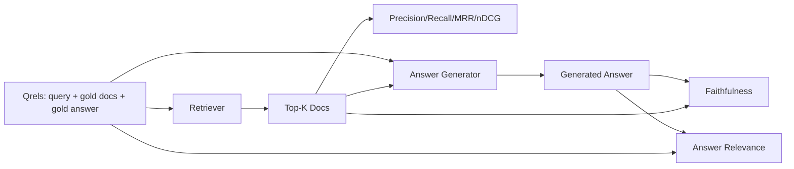

# RAG 评测：精确率、召回率、MRR、nDCG、忠实度、答案相关性

> 如果你不能同时给检索端和答案端打分，你就没法上线这套系统。二者不是同一个指标，同一个提示词也会在不同的轴上失败。

> **【中文解读】** 本课是 RAG 深入路线（64-69）的收尾评测课：用一份固定 qrels（查询 + 金标文档 + 金标答案）同时给检索和生成两端打分。检索端四个指标——精确率@k、召回率@k、MRR、nDCG@k——评"找没找到、排没排对"；生成端两个指标——忠实度与答案相关性——评"答案是否落地有据、是否切题"。六个指标全部按字面定义从零实现，LLM 裁判用确定性 mock 替代，评测全程离线、可复现。

> **【拓展：RAG 评测生态→Ragas 三件套】** 工业界流行的 Ragas 框架把 RAG 评测拆成几乎相同的维度：faithfulness（忠实度）、answer relevancy（答案相关性）、context precision/recall（上下文精确率/召回率），与本课六指标一一对应。区别在于 Ragas 的裁判是真 LLM，本课用 token 重叠的 mock 裁判换来了确定性与零成本。把本课的 mock 换成真实模型调用，就得到一个迷你 Ragas——这也是"先手写再换库"这条课程主线的又一次演练。

> 🔗 **【前置】** 学本课前请先掌握：(1) Phase 11 · 06（RAG 基础）与 · 10（评测框架）；(2) Phase 19 Track B 基础（20-29 课）；(3) 本路线前四课——64 分块、65 混合检索、66 重排序、67 查询改写——本课的指标正是给这四个组件定位故障的仪表盘。

**类型：** 动手构建
**语言：** Python
**前置条件：** Phase 11 · 06（RAG）、10（评测）；Phase 19 Track B 基础（20-29 课）；Phase 19 · 64、65、66、67
**预计用时：** 约 90 分钟

## 学习目标

- 从金标 qrels 计算四个检索指标：precision@k、recall@k、MRR（平均倒数排名）和 nDCG@k。
- 计算两个答案层指标：忠实度（每条论断都以检索上下文为依据）和答案相关性（答案切合问题）。
- 构建一个固定 qrels 文件（查询、金标文档 id、金标答案文本），让评测端到端读得起来。
- 读懂指标数值，诊断流水线在哪一层失败：检索、排序、生成还是落地依据。

## 问题引入

> **【中文解读】** RAG 系统至少有四个可独立出错的部件：分块器、检索器、重排序器、生成器。用户只报告"答案错了"，但病灶可能在任何一环。没有分阶段指标就无法定位——这就是本课用六个指标把流水线切成可观测段落的原因。

RAG 系统至少有四个活动部件：分块器、检索器、重排序器、生成器。任何一个都可能是错误答案的源头。没有分阶段指标，你就是在盲飞。

用户报告了一个错误答案。是分块器切断了答案片段？是检索器没把正确分块送进 top-k？是重排序器把正确分块挤出了第一位？还是生成器无视分块自己编了一个？光看答案无法判断。你需要：

- 检索指标，给检索器的产出打分。
- 排序指标，给正确分块在序列中的位置打分。
- 忠实度，检查生成器是否守在检索上下文之内。
- 答案相关性，检查答案到底有没有回应问题。

本课在一份固定 qrels 文件之上构建全部六个指标。评测离线且确定性；生产环境中把 mock LLM 裁判换成真模型即可。

## 核心概念

> **【中文解读】** 六个指标分两层看。检索层看 top-k 列表：精确率=retrieved 里有多少是金标，召回率=金标有多少进了 top-k，MRR=第一个相关文档排多前，nDCG=带分级相关性的排序质量。生成层看最终答案：忠实度=每条论断是否有检索上下文支撑，答案相关性=答案是否回应了问题。两个生成层指标相互独立——忠实但不切题、切题但编造，是两类不同的病，要用不同的药。



### Precision@k（精确率@k）

在检索器返回的 top-k 文档里，有多大比例属于金标集合？若金标有 3 篇文档而 top-3 命中其中 2 篇外加 1 篇错的，precision@3 = 2/3。当"检索回一个无关分块"的代价高时（生成器浪费 token，或该分块污染答案）用精确率。

### Recall@k（召回率@k）

在金标文档里，有多大比例进了 top-k？若金标有 3 篇而 top-5 全部包含，recall@5 = 1.0。当"错过答案"的代价高时用召回率（宁可多看一个错误分块，也不要彻底错过答案分块）。

生产 RAG 中人们最常引用的指标是 recall@k。生成端丢掉无关分块很容易；但它无法凭空回答一个从未见过的分块里的问题。

### MRR（平均倒数排名）

对每个查询，找出排序列表中第一个相关文档的位置。倒数排名 = 1 / 位置。对整个查询集取平均。MRR 用一个数字概括"检索器把最佳答案放到最前面的能力"。

MRR 重罚非第一的位置。金标文档排第 1 的查询贡献 1.0，第 2 贡献 0.5，第 10 贡献 0.1。该指标由列表顶部主导。

### nDCG@k（归一化折损累计增益）

归一化折损累计增益。完整公式给每个检索到的文档赋予增益（通常相关为 1、不相关为 0），按位置的对数折损，求和，再除以理想 DCG（完美排序时能得到的 DCG）。取值范围 0 到 1。

nDCG 容纳分级相关性：金标可以说"文档 A 是 3、文档 B 是 2、文档 C 是 1"。MRR 和 recall@k 把一切压平成二元。当语料中每个查询存在多个部分相关的文档时，用 nDCG。

### Faithfulness（忠实度）

对生成答案里的每条论断，检查它是否被检索上下文支撑。标准实现用 LLM 裁判提示词：输入（论断， 上下文），输出是或否。指标值 = 通过的论断占比。

忠实度捕捉的是"模型编造内容"这种生成器失败模式。即使检索器返回了正确分块，会幻觉的生成器也是坏的。忠实度也叫 groundedness、support、attribution。

本课用确定性 mock 裁判实现忠实度：检查每条论断的 token 与检索上下文的重叠是否超过阈值。生产中换成真实模型调用，指标的形状不变。

### Answer relevance（答案相关性）

答案到底切不切题？忠实度问"答案是否以上下文为依据"，答案相关性问"答案是否以问题为依据"。忠实但跑题的答案，忠实度高、相关性低；简短切题但无视上下文的答案，相关性高、忠实度低。

标准实现同样用 LLM 裁判：输入（问题， 答案），问答案是否回应了问题。本课实现的是"token 重叠 + 裁判"的替身。

## 固定 qrels 测评集

> **【中文解读】** qrels（queries + relevance judgments，查询与相关性判定）是评测的地基：每条查询带金标文档 id 集合（供精确率/召回率/MRR 用）、分级相关性字典（供 nDCG 用）和金标答案子串（仅作参考元数据，忠实度并不对着它算）。生产中这些标签要人工标注；本课交付手工构造的 fixture，让评测开箱即跑。

```python
{
  "qid": "q1",
  "query": "what is the abort threshold for multipart uploads",
  "gold_doc_ids": ["d1", "d3"],
  "gold_answer_substring": "three failed parts",
  "graded_relevance": {"d1": 3, "d3": 2},
}
```

每条查询携带：

- 查询字符串；
- 金标文档 id 集合（供精确率/召回率/MRR 使用）；
- 分级相关性字典（供 nDCG 使用）；
- 金标答案子串（仅作为每条 qrel 的参考元数据保留；本课的忠实度是把抽取出的论断对着检索上下文判定的，不是对着这个子串）。

生产环境中这些需要人工标注。本课交付手工构造的 fixture，让评测开箱即跑。

```figure
ci-rag-metric-ladder
```

## 动手构建

> **【中文解读】** `code/main.py` 把六个指标全部按字面定义实现，外加确定性 `MockJudge`（token 重叠裁判）和 `evaluate_pipeline` 编排器。演示对三条流水线变体（分块基线、混合检索、混合检索+重排序）跑同一份 qrels，输出单张指标表——混合检索行的召回率高于基线，重排序行的 MRR 又高于混合检索，与 64-67 课的结论形成闭环。

`code/main.py` 实现：

- `precision_at_k(retrieved, gold, k)`——字面定义。
- `recall_at_k(retrieved, gold, k)`——字面定义。
- `mean_reciprocal_rank(retrieved_list_of_lists, gold_list)`——对查询集取平均。
- `ndcg_at_k(retrieved, graded_relevance, k)`——二元或分级增益下的 DCG / IDCG。
- `extract_claims(answer)`——把答案拆成句子形状的论断。
- `faithfulness(claims, context_texts, judge)`——被判为有支撑的论断占比。
- `answer_relevance(question, answer, judge)`——裁判答案是否回应了问题。
- `MockJudge`——确定性 token 重叠裁判，让评测离线运行。
- `evaluate_pipeline(pipeline_fn, qrels, ks)`——跑全部指标的编排器。
- 一个演示——对三条流水线变体（分块基线、混合检索、混合检索+重排序）跑 qrels 并打印指标表。

运行：

```bash
python3 code/main.py
```

输出在一张指标表里给出每个变体的 precision@k、recall@k、MRR、nDCG@k、忠实度和答案相关性。混合检索行在召回率上胜过基线；重排序行在 MRR 上胜过混合检索。

## 读指标定位故障

> **【中文解读】** 这张诊断表是本课的实战核心：指标组合直接指向故障组件。召回率和精确率都低 → 查分块器或检索器；召回够但 MRR 低 → 查重排序器；MRR 高但忠实度低 → 查生成提示词（强制引用或拒答）；忠实度高但相关性低 → 查查询改写器。四个指标都高而用户仍抱怨 → qrels 不代表真实查询，扩集。

| 症状 | 可能原因 | 修什么 |
|------|---------|--------|
| recall@k 低、precision@k 低 | 分块器切断了答案，或检索器找不到它 | 分块边界（64 课）或检索器模态（65 课） |
| recall@k 尚可、MRR 低 | 正确分块在 top-k 里但不在第 1 位 | 重排序器（66 课） |
| MRR 高、忠实度低 | 上下文正确但生成器仍编造 | 生成提示词；强制引用或拒答 |
| 忠实度高、相关性低 | 答案落地有据但跑题 | 查询改写器（67 课）或生成提示词 |
| 四项全高、用户仍抱怨 | 评测集不具代表性 | 用真实用户查询扩充 qrels |

## 演示会掩盖的失败模式

> **【中文解读】** 自动化评测的四个坑：LLM 裁判偏袒自家输出（换一个与生成器不同家族的模型当裁判，或人工抽检）；qrels 腐化（语料一变金标答案就过期，安排季度复审）；逐句忠实度漏掉整体误导（在自动化指标之上叠加人工抽检）；平均召回率掩盖某一类查询永远失败（按查询类别切片报告）。

**LLM 裁判偏袒。**模型给自家输出的忠实度打分偏高。给裁判换一个与生成器不同的模型家族，或人工给样本打分。

**qrels 腐化。**语料变化时金标答案随之漂移。2024 年 1 月还是 q1 金标的文档，到 2024 年 10 月因为团队给函数改了名就不再是正确答案。安排季度 qrels 复审。

**忠实度微观检查漏掉宏观论断。**逐句忠实度可以全部通过，而整篇答案的结构仍在误导人。在自动化指标之上叠加样本级的人工复审。

**recall@k 掩盖单查询失败。**90% 的平均召回率可以掩盖某一类查询永远失败。按查询类别（字面、改述、多主题）切片 qrels 并分片报告。

## 生产实践

生产实践模式：

- 每次改动检索器或生成器都跑评测。把 recall@k 回退当作测试失败对待。
- 按查询持久化指标轨迹。用户投诉时查到匹配的 qrels 条目，看它本该不该被拦住。
- 给 qrels 分层：20 条查询的冒烟集跑 CI；200 条的回归集每晚跑；2000 条的深度集每周跑。

## 产出物

第 69 课把整条流水线（分块器、检索器、重排序器、生成器）接起来，并用这套评测给端到端系统打分。

## 练习题

1. 加第五个检索指标：hit-rate@k。与 recall@k 对比，解释二者何时不同。
2. 实现分级忠实度：0（无支撑）、1（部分支撑）、2（完全支撑），并相应更新指标。
3. 把 mock 裁判换成真实模型调用，度量 mock 与真裁判在 fixture 上的分歧。
4. 加查询类别切片（"字面"、"改述"、"多主题"），分片报告指标。
5. 加"答案长度"指标并与忠实度做相关分析，画出曲线。

## 术语速查表

| 术语 | 口头说法 | 实际含义 |
|------|---------|---------|
| Precision@k | "检索结果的命中率" | top-k 中属于金标的比例 |
| Recall@k | "金标的命中率" | 金标进入 top-k 的比例 |
| MRR | "首命中位置" | 第一个相关文档排名倒数的平均 |
| nDCG@k | "分级排序质量" | top-k 的 DCG 除以理想 DCG |
| Faithfulness | "落地性" | 答案论断被检索上下文支撑的比例 |
| Answer relevance | "切题吗" | 答案是否匹配问题的意图 |
| Qrels | "金标标签" | 已标注的查询集合及其金标文档与答案 |

## 延伸阅读

- Buckley, Voorhees, "Evaluating Evaluation Measure Stability", SIGIR 2000——排序指标稳定性度量的经典论文
- Jarvelin, Kekalainen, "Cumulated Gain-based Evaluation of IR Techniques"——nDCG 的原始论文
- [Ragas: Automated Evaluation of RAG Pipelines](https://docs.ragas.io)——自动化 RAG 流水线评测框架的官方文档
- [Anthropic, Evaluating RAG](https://www.anthropic.com/news/evaluating-rag)——Anthropic 关于 RAG 评测的实践文章
- Phase 11 · 10——评测框架基础
- Phase 19 · 64-67——本课评测的组件
- Phase 19 · 69——本评测打分的端到端流水线
