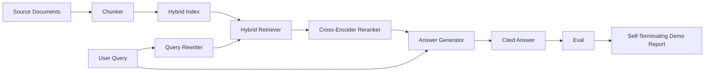

# End-to-End RAG System | 端到端 RAG 系统

> Six lessons of components. One pipeline. One eval loop. One self-terminating demo. This is the system you ship.

> **【中文解读】** 本课把 64-68 五课的组件接成一条完整流水线：分块 → 混合索引 → 查询改写 → 交叉编码器重排序 → 带引用的答案生成，再用第 68 课的六指标评测给整条系统打分。核心论证方式是"集成对比孤立"：只有当集成后的指标全面超过各组件孤立演示的成绩，系统才算被证明。演示自终止——摄取固定语料、跑固定查询、按阈值设退出码，可以直接当 CI 冒烟测试用。

> **【拓展：RAG 路线终点→生产形态】** 这条 64-69 路线对应生产 RAG 系统的标准骨架：Anthropic 的上下文检索（contextual retrieval）文章讲的正是"分块时给每个块补上下文 + BM25 与稠密向量混合 + 重排序"这套组合。本课的 mock 生成器不能幻觉（只复述检索文本），这恰好隔离了检索端的变量；生产中换真 LLM 后，忠实度指标就成为守护幻觉风险的闸门。后续的摄取自动化、增量重索引、遥测、serving 层都在这条骨架之上叠加。

> 🔗 **【前置】** 学本课前请先掌握：(1) Phase 11 · 06（RAG 基础）与 · 10（评测框架）；(2) Phase 19 Track B 基础（20-29 课）；(3) 本路线 64-68 五课——分块、混合检索、重排序、查询改写、评测——本课的全部组件与评测线束都来自那里。

**Type:** Build | **类型:** 动手构建
**Languages:** Python | **语言:** Python
**Prerequisites:** Phase 11 lessons 06 (RAG), 10 (evaluation); Phase 19 Track B foundations (lessons 20-29); Phase 19 lessons 64, 65, 66, 67, 68 | **前置知识:** Phase 11 · 06（RAG）、10（评测）；Phase 19 Track B 基础（20-29 课）；Phase 19 · 64、65、66、67、68
**Time:** ~90 minutes | **时间:** 约 90 分钟

## Learning Objectives | 学习目标
- Compose the chunker, hybrid retriever, query rewriter, cross-encoder reranker, and answer generator into a single end-to-end pipeline.
  中文翻译：把分块器、混合检索器、查询改写器、交叉编码器重排序器和答案生成器组装成一条端到端流水线。
- Implement an answer generator that cites its claims by chunk anchor, with refuse-on-low-confidence fallback.
  中文翻译：实现一个按分块锚点引用论断的答案生成器，并带低置信度拒答回退。
- Run the lesson 68 eval against the assembled pipeline and prove the staged build wins on every metric over the same components in isolation.
  中文翻译：对组装好的流水线跑第 68 课的评测，证明分阶段构建在每项指标上都胜过同样组件的孤立版本。
- Build a self-terminating CLI demo that ingests a fixture corpus, runs a fixed query set, and exits zero with a summary report.
  中文翻译：构建一个自终止的 CLI 演示：摄取固定语料、跑固定查询集、输出摘要报告并以零退出码结束。

## The Problem | 问题引入

> **【中文解读】** 本节论证"集成测试才是真正的测试"：组件在孤立基准上赢了不代表系统会赢——分块器赢了 recall@5 但检索器排不动它产出的块；重排序器在合成候选池上提升 MRR 却在真实双编码器候选上失效；改写器在一条查询上提升、在下一条上崩溃。唯一可信的证据是整条流水线对同一份 qrels、同一套指标的端到端成绩。

Six components in isolation prove nothing. The chunker can win on recall@5 against the corpus and lose on the system's recall@5 because the retriever cannot rank what the chunker emits. The reranker can lift MRR on a synthetic candidate pool and fail on real bi-encoder candidates because the bi-encoder's recall at the rerank budget is too low. The query rewriter can promote the gold doc on a single query and break on the next because the LLM mock returns a degenerate hypothetical.

> 孤立的六个组件什么也证明不了。分块器可以在语料上赢得 recall@5，却在系统 recall@5 上输掉——因为检索器排不动它产出的块。重排序器可以在合成候选池上拉高 MRR，却在真实双编码器候选上失败——因为双编码器在重排序预算内的召回率太低。查询改写器可以在一条查询上把金标顶上去，却在下一条上崩掉——因为 LLM mock 返回了一个退化的假设文档。

The integration test is the whole pipeline run end to end against the same fixture qrels, with the same metric, with one orchestrator file that wires everything together. That is what this lesson builds. If the metrics on the integrated pipeline beat the metrics on each stage's isolated demo, you have proven the system.

> 集成测试就是整条流水线端到端地对着同一份固定 qrels、同一套指标运行，并由一个把一切都接起来的编排器文件完成。本课构建的就是它。如果集成流水线的指标胜过每个阶段孤立演示的指标，你就证明了这套系统。

## The Concept | 核心概念

> **【中文解读】** 流水线是一张小图：每个阶段都是一个签名清晰的函数（分块器、检索器、改写器、重排序器、生成器），`Pipeline` 类持有五个阶段并按序执行。签名稳定是可组合的前提——任何阶段都可替换，流水线照跑。



### Wiring choices

The pipeline is a small graph. Each stage is a function with a clear signature.

> 流水线是一张小图。每个阶段都是一个签名清晰的函数。

| Stage | Input | Output |
|-------|-------|--------|
| Chunker | Document text | List of Chunk records |
| Retriever | Query string | Top-N Chunk records |
| Rewriter (optional) | Query string | List of rewrites + hypothetical |
| Reranker | Query, candidates | Top-K Chunk records with cross scores |
| Generator | Query, top-K Chunk records | Answer string with citations |

The composition is straightforward when each signature is stable. The lesson's `Pipeline` class holds the five stages and a `query` method that runs them in order. Every stage is swappable: pass a different chunker, retriever, rewriter, reranker, or generator and the pipeline still runs.

> 每个签名稳定时，组装就直截了当。本课的 `Pipeline` 类持有五个阶段和一个按序执行它们的 `query` 方法。每个阶段都可替换：传入不同的分块器、检索器、改写器、重排序器或生成器，流水线照跑。

### Answer generator with citations

> **【中文解读】** 生成器是最容易坏的一环。本课的确定性 mock 生成器：从重排序后的 top-K 里选至多两个与查询内容 token 重叠最高的块，逐句拼接成答案，每句后跟 `[doc_id:chunk_index]` 锚点；没有任何块的重叠超过拒答阈值就输出"我不知道"且不带引用。生产提示词模板同样强制"只用给定片段、逐条引用、答不了就说不知道"。交叉编码器第 1 名分数被记录的原因正在于此——低于语料阈值即拒答，这是防幻觉的安全阀。

The generator is the last stage and the easiest to break. The lesson ships a deterministic mock generator that:

> 生成器是最后一个阶段，也是最容易坏的一个。本课交付一个确定性 mock 生成器，它：

1. Takes the top-K reranked chunks.
   中文翻译：取重排序后的 top-K 分块。
2. Selects up to two chunks whose text contains the highest content-token overlap with the query.
   中文翻译：选出至多两个文本与查询内容 token 重叠最高的分块。
3. Emits an answer that is a concatenation of one-sentence-from-each-selected-chunk, with each sentence followed by a `[doc_id:chunk_index]` anchor.
   中文翻译：输出的答案是"每个选中分块各取一句"的拼接，每句后面跟一个 `[doc_id:chunk_index]` 锚点。
4. If no chunk has overlap above a refuse threshold, emits "I do not know" with no citation.
   中文翻译：若没有任何分块的重叠超过拒答阈值，输出"我不知道"且不带引用。

In production you swap the mock for a real LLM call with the prompt template:

> 生产中把 mock 换成真实 LLM 调用，提示词模板如下：

```
You are answering a question using only the snippets below.
Cite every claim with the anchor in parentheses.
If the snippets do not answer the question, say "I do not know".

Question: {query}

Snippets:
{enumerated chunks with anchors}

Answer:
```

The refuse-on-low-confidence path is the whole reason the cross-encoder rank-1 score is logged. If it sits below the corpus threshold, the generator refuses. This is the safety valve against hallucinated answers.

> "低置信度拒答"路径正是交叉编码器第 1 名分数被记录的全部原因。若它低于语料阈值，生成器就拒答。这是对抗幻觉答案的安全阀。

### The self-terminating demo

> **【中文解读】** 演示就是 CI 冒烟测试的形状：打印单条查询的分阶段明细、对四条固定 qrels 跑评测、打印指标表；全部第 68 课指标达到演示设定的阈值则退出码为 0，任一指标低于阈值则非零退出并指名失败指标。离线、快速、确定性；阈值在 fixture 上刻意收紧，六课中任何一处的回退都会挂掉演示。

The demo runs everything end to end. It prints a per-stage breakdown of one query, runs the eval over the four fixture qrels, prints a metrics table, and exits with status zero if all the lesson 68 metrics meet the thresholds set in the demo. If any metric is below threshold, the demo exits with a non-zero status and a message naming the failing metric.

> 演示端到端跑完一切。它打印一条查询的分阶段明细，对四条固定 qrels 跑评测，打印指标表；若第 68 课的全部指标都达到演示设定的阈值，就以状态码 0 退出。任一指标低于阈值，演示就非零退出并给出指名失败指标的消息。

This is the shape a CI smoke test takes. The pipeline runs offline, fast, deterministic. The thresholds are deliberately tight on the fixture so a regression in any of the six lessons fails the demo.

> 这就是 CI 冒烟测试的形状。流水线离线、快速、确定性运行。阈值在 fixture 上刻意收紧，六课中任何一处的回退都会让演示失败。

```figure
rag-pipeline-flow
```

## Build It | 动手构建

> **【中文解读】** `code/main.py` 组装全部五阶段：`Chunk` 记录贯穿全程；`Chunker` 选 64 课的策略；`HybridIndex` 打包 65 课的 BM25+稠密+RRF；`Rewriter` 从 67 课的 HyDE/多查询/分解中按查询长度和连词情况择一；`Reranker` 是 66 课的交叉编码器（缩小训练集以便秒级收敛）；`Generator` 是带引用与拒答的 mock。跑完输出一条查询 trace、完整评测表和 pass/fail 状态。

`code/main.py` implements:

> `code/main.py` 实现：

- `Chunk` - the record carried through all stages (extends lesson 64's shape with a chunk_index and source doc_id).
  中文翻译：`Chunk`——贯穿所有阶段的记录（在 64 课的形状上扩展了 chunk_index 和源 doc_id）。
- `Chunker` - selects a strategy from lesson 64 (default recursive split).
  中文翻译：`Chunker`——选用 64 课的策略（默认递归切分）。
- `HybridIndex` - bundles BM25 + dense + RRF from lesson 65.
  中文翻译：`HybridIndex`——打包 65 课的 BM25 + 稠密向量 + RRF。
- `Rewriter` (optional) - picks one of HyDE, multi-query, decomposition from lesson 67 by query length and presence of conjunctions.
  中文翻译：`Rewriter`（可选）——按查询长度和连词情况，从 67 课的 HyDE、多查询、分解中择一。
- `Reranker` - the trained cross-encoder from lesson 66, with a smaller fixture training set so it converges in seconds.
  中文翻译：`Reranker`——66 课训练的交叉编码器，配更小的 fixture 训练集以便数秒内收敛。
- `Generator` - the deterministic mock generator with citations and refuse-on-low-confidence.
  中文翻译：`Generator`——带引用与低置信度拒答的确定性 mock 生成器。
- `Pipeline` - composes the five stages with a `query(question)` method that returns `Result(answer, top_k, latency_ms_per_stage)`.
  中文翻译：`Pipeline`——组装五阶段，`query(question)` 方法返回 `Result(answer, top_k, latency_ms_per_stage)`。
- `run_demo()` - ingests the corpus, runs three fixture queries, runs the eval, prints results, sets exit code by threshold.
  中文翻译：`run_demo()`——摄取语料、跑三条固定查询、跑评测、打印结果、按阈值设定退出码。

Run it:

> 运行：

```bash
python3 code/main.py
```

The output is one printed query trace, the full eval table, and a final pass/fail status. Returns exit code 0 on the fixture.

> 输出是一条打印出来的查询 trace、完整评测表和最终 pass/fail 状态。在 fixture 上返回退出码 0。

## Failure modes the demo will hide | 演示会掩盖的失败模式

> **【中文解读】** 五个演示掩盖不了的坑：分块边界漂移（qrels 标注与演示之间换分块策略会让金标 id 对不上——把策略锁进 qrels 文件，演示头部写明分块器）；重排序训练集泄入评测（严格隔离评测查询，本课刻意让二者不相交）；mock 生成器掩盖幻觉风险（它只会复述检索文本，无法幻觉——生产换真模型）；无流式输出（答案层指标只作用于最终字符串，不影响正确性）；延迟离线（mock 常数时间，真实 LLM 调用占大头，要按请求域规划延迟预算）。

**Chunker boundary drift.** If you swap the chunker strategy between the eval qrels labeling pass and the demo, the gold doc ids no longer line up. Lock the chunker strategy in the qrels file. The demo includes a header that names the chunker.

> **分块边界漂移。**若在 qrels 标注轮与演示之间更换分块策略，金标文档 id 就对不上了。把分块策略锁进 qrels 文件。演示头部写明了分块器名称。

**Reranker training set leaks into the eval.** The 14 training triples in lesson 66 include queries that resemble the eval queries. In production, hold out the eval queries strictly. The demo's eval queries are deliberately disjoint from the rerank training set.

> **重排序训练集泄入评测。**66 课的 14 个训练三元组包含与评测查询相似的查询。生产中要严格隔离评测查询。演示的评测查询与重排序训练集刻意不相交。

**Mock generator hides hallucination risk.** The mock cannot hallucinate because it only emits text from the retrieved chunks. The lesson notes this and points the production swap-in path to a real model.

> **mock 生成器掩盖幻觉风险。**mock 无法幻觉，因为它只输出检索分块中的文本。本课注明了这一点，并把生产替换路径指向真模型。

**No streaming.** The pipeline returns the full answer at the end of every stage. A production system would stream the generator's output. Streaming is out of scope; the answer-grade metrics work on the final string either way.

> **无流式输出。**流水线在每阶段结束时返回完整答案。生产系统会流式输出生成器结果。流式超出本课范围；无论哪种方式，答案层指标都作用于最终字符串。

**Latency is offline.** The mock LLM calls are constant time. Real LLM calls dominate. Plan a latency budget in the request scope; the lesson's per-stage timing only measures CPU work.

> **延迟是离线的。**mock LLM 调用是常数时间。真实 LLM 调用占大头。在请求范围内规划延迟预算；本课的分阶段计时只度量 CPU 工作。

## Use It | 生产实践

Production patterns:

> 生产实践模式：

- Ship the pipeline file under one orchestrator with explicit stage interfaces. Avoid spreading the wiring across the repo.
  中文翻译：把流水线放进单个编排器文件，接口显式。不要把接线散落全仓库。
- Run the eval before every merge that touches a stage. If the eval drops, the merge does not land.
  中文翻译：每次触碰某阶段的合并前都跑评测。评测掉了，合并不落地。
- Persist the metric trace per CI run so you can attribute regressions to a stage swap.
  中文翻译：按 CI 运行持久化指标轨迹，以便把回退归因到某次阶段替换。
- Add a smoke set of 20 queries (subset of the regression set) that runs in under 30 seconds; the full regression set runs nightly.
  中文翻译：加一个 20 条查询的冒烟集（回归集的子集），30 秒内跑完；完整回归集每晚跑。

## Ship It | 产出物

The pipeline file in this lesson is the shape the rest of Phase 19's Track F lessons assume. Subsequent lessons would add ingestion automation, incremental re-index, telemetry, and a serving layer on top. The retrieval, rerank, rewrite, and eval halves are complete here.

> 本课的流水线文件是 Phase 19 Track F 后续课程假定的形状。后续课会在此基础上加摄取自动化、增量重索引、遥测和 serving 层。检索、重排、改写与评测这四块在这里已经完备。

## Exercises | 练习题

1. Add a per-query strategy selector inside the rewriter: heuristics from lesson 67 (length, conjunctions, jargon ratio) pick HyDE, multi-query, or decomposition.
   中文翻译：在改写器内加按查询选择策略的选择器：用 67 课的启发式（长度、连词、术语占比）在 HyDE、多查询或分解之间挑选。
2. Add a real LLM call for the generator behind an env flag. Default to the mock. Measure the latency delta.
   中文翻译：在环境开关后面给生成器加真实 LLM 调用，默认用 mock，度量延迟差。
3. Extend the demo to take a `--corpus path` flag that loads a real corpus. Re-run the eval and the threshold check.
   中文翻译：给演示加 `--corpus path` 参数以加载真实语料，重跑评测和阈值检查。
4. Add a `--strategy` flag to the chunker. Measure each strategy's contribution to end-to-end recall.
   中文翻译：给分块器加 `--strategy` 参数，度量每种策略对端到端召回率的贡献。
5. Add a streaming generator interface and feed it into the eval. Confirm that faithfulness is computed on the final string and not on the streamed prefix.
   中文翻译：加流式生成器接口并接入评测，确认忠实度在最终字符串上计算而非流式前缀。

## Key Terms | 术语速查表

| Term | What people say | What it actually means | 中文术语 |
|------|-----------------|------------------------|----------|
| Pipeline | "RAG pipeline" | The composed stages from ingestion to cited answer | 流水线 |
| Citation anchor | "Source link" | The (doc_id, chunk_index) reference attached to each claim | 引用锚点 |
| Refuse-on-low-confidence | "I do not know" | Generator returns no answer when the reranker top-1 score sits below threshold | 低置信度拒答 |
| Smoke set | "CI eval" | The minimal qrels subset that runs in every PR check | 冒烟集 |
| Stage interface | "Function signature" | The stable input and output type of each pipeline stage | 阶段接口 |

## Further Reading | 延伸阅读

- [Anthropic, Building search and retrieval](https://www.anthropic.com/news/contextual-retrieval)
  中文翻译：Anthropic 上下文检索——生产级检索增强的技术文章。
- [Pinterest, MCP internal search](https://medium.com/pinterest-engineering) - reference production architecture
  中文翻译：Pinterest 工程博客——生产架构参考。
- [Ragas: Automated Evaluation of RAG Pipelines](https://docs.ragas.io)
  中文翻译：Ragas——自动化 RAG 流水线评测框架的官方文档。
- Phase 11 lesson 06 - RAG fundamentals
  中文翻译：Phase 11 · 06——RAG 基础。
- Phase 19 lessons 64-68 - the components composed here
  中文翻译：Phase 19 · 64-68——本课组装的组件。
