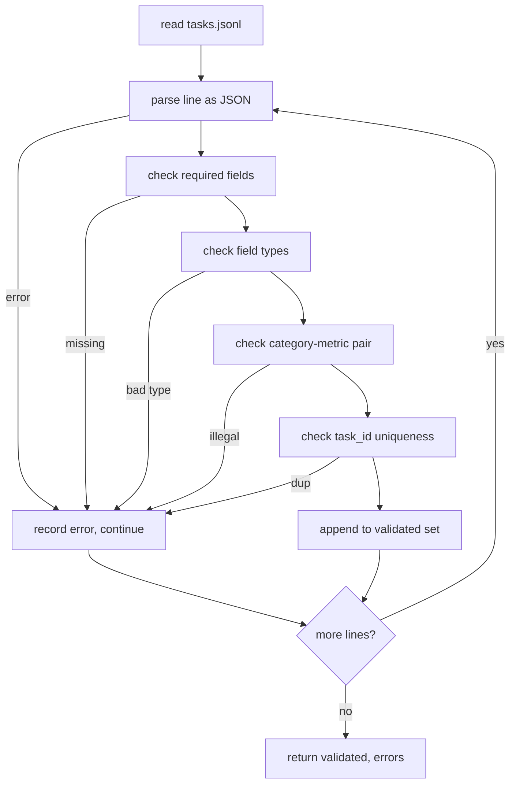

# 任务规格格式

> 一个评测线束的上限，由它的任务所遵守的契约决定。在写任何打分函数之前，先冻结 JSONL 形状和指标词表。

> **【中文解读】** 本课是评测系统路线（70-75）的第一课：在写任何打分函数之前，先冻结任务的 JSONL 形状和指标词表。算术、多选、代码执行、分类、摘要五类任务共用一种记录形状，指标名词表封闭，校验器把坏记录挡在运行器之外。这是后面 71（经典指标）、72（代码执行指标）、75（端到端运行器）共同遵守的地基。

> 🔗 **【前置】** 学本课前请先掌握：Phase 19 Track B 基础（20-29 课）——特别是其中的验证门控与 fixture 任务设计；本课不依赖任何模型调用，纯标准库。

**类型：** 动手构建
**语言：** Python
**前置条件：** Phase 19 Track B 基础
**预计用时：** 约 90 分钟

## 学习目标

- 定义一个 JSONL 任务记录 schema，用同一种形状覆盖算术、多选、代码执行、分类和自由文本摘要。
- 钉死一个封闭的指标名词表，让下游课程（71-73）只按单个字段分发。
- 把少样本示例和后处理规则写成任务的一部分而不是运行器的一部分，让同一提示词在不同模型上产出同样的目标。
- 实现一个严格校验器，在坏记录到达运行器之前就拒绝它。
- 交付一个 10 任务的 fixture 集，走遍规格的每个分支，让校验器有真东西可嚼。

```figure
ci-task-spec-gate
```

## 为什么要冻结规格

> **【中文解读】** 本节给出动机：研究代码库积累评测脚本的速度快过积累测试，半年后每个 notebook 一套 JSON 形状、每个指标被实现两遍、跨运行无法比较。解法无聊但有效：定一个 schema、写一个校验器、拒绝其余一切。设计借镜 BIG-bench、HELM、lm-eval 风格的线束，但字段名是本课自己的——每个字段有唯一属主，流水线中途任何字段不可变。

研究代码库积累评测脚本的速度快过积累测试。半年之后，每个 notebook 有自己的 JSON 形状，每个指标被实现了两遍，没有任何东西能跨运行比较。修复方法很无聊：选定一个 schema，写一个校验器，拒绝其余一切。这就是本课做的事。

这个形状借镜了 BIG-bench、HELM 和 lm-eval 风格线束的思路，但字段名是我们自己的。每个字段有唯一属主：运行器读任务，指标读 targets，后处理步骤归一化生成结果。流水线中途任何字段都不可变。

## 记录结构

> **【中文解读】** 一个任务就是一行 JSON 对象（JSONL）：线束读 `tasks.jsonl` 并逐行独立校验——一行坏了只中止该记录，不中止整个运行。必填字段 6 个（task_id、category、prompt、targets、metric_name、post_process），可选 2 个（few_shot_examples、metadata），未知顶层字段直接校验失败。

一个任务是单行上的一个 JSON 对象。线束读 `tasks.jsonl` 并逐行独立校验。一行坏了只中止该记录，不中止整个运行。

```json
{
  "task_id": "arith_001",
  "category": "arithmetic",
  "prompt": "Compute the result. Question: 17 + 24\nAnswer:",
  "targets": ["41"],
  "metric_name": "exact_match",
  "few_shot_examples": [
    {"prompt": "Question: 2 + 2\nAnswer:", "completion": "4"}
  ],
  "post_process": "strip_whitespace",
  "metadata": {"difficulty": "easy"}
}
```

必填字段是 `task_id`、`category`、`prompt`、`targets`、`metric_name`、`post_process`。`few_shot_examples` 和 `metadata` 可选。未知顶层字段校验失败。

## 字段规则

> **【中文解读】** 字段规则的核心是"类别约束指标"：`code_exec` 任务必须配 `metric_name = code_exec`，`mcq` 必须配 `exact_match` 加单字母目标。指标词表封闭为六个（exact_match、f1、bleu_4、rouge_l、accuracy、code_exec）——加新指标必须开新课并在词表里加条目。few-shot 上限 8 条；后处理规则六选一、不许组合。

`task_id` 是不含空白字符的字符串。校验器在整文件范围内强制唯一。

`category` 是 `arithmetic`、`mcq`、`code_exec`、`classification`、`summary` 之一。类别约束哪个"指标 + 后处理"组合是合法的：`code_exec` 任务必须用 `metric_name = code_exec`；`mcq` 任务必须用 `metric_name = exact_match` 对单字母目标。

`prompt` 是非空字符串。校验器禁止尾部空白，并拒绝 prompt 正文里已含少样本块的记录。少样本渲染发生在运行器，不在作者侧。

`targets` 是非空字符串列表。对 `exact_match`，任一元素命中即算；对 `f1` 和 `rouge_l`，取得分最高的目标；对 `mcq`，列表恰好一个元素。

`metric_name` 是 `exact_match`、`f1`、`bleu_4`、`rouge_l`、`accuracy`、`code_exec` 之一。词表是封闭的。新指标需要新课和新条目。

`few_shot_examples` 是 `{prompt, completion}` 对的列表。校验器把列表上限压到 8 条，以约束提示词长度。

`post_process` 是 `none`、`strip_whitespace`、`lower`、`extract_letter`、`extract_code_block`、`extract_first_line` 之一。每条规则只有单一确定行为。校验器禁止组合规则。

## 校验器行为

> **【中文解读】** 校验器返回两个列表：通过的记录，以及带行号、违反规则、出错字段的错误记录。运行器在错误列表非空时拒绝启动，除非显式传 `--allow-bad-tasks`。"fail fast + 精确指认"是评测基础设施的基本功。



校验器返回两个列表：通过的记录；带出错行号、违反规则和出错字段的错误记录。错误列表非空时运行器拒绝启动，除非显式设置 `--allow-bad-tasks` 开关。

## 少样本渲染

> **【中文解读】** 少样本渲染由运行器统一拼接——同一条代码路径服务所有模型，方差来源只剩模型本身；作者只把示例写一次，不是每个 provider 写一次。

运行器把少样本示例拼接在 prompt 之前，中间以空行分隔。同一条代码路径为每个模型运行，因此唯一的方差来源是模型本身。作者把示例写一次，而不是每个 provider 写一次。

```python
def render(task):
    parts = []
    for ex in task.get("few_shot_examples", []):
        parts.append(ex["prompt"] + " " + ex["completion"])
    parts.append(task["prompt"])
    return "\n\n".join(parts)
```

## 后处理规则

> **【中文解读】** 后处理在生成之后、指标之前运行，确定性、无状态、不许组合。六条规则各司其职——MCQ 抽字母、代码执行抽围栏代码块、摘要取首行。

后处理步骤在生成之后、指标之前运行。它是确定性的、无状态的。

- `none` 原样返回字符串。
- `strip_whitespace` 去除首尾空白。
- `lower` 把字符串转小写。
- `extract_letter` 返回第一个匹配 `[A-E]` 的字符，用于多选题。
- `extract_code_block` 返回第一个三反引号围栏代码块的主体，用于代码执行。
- `extract_first_line` 返回第一个非空行，用于摘要分类。

需要这张清单之外规则的任务，应该放进一门新课。

## 本课不做什么

本课不评分、不调模型、不跑代码——那些在 71、72、75 课。本课冻结的是它们全部要遵守的契约。

10 条任务的 fixture 覆盖两条算术、两条多选、两条代码执行、两条分类、两条摘要。校验器在全部 10 条上通过。另一个 fixture（`tasks_bad.jsonl`）踩遍每条规则，校验器返回恰好那么多个错误。

## 如何读代码

`main.py` 定义 `TaskSpec`、`validate_task`、`validate_file` 和 CLI 入口。fixture 加载器是 `load_fixtures`。渲染与后处理辅助函数就放在校验旁边，让 75 课的运行器只需导入单个模块。

从头到尾读 `main.py`，然后读 `code/tests/test_spec.py`。测试钉死了每条校验规则和每个后处理行为。`main.py` 底部的演示校验自带的 fixture 并打印摘要。

## 更进一步

> **【中文解读】** 收尾的态度值得记住：像对待数据库迁移一样对待规格变更——加类别必须同时加指标、后处理规则和至少一条 fixture 任务；每次变更都过评审、有版本、带测试。校验器就是那道门。

真实评测套件长类别的方式，就是 schema 长列的方式。清醒的做法是：拒绝只加类别而不同时加一个指标、一条后处理规则和至少一条 fixture 任务。像对待数据库迁移一样对待规格：每次变更都被评审、有版本、带测试。本课的校验器就是那道门。
