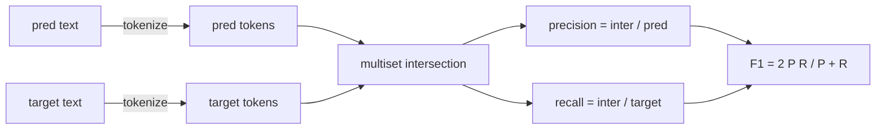
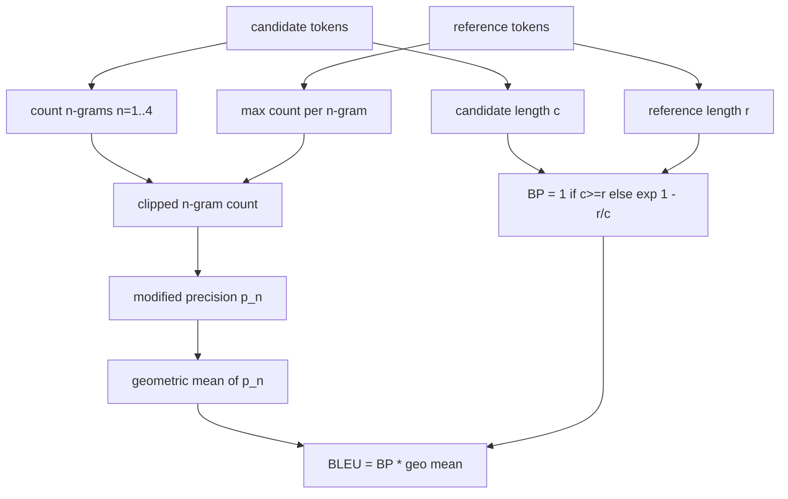

# Classical Metrics | 经典指标

> BLEU, ROUGE-L, F1, exact-match, accuracy. Five metrics that still account for most published LLM eval numbers. Implement each from first principles so you know what the number means.

> **【中文解读】** 本课把发表文献里最常见的五个 LLM 评测指标——BLEU、ROUGE-L、F1、精确匹配、准确率——全部从第一性原理实现一遍。目的不是造轮子，而是让你能指着代码说清"分词器在哪一行决定、平滑在哪一行施加"，从此读论文里的指标数字不再困惑。全部实现只依赖标准库加 numpy，并与 70 课的 metric_name 字段对接成单一分发入口。

> **【拓展：指标分层→经典地基与模型层】** 评测指标分两层：本课的经典层（表面重叠：n-gram、LCS、token 集合）快、可审计、可复现，但奖励字面重合、漏掉语义；模型层（BLEURT、BERTScore、GEval）用神经网络度量语义相似，但引入模型偏差与复现成本。工程惯例是先钉死经典层作为地基，再在其上叠加模型层——两层数字背离时，恰恰暴露了"表面像但语义不同"的样本。

> 🔗 **【前置】** 学本课前请先掌握：(1) 70 课（任务规格格式）——本课的分发器按其 metric_name 字段分发；(2) 基础组合数学（几何平均）与动态规划概念——ROUGE-L 的 LCS 表会用到。

**Type:** Build | **类型:** 动手构建
**Languages:** Python | **语言:** Python
**Prerequisites:** Phase 19 Track B foundations, lesson 70 | **前置知识:** Phase 19 Track B 基础；70 课（任务规格格式）
**Time:** ~90 min | **时间:** 约 90 分钟

## Learning objectives | 学习目标

- Implement token-level exact-match, F1, and accuracy with explicit tokenisation rules.
  中文翻译：用显式的分词规则实现 token 级精确匹配、F1 和准确率。
- Implement BLEU-4 from the ground up: modified n-gram precision, geometric mean over n equals 1 through 4, brevity penalty.
  中文翻译：从零实现 BLEU-4：修改版 n-gram 精确率、n=1..4 的几何平均、短句惩罚。
- Implement ROUGE-L using longest common subsequence, with F-beta combination of precision and recall.
  中文翻译：用最长公共子序列实现 ROUGE-L，以 F-beta 组合精确率与召回率。
- Dispatch on the metric_name field from lesson 70 so the runner stays metric-agnostic.
  中文翻译：按 70 课的 metric_name 字段分发，让运行器对指标保持无关。
- Pin the behaviour with reference vectors drawn from worked examples, not from a third-party library.
  中文翻译：用手工演算的参考向量钉死行为，而不是依赖第三方库。

```figure
cd-bleu-overlap
```

## Why reimplement | 为什么要重新实现

> **【中文解读】** "BLEU 28.3 和 BLEU 0.283 哪个大""两个库的 ROUGE-L 为什么差十分"——这类困惑的根源是指标实现里藏着看不见的默认值（分词、大小写、平滑）。自己写一遍、钉住每条规则，是把指标数字从黑盒变成可读配置的唯一途径。

You will read papers that report BLEU 28.3 and another that reports BLEU 0.283. You will find ROUGE-L scores that differ by ten points across two libraries because one truncates to lowercase and the other does not. The fastest way to stop being confused is to write the metrics yourself, then point at the line where the tokenizer is decided and the line where the smoothing is applied. After that, comparing numbers across papers becomes a matter of reading the metric setup, not arguing about libraries.

> 你会读到报告 BLEU 28.3 的论文，也会读到报告 BLEU 0.283 的论文。你会发现两个库的 ROUGE-L 分数相差十分，因为一个截断转小写而另一个不转。止住困惑最快的办法就是自己把这些指标写一遍，然后能指出"分词器在哪一行决定、平滑在哪一行施加"。此后，跨论文比较数字就成了读指标配置的事，而不是争论用哪个库的事。

Stdlib plus numpy is enough. BLEU is counting and a clamp. ROUGE-L is dynamic programming. F1 is a set intersection on tokens. The hardest part is choosing a tokenizer and committing to it.

> 标准库加 numpy 就够了。BLEU 是计数加一个钳制。ROUGE-L 是动态规划。F1 是 token 上的集合交集。最难的部分是选定一个分词器并坚持用它。

## Tokenisation | 分词

> **【中文解读】** 分词器是本课唯一的全局决定：小写、`\w+` 连串、丢标点，所有指标共用，运行器无权换。换了分词器就是换了基准——分词器是契约，不是旋钮。生产环境需另议 CJK、缩写、代码标识符。

The tokenizer is `re.findall(r"\w+", text.lower())`. Lowercase, alphanumeric runs, drop punctuation. Every metric in this lesson uses this exact tokenizer. The runner does not get to choose. If you swap tokenizers, you are running a different benchmark.

> 分词器是 `re.findall(r"\w+", text.lower())`：转小写、字母数字连串、丢弃标点。本课的每个指标都用这同一个分词器，运行器无权选择。换了分词器，你跑的就是另一个基准。

```python
TOKEN_RE = re.compile(r"\w+", re.UNICODE)
def tokenize(text):
    return TOKEN_RE.findall(text.lower())
```

This is a deliberate simplification. Production setups will care about CJK, contractions, and code identifiers. The point of the lesson is that the tokenizer is a contract, not a knob.

> 这是刻意的简化。生产环境会关心 CJK 字符、缩写和代码标识符。本课的要点是：分词器是契约，不是旋钮。

## Exact match | 精确匹配

```python
def exact_match(pred, targets):
    return float(any(pred.strip() == t.strip() for t in targets))
```

It returns 1.0 or 0.0 per task. The aggregate over a dataset is the mean. This is the workhorse for arithmetic, MCQ, and short classification tasks.

> 每个任务返回 1.0 或 0.0。数据集上的聚合值取平均。这是算术、多选和短分类任务的主力指标。

## Token-level F1 | token 级 F1

> **【中文解读】** token 级 F1 是 SQuAD 风格问答的标准分：预测和目标各建 token 多重集，交集除以预测长度得精确率、除以目标长度得召回率，调和平均成 F1；多目标任务取目标列表上的最大值。它比精确匹配宽容（部分重叠有部分分），又比 BLEU 简单（不看词序）。

Set up the token multiset for prediction and target. Precision is the multiset intersection divided by the multiset of the prediction. Recall is the same intersection divided by the multiset of the target. F1 is the harmonic mean. The implementation handles the empty-prediction and empty-target edge cases.

> 为预测和目标各建 token 多重集。精确率 = 多重集交集除以预测的多重集。召回率 = 同一交集除以目标的多重集。F1 是二者的调和平均。实现处理了空预测和空目标的边界情况。



For multi-target tasks, we take the best F1 over the target list. That matches the SQuAD-style behaviour widely reported in the literature.

> 对多目标任务，我们在目标列表上取最优 F1。这与文献中广泛报告的 SQuAD 风格行为一致。

## BLEU-4

> **【中文解读】** BLEU-4 三件套：修改版 n-gram 精确率（候选计数按"任一参考中的最大计数"截断，防止靠重复短语刷分）、n=1..4 精确率的几何平均、短句惩罚 BP（候选比参考短就指数扣分）。平滑用 Lin-Och 方法 1（分子分母各加一），避免单个缺失 4-gram 把分数打到零。

BLEU is the canonical machine-translation metric and it still shows up in summarisation work. The formulation we use is corpus-level BLEU-4 with the standard brevity penalty and additive-one smoothing on modified n-gram counts so a single missing 4-gram does not push the score to zero.

> BLEU 是机器翻译的经典指标，如今仍出现在摘要工作中。我们使用的形式是语料级 BLEU-4：标准的短句惩罚，加上对修改版 n-gram 计数的加一平滑，使单个缺失的 4-gram 不至于把分数压到零。

For each candidate-reference pair, we count modified n-gram precision for n equals 1, 2, 3, 4. Modified precision clips the candidate n-gram count by the maximum count of that n-gram in any reference, so a candidate cannot inflate by repeating one phrase. The geometric mean across the four precisions is wrapped by the brevity penalty.

> 对每个"候选-参考"对，我们为 n=1,2,3,4 统计修改版 n-gram 精确率。修改版精确率把候选的 n-gram 计数按"该 n-gram 在任一参考中的最大计数"截断，候选无法靠重复一个短语刷分。四个精确率的几何平均再包上短句惩罚。



The smoothing rule is the one Lin and Och called method 1: add one to both numerator and denominator of every n-gram precision before taking the log. This avoids `log 0` when a reference has no matching 4-gram and stays close to the unsmoothed value on long candidates.

> 平滑规则是 Lin 与 Och 所称的方法 1：在取对数之前，给每个 n-gram 精确率的分子和分母各加一。它避免了参考中没有匹配 4-gram 时的 `log 0`，且在长候选上接近未平滑的值。

## ROUGE-L

> **【中文解读】** ROUGE-L 用最长公共子序列捕捉词序而不强制连续：LCS/参考长度=召回率，LCS/候选长度=精确率，F-beta（beta=1）合成。动态规划 O(nm)，摘要长度下毫秒级。它是默认的摘要指标，因为对词的插入删除不敏感。

ROUGE-L compares the longest common subsequence of the candidate and reference token sequences. The LCS captures word order without forcing contiguity, which is why it is the default summarisation metric. We compute the LCS length with a standard dynamic-programming table, then derive recall as `lcs / reference length`, precision as `lcs / candidate length`, and combine with F-beta where beta equals one for the symmetric F1 form.

> ROUGE-L 比较候选与参考 token 序列的最长公共子序列。LCS 在不强制连续的情况下捕捉词序，这正是它成为默认摘要指标的原因。我们用标准的动态规划表计算 LCS 长度，然后以 `lcs / 参考长度` 导出召回率、`lcs / 候选长度` 导出精确率，并以 beta=1 的 F-beta 组合成对称的 F1 形式。

```python
def lcs_length(a, b):
    n, m = len(a), len(b)
    dp = numpy.zeros((n + 1, m + 1), dtype=int)
    for i in range(n):
        for j in range(m):
            if a[i] == b[j]:
                dp[i+1, j+1] = dp[i, j] + 1
            else:
                dp[i+1, j+1] = max(dp[i+1, j], dp[i, j+1])
    return int(dp[n, m])
```

The numpy table makes the implementation legible; pure Python lists would work too. Tasks that opt into ROUGE-L pay the O(n m) cost per task. For typical summary lengths that stays under a millisecond.

> numpy 表让实现清晰易读；纯 Python 列表也行。选择 ROUGE-L 的任务为每个任务付出 O(nm) 的代价。对典型摘要长度，这保持在毫秒级以内。

## Accuracy | 准确率

For multi-target classification tasks, accuracy reduces to exact-match against a single normalised target. We expose it as a separate function so the dispatcher can dispatch on `metric_name` without going through string comparisons inside the runner.

> 对多目标分类任务，准确率归约为对单个归一化目标的精确匹配。我们把它暴露成单独的函数，让分发器可以按 `metric_name` 分发，而运行器内部不用做字符串比较。

## Dispatch contract | 分发契约

> **【中文解读】** 分发契约是"运行器对指标保持无关"的关键：唯一入口 `score(metric_name, prediction, targets)` 返回 [0,1] 浮点数，运行器不分支、只转交并记录结果。72 课的 code_exec 会以同样的方式插进这张表。

The single entry point is `score(metric_name, prediction, targets)`. It returns a float in `[0, 1]`. The runner does not branch on metric name. It hands the call off and writes the result. This is the surface that lesson 75 will glue to the task spec from lesson 70.

> 唯一入口是 `score(metric_name, prediction, targets)`。它返回 `[0, 1]` 区间的一个浮点数。运行器不按指标名分支，它把调用转交出去并写下结果。这就是 75 课要接到 70 课任务规格上的那个面。

```python
def score(metric_name, pred, targets):
    if metric_name == "exact_match":
        return exact_match(pred, targets)
    if metric_name == "f1":
        return max(f1_score(pred, t) for t in targets)
    if metric_name == "bleu_4":
        return max(bleu4(pred, t) for t in targets)
    if metric_name == "rouge_l":
        return max(rouge_l(pred, t) for t in targets)
    if metric_name == "accuracy":
        return accuracy(pred, targets)
    raise ValueError(f"unknown metric_name: {metric_name}")
```

`code_exec` is handled in lesson 72 and slotted into the dispatcher there.

> `code_exec` 在 72 课处理，并在那里插进分发器。

## What this lesson does not do | 本课不做什么

It does not call a model. It does not normalise generations beyond what the post-process rules from lesson 70 already did. It does not compute confidence intervals. It does not do BLEURT or BERTScore (those need a model and live in a different lesson). The point is the floor: five metrics, one tokenizer, one dispatch table.

> 本课不调模型；不做 70 课后处理规则之外的生成归一化；不计算置信区间；不做 BLEURT 或 BERTScore（它们需要模型，属于另一课）。重点是打地基：五个指标、一个分词器、一张分发表。

## How to read the code | 如何读代码

`main.py` defines each metric as a free function plus the dispatcher. The reference vectors live in the `_reference_examples` block at the bottom of the file. The demo runs the dispatcher against eight examples and prints per-metric scores. The tests in `code/tests/test_metrics.py` pin the reference vectors and stress every edge case (empty prediction, empty reference, no shared tokens, exact match, repeated phrase clipping).

> `main.py` 把每个指标定义为自由函数加分发器。参考向量放在文件底部的 `_reference_examples` 块。演示对八个样例跑分发器并打印各指标分数。`code/tests/test_metrics.py` 里的测试钉死参考向量，并压测每个边界情况（空预测、空参考、无共享 token、精确匹配、重复短语截断）。

Read `main.py` top to bottom. The functions are ordered by complexity. exact_match and accuracy are one line each. F1 is six lines. BLEU and ROUGE-L are the heavy parts and they include detailed comments on the smoothing rule and the LCS recurrence.

> 从头到尾读 `main.py`。函数按复杂度排序。exact_match 和 accuracy 各一行。F1 六行。BLEU 和 ROUGE-L 是重头，附有关于平滑规则和 LCS 递推的详细注释。

## Going further | 更进一步

> **【中文解读】** 经典指标奖励表面重叠、漏掉语义，是必要条件而非充分条件。正确的次序是：先让这五个跑起来并用测试钉住（可审计、快速、可复现的地基），再在信任地基之后叠加模型层指标（BLEURT、BERTScore、GEval）。两层数字背离之处，往往就是最值得人工看的样本。

The classical metrics are necessary, not sufficient. They reward surface overlap and miss meaning. The fix is to layer model-based metrics on top (BLEURT, BERTScore, GEval) once you trust the classical floor. That is a later lesson. For now: make these five work, pin them with tests, and you have a metric stack that is auditable, fast, and reproducible.

> 经典指标是必要条件，不是充分条件。它们奖励表面重叠、漏掉语义。修复方法是在信任这层经典地基之后，把基于模型的指标（BLEURT、BERTScore、GEval）叠上去。那是后面一课的事。现在：让这五个跑起来，用测试钉住，你就拥有了一套可审计、快速、可复现的指标栈。
