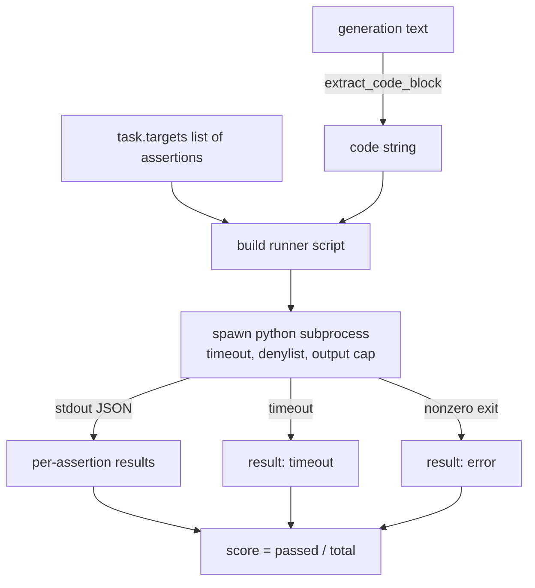
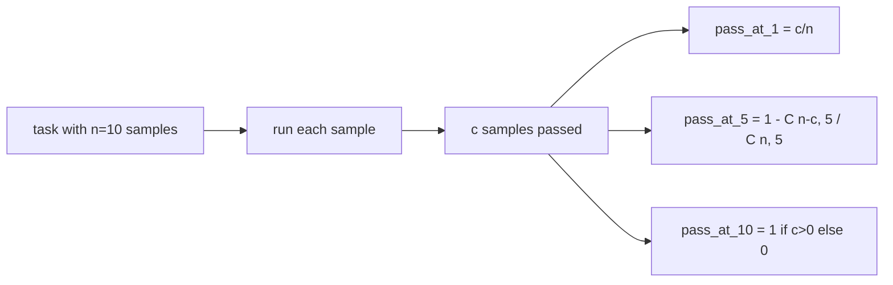

# Code Exec Metric | 代码执行指标

> Generated code is right when it passes the tests. The eval harness has to extract code, run it without crashing the host, and tally pass-rates honestly. This lesson builds that surface.

> **【中文解读】** 本课给评测平台补上"代码执行"这最后一类指标：从自由格式生成中抽取代码块，在隔离子进程里执行（挂钟超时 + 输出上限 + 导入拒绝列表），按"断言字符串通过比例"打分，并实现 HumanEval 式的 pass-at-k 无偏估计。沙箱崩溃、语法错误、超时都被当作一等失败模式，映射为五种退出码——运行器拿到的是干净的错误码，不是 traceback。

> 🔗 **【前置】** 学本课前请先掌握：(1) 70 课（任务规格格式）——code_exec 任务的形状、`extract_code_block` 后处理规则、`metadata.timeout_s` 上限都定义在那里；(2) 71 课（经典指标）——本课以同样的分发契约把 code_exec 插进指标表；(3) 基础的子进程与组合数概念（pass-at-k 用到 C(n,k)）。

**Type:** Build | **类型:** 动手构建
**Languages:** Python | **语言:** Python
**Prerequisites:** Phase 19 Track B foundations, lessons 70 and 71 | **前置知识:** Phase 19 Track B 基础；70、71 课（任务规格与经典指标）
**Time:** ~90 min | **时间:** 约 90 分钟

## Learning objectives | 学习目标

- Extract a code block from a free-form generation in a way that matches the post-process rule from lesson 70.
  中文翻译：以与 70 课后处理规则一致的方式，从自由格式生成中抽取代码块。
- Execute candidate code in an isolated subprocess with a wall-clock timeout, output cap, and an import denylist.
  中文翻译：在隔离子进程中执行候选代码，配挂钟超时、输出上限和导入拒绝列表。
- Score a task as the fraction of supplied assertion strings that pass against the candidate.
  中文翻译：把任务评分定为"所给断言字符串在候选上通过的比例"。
- Compute pass-at-k for tasks that sample multiple generations from one model.
  中文翻译：为从同一模型采样多条生成的任务计算 pass-at-k。
- Treat sandbox crashes, syntax errors, and timeouts as first-class fail modes with distinct exit codes the runner can log.
  中文翻译：把沙箱崩溃、语法错误和超时当作一等失败模式，配运行器可记录的不同退出码。

```figure
sandbox-runner
```

## Why an isolated subprocess | 为什么要用隔离子进程

> **【中文解读】** 内联 `exec` 的两个灾难场景——`while True: pass` 卡死评测、`shutil.rmtree('/')` 真删根目录——决定了候选代码必须进隔离子进程：代码走 stdin、结果走 stdout、超时被杀，宿主评测进程毫发无损。真实评测（HumanEval、MBPP、BigCodeBench、LiveCodeBench）都用子进程沙箱，有些再叠 Docker；本课停在子进程层，换取可移植与纯标准库。

> **【拓展：沙箱分级→从子进程到 microVM】** 代码执行沙箱是一道频谱：进程内拒绝列表（最弱，可被对抗代码绕过）→ 隔离子进程 + 超时 + 输出上限（本课，教学够用）→ Docker 容器（文件系统与网络隔离）→ gVisor/Firecracker microVM（最强，在线评测平台所用）。本课明说拒绝列表只是兜底、超时与输出上限才是承重控制——这个诚实的安全分层判断比任何"万无一失"的宣传都值得学。

Inline `exec` is a security and stability hazard. A generated `while True: pass` blocks the eval forever. A generated `import shutil; shutil.rmtree('/')` is exactly as catastrophic as it sounds. The fix is to spawn a fresh Python interpreter per candidate, pass the code on stdin, write the assertion results to stdout, and kill the process if it overruns. The host eval process keeps running.

> 内联 `exec` 是安全和稳定性隐患。生成的 `while True: pass` 会把评测永久卡死。生成的 `import shutil; shutil.rmtree('/')` 破坏力正如它看起来的那样。修复方法是每个候选都启动一个全新的 Python 解释器：代码经 stdin 传入、断言结果写到 stdout、超时就杀进程。宿主评测进程继续运行。

Real evals like HumanEval, MBPP, BigCodeBench, and LiveCodeBench all use a subprocess sandbox. Some layer Docker on top. We stop at the subprocess for a reason: it is portable, it is stdlib, and it catches the failure modes that matter for educational eval. Production deployments add seccomp, network isolation, and a read-only filesystem. The next lesson on hardening lives outside this track.

> HumanEval、MBPP、BigCodeBench、LiveCodeBench 这些真实评测都用子进程沙箱，有些再叠一层 Docker。我们停在子进程这一层是有理由的：它可移植、纯标准库、能兜住教学评测在乎的失败模式。生产部署会再加 seccomp、网络隔离和只读文件系统。关于加固的下一课不在这条路线里。

## The shape of a code-exec task | code-exec 任务的形状

> **【中文解读】** code-exec 任务把断言字符串放进 `targets`；分数 = 通过断言数 / 总断言数（三条过两条得 0.667）。关键设计是"失败也归一化"：子进程崩溃、超时、语法错误全部映射为退出码词表里的一项，线束永远拿到同一形状的结果，而不是被 traceback 冒泡打断。

A `code_exec` task carries assertion strings in `targets`. The runner extracts a fenced code block from the generation, builds a test harness around it, and runs the result.

> 一个 `code_exec` 任务把断言字符串放在 `targets` 里。运行器从生成中抽取围栏代码块，围绕它搭一个测试线束，然后运行结果。



The score is a fraction in `[0, 1]`. A task with three assertions where two pass scores 0.667. The runner returns the same shape no matter what fails: the subprocess crashes are mapped to a normalised error code, not a Python traceback bubbling up to the harness.

> 分数是 `[0, 1]` 区间的一个比例。三条断言过两条的任务得 0.667。无论什么失败，运行器返回的形状都一样：子进程崩溃被映射为归一化的错误码，而不是冒泡到线束的 Python traceback。

## The denylist | 拒绝列表

> **【中文解读】** 拒绝列表基于导入改写：危险模块（os.system、subprocess、socket、ctypes、shutil 等）的导入被替换成抛 `ImportError("denied")` 的桩。要诚实：进程内沙箱挡不住坚定的对抗代码——拒绝列表是兜底，真正承重的是挂钟超时和输出上限。

The denylist is import-based. Before running candidate code, the runner script rewrites imports of dangerous modules to a stub that raises `ImportError("denied")`. The list is deliberately conservative: `os.system`, `subprocess`, `socket`, `requests`, `urllib`, `urllib.request`, `urllib.error`, `urllib.parse`, `ctypes`, `shutil`, `http.client`, `asyncio.subprocess`.

> 拒绝列表基于导入。运行候选代码之前，运行器脚本把危险模块的导入改写成一个抛 `ImportError("denied")` 的桩。清单刻意保守：`os.system`、`subprocess`、`socket`、`requests`、`urllib`、`urllib.request`、`urllib.error`、`urllib.parse`、`ctypes`、`shutil`、`http.client`、`asyncio.subprocess`。

We do not pretend this is bulletproof. Determined adversarial code can escape any in-process sandbox in Python. The denylist is a backstop. The wall-clock timeout and the output cap are the load-bearing controls.

> 我们不假装它万无一失。坚定的对抗性代码可以逃出 Python 里任何进程内沙箱。拒绝列表是兜底。真正承重的是挂钟超时和输出上限。

```python
DENIED = {
    "os.system": True,
    "subprocess": True,
    "socket": True,
    "shutil": True,
    "requests": True,
    "urllib": True,
    "ctypes": True,
}
```

We wrap the candidate by prepending `import sys` and a guard that monkey-patches `os.system` to raise. The full template is in `main.py`.

> 我们在候选前面 prepend `import sys` 和一个把 `os.system` monkey-patch 成抛错的守卫。完整模板在 `main.py` 里。

## Wall-clock timeout | 挂钟超时

> **【中文解读】** 两条承重控制之一：每个子进程默认 3 秒挂钟预算（可按任务经 `metadata.timeout_s` 调整，上限 30 秒），超时即杀、记 `timeout`、得零分、继续跑。

Every subprocess gets a default budget of three wall-clock seconds. The runner uses `subprocess.run(..., timeout=t)`. If the timeout fires, the runner catches `TimeoutExpired`, kills the process, and records a `timeout` exit reason for the task. The score for that task is zero. The runner moves on.

> 每个子进程默认有 3 秒挂钟预算。运行器用 `subprocess.run(..., timeout=t)`。超时触发时，运行器捕获 `TimeoutExpired`、杀掉进程、为该任务记录 `timeout` 退出原因。该任务得零分，运行器继续走。

The timeout is configurable per task through `task.metadata.timeout_s`. Long-running unit tests can ask for more; the validator from lesson 70 caps the value at thirty seconds to keep the suite bounded.

> 超时可按任务通过 `task.metadata.timeout_s` 配置。长时单元测试可以申请更多；70 课的校验器把上限压在 30 秒，以约束套件时长。

## Output cap | 输出上限

> **【中文解读】** 承重控制之二：子进程可以灌爆 stdout、耗尽宿主内存。运行器把 stdout 流进缓冲区，累计一过 256 KB 就杀掉子进程，记 `error` + `"output overflow"`——无限打印循环撞的就是这堵墙。

The subprocess can flood stdout, exhausting host memory. The runner streams stdout into a buffer and kills the child as soon as the running total crosses 256 KB. The result is recorded as `exit_code = error` with the detail string `"output overflow"`. This shows up in practice when a generation accidentally writes an infinite loop that prints.

> 子进程可以灌爆 stdout、耗尽宿主内存。运行器把 stdout 流进缓冲区，运行总量一过 256 KB 就杀掉子进程。结果记录为 `exit_code = error`，细节字符串 `"output overflow"`。生成意外写出无限循环打印时就会撞上这个。

## Pass-at-k

> **【中文解读】** pass-at-k 回答"抽 k 条生成至少一条全通过的概率"：1 - C(n-c, k)/C(n, k)。它是 HumanEval 用的无偏估计量，比"平均通过率"更贴近"模型能否解出这题"的直觉。n-c < k 时值为 1，实现直接处理该边界；74 课的排行榜层会复用这个函数。

Pass-at-k is the unbiased estimator used by HumanEval and friends. Given `n` independent samples per task and `c` of them passing, the probability that a sample of size `k` from the `n` contains at least one passing solution is:

> Pass-at-k 是 HumanEval 等使用的无偏估计量。给定每任务 `n` 个独立采样、其中 `c` 个通过，从 `n` 个中抽大小为 `k` 的样本、其中至少含一个通过解的概率是：

```
pass_at_k(n, c, k) = 1 - C(n - c, k) / C(n, k)
```

When `n - c < k` the numerator is undefined and the value is `1`. The implementation handles the edge case directly. We expose `pass_at_k(n, c, k)` for use by the leaderboard layer in lesson 74.

> 当 `n - c < k` 时分子无定义，取值为 `1`。实现直接处理该边界。我们暴露 `pass_at_k(n, c, k)` 供 74 课的排行榜层使用。



## Exit codes | 退出码

> **【中文解读】** 五种退出码把失败分成可统计的桶：pass / assertion_fail / syntax_error / timeout / error。分数仍是比例、退出码只是元数据——下游可以自行决定把超时计零分还是缺失数据。这个"分数与失败原因分离"的设计贯穿整个评测路线。

The runner returns one of five outcomes per task:

> 运行器对每个任务返回五种结果之一：

- `pass` when every assertion passed.
  中文翻译：`pass`——所有断言全部通过。
- `assertion_fail` when the code ran but at least one assertion failed.
  中文翻译：`assertion_fail`——代码跑起来了但至少一条断言失败。
- `syntax_error` when the code did not import or had a SyntaxError.
  中文翻译：`syntax_error`——代码无法导入或存在 SyntaxError。
- `timeout` when the wall clock expired.
  中文翻译：`timeout`——挂钟到期。
- `error` for any other crash, including denylist hits and output overflow (overflow surfaces with detail `"output overflow"`).
  中文翻译：`error`——其他任何崩溃，包括拒绝列表命中与输出超限（超限以细节 `"output overflow"` 呈现）。

The score is still a fraction. The exit code is metadata. Downstream lessons can decide whether to count a timeout as zero or as missing data.

> 分数仍是一个比例。退出码是元数据。下游课程可以自行决定把超时计为零分还是缺失数据。

## What this lesson does not do | 本课不做什么

It does not give you a real sandbox. It does not run untrusted code from the open web. It does not handle stateful tasks like file I/O or network calls. Those need a container or a microVM. The point of this lesson is the contract: an isolated subprocess, a denylist, a timeout, an output cap, a clean exit-code vocabulary, and pass-at-k math.

> 本课不给你真沙箱；不运行来自开放网络的不受信代码；不处理文件 I/O 或网络调用这类有状态任务——那些需要容器或 microVM。本课的重点是契约：隔离子进程、拒绝列表、超时、输出上限、干净的退出码词表，以及 pass-at-k 数学。

## How to read the code | 如何读代码

`main.py` defines `extract_code`, `run_candidate`, `score_code_exec`, and `pass_at_k`. The subprocess runner script is built as a string and passed as `-c` to a fresh Python interpreter. The tests in `code/tests/test_exec.py` exercise the four exit codes plus pass-at-k against worked examples drawn from the HumanEval style.

> `main.py` 定义 `extract_code`、`run_candidate`、`score_code_exec` 和 `pass_at_k`。子进程运行器脚本以字符串构建，作为 `-c` 传给一个全新的 Python 解释器。`code/tests/test_exec.py` 里的测试覆盖四种退出码，并用 HumanEval 风格的演算样例压测 pass-at-k。

Read `main.py` top to bottom. The runner template is the load-bearing piece. Stare at the assertion loop until you can predict the JSON envelope it writes back to the parent process.

> 从头到尾读 `main.py`。运行器模板是承重件。盯着断言循环看，直到你能预测它写回父进程的 JSON 信封。

## Going further | 更进一步

Once the subprocess shape works, the next concern is portability. Different Python versions handle SIGKILL differently on Windows. The cleanest fix is to put the runner in a Docker image. The next thing after that is replacing assertion strings with real unit test files so the eval matches what production CI does. Stop calling assertion strings tests at that point; they are toy tests and they have toy failure modes.

> 子进程形状跑通之后，下一个关切是可移植性。不同 Python 版本在 Windows 上对 SIGKILL 的处理不同。最干净的修复是把运行器放进 Docker 镜像。再之后是把断言字符串换成真正的单元测试文件，让评测对齐生产 CI。到那时就别再管断言字符串叫测试了——它们是玩具测试，有着玩具式的失败模式。
