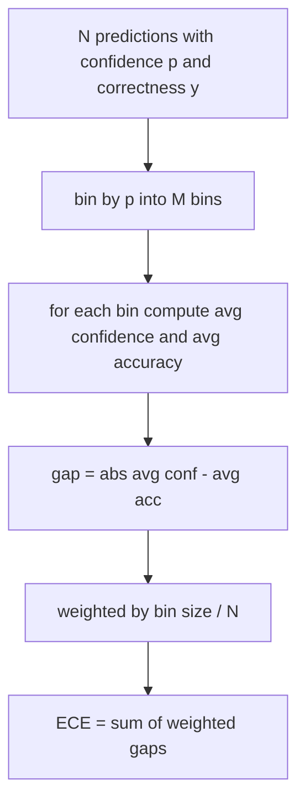
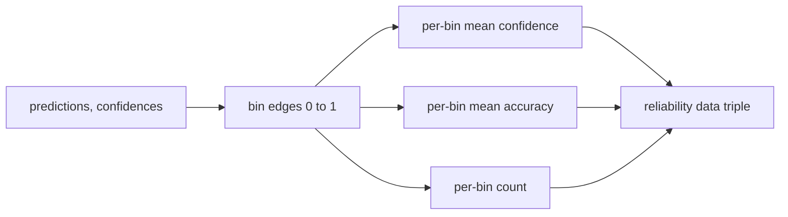

# Perplexity and Calibration | 困惑度与校准

> If your model says 90 percent confident on a thousand answers and gets six hundred right, it is not well calibrated. Calibration is half of trustworthy eval. The other half is perplexity, which tells you whether the model thinks the held-out text is plausible at all.

> **【中文解读】** 本课补上"可信评测"的另一半：模型在一千道题上自称九成把握、却只答对六百道，它就没校准好。校准回答"置信度是否与真实正确率匹配"，困惑度回答"模型是否认为留出文本合理"——两者互相独立，一个模型可以准确但过度自信，也可以流畅但困惑度糟糕。本课用纯 numpy 实现困惑度、ECE、Brier 分数三个数字，并给出接入评测线束的接口。

> **【拓展：评测系统路线→排行榜的信任底线】** 本课是 Phase 19 评测系统路线（70-75）的第四站：70 定义任务规格，71/72 实现经典指标与代码执行指标，73（本课）度量"模型可信度"，74 做排行榜聚合，75 组装端到端运行器。公开排行榜几乎只报一个准确率数字；把校准指标挂进报告后，"准确率赢但 Brier 输"的模型在生产部署上的真实风险才暴露出来——这也是近年学术榜单开始随准确率一并报告校准的原因。

> 🔗 **【前置】** 学本课前请先掌握：(1) 19·70（任务规格格式）——评测线束的数据契约；(2) 19·71（经典指标）——标量指标的分发模式；(3) 概率论基础：似然、负对数似然、期望值。

**Type:** Build | **类型:** 动手实践
**Languages:** Python | **语言:** Python
**Prerequisites:** Phase 19 Track B foundations, lessons 70 and 71 | **前置知识:** Phase 19 Track B 基础，第 70、71 课
**Time:** ~90 min | **时间:** 约 90 分钟

## Learning objectives | 学习目标

- Compute token-level perplexity on a held-out corpus from token negative log-probabilities supplied by the model adapter.
  中文翻译：用模型适配器提供的逐 token 负对数概率，在留出语料上计算 token 级困惑度。
- Compute the expected calibration error (ECE) of a classifier or multiple-choice eval from binned predicted probabilities.
  中文翻译：从分箱后的预测概率计算分类器或多选题评测的期望校准误差（ECE）。
- Compute the Brier score (mean squared error against the indicator of correctness) and explain when it does what ECE does not.
  中文翻译：计算 Brier 分数（相对"是否正确"指示变量的均方误差），并解释它在哪些地方做到了 ECE 做不到的事。
- Build the reliability diagram data needed to plot a confidence-versus-accuracy curve.
  中文翻译：构建绘制"置信度-准确率"曲线所需的可靠性图数据。
- Wire all three into the eval harness so the runner can attach `perplexity`, `ece`, and `brier` numbers to a model report.
  中文翻译：把三者接入评测线束，让运行器能把 `perplexity`、`ece`、`brier` 三个数字挂到模型报告上。

```figure
cd-reliability-diagram
```

## What perplexity tells you | 困惑度告诉我们什么

> **【中文解读】** 困惑度 = 每 token 平均负对数似然取指数。越低越好：1 表示模型给每个真实 token 都分配概率 1；等于词表大小表示模型完全均匀、什么都没学到。2026 年的强基座模型在 WikiText-103 上约 8-12，差的模型 50+。关键分工：线束自己不算对数概率（那是模型适配器的活），只做聚合——输入逐 token 负对数概率列表和每条序列的 token 数，输出语料级困惑度。

Perplexity is the exponentiated average negative log-likelihood per token. Lower is better. A perplexity of one means the model assigns probability one to every actual token. A perplexity of the vocabulary size means the model is uniform and learnt nothing. Real numbers fall in between: a strong 2026 base model on WikiText-103 sits around eight to twelve. A bad one on the same text sits at fifty plus.

> 困惑度是每 token 平均负对数似然的指数。越低越好。困惑度为 1 表示模型给每个真实 token 都分配了概率 1。困惑度等于词表大小表示模型是均匀分布、什么也没学到。真实数字落在两者之间：2026 年的强基座模型在 WikiText-103 上大约在 8 到 12 之间；差的模型在同一段文本上会到 50 以上。

The harness does not compute log-probabilities itself. Those come from the model adapter. The harness aggregates: it takes a list of per-token log-probabilities, a list of token counts per sequence, and returns corpus perplexity.

> 线束自己不计算对数概率。那些来自模型适配器。线束做聚合：接收一个逐 token 对数概率列表、一个每条序列的 token 计数列表，返回语料级困惑度。

```python
def perplexity(neg_log_probs, token_counts):
    total_nll = sum(neg_log_probs)
    total_tokens = sum(token_counts)
    return math.exp(total_nll / total_tokens)
```

The implementation handles zero-token edge cases and asserts that the negative log-probabilities are non-negative. A common mistake is to forget the negation: an adapter that returns `log p` instead of `-log p` produces a perplexity below one, which is impossible. The function catches that as a contract violation.

> 实现处理零 token 的边界情况，并断言负对数概率非负。一个常见错误是忘掉取负号：返回 `log p` 而不是 `-log p` 的适配器会算出小于 1 的困惑度——这是不可能的。函数把这种情况当作契约违规捕获。

## What ECE measures | ECE 度量什么

> **【中文解读】** ECE（期望校准误差）把预测按置信度分进固定数量的箱，逐箱度量"平均置信度与平均准确率之差"，再按箱内样本数加权平均。标准做法是 [0, 1] 上 10 个等宽箱，实现支持任意正整数箱数（`bins` 参数区分发布约定 10 与对比约定 15）。统计陷阱：ECE 受箱数和样本量偏置——10 箱、100 条预测时 0.02 的 ECE 与随机噪声无法区分，所以实现同时返回"有数据的箱数"，样本太少时运行器应拒绝上报单一数字。

Expected calibration error groups predictions by their confidence into a fixed number of bins, then measures the average gap between confidence and accuracy across bins, weighted by bin size.

> 期望校准误差把预测按置信度分进固定数量的箱，然后度量各箱中置信度与准确率的平均差距，按箱大小加权。



The standard formulation uses ten equal-width bins on `[0, 1]`. The implementation supports any positive integer count. We expose a `bins` parameter so the runner can choose between the publishing convention (10) and the comparison convention (15).

> 标准公式用 [0, 1] 上的 10 个等宽箱。实现支持任意正整数箱数。我们暴露一个 `bins` 参数，让运行器在发布约定（10）与对比约定（15）之间选择。

ECE is biased by bin count and sample size. With ten bins and a hundred predictions, you cannot distinguish 0.02 ECE from random noise. The implementation returns the number of populated bins along with the ECE so the runner can refuse to report a single number on too few samples.

> ECE 受箱数和样本量偏置。10 个箱、100 条预测时，你无法把 0.02 的 ECE 与随机噪声区分开。实现随 ECE 一并返回有数据的箱数，让运行器在样本过少时拒绝上报单一数字。

## What Brier score does that ECE does not | Brier 分数做到了 ECE 做不到的什么

> **【中文解读】** ECE 只关心平均差距：一半箱过度自信、另一半箱不够自信的模型可以 ECE 很低、局部校准却很差。Brier 分数逐条预测计算 (p_i − y_i)²，直接惩罚偏差的散布，还能分解为可靠性、分辨率、不确定性三项——标量上报，分解记日志给仪表板。实践口诀：与文献对比用 ECE，横向选模型加上 Brier。

ECE only cares about average gaps. A model that is overconfident on half the bins and underconfident on the other half can have low ECE while being poorly calibrated locally. The Brier score measures squared error against the true outcome per prediction, so it penalises spread directly.

> ECE 只关心平均差距。一个在一半箱上过度自信、另一半箱上不够自信的模型可以 ECE 很低，但局部校准很差。Brier 分数逐条预测度量与真实结果的平方误差，因此直接惩罚散布。

For binary outcomes, Brier is `mean((p_i - y_i)^2)`. It decomposes into reliability, resolution, and uncertainty. We compute the score and the decomposition. The runner reports the scalar but logs the decomposition for the dashboard.

> 对二元结果，Brier 是 `mean((p_i - y_i)^2)`。它可分解为可靠性、分辨率和不确定性。我们同时计算分数和分解。运行器上报标量，把分解记入日志供仪表板使用。

```python
def brier(p, y):
    return float(np.mean((p - y) ** 2))
```

## Reliability diagram data | 可靠性图数据

> **【中文解读】** 可靠性图把预测置信度对经验准确率逐箱作图，对角线即完美校准。本课止步于数据形状：返回三个数组——逐箱平均置信度、逐箱平均准确率、逐箱计数。画图代码在下游；调用层用同一份数据画图或计算自定义 ECE 变体（自适应 ECE、扫描 ECE 等）。返回 numpy 数组，下游无需再转换。

A reliability diagram plots predicted confidence against empirical accuracy in each bin. The diagonal is perfect calibration. The function returns three arrays: per-bin average confidence, per-bin average accuracy, and per-bin count. The plotting code lives downstream; this lesson stops at the data shape.

> 可靠性图把每个箱里的预测置信度对经验准确率作图。对角线是完美校准。函数返回三个数组：逐箱平均置信度、逐箱平均准确率、逐箱计数。画图代码在下游；本课止步于数据形状。



The returned tuple is what a calling layer needs to draw the plot or compute a custom ECE variant (adaptive ECE, sweep ECE, etc.). We return numpy arrays so downstream code does not have to convert.

> 返回的元组正是调用层画图或计算自定义 ECE 变体（自适应 ECE、扫描 ECE 等）所需的东西。我们返回 numpy 数组，下游代码不必再转换。

## Confidence sources | 置信度来源

The harness does not assume confidence comes from softmax. It accepts any number in `[0, 1]` per prediction. For multiple-choice tasks the natural confidence is `softmax over option log-likelihoods`. For free-text the natural confidence is the model's self-reported probability or the exponential of the average log-likelihood. The eval just consumes the number. Where it comes from is the adapter's job.

> 线束不假设置信度来自 softmax。它接受每条预测 [0, 1] 内的任意数字。多选题任务的天然置信度是"选项对数似然上的 softmax"；自由文本的天然置信度是模型自报概率或平均对数似然的指数。评测只消费这个数字。它从哪里来是适配器的职责。

## Edge cases | 边界情况

> **【中文解读】** 四种边界全部固化在测试里：全错、全对且高置信、完全不确定（p=0.5）、空输入。真实模型跑真实基准不会撞上它们，但有 bug 的适配器或极小样本会——运行器必须不崩，由值本身决定上报还是跳过。

- All predictions wrong: ECE is the average confidence, Brier is high, perplexity is whatever the model thinks of the text.
  中文翻译：全部预测错误：ECE 等于平均置信度，Brier 很高，困惑度则是模型对这段文本的看法。
- All predictions correct with high confidence: ECE near zero, Brier near zero.
  中文翻译：全部预测正确且高置信：ECE 接近零，Brier 接近零。
- Perfectly uncertain predictor at p=0.5: ECE is 0.5 minus accuracy, Brier is 0.25 minus a correction term.
  中文翻译：完全不确定的 p=0.5 预测器：ECE 是 0.5 减准确率，Brier 是 0.25 减一个修正项。
- Empty input: ECE, Brier, and reliability return `0.0` (or zero-filled arrays). Perplexity returns `NaN` for the zero-token case. None of these paths emit a warning; the runner inspects the values and decides whether to report or skip.
  中文翻译：空输入：ECE、Brier 和可靠性返回 `0.0`（或零填充数组）。困惑度在零 token 场景返回 `NaN`。这些路径都不发警告；运行器检查值并决定上报还是跳过。

These cases are baked into the tests. A real model on a real benchmark will not hit them, but a buggy adapter or a tiny sample will, and the runner should not crash.

> 这些情况都固化在测试里。真实模型跑真实基准不会命中它们，但有 bug 的适配器或极小样本会，而运行器不该崩溃。

## Dispatch | 分发与挂接

> **【中文解读】** 校准不是 F1 那种逐任务指标，而是逐模型报告：运行器跨整个评测累积 (confidence, correct) 对，最后一次性计算 ECE、Brier 和可靠性数据；困惑度则在独立的留出文本语料上计算，与逐任务打分分开。接口入口是 `CalibrationReport.from_predictions` 与 `PerplexityResult.from_token_nll`。

Calibration is not a per-task metric like F1. It is a per-model report. The runner accumulates `(confidence, correct)` pairs across the entire eval and computes ECE, Brier, and reliability data once. Perplexity is computed over a held-out text corpus, separate from the task-by-task scoring.

> 校准不是 F1 那样的逐任务指标。它是逐模型报告。运行器跨整个评测累积 `(confidence, correct)` 对，一次性计算 ECE、Brier 和可靠性数据。困惑度在留出文本语料上计算，与逐任务打分分开。

The interface is:

> 接口是：

```python
report = CalibrationReport.from_predictions(confidences, correct)
report.ece          # float
report.brier        # float
report.reliability  # tuple of three numpy arrays
report.populated_bins  # int
```

`PerplexityResult.from_token_nll(neg_log_probs, token_counts)` returns the perplexity and the average negative log-likelihood per token.

> `PerplexityResult.from_token_nll(neg_log_probs, token_counts)` 返回困惑度和每 token 平均负对数似然。

## What this lesson does not do | 本课不做什么

It does not call a model. It does not implement softmax. It does not estimate confidence from output tokens; that is the adapter's job. It does not do temperature scaling or Platt scaling; those are post-hoc fixes that live in a different lesson. The point of this lesson is to make the three numbers (perplexity, ECE, Brier) trustworthy and reproducible.

> 它不调用模型。它不实现 softmax。它不从输出 token 估计置信度；那是适配器的活。它不做温度缩放或 Platt 缩放；那些是另外一课讲的事后修复。本课的要点是让三个数字（困惑度、ECE、Brier）可信、可复现。

## How to read the code | 如何阅读代码

`main.py` defines `perplexity`, `expected_calibration_error`, `brier_score`, `reliability_diagram`, and the `CalibrationReport` / `PerplexityResult` dataclasses. The demo runs on synthetic predictions where the ground truth is known: a well-calibrated model, an overconfident one, and an underconfident one. The tests in `code/tests/test_calibration.py` pin every edge case plus reference values for the synthetic predictors.

> `main.py` 定义了 `perplexity`、`expected_calibration_error`、`brier_score`、`reliability_diagram` 以及 `CalibrationReport` / `PerplexityResult` 两个 dataclass。演示在真值已知的合成预测上运行：一个校准良好的模型、一个过度自信的模型、一个不够自信的模型。`code/tests/test_calibration.py` 中的测试钉住每个边界情况，外加合成预测器的参考值。

Read `main.py` top to bottom. The function ordering goes scalar to vector to report. Each function has a short docstring with the math and the contract.

> 从头到尾读 `main.py`。函数排序从标量到向量再到报告。每个函数都有一段短 docstring，写明数学和契约。

## Going further | 再进一步

> **【中文解读】** 校准是公开评测里最被忽视的轴：多数排行榜报一个准确率就收工。准确率赢但 Brier 输的模型，作为生产部署反而比准确率低几分散但如实报告不确定性的模型更差。地基打好后，在留出验证切片上加温度缩放、重算 ECE、看差距收窄——那是另一课，但地基在本课。

Calibration is the most ignored axis in published eval. Most leaderboards report a single accuracy number and call it done. A model that wins on accuracy and loses on Brier is a worse production deployment than a model that scores a few points lower on accuracy but reliably reports its uncertainty. Once you have the calibration plumbing in place, add temperature scaling on a held-out validation slice, recompute ECE, and watch the gap shrink. That is a separate lesson, but the floor lives here.

> 校准是公开评测中最被忽视的轴。多数排行榜报一个准确率数字就算完事。准确率赢而 Brier 输的模型，作为生产部署比准确率低几分但可靠报告不确定性的模型更差。校准管线就位后，在留出验证切片上加温度缩放、重算 ECE，看着差距收窄。那是单独一课，但地基在这里。
