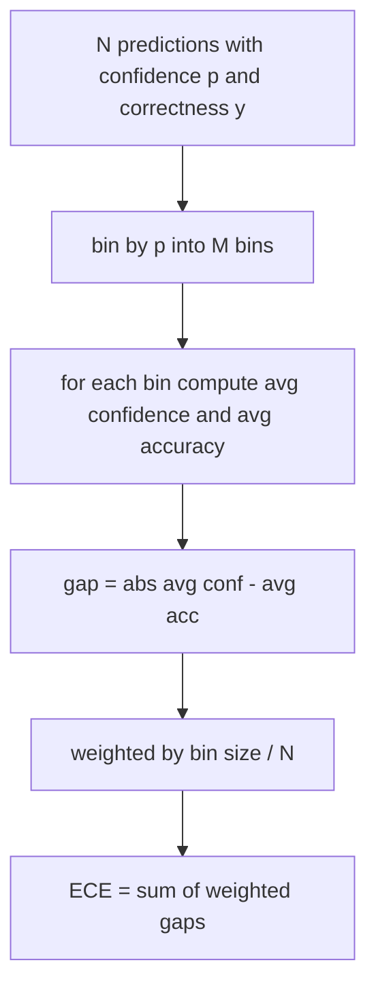
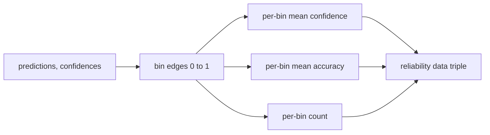

# 困惑度与校准

> 如果你的模型在一千道题上自称"九成把握"却只答对六百道，它就没有校准好。校准是可信评测的一半。另一半是困惑度，它告诉你模型到底觉不觉得留出文本说得通。

> **【中文解读】** 本课补上"可信评测"的另一半：校准回答"置信度是否与真实正确率匹配"，困惑度回答"模型是否认为留出文本合理"——两者互相独立，一个模型可以准确但过度自信，也可以流畅但困惑度糟糕。本课用纯 numpy 实现困惑度、ECE、Brier 分数三个数字，并给出接入评测线束的接口。

> **【拓展：评测系统路线→排行榜的信任底线】** 本课是 Phase 19 评测系统路线（70-75）的第四站：70 定义任务规格，71/72 实现经典指标与代码执行指标，73（本课）度量"模型可信度"，74 做排行榜聚合，75 组装端到端运行器。公开排行榜几乎只报一个准确率数字；把校准指标挂进报告后，"准确率赢但 Brier 输"的模型在生产部署上的真实风险才暴露出来——这也是近年学术榜单开始随准确率一并报告校准的原因。

> 🔗 **【前置】** 学本课前请先掌握：(1) 19·70（任务规格格式）——评测线束的数据契约；(2) 19·71（经典指标）——标量指标的分发模式；(3) 概率论基础：似然、负对数似然、期望值。

**类型：** 动手实践
**语言：** Python
**前置条件：** Phase 19 Track B 基础，第 70、71 课
**预计用时：** 约 90 分钟

## 学习目标

- 用模型适配器提供的逐 token 负对数概率，在留出语料上计算 token 级困惑度。
- 从分箱后的预测概率计算分类器或多选题评测的期望校准误差（ECE）。
- 计算 Brier 分数（相对"是否正确"指示变量的均方误差），并解释它在哪些地方做到了 ECE 做不到的事。
- 构建绘制"置信度-准确率"曲线所需的可靠性图数据。
- 把三者接入评测线束，让运行器能把 `perplexity`、`ece`、`brier` 三个数字挂到模型报告上。

```figure
cd-reliability-diagram
```

## 困惑度告诉我们什么

> **【中文解读】** 困惑度 = 每 token 平均负对数似然取指数，越低越好：1 是完美预测，等于词表大小等于什么都没学。注意分工：线束不算对数概率（那是适配器的活），只做聚合。

困惑度是每 token 平均负对数似然的指数。越低越好。困惑度为 1 表示模型给每个真实 token 都分配了概率 1。困惑度等于词表大小表示模型是均匀分布、什么也没学到。真实数字落在两者之间：2026 年的强基座模型在 WikiText-103 上大约在 8 到 12 之间；差的模型在同一段文本上会到 50 以上。

线束自己不计算对数概率。那些来自模型适配器。线束做聚合：接收一个逐 token 对数概率列表、一个每条序列的 token 计数列表，返回语料级困惑度。

```python
def perplexity(neg_log_probs, token_counts):
    total_nll = sum(neg_log_probs)
    total_tokens = sum(token_counts)
    return math.exp(total_nll / total_tokens)
```

实现处理零 token 的边界情况，并断言负对数概率非负。一个常见错误是忘掉取负号：返回 `log p` 而不是 `-log p` 的适配器会算出小于 1 的困惑度——这是不可能的。函数把这种情况当作契约违规捕获。

## ECE 度量什么

> **【中文解读】** ECE 按置信度分箱、逐箱量"置信度-准确率"差距、按箱大小加权求和。10 箱 + 100 条预测时 0.02 的 ECE 就是噪声——所以实现同时返回有数据的箱数，样本太少就不该上报单一数字。

期望校准误差把预测按置信度分进固定数量的箱，然后度量各箱中置信度与准确率的平均差距，按箱大小加权。



标准公式用 [0, 1] 上的 10 个等宽箱。实现支持任意正整数箱数。我们暴露一个 `bins` 参数，让运行器在发布约定（10）与对比约定（15）之间选择。

ECE 受箱数和样本量偏置。10 个箱、100 条预测时，你无法把 0.02 的 ECE 与随机噪声区分开。实现随 ECE 一并返回有数据的箱数，让运行器在样本过少时拒绝上报单一数字。

## Brier 分数做到了 ECE 做不到的什么

> **【中文解读】** ECE 只看平均差距，会放过"一半箱过度自信、一半箱不够自信"的模型；Brier 逐条算平方误差，直接惩罚散布，还能分解为可靠性/分辨率/不确定性三项。

ECE 只关心平均差距。一个在一半箱上过度自信、另一半箱上不够自信的模型可以 ECE 很低，但局部校准很差。Brier 分数逐条预测度量与真实结果的平方误差，因此直接惩罚散布。

对二元结果，Brier 是 `mean((p_i - y_i)^2)`。它可分解为可靠性、分辨率和不确定性。我们同时计算分数和分解。运行器上报标量，把分解记入日志供仪表板使用。

```python
def brier(p, y):
    return float(np.mean((p - y) ** 2))
```

## 可靠性图数据

> **【中文解读】** 可靠性图逐箱画"置信度 vs 准确率"，对角线是完美校准。本课只产出数据三元组（逐箱平均置信度、逐箱平均准确率、逐箱计数），画图和自定义 ECE 变体都留给下游。

可靠性图把每个箱里的预测置信度对经验准确率作图。对角线是完美校准。函数返回三个数组：逐箱平均置信度、逐箱平均准确率、逐箱计数。画图代码在下游；本课止步于数据形状。



返回的元组正是调用层画图或计算自定义 ECE 变体（自适应 ECE、扫描 ECE 等）所需的东西。我们返回 numpy 数组，下游代码不必再转换。

## 置信度来源

线束不假设置信度来自 softmax。它接受每条预测 [0, 1] 内的任意数字。多选题任务的天然置信度是"选项对数似然上的 softmax"；自由文本的天然置信度是模型自报概率或平均对数似然的指数。评测只消费这个数字。它从哪里来是适配器的职责。

## 边界情况

- 全部预测错误：ECE 等于平均置信度，Brier 很高，困惑度则是模型对这段文本的看法。
- 全部预测正确且高置信：ECE 接近零，Brier 接近零。
- 完全不确定的 p=0.5 预测器：ECE 是 0.5 减准确率，Brier 是 0.25 减一个修正项。
- 空输入：ECE、Brier 和可靠性返回 `0.0`（或零填充数组）。困惑度在零 token 场景返回 `NaN`。这些路径都不发警告；运行器检查值并决定上报还是跳过。

这些情况都固化在测试里。真实模型跑真实基准不会命中它们，但有 bug 的适配器或极小样本会，而运行器不该崩溃。

## 分发与挂接

> **【中文解读】** 校准是逐模型报告：跨整个评测累积 (confidence, correct) 对，最后一次性算 ECE、Brier、可靠性；困惑度在独立留出语料上算。

校准不是 F1 那样的逐任务指标。它是逐模型报告。运行器跨整个评测累积 `(confidence, correct)` 对，一次性计算 ECE、Brier 和可靠性数据。困惑度在留出文本语料上计算，与逐任务打分分开。

接口是：

```python
report = CalibrationReport.from_predictions(confidences, correct)
report.ece          # float
report.brier        # float
report.reliability  # tuple of three numpy arrays
report.populated_bins  # int
```

`PerplexityResult.from_token_nll(neg_log_probs, token_counts)` 返回困惑度和每 token 平均负对数似然。

## 本课不做什么

它不调用模型。它不实现 softmax。它不从输出 token 估计置信度；那是适配器的活。它不做温度缩放或 Platt 缩放；那些是另外一课讲的事后修复。本课的要点是让三个数字（困惑度、ECE、Brier）可信、可复现。

## 如何阅读代码

`main.py` 定义了 `perplexity`、`expected_calibration_error`、`brier_score`、`reliability_diagram` 以及 `CalibrationReport` / `PerplexityResult` 两个 dataclass。演示在真值已知的合成预测上运行：一个校准良好的模型、一个过度自信的模型、一个不够自信的模型。`code/tests/test_calibration.py` 中的测试钉住每个边界情况，外加合成预测器的参考值。

从头到尾读 `main.py`。函数排序从标量到向量再到报告。每个函数都有一段短 docstring，写明数学和契约。

## 再进一步

校准是公开评测中最被忽视的轴。多数排行榜报一个准确率数字就算完事。准确率赢而 Brier 输的模型，作为生产部署比准确率低几分但可靠报告不确定性的模型更差。校准管线就位后，在留出验证切片上加温度缩放、重算 ECE，看着差距收窄。那是单独一课，但地基在这里。
