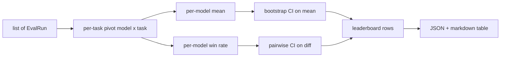
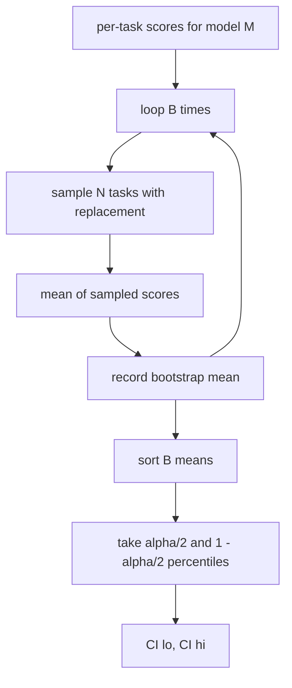

# Leaderboard Aggregation | 排行榜聚合

> Per-task scores are easy. Per-model rankings across heterogeneous tasks are harder. Statistical significance on a thousand-prediction leaderboard is the part everyone skips. This lesson does not skip it.

> **【中文解读】** 逐任务打分容易，跨异构任务的逐模型排名难，而"千条预测上的统计显著性"是所有人都会跳过的部分——本课不跳。排行榜聚合回答三个问题：怎么把多个模型 × 多个任务的分数归并成每个模型一行？均值和胜率两种排名各在什么时候该用？排名差异到底是真差异还是噪声？答案的核心是 bootstrap 置信区间：区间不跨零才算显著，否则视作并列。

> **【拓展：评测系统路线→可辩护的排行榜】** 本课是评测系统路线（70-75）的第五站：70 任务规格、71/72 指标、73 校准、74（本课）排行榜聚合、75 端到端运行器。真实世界的同类问题无处不在——LMSYS Chatbot Arena 用 Elo 与 bootstrap 置信区间排名，Open LLM Leaderboard 用多任务均值。本课把"报告一个你能辩护的数字"做成了纯 numpy 的可复现实现。

> 🔗 **【前置】** 学本课前请先掌握：(1) 19·70（任务规格格式）——EvalRun 记录的上游来源；(2) 19·71-73（指标与校准）——分数如何产生、为何已归一到 [0, 1]；(3) 统计基础：均值、百分位数、有放回重采样。

**Type:** Build | **类型:** 动手实践
**Languages:** Python | **语言:** Python
**Prerequisites:** Phase 19 Track B foundations, lessons 70, 71, 73 | **前置知识:** Phase 19 Track B 基础，第 70、71、73 课
**Time:** ~90 min | **时间:** 约 90 分钟

## Learning objectives | 学习目标

- Aggregate per-task scores across multiple models and multiple tasks into a tidy per-model row.
  中文翻译：把多个模型、多个任务的逐任务分数聚合成每个模型一行的整洁表格。
- Normalise heterogeneous scores so that pass rates and BLEU values do not over-influence the aggregate.
  中文翻译：归一化异构分数，避免通过率和 BLEU 值过度影响聚合结果。
- Rank models by mean and by win-rate, and explain when each is the right summary.
  中文翻译：按均值和按胜率给模型排名，并解释各自适合什么场景。
- Compute bootstrap confidence intervals on the mean score per model and on pairwise differences.
  中文翻译：计算每个模型均分的 bootstrap 置信区间，以及两两差异的置信区间。
- Output the leaderboard as a JSON report and as a markdown table the runner in lesson 75 can paste into a CI comment.
  中文翻译：把排行榜输出为 JSON 报告和 markdown 表格，供第 75 课的运行器贴进 CI 评论。

```figure
ci-leaderboard-ci
```

## The shape of input | 输入的形状

The aggregator consumes a list of `EvalRun` records:

> 聚合器消费一个 `EvalRun` 记录列表：

```python
@dataclass
class EvalRun:
    model_id: str
    task_id: str
    metric_name: str
    score: float          # in [0, 1]
    category: str
```

The runner in lesson 75 emits one record per `(model, task)` pair. The aggregator does not care how the score was produced. It expects normalisation to already have happened: every score is in `[0, 1]`.

> 第 75 课的运行器为每个 `(model, task)` 对产出一条记录。聚合器不关心分数是怎么来的。它期望归一化已经完成：每个分数都在 `[0, 1]` 内。

## The output | 输出

> **【中文解读】** 输入是 EvalRun 记录流，输出是排行榜行：`model_id`、`mean_score`、置信区间上下界 `mean_ci_lo`/`mean_ci_hi`、`win_rate`、`tasks_completed`，外加可选的按类别均分 `categories` 映射。中间经过三个变换：透视成模型 × 任务矩阵、算每模型的均值与胜率、用 bootstrap 补置信区间——最后渲染成 JSON + markdown。

Three tables come out:

> 产出三张表：



The leaderboard row contains: `model_id`, `mean_score`, `mean_ci_lo`, `mean_ci_hi`, `win_rate`, `tasks_completed`, and an optional `categories` map for per-category mean.

> 排行榜行包含：`model_id`、`mean_score`、`mean_ci_lo`、`mean_ci_hi`、`win_rate`、`tasks_completed`，以及可选的按类别均分 `categories` 映射。

## Normalisation | 归一化

> **【中文解读】** 归一化是最容易埋雷的一步：一个任务打分在 [0, 1]、另一个在 [0, 100]，后者会静默支配均值。聚合器的选择是"验证 + 拒绝"而不是悄悄重缩放——任何分数落在 [0, 1] 之外就拒绝整次运行，修复放上游：指标层就该返回比率。71-73 课已经在指标层强制了这个契约。

If one task scores in `[0, 1]` and another in `[0, 100]`, the second silently dominates the mean. The aggregator validates that every input score sits in `[0, 1]` and refuses the run otherwise. The fix lives upstream: the metric should already return a fraction. Lessons 71 to 73 enforce that contract.

> 如果一个任务打分在 `[0, 1]`、另一个在 `[0, 100]`，第二个会静默支配均值。聚合器验证每个输入分数都落在 `[0, 1]` 内，否则拒绝这次运行。修复在上游：指标本就该返回比率。第 71 到 73 课强制了这个契约。

## Mean and win-rate | 均值与胜率

> **【中文解读】** 两种排名服务不同目标。均值是排行榜的头条数字，但对离群值和任务不均衡敏感；胜率统计"在同一任务上击败其他所有模型"的频率（最高分获胜、平局平分），对离群值和量纲差异更鲁棒，但丢失信息。线束两个都报：运行器默认按均值排，胜率列就放在旁边供用户自选。

The two ranking schemes serve different goals.

> 两种排名方案服务不同的目标。

Mean score is the average of per-task scores for one model. It is the headline number leaderboards report. It is sensitive to outliers and to task imbalance.

> 均分是一个模型逐任务分数的平均值。它是排行榜报告的头条数字。它对离群值和任务不均衡敏感。

Win-rate counts how often a model beats every other model on the same task. For each task, the model with the highest score wins (ties split). Win rate equals wins divided by the number of tasks where the model has a score. It is less sensitive to outliers and to scale differences but loses information.

> 胜率统计一个模型在同一任务上击败其他所有模型的频率。每个任务里分数最高的模型获胜（平局平分）。胜率等于获胜数除以该模型有分数的任务数。它对离群值和量纲差异更不敏感，但会丢失信息。

```python
def win_rate(model_id, runs_by_task, all_models):
    wins, total = 0, 0
    for task_id, runs in runs_by_task.items():
        scores = {r.model_id: r.score for r in runs if r.model_id in all_models}
        if model_id not in scores:
            continue
        total += 1
        best = max(scores.values())
        if scores[model_id] >= best:
            wins += 1
    return wins / total if total else 0.0
```

The harness reports both. The runner in lesson 75 ranks by mean by default; the markdown column for win-rate is right there in case the user prefers it.

> 线束两个都报告。第 75 课的运行器默认按均值排名；胜率的 markdown 列就在旁边，以备用户更偏好它。

## Bootstrap confidence intervals | Bootstrap 置信区间

> **【中文解读】** bootstrap 的做法：对任务 id 有放回重采样，算重采样集合上的均值，重复 B 次，取百分位区间。逐模型均分配一个 CI；两两比较则对逐任务差值 `score_A - score_B` 做 bootstrap——区间不含零即在水平 alpha 下显著，含零就当作并列。默认参数：底层助手 B=1000，公开聚合器 b=500（演示和测试跑得快），alpha=0.05，纯 numpy 无 scipy。

Per-model means come with a confidence interval estimated by bootstrap resampling over tasks. We resample task ids with replacement, compute the mean over the resampled set, repeat `B` times, and take the percentile interval at level `alpha`.

> 每个模型的均分配一个通过对任务做 bootstrap 重采样估计的置信区间。我们有放回地重采样任务 id、计算重采样集合上的均值、重复 `B` 次、取水平 `alpha` 的百分位区间。



For pairwise comparisons we bootstrap the per-task difference `score_A - score_B`, take the percentile interval, and report it. The user reads off whether the interval excludes zero. If it does, the difference is significant at level alpha. If it does not, the leaderboard treats the models as tied.

> 对两两比较，我们对逐任务差值 `score_A - score_B` 做 bootstrap、取百分位区间并上报。用户读出区间是否不含零。若不含零，差异在水平 alpha 下显著。若含零，排行榜把两个模型当作并列。

The low-level helpers (`bootstrap_mean_ci`, `bootstrap_pairwise_diff`) default to `B=1000`; the public aggregators (`aggregate`, `pairwise_diffs`) default to `b=500` so the demo and tests stay quick. The default alpha is 0.05. The lesson keeps the bootstrap pure numpy, no scipy.

> 底层助手（`bootstrap_mean_ci`、`bootstrap_pairwise_diff`）默认 `B=1000`；公开聚合器（`aggregate`、`pairwise_diffs`）默认 `b=500`，让演示和测试保持快速。默认 alpha 是 0.05。本课的 bootstrap 保持纯 numpy，不用 scipy。

## Categories | 类别

> **【中文解读】** 若 EvalRun 带类别（math、reasoning、code、safety），聚合器额外给出按类别的均分。这是排行榜上最有信息量的一列：它暴露"总体好但代码弱"的模型——头条均值会掩盖这一点，而选型时恰恰最需要这个信息。

If `EvalRun.category` is set, the aggregator also reports per-category mean. This is the column on every leaderboard that says `math`, `reasoning`, `code`, `safety`. It lets the runner spot whether a model is good overall but weak in code, which is information the headline mean hides.

> 若设置了 `EvalRun.category`，聚合器还会报告按类别的均分。这是每个排行榜上写着 `math`、`reasoning`、`code`、`safety` 的那一列。它让运行器发现"总体好但代码弱"的模型——这是头条均值隐藏的信息。

## Markdown rendering | Markdown 渲染

> **【中文解读】** 排行榜渲染成 markdown 表：按均分排序、置信区间保留两位小数、超过二十字符的模型 id 截断。这层唯一的职责是"人类可读"——JSON 给机器，markdown 给 PR 评论和报告。

The leaderboard is rendered as a markdown table:

> 排行榜被渲染成一张 markdown 表：

```text
| Rank | Model | Mean | 95% CI | Win rate | Tasks |
|------|-------|------|--------|----------|-------|
| 1    | gpt   | 0.78 | 0.74-0.82 | 0.62 | 50 |
| 2    | claude| 0.75 | 0.71-0.79 | 0.34 | 50 |
| 3    | random| 0.10 | 0.07-0.13 | 0.04 | 50 |
```

The table is sorted by mean score. The CI is rendered to two decimals. Long model ids are truncated to twenty characters.

> 表格按均分排序。置信区间渲染到两位小数。过长的模型 id 截断到二十个字符。

## What this lesson does not do | 本课不做什么

It does not run models. It does not call the metric layer. It does not implement adaptive ECE or other calibration variants; those are lesson 73. It does not implement task weighting. Every task counts the same here. Production leaderboards weight tasks; we leave that hook open through the `weight` field but ignore it in the aggregator. Add weighting in a follow-up lesson if you need it.

> 它不运行模型。它不调用指标层。它不实现自适应 ECE 或其他校准变体；那些是第 73 课。它不实现任务加权。这里每个任务权重相同。生产排行榜会给任务加权；我们通过 `weight` 字段留了这个钩子，但聚合器忽略它。需要的话在后续课程里加加权。

## How to read the code | 如何阅读代码

`main.py` defines `EvalRun`, `LeaderboardRow`, `aggregate`, `bootstrap_mean_ci`, `bootstrap_pairwise_diff`, and `render_markdown`. The demo builds a synthetic suite of three models and twelve tasks, aggregates, and prints the leaderboard plus the pairwise diff table. The tests in `code/tests/test_leaderboard.py` pin the bootstrap, the markdown rendering, the win-rate edge cases, and the empty-input behaviour.

> `main.py` 定义了 `EvalRun`、`LeaderboardRow`、`aggregate`、`bootstrap_mean_ci`、`bootstrap_pairwise_diff` 和 `render_markdown`。演示构建三个模型、十二个任务的合成套件，聚合后打印排行榜和两两差异表。`code/tests/test_leaderboard.py` 中的测试钉住 bootstrap、markdown 渲染、胜率边界情况和空输入行为。

Read `main.py` top to bottom. The data shape (EvalRun, LeaderboardRow) comes first, the aggregator next, the bootstrap third, the rendering last. Each function has a focused contract.

> 从头到尾读 `main.py`。数据形状（EvalRun、LeaderboardRow）在最前，聚合器其次，bootstrap 第三，渲染最后。每个函数都有聚焦的契约。

## Going further | 再进一步

> **【中文解读】** 自然的下一步是配对显著性检验（模型 A、B 跑的是同一批任务，对逐任务差值做配对 bootstrap——本课已实现）。再往后是尊重任务簇的分层 bootstrap：数学题之间不独立，一种算术错误模式会影响十道题。本课的要点是把底线做对，让评测报出一个你能辩护的数字。

The natural next step is paired-task significance instead of unpaired bootstrap. If model A and B both ran the same hundred tasks, the appropriate test is the paired bootstrap on task-by-task differences, which we implement. Beyond that, you want a hierarchical bootstrap that respects task families (math problems are not independent from each other; an arithmetic error pattern affects ten of them). That is a follow-up. The point of this lesson is to get the floor right so the eval reports a number you can defend.

> 自然的下一步是用配对任务显著性取代非配对 bootstrap。如果模型 A 和 B 跑了同样一百个任务，合适的检验是对逐任务差值做配对 bootstrap——我们已经实现了。再往前，你会想要尊重任务簇的分层 bootstrap（数学题彼此不独立；一种算术错误模式会影响其中十道）。那是后续课程。本课的要点是把底线做对，让评测报出一个你能辩护的数字。
