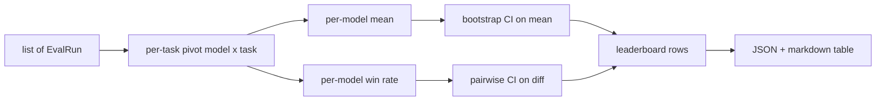
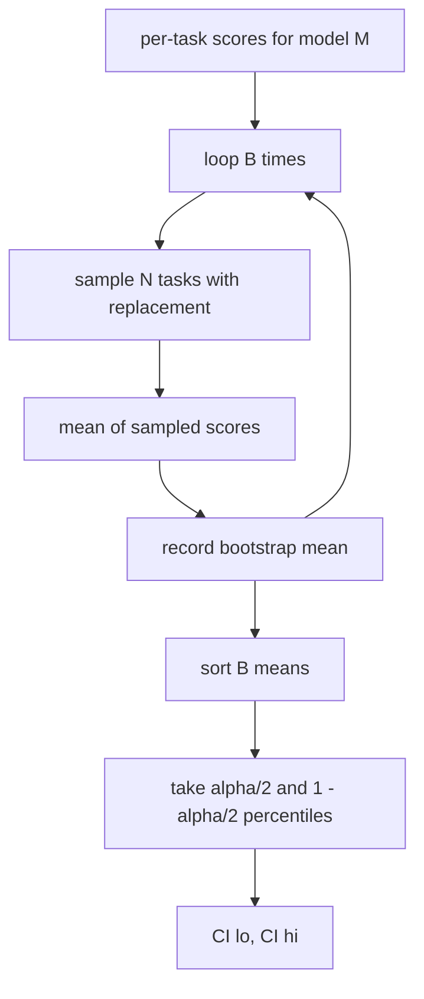

# 排行榜聚合

> 逐任务打分容易。跨异构任务的逐模型排名更难。千条预测排行榜上的统计显著性是所有人都会跳过的部分。本课不跳。

> **【中文解读】** 排行榜聚合回答三个问题：怎么把多个模型 × 多个任务的分数归并成每个模型一行？均值和胜率两种排名各在什么时候该用？排名差异到底是真差异还是噪声？答案的核心是 bootstrap 置信区间：区间不跨零才算显著，否则视作并列。本课实现纯 numpy 的聚合、bootstrap 和 markdown 渲染，供第 75 课的运行器直接消费。

> **【拓展：评测系统路线→可辩护的排行榜】** 本课是评测系统路线（70-75）的第五站：70 任务规格、71/72 指标、73 校准、74（本课）排行榜聚合、75 端到端运行器。真实世界的同类问题无处不在——LMSYS Chatbot Arena 用 Elo 与 bootstrap 置信区间排名，Open LLM Leaderboard 用多任务均值。本课把"报告一个你能辩护的数字"做成了可复现实现。

> 🔗 **【前置】** 学本课前请先掌握：(1) 19·70（任务规格格式）——EvalRun 记录的上游来源；(2) 19·71-73（指标与校准）——分数如何产生、为何已归一到 [0, 1]；(3) 统计基础：均值、百分位数、有放回重采样。

**类型：** 动手实践
**语言：** Python
**前置条件：** Phase 19 Track B 基础，第 70、71、73 课
**预计用时：** 约 90 分钟

## 学习目标

- 把多个模型、多个任务的逐任务分数聚合成每个模型一行的整洁表格。
- 归一化异构分数，避免通过率和 BLEU 值过度影响聚合结果。
- 按均值和按胜率给模型排名，并解释各自适合什么场景。
- 计算每个模型均分的 bootstrap 置信区间，以及两两差异的置信区间。
- 把排行榜输出为 JSON 报告和 markdown 表格，供第 75 课的运行器贴进 CI 评论。

```figure
ci-leaderboard-ci
```

## 输入的形状

聚合器消费一个 `EvalRun` 记录列表：

```python
@dataclass
class EvalRun:
    model_id: str
    task_id: str
    metric_name: str
    score: float          # in [0, 1]
    category: str
```

第 75 课的运行器为每个 `(model, task)` 对产出一条记录。聚合器不关心分数是怎么来的。它期望归一化已经完成：每个分数都在 `[0, 1]` 内。

## 输出

> **【中文解读】** 输出行的字段是排名的全部证据：均值 + 置信区间 + 胜率 + 完成任务数 + 按类别均分。

产出三张表：



排行榜行包含：`model_id`、`mean_score`、`mean_ci_lo`、`mean_ci_hi`、`win_rate`、`tasks_completed`，以及可选的按类别均分 `categories` 映射。

## 归一化

> **【中文解读】** 聚合器对量纲问题选择"验证 + 拒绝"而不是悄悄重缩放——契约在上游（指标层）就该守住。

如果一个任务打分在 `[0, 1]`、另一个在 `[0, 100]`，第二个会静默支配均值。聚合器验证每个输入分数都落在 `[0, 1]` 内，否则拒绝这次运行。修复在上游：指标本就该返回比率。第 71 到 73 课强制了这个契约。

## 均值与胜率

> **【中文解读】** 均值是头条数字但对离群值敏感；胜率对量纲差异鲁棒但丢信息。两个都报，默认按均值排。

两种排名方案服务不同的目标。

均分是一个模型逐任务分数的平均值。它是排行榜报告的头条数字。它对离群值和任务不均衡敏感。

胜率统计一个模型在同一任务上击败其他所有模型的频率。每个任务里分数最高的模型获胜（平局平分）。胜率等于获胜数除以该模型有分数的任务数。它对离群值和量纲差异更不敏感，但会丢失信息。

```python
def win_rate(model_id, runs_by_task, all_models):
    wins, total = 0, 0
    for task_id, runs in runs_by_task.items():
        scores = {r.model_id: r.score for r in runs if r.model_id in all_models}
        if model_id not in scores:
            continue
        total += 1
        best = max(scores.values())
        if scores[model_id] >= best:
            wins += 1
    return wins / total if total else 0.0
```

线束两个都报告。第 75 课的运行器默认按均值排名；胜率的 markdown 列就在旁边，以备用户更偏好它。

## Bootstrap 置信区间

> **【中文解读】** 有放回重采样任务、算均值、重复 B 次、取百分位区间。两两比较看差值区间是否含零：不含零才显著，含零就并列。

每个模型的均分配一个通过对任务做 bootstrap 重采样估计的置信区间。我们有放回地重采样任务 id、计算重采样集合上的均值、重复 `B` 次、取水平 `alpha` 的百分位区间。



对两两比较，我们对逐任务差值 `score_A - score_B` 做 bootstrap、取百分位区间并上报。用户读出区间是否不含零。若不含零，差异在水平 alpha 下显著。若含零，排行榜把两个模型当作并列。

底层助手（`bootstrap_mean_ci`、`bootstrap_pairwise_diff`）默认 `B=1000`；公开聚合器（`aggregate`、`pairwise_diffs`）默认 `b=500`，让演示和测试保持快速。默认 alpha 是 0.05。本课的 bootstrap 保持纯 numpy，不用 scipy。

## 类别

> **【中文解读】** 按类别均分暴露"总体好但代码弱"的模型——选型时最需要、头条均值最容易掩盖的信息。

若设置了 `EvalRun.category`，聚合器还会报告按类别的均分。这是每个排行榜上写着 `math`、`reasoning`、`code`、`safety` 的那一列。它让运行器发现"总体好但代码弱"的模型——这是头条均值隐藏的信息。

## Markdown 渲染

> **【中文解读】** JSON 给机器，markdown 给 PR 评论；按均值排序、CI 两位小数、长模型 id 截断。

排行榜被渲染成一张 markdown 表：

```text
| Rank | Model | Mean | 95% CI | Win rate | Tasks |
|------|-------|------|--------|----------|-------|
| 1    | gpt   | 0.78 | 0.74-0.82 | 0.62 | 50 |
| 2    | claude| 0.75 | 0.71-0.79 | 0.34 | 50 |
| 3    | random| 0.10 | 0.07-0.13 | 0.04 | 50 |
```

表格按均分排序。置信区间渲染到两位小数。过长的模型 id 截断到二十个字符。

## 本课不做什么

它不运行模型。它不调用指标层。它不实现自适应 ECE 或其他校准变体；那些是第 73 课。它不实现任务加权。这里每个任务权重相同。生产排行榜会给任务加权；我们通过 `weight` 字段留了这个钩子，但聚合器忽略它。需要的话在后续课程里加加权。

## 如何阅读代码

`main.py` 定义了 `EvalRun`、`LeaderboardRow`、`aggregate`、`bootstrap_mean_ci`、`bootstrap_pairwise_diff` 和 `render_markdown`。演示构建三个模型、十二个任务的合成套件，聚合后打印排行榜和两两差异表。`code/tests/test_leaderboard.py` 中的测试钉住 bootstrap、markdown 渲染、胜率边界情况和空输入行为。

从头到尾读 `main.py`。数据形状（EvalRun、LeaderboardRow）在最前，聚合器其次，bootstrap 第三，渲染最后。每个函数都有聚焦的契约。

## 再进一步

自然的下一步是用配对任务显著性取代非配对 bootstrap。如果模型 A 和 B 跑了同样一百个任务，合适的检验是对逐任务差值做配对 bootstrap——我们已经实现了。再往前，你会想要尊重任务簇的分层 bootstrap（数学题彼此不独立；一种算术错误模式会影响其中十道）。那是后续课程。本课的要点是把底线做对，让评测报出一个你能辩护的数字。
