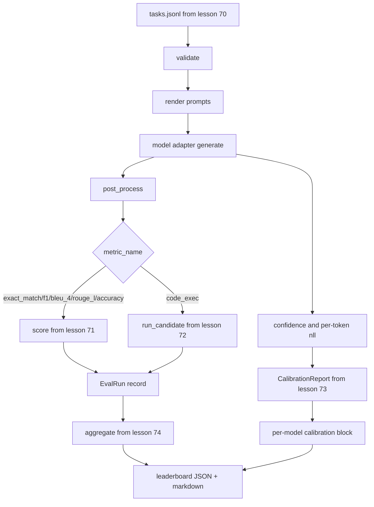

# End-to-End Eval Runner | 端到端评测运行器

> Five lessons of plumbing, one lesson to glue them. The runner reads the task spec from lesson 70, calls a model through an adapter, scores with lessons 71 and 72, attaches the calibration report from lesson 73, and emits the leaderboard from lesson 74. Demo self-terminates.

> **【中文解读】** 五节管线课，一节课把它们粘起来。运行器读第 70 课的任务规格、经适配器调用模型、用 71/72 课打分、挂上 73 课的校准报告、产出 74 课的排行榜——它自己不重复任何一层逻辑，只做导入和组装。这是评测系统路线的收官课：适配器接口（ModelAdapter）、单遍评分循环、并行执行、自终止演示，全部在一个文件里跑通。

> **【拓展：评测系统路线→你自己的评测平台】** 本课把 70-74 五个模块组装成一个可运行的迷你评测平台，结构上就是 lm-eval-harness、OpenAI evals、HELM 这类生产评测系统的骨架：任务规格层 → 模型适配层 → 指标层 → 校准层 → 聚合/报告层。做完本课，接入一个真实模型供应商只需要写三十行适配器胶水——换模型不换线束，这就是分层契约的价值。

> 🔗 **【前置】** 学本课前请先掌握：(1) 19·70（任务规格格式）——fixture 任务与校验；(2) 19·71/72（经典指标与代码执行指标）——评分层接口；(3) 19·73（困惑度与校准）——CalibrationReport；(4) 19·74（排行榜聚合）——aggregate 与 pairwise_diffs；(5) Python `concurrent.futures` 线程池基础。

**Type:** Build | **类型:** 动手实践
**Languages:** Python | **语言:** Python
**Prerequisites:** Phase 19 Track B foundations, lessons 70 through 74 | **前置知识:** Phase 19 Track B 基础，第 70 至 74 课
**Time:** ~90 min | **时间:** 约 90 分钟

## Learning objectives | 学习目标

- Define a `ModelAdapter` interface that any model (mock, local, API) can satisfy with a small method surface.
  中文翻译：定义一个任何模型（mock、本地、API）都能用极小方法面满足的 `ModelAdapter` 接口。
- Run the eval over a fixture JSONL file with parallel task execution across a worker pool.
  中文翻译：在工作线程池上并行执行任务，跑完一个 fixture JSONL 文件的评测。
- Compose the metric layer (exact_match, F1, BLEU-4, ROUGE-L, code_exec) with the calibration layer in one pass.
  中文翻译：把指标层（exact_match、F1、BLEU-4、ROUGE-L、code_exec）与校准层在一遍循环里组合起来。
- Emit per-model `EvalRun` records and feed them straight into the leaderboard aggregator.
  中文翻译：产出逐模型的 `EvalRun` 记录，直接喂给排行榜聚合器。
- Output both a JSON report and a markdown table; self-terminate with exit zero on a clean run, non-zero on validation or runtime failure.
  中文翻译：同时输出 JSON 报告和 markdown 表格；干净运行以退出码 0 自终止，校验或运行失败则非零。

```figure
eval-grid
```

## The pipeline | 流水线

> **【中文解读】** 流水线把五个模块串成一条线：tasks.jsonl 校验 → 渲染 prompt → 适配器 generate → 后处理 → 按 metric_name 分发到 71 课指标或 72 课代码执行 → EvalRun 记录；同时从 generate 抽取置信度和逐 token 负对数似然喂给 73 课校准；最后全部进 74 课聚合，输出 leaderboard + 校准块的 JSON 与 markdown。运行器是集成点，只导入不复制。



The runner is the integration point. Each lesson 70 through 74 owns one module that the runner composes. The runner does not duplicate any logic from those modules: it imports them.

> 运行器是集成点。第 70 到 74 课各拥有一个模块，运行器把它们组装起来。运行器不复制这些模块的任何逻辑：它导入它们。

## The adapter interface | 适配器接口

> **【中文解读】** 适配器是运行器与任意模型之间的接缝，接口刻意最小：一个 `model_id` 属性加一个 `generate(prompt, task) -> Generation` 方法。Generation 携带自由文本输出、[0, 1] 置信度、可选的 token 负对数似然总和与 token 数。内置三个 mock 适配器各代表一种典型模型：RuleBasedAdapter（确定性、近乎全对）、NoisyAdapter（过度自信、常错）、BiasedAdapter（一类强、另一类差）。

The adapter is the seam between the runner and any model. The interface is intentionally small.

> 适配器是运行器与任意模型之间的接缝。接口刻意保持很小。

```python
class ModelAdapter:
    model_id: str

    def generate(self, prompt: str, task: TaskSpec) -> Generation: ...
```

`Generation` is a dataclass with:

> `Generation` 是一个 dataclass，包含：

- `text`: the model's free-form output
  中文翻译：`text`：模型的自由格式输出
- `confidence`: a float in `[0, 1]` representing the model's self-reported probability for the answer
  中文翻译：`confidence`：[0, 1] 内的浮点数，表示模型对答案的自报概率
- `token_nll`: optional sum of negative log-likelihoods over the generated tokens
  中文翻译：`token_nll`：可选，生成 token 上负对数似然的总和
- `token_count`: optional number of generated tokens
  中文翻译：`token_count`：可选，生成的 token 数

Mock adapters in the runner provide three flavours: `RuleBasedAdapter` (deterministic, near-perfect), `NoisyAdapter` (overconfident, often wrong), and `BiasedAdapter` (good at one category, terrible at another). The demo runs all three over the lesson 70 fixture.

> 运行器里的 mock 适配器提供三种风味：`RuleBasedAdapter`（确定性、近乎完美）、`NoisyAdapter`（过度自信、常错）和 `BiasedAdapter`（一类任务好、另一类差）。演示在 70 课的 fixture 上跑全部三个。

## Parallel execution | 并行执行

> **【中文解读】** 并行用 `concurrent.futures.ThreadPoolExecutor`，每个模型一批任务并行跑，worker 数默认取 8 与任务数的较小值。线程就够用，因为真实模型调用的瓶颈是网络 I/O；代码执行路径在任务内部另起子进程，线程池只负责调度等待。为了确定性测试，`run_eval(adapters, tasks, parallel=False)` 可以钉住执行顺序。

The runner uses `concurrent.futures.ThreadPoolExecutor` to run tasks in parallel per model. The worker count defaults to the smaller of eight and the task count. Threads are sufficient because the bottleneck for real model calls is network I/O. The code-exec path spawns its own subprocess inside the task and the executor only schedules the wait.

> 运行器用 `concurrent.futures.ThreadPoolExecutor` 对每个模型并行执行任务。worker 数默认取 8 与任务数的较小值。线程就足够了，因为真实模型调用的瓶颈是网络 I/O。代码执行路径在任务内部自行派生子进程，执行器只调度这个等待。

For deterministic tests, the runner exposes `run_eval(adapters, tasks, parallel=False)` so tests can pin the execution order.

> 为了确定性测试，运行器暴露 `run_eval(adapters, tasks, parallel=False)`，让测试可以钉住执行顺序。

## The single-pass scoring loop | 单遍评分循环

> **【中文解读】** 每个任务六步：渲染 prompt（few-shot 前缀 + 正文）→ 调适配器并计时 → 按任务规则后处理 → 分发到指标层 → 构造 EvalRun 记录 → 把 (confidence, correct) 追加进校准缓冲。correct 判定规则：exact_match 类指标（exact_match、accuracy、code_exec）用 `score >= 1.0`，分级指标用 `score >= 0.5`；阈值在 `_correct_from_score` 里，不暴露公开覆盖。

For each task:

> 对每个任务：

1. Render the prompt (few-shot prefix plus the prompt body).
   中文翻译：渲染 prompt（few-shot 前缀加 prompt 正文）。
2. Call the adapter and time the call.
   中文翻译：调用适配器并为调用计时。
3. Post-process the generation per the task's rule.
   中文翻译：按任务规则对生成结果做后处理。
4. Dispatch to the metric layer.
   中文翻译：分发到指标层。
5. Build an `EvalRun` record with the score and metric metadata.
   中文翻译：用分数和指标元数据构造一条 `EvalRun` 记录。
6. Append the `(confidence, correct)` pair to the calibration buffer.
   中文翻译：把 `(confidence, correct)` 对追加进校准缓冲。

The `correct` signal is `score >= 1.0` for exact_match-style metrics (`exact_match`, `accuracy`, `code_exec`) and `score >= 0.5` for graded metrics. The threshold lives in `_correct_from_score` and the runner does not expose a public override.

> 对 exact_match 类指标（`exact_match`、`accuracy`、`code_exec`），`correct` 信号是 `score >= 1.0`；对分级指标是 `score >= 0.5`。阈值放在 `_correct_from_score` 里，运行器不提供公开的覆盖入口。

## Aggregation | 聚合

> **【中文解读】** 所有任务出分后，运行器调用 74 课的 `aggregate` 和 `pairwise_diffs`、73 课的 `CalibrationReport.from_predictions`，打包成一个 JSON 信封：leaderboard、pairwise、逐模型 calibration 块、summary（任务数、模型数、耗时）。同时把 markdown 表写到 stdout，方便直接贴进 PR 评审。

After every task has a result, the runner calls `aggregate` and `pairwise_diffs` from lesson 74 and `CalibrationReport.from_predictions` from lesson 73. The output is a single JSON envelope:

> 每个任务都有结果之后，运行器调用第 74 课的 `aggregate` 和 `pairwise_diffs`、以及第 73 课的 `CalibrationReport.from_predictions`。输出是一个单一的 JSON 信封：

```json
{
  "leaderboard": [...],
  "pairwise": [...],
  "calibration": {
    "model_id_a": {"ece": 0.04, "brier": 0.10, "populated_bins": 8, ...},
    ...
  },
  "summary": {
    "tasks": 10,
    "models": 3,
    "wall_seconds": 1.2
  }
}
```

The runner also writes a markdown table to stdout so the user can paste the result into a PR review.

> 运行器还把 markdown 表写到 stdout，让用户能把结果贴进 PR 评审。

## Self-terminating demo | 自终止演示

> **【中文解读】** 演示用三个 mock 适配器跑 70 课的十个 fixture 任务，墙钟时间应在十秒内，干净运行退出码为 0。干净运行的判据有四条：每个任务通过 70 课校验、每个任务通过 71/72 课打分、73 课校准报告无错误聚合、排行榜把规则适配器严格排在随机适配器之上。任何一条破坏，运行器以非零退出码结束，并在 JSON 信封里给出结构化错误。

The demo runs three mock adapters over the ten fixture tasks from lesson 70. Wall time should sit under ten seconds. The exit code is zero on a clean run.

> 演示用三个 mock 适配器跑第 70 课的十个 fixture 任务。墙钟时间应在十秒以内。干净运行的退出码为零。

The clean-run criteria are:

> 干净运行的判据是：

- Every task validated under lesson 70.
  中文翻译：每个任务都通过第 70 课的校验。
- Every task scored under lessons 71 and 72.
  中文翻译：每个任务都由第 71、72 课打分。
- The calibration report aggregated under lesson 73 without errors.
  中文翻译：第 73 课的校准报告无错误地完成聚合。
- The leaderboard ranked the rule-based adapter strictly above the random adapter.
  中文翻译：排行榜把规则适配器严格排在随机适配器之上。

If any of those break, the runner exits non-zero with a structured error in the JSON envelope.

> 其中任何一条破坏，运行器以非零码退出，并在 JSON 信封中带一个结构化错误。

## What this lesson does not do | 本课不做什么

It does not call a real model. It does not implement an API key flow or rate-limit handling. It does not implement streaming or partial generation; the adapter returns one generation per call. It does not do retries or caching. Those concerns live at the adapter layer; the runner is metric-agnostic and provider-agnostic.

> 它不调用真实模型。它不实现 API 密钥流程或限流处理。它不实现流式或部分生成；适配器每次调用返回一个生成结果。它不做重试或缓存。这些关切都住在适配器层；运行器对指标和供应商都是中立的。

## How to read the code | 如何阅读代码

`main.py` is the integration. It imports from the other five lesson modules through a small `_load_sibling` helper that resolves them by relative path. The dataclasses `Generation`, `EvalReport`, and `ModelAdapter` are defined locally. The mock adapters are at the bottom of the file.

> `main.py` 就是那个集成层。它通过一个按相对路径解析模块的小助手 `_load_sibling` 从另外五课导入。dataclass `Generation`、`EvalReport` 和 `ModelAdapter` 在本地定义。mock 适配器在文件底部。

Read `main.py` top to bottom. Skim the imports, then look at `run_eval`, then `_score_one`, then the adapters. The demo at the end is the entry point.

> 从头到尾读 `main.py`。先略读导入，再看 `run_eval`，再看 `_score_one`，再看适配器。末尾的演示是入口。

The tests in `code/tests/test_runner.py` pin the adapter interface, the single-pass loop, the parallel-vs-sequential equivalence, the calibration buffer, and the JSON envelope shape.

> `code/tests/test_runner.py` 中的测试钉住适配器接口、单遍循环、并行与顺序执行的等价性、校准缓冲和 JSON 信封形状。

## Going further | 再进一步

> **【中文解读】** 这个运行器是底线，生产评测系统在它外面包：以 (task_id, model_id, model_version) 为键的结果缓存、按美元和 token 记账的成本台账、限流退避的重试层、pass-at-k 的采样策略、长套件的流式输出——每个关切都只包住运行器、不动指标和聚合层，这正是契约分层的意义。mock 跑通后，挑一个有免费额度的供应商写三十行适配器胶水，让排行榜亮起来。

This runner is the floor. A production eval system adds: a results cache keyed by `(task_id, model_id, model_version)`, a cost ledger that tracks dollars and tokens per run, a retry layer that backs off on rate limits, a sampling policy for pass-at-k tasks, and a streaming output format for long suites. Each of those is a single concern that wraps the runner without changing the metric or aggregation layers. That separation is the point of the contract.

> 这个运行器是底线。生产评测系统会加上：以 `(task_id, model_id, model_version)` 为键的结果缓存、追踪每次运行美元数和 token 数的成本台账、对限流做退避的重试层、pass-at-k 任务的采样策略，以及面向长套件的流式输出格式。其中每一个都是只包住运行器的单一关切，不改动指标层或聚合层。这种分离正是契约的意义所在。

Add an adapter for a real provider after you have the mocks working. Pick one with a free tier, write thirty lines of glue, watch the leaderboard light up. Then add the second provider and let the harness do the work.

> mock 跑通之后，为一个真实供应商加适配器。挑一个有免费额度的，写三十行胶水，看着排行榜亮起来。然后加第二个供应商，让线束去干活。
