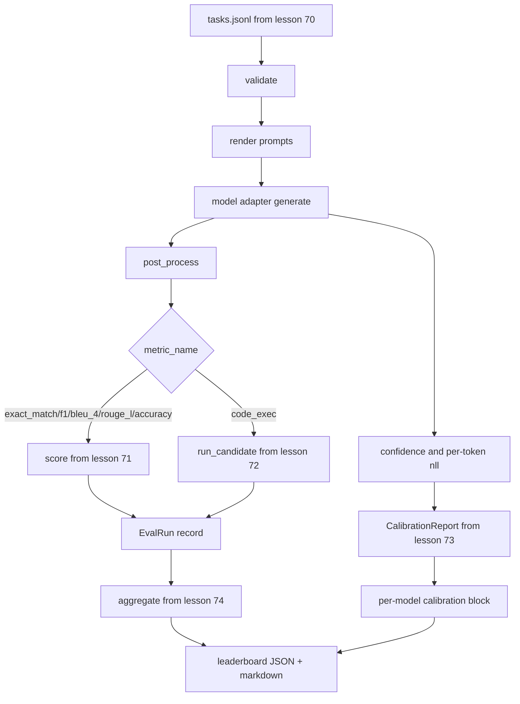

# 端到端评测运行器

> 五节管线课，一节课把它们粘起来。运行器读第 70 课的任务规格、经适配器调用模型、用 71/72 课打分、挂上 73 课的校准报告、产出 74 课的排行榜。演示自终止。

> **【中文解读】** 运行器是评测系统路线的集成点：它自己不重复任何一层的逻辑，只做导入和组装。适配器接口（ModelAdapter）、单遍评分循环、并行执行、自终止演示，全部在一个文件里跑通。这是 70-75 路线的收官课。

> **【拓展：评测系统路线→你自己的评测平台】** 本课把 70-74 五个模块组装成一个可运行的迷你评测平台，结构上就是 lm-eval-harness、OpenAI evals、HELM 这类生产评测系统的骨架：任务规格层 → 模型适配层 → 指标层 → 校准层 → 聚合/报告层。做完本课，接入一个真实模型供应商只需要写三十行适配器胶水——换模型不换线束，这就是分层契约的价值。

> 🔗 **【前置】** 学本课前请先掌握：(1) 19·70（任务规格格式）——fixture 任务与校验；(2) 19·71/72（经典指标与代码执行指标）——评分层接口；(3) 19·73（困惑度与校准）——CalibrationReport；(4) 19·74（排行榜聚合）——aggregate 与 pairwise_diffs；(5) Python `concurrent.futures` 线程池基础。

**类型：** 动手实践
**语言：** Python
**前置条件：** Phase 19 Track B 基础，第 70 至 74 课
**预计用时：** 约 90 分钟

## 学习目标

- 定义一个任何模型（mock、本地、API）都能用极小方法面满足的 `ModelAdapter` 接口。
- 在工作线程池上并行执行任务，跑完一个 fixture JSONL 文件的评测。
- 把指标层（exact_match、F1、BLEU-4、ROUGE-L、code_exec）与校准层在一遍循环里组合起来。
- 产出逐模型的 `EvalRun` 记录，直接喂给排行榜聚合器。
- 同时输出 JSON 报告和 markdown 表格；干净运行以退出码 0 自终止，校验或运行失败则非零。

```figure
eval-grid
```

## 流水线

> **【中文解读】** 流水线五站串联：校验 → 渲染 prompt → 适配器 generate → 后处理 → 按 metric_name 分发打分；置信度与逐 token 负对数似然旁路进校准层；最后全部进聚合层，输出 JSON 与 markdown。



运行器是集成点。第 70 到 74 课各拥有一个模块，运行器把它们组装起来。运行器不复制这些模块的任何逻辑：它导入它们。

## 适配器接口

> **【中文解读】** 接口刻意最小：`model_id` + `generate(prompt, task) -> Generation`。三个 mock 各代表一种典型模型画像——确定性全对、过度自信常错、一类强一类差。

适配器是运行器与任意模型之间的接缝。接口刻意保持很小。

```python
class ModelAdapter:
    model_id: str

    def generate(self, prompt: str, task: TaskSpec) -> Generation: ...
```

`Generation` 是一个 dataclass，包含：

- `text`：模型的自由格式输出
- `confidence`：[0, 1] 内的浮点数，表示模型对答案的自报概率
- `token_nll`：可选，生成 token 上负对数似然的总和
- `token_count`：可选，生成的 token 数

运行器里的 mock 适配器提供三种风味：`RuleBasedAdapter`（确定性、近乎完美）、`NoisyAdapter`（过度自信、常错）和 `BiasedAdapter`（一类任务好、另一类差）。演示在 70 课的 fixture 上跑全部三个。

## 并行执行

> **【中文解读】** 线程池并行、worker 取 8 与任务数的较小值；瓶颈是网络 I/O 所以线程够用；`parallel=False` 供测试钉住顺序。

运行器用 `concurrent.futures.ThreadPoolExecutor` 对每个模型并行执行任务。worker 数默认取 8 与任务数的较小值。线程就足够了，因为真实模型调用的瓶颈是网络 I/O。代码执行路径在任务内部自行派生子进程，执行器只调度这个等待。

为了确定性测试，运行器暴露 `run_eval(adapters, tasks, parallel=False)`，让测试可以钉住执行顺序。

## 单遍评分循环

> **【中文解读】** 六步一任务：渲染 → 调用并计时 → 后处理 → 分发打分 → 记 EvalRun → 追加校准缓冲。correct 判定：exact_match 类 `score >= 1.0`，分级指标 `score >= 0.5`。

对每个任务：

1. 渲染 prompt（few-shot 前缀加 prompt 正文）。
2. 调用适配器并为调用计时。
3. 按任务规则对生成结果做后处理。
4. 分发到指标层。
5. 用分数和指标元数据构造一条 `EvalRun` 记录。
6. 把 `(confidence, correct)` 对追加进校准缓冲。

对 exact_match 类指标（`exact_match`、`accuracy`、`code_exec`），`correct` 信号是 `score >= 1.0`；对分级指标是 `score >= 0.5`。阈值放在 `_correct_from_score` 里，运行器不提供公开的覆盖入口。

## 聚合

> **【中文解读】** 出分后调 74 课 aggregate/pairwise_diffs 和 73 课 CalibrationReport，打包成一个 JSON 信封（leaderboard、pairwise、calibration、summary），markdown 表写 stdout 供贴 PR。

每个任务都有结果之后，运行器调用第 74 课的 `aggregate` 和 `pairwise_diffs`、以及第 73 课的 `CalibrationReport.from_predictions`。输出是一个单一的 JSON 信封：

```json
{
  "leaderboard": [...],
  "pairwise": [...],
  "calibration": {
    "model_id_a": {"ece": 0.04, "brier": 0.10, "populated_bins": 8, ...},
    ...
  },
  "summary": {
    "tasks": 10,
    "models": 3,
    "wall_seconds": 1.2
  }
}
```

运行器还把 markdown 表写到 stdout，让用户能把结果贴进 PR 评审。

## 自终止演示

> **【中文解读】** 三个 mock 跑十个 fixture，十秒内、退出码 0。四条干净判据：校验全过、打分全过、校准无错、规则适配器严格排在随机之上；任何一条破坏即非零退出并带结构化错误。

演示用三个 mock 适配器跑第 70 课的十个 fixture 任务。墙钟时间应在十秒以内。干净运行的退出码为零。

干净运行的判据是：

- 每个任务都通过第 70 课的校验。
- 每个任务都由第 71、72 课打分。
- 第 73 课的校准报告无错误地完成聚合。
- 排行榜把规则适配器严格排在随机适配器之上。

其中任何一条破坏，运行器以非零码退出，并在 JSON 信封中带一个结构化错误。

## 本课不做什么

它不调用真实模型。它不实现 API 密钥流程或限流处理。它不实现流式或部分生成；适配器每次调用返回一个生成结果。它不做重试或缓存。这些关切都住在适配器层；运行器对指标和供应商都是中立的。

## 如何阅读代码

`main.py` 就是那个集成层。它通过一个按相对路径解析模块的小助手 `_load_sibling` 从另外五课导入。dataclass `Generation`、`EvalReport` 和 `ModelAdapter` 在本地定义。mock 适配器在文件底部。

从头到尾读 `main.py`。先略读导入，再看 `run_eval`，再看 `_score_one`，再看适配器。末尾的演示是入口。

`code/tests/test_runner.py` 中的测试钉住适配器接口、单遍循环、并行与顺序执行的等价性、校准缓冲和 JSON 信封形状。

## 再进一步

这个运行器是底线。生产评测系统会加上：以 `(task_id, model_id, model_version)` 为键的结果缓存、追踪每次运行美元数和 token 数的成本台账、对限流做退避的重试层、pass-at-k 任务的采样策略，以及面向长套件的流式输出格式。其中每一个都是只包住运行器的单一关切，不改动指标层或聚合层。这种分离正是契约的意义所在。

mock 跑通之后，为一个真实供应商加适配器。挑一个有免费额度的，写三十行胶水，看着排行榜亮起来。然后加第二个供应商，让线束去干活。
