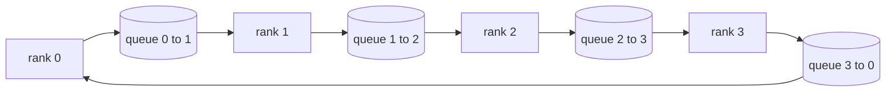

# Collective Ops From Scratch | 集合通信原语从零实现

> The four collective operations that hold distributed training together are allreduce, broadcast, allgather, and reduce_scatter. Every other primitive a training framework offers is a wrapper around these. Build them once over a `multiprocessing.Queue` mesh, verify them against a reference implementation, and the rest of the track becomes plumbing.

> **【中文解读】** 撑起分布式训练的四个集合通信原语是 allreduce、broadcast、allgather 和 reduce_scatter——训练框架里的其他原语都是这四个的包装。本课在 `multiprocessing.Queue` 网格上把它们各实现一遍，并用 `torch.distributed`（gloo 后端）做参考实现逐一验证。把这四个吃透，本路线后面五课（DDP、ZeRO、流水线并行、分片检查点、端到端）就只是管线组装。

> **【拓展：分布式训练路线→为什么从集合通信开始】** 本课是 Phase 19 分布式训练路线（76-81）的第一站。真实世界对应物是 NVIDIA NCCL：跑在 PCIe/NVLink 上、硬件卸载归约。读懂 NCCL 的关键不是 API，而是它底下的环/树拓扑选择——NCCL 自带的拓扑检测器对约 1 MB 以上的消息选环、以下选树，这正是本课表格里"按消息大小选拓扑"的工程化版本。Horovod 论文（2018）让 ring allreduce 成为大模型训练的常识，其每 rank 通信量 2(N-1)/N 的结论是本课要亲手证明的。

> 🔗 **【前置】** 学本课前请先掌握：(1) 19·42-49 训练端到端路线——尤其是 47（检查点）与 48（分布式训练概览），理解单进程训练循环；(2) 多进程编程基础：`multiprocessing.Queue` 的生产者-消费者语义；(3) 大 O 记号与带宽/延迟的基本权衡。

**Type:** Build | **类型:** 动手实践
**Languages:** Python | **语言:** Python
**Prerequisites:** Phase 19 Track C lessons 42-49 | **前置知识:** Phase 19 Track C 第 42-49 课
**Time:** ~90 min | **时间:** 约 90 分钟

## Learning Objectives | 学习目标

- Implement ring allreduce in two passes (reduce-scatter then allgather) and prove the per-rank communication volume is 2(N-1)/N bytes per element.
  中文翻译：实现两遍式环 allreduce（先 reduce-scatter 再 allgather），并证明每 rank 通信量是每元素 2(N-1)/N 字节。
- Build broadcast, allgather, and reduce_scatter on top of point-to-point sends over `multiprocessing.Queue`.
  中文翻译：在 `multiprocessing.Queue` 上的点对点发送之上构建 broadcast、allgather 和 reduce_scatter。
- Verify every primitive against a `torch.distributed` gloo reference for the same input.
  中文翻译：把每个原语与相同输入下的 `torch.distributed` gloo 参考实现互相验证。
- Defend the choice of ring versus tree on cluster shape, latency floor, and bandwidth ceiling.
  中文翻译：能基于集群形态、延迟下限和带宽上限为"环还是树"的选择做辩护。

## The Problem | 问题引入

> **【中文解读】** 本节算一笔带宽账。朴素 allreduce 让每个 rank 把整个张量发给 root 再广播回来：每 rank 带宽 O(N)、root 成瓶颈、墙钟下限 = 最慢链路 × N。环 allreduce 把它压成 2(N-1) 个大小 T/N 的块，每 rank 字节数降到 2T(N-1)/N、与集群规模无关；树 allreduce 深度只有 log2(N) 跳，在小 N、高延迟链路上赢。选错拓扑，最慢的 GPU 就决定每步时间。

A naive allreduce over N ranks sends N times the tensor to a root and broadcasts N times back. Bandwidth scales as O(N) per rank, the root becomes a bottleneck, and the wall-clock floor is the slowest link times N. Ring allreduce flattens that into 2(N-1) chunks of size T/N, so per-rank bytes drop to 2T(N-1)/N independent of cluster size. Tree allreduce wins on small N and high-latency links because depth is log2(N) hops instead of 2(N-1). Pick the wrong topology for the cluster shape and the slowest GPU dictates step time.

> N 个 rank 上的朴素 allreduce 会把张量发 N 份给 root、再广播 N 份回来。每 rank 带宽按 O(N) 增长，root 成为瓶颈，墙钟下限是最慢链路乘 N。环 allreduce 把它摊平成 2(N-1) 个大小为 T/N 的块，于是每 rank 字节降到 2T(N-1)/N，与集群规模无关。树 allreduce 在小 N 和高延迟链路上胜出，因为深度是 log2(N) 跳而不是 2(N-1)。为集群形态选错拓扑，最慢的 GPU 就主宰每步时间。

Every distributed training framework you will read this track depends on these four primitives. PyTorch DDP synchronises gradients with one allreduce per parameter bucket. ZeRO shards optimiser state by reduce_scatter and broadcasts updated parameters by allgather. FSDP turns the full forward into allgather plus reduce_scatter. Pipeline parallel needs broadcast for activations across stage groups. If you cannot implement the four collectives, you cannot reason about why training stalls, why the gradient mismatch shows up at rank 3, or why the pipeline bubble doubles when you swap topologies.

> 你在本路线里读到的每个分布式训练框架都依赖这四个原语。PyTorch DDP 用每个参数桶一次 allreduce 同步梯度。ZeRO 用 reduce_scatter 给优化器状态分片、用 allgather 广播更新后的参数。FSDP 把整个前向变成 allgather 加 reduce_scatter。流水线并行需要 broadcast 把激活传过阶段组。如果你实现不了这四个集合通信，你就无法推理：训练为什么卡住、梯度不匹配为什么出现在 rank 3、换拓扑后流水线气泡为什么翻倍。

## The Concept | 核心概念

> **【中文解读】** 本节是全课核心：把张量均分成 N 块，环上跑两遍——第一遍 reduce-scatter（N-1 步，每步每个 rank 把一块部分和发给右邻居、收左邻居的部分和并累加，结束后 rank r 持有第 r 块的完整和），第二遍 allgather（再 N-1 步，把完成的块绕环轮转，直到每个 rank 持有所有块的完整和）。表格给出五个原语的每 rank 字节数与步数，是后续 DDP/ZeRO 课反复引用的"账本"。



### Ring allreduce in two passes

Split the tensor into N equal chunks indexed 0..N-1. Each rank owns chunk index equal to its rank. Pass 1, reduce-scatter, runs N-1 steps. At step s, rank r sends chunk (r - s) mod N to rank (r + 1) mod N and receives chunk (r - s - 1) mod N from rank (r - 1) mod N, accumulating the received chunk into its local copy. After N-1 steps, rank r owns the full sum for chunk r. Pass 2, allgather, runs another N-1 steps and rotates the finished chunks around the ring until every rank holds the full sum for every chunk.

> 把张量均分成索引为 0..N-1 的 N 块。每个 rank 拥有等于自己 rank 号的那块。第一遍 reduce-scatter 跑 N-1 步。在第 s 步，rank r 把第 (r - s) mod N 块发给 rank (r + 1) mod N，并从 rank (r - 1) mod N 收第 (r - s - 1) mod N 块，把收到的块累加进本地副本。N-1 步之后，rank r 拥有第 r 块的完整和。第二遍 allgather 再跑 N-1 步，把完成的块绕环轮转，直到每个 rank 持有每一块的完整和。

| Primitive | Per-rank bytes | Steps | When to use |
|-----------|---------------|-------|-------------|
| Ring allreduce | 2T(N-1)/N | 2(N-1) | Large T, fat-pipe homogeneous cluster |
| Tree allreduce | T log2(N) | 2 log2(N) | Small T or high-latency links |
| Broadcast | T | log2(N) tree | Parameter init, scalar config |
| Allgather | T(N-1)/N | N-1 | Sharded forward, ZeRO unshard |
| Reduce_scatter | T(N-1)/N | N-1 | ZeRO gradient sharding |

### Queue mesh as a stand-in for NCCL

> **【中文解读】** NCCL 跑在 PCIe/NVLink 上、带硬件卸载归约；CPU 上没有这些。替代方案：每条环边一条 `multiprocessing.Queue`，给出单生产者-单消费者的有序点对点投递。归约发生在用户态，要付 Python 开销，但线格式（wire pattern）与 NCCL 环 allreduce 完全一致——在队列版本上推理正确性，集群行为随之成立。

NCCL runs over PCIe and NVLink with hardware-offloaded reductions. On CPU you do not have that. A `multiprocessing.Queue` per ring edge gives you ordered point-to-point delivery with a single producer and single consumer. The reduction happens in user space, so you pay Python overhead, but the wire pattern is identical to NCCL ring allreduce. Reason about correctness on the queue version and the cluster behaviour follows.

> NCCL 跑在 PCIe 和 NVLink 上，归约由硬件卸载。CPU 上你没有这些。每条环边一条 `multiprocessing.Queue` 给你单生产者、单消费者的有序点对点投递。归约发生在用户态，所以你要付 Python 的开销，但线格式与 NCCL 环 allreduce 完全相同。在队列版本上推理正确性，集群行为随之成立。

### Verify against gloo

> **【中文解读】** 每个原语都配一个单元测试：同一张量、同一 world size，与 gloo 后端的 `torch.distributed` 输出比对，偏差超过 float32 epsilon 即失败。对参考实现做验证不可谈判——没有它，原语"看起来正确"直到真实训练跑到第 10000 步才暴露。

Every primitive lands with a unit test that compares its output against `torch.distributed` initialised with the gloo backend on the same tensor across the same world size. If your ring allreduce diverges from gloo by more than float32 epsilon, the test fails. Verification against a reference implementation is non-negotiable; without it the primitive looks correct until step 10000 of a real training run.

> 每个原语都配一个单元测试：把它的输出与用 gloo 后端初始化的 `torch.distributed` 在同一张量、同一 world size 下的输出比对。如果你的环 allreduce 与 gloo 的偏差超过 float32 epsilon，测试失败。对参考实现做验证是不可谈判的；没有它，原语会一直"看起来正确"，直到真实训练运行到第 10000 步。

```figure
ci-ring-allreduce
```

## Build It | 动手实现

> **【中文解读】** 代码结构五件套：`Mesh` 把 N 个 `multiprocessing.Queue` 接成环并暴露 `send/recv`；`ring_allreduce` 跑两遍算法；`broadcast` 用对数树；`allgather` 用 N-1 次轮转；`reduce_scatter` 取 allreduce 的前半；`_gloo_reference` 把同一输入过一遍 gloo 做字节级比对。运行后输出原语验证表和逐 rank 字节计数——后者亲手证明 2T(N-1)/N 的伸缩律。

`code/main.py` implements:

> `code/main.py` 实现了：

- `Mesh` class that wires N `multiprocessing.Queue` instances into a ring and exposes `send(dst, tensor)` and `recv(src)` per rank.
  中文翻译：`Mesh` 类，把 N 个 `multiprocessing.Queue` 接成环，并为每个 rank 暴露 `send(dst, tensor)` 和 `recv(src)`。
- `ring_allreduce(mesh, rank, world_size, tensor)` running the two-pass algorithm.
  中文翻译：`ring_allreduce(mesh, rank, world_size, tensor)`，跑两遍式算法。
- `broadcast(mesh, rank, world_size, tensor, src)` over a logarithmic tree.
  中文翻译：`broadcast(mesh, rank, world_size, tensor, src)`，走对数树。
- `allgather(mesh, rank, world_size, tensor)` using N-1 rotations.
  中文翻译：`allgather(mesh, rank, world_size, tensor)`，用 N-1 次轮转。
- `reduce_scatter(mesh, rank, world_size, tensor)` as the first half of allreduce.
  中文翻译：`reduce_scatter(mesh, rank, world_size, tensor)`，取 allreduce 的前半。
- `_gloo_reference(op, world_size, tensor)` that runs the same input through `torch.distributed` with gloo for byte-equal comparison.
  中文翻译：`_gloo_reference(op, world_size, tensor)`，把同一输入过一遍 gloo 后端的 `torch.distributed`，做字节相等比对。

Run it:

> 运行：

```bash
python3 code/main.py
```

Output: per-primitive verification table comparing queue-mesh and gloo outputs, followed by a per-rank byte counter that proves the 2T(N-1)/N scaling.

> 输出：逐原语的验证表（比对队列网格与 gloo 的输出），随后是逐 rank 字节计数器，证明 2T(N-1)/N 的伸缩律。

## Production patterns in the wild | 生产中的模式

> **【中文解读】** 三条把原语炼到能上生产的模式：(1) allreduce 前先把梯度装桶——十亿参数模型有几万个梯度张量，逐张量 allreduce 要付 N 倍延迟下限，DDP 按 ~25 MB 装桶、大张量捎带小张量；(2) 通信与计算重叠——最后一层梯度一就绪就发起它的 allreduce，同时下一层继续反向，DDP 用桶就绪钩子实现，网络有余量时可见通信时间减半；(3) 按消息大小而非信仰选环或树——NCCL 拓扑检测器约 1 MB 以上选环（带宽项主导）、以下选树（log2(N) 跳数主导）。

Three patterns harden the primitives enough to ship.

> 三条模式足以把原语加固到可上线。

**Bucket gradients before allreduce.** A 1B-parameter model has tens of thousands of gradient tensors. One allreduce per tensor pays the latency floor N times. DDP buckets gradients into ~25 MB chunks and issues one allreduce per bucket; the small tensors ride on the back of the big ones. Without bucketing the latency overhead dominates the step.

> **allreduce 之前先把梯度装桶。** 十亿参数模型有几万个梯度张量。每张量一次 allreduce 要把延迟下限付 N 次。DDP 把梯度装进约 25 MB 的桶，每桶只发起一次 allreduce；小张量搭大张量的便车。不装桶，延迟开销就会主宰每一步。

**Overlap communication with computation.** Backward computes gradients layer by layer in reverse order. The moment the last layer's gradient is ready, kick off its allreduce while the next layer keeps computing. PyTorch DDP wires this with bucket-ready hooks. The overlap halves visible communication time when the network has slack.

> **通信与计算重叠。** 反向传播按逆序逐层计算梯度。最后一层的梯度一就绪，就立刻发起它的 allreduce，同时下一层继续计算。PyTorch DDP 用桶就绪钩子接线。网络有余量时，这个重叠能把可见通信时间砍半。

**Pick ring or tree by message size, not religion.** NCCL ships a topology detector that picks ring for messages above ~1 MB and tree below. The crossover is bandwidth-versus-latency: above 1 MB, the bandwidth term 2T(N-1)/N dominates and ring wins; below 1 MB, the log2(N) hop count wins. Hard-coding one topology costs throughput on the wrong message size.

> **按消息大小选环或树，而不是按信仰。** NCCL 自带拓扑检测器：约 1 MB 以上的消息选环，以下选树。交叉点是带宽对延迟：1 MB 以上，带宽项 2T(N-1)/N 主导、环赢；1 MB 以下，log2(N) 跳数赢。硬编码单一拓扑会在错误的消息尺寸上损失吞吐。

## Use It | 用框架实现

Production patterns:

> 生产用法：

- **PyTorch DDP.** Calls `dist.all_reduce` on bucketed gradients after backward. The bucket size is tunable; default 25 MB is reasonable for 100Gbit Ethernet.
  中文翻译：**PyTorch DDP。** 反向传播后对装桶的梯度调 `dist.all_reduce`。桶大小可调；默认 25 MB 对 100G 以太网合理。
- **DeepSpeed ZeRO.** Issues reduce_scatter to shard gradients and allgather to reconstruct full parameters before forward. The lesson's primitives are exactly the calls ZeRO makes.
  中文翻译：**DeepSpeed ZeRO。** 发 reduce_scatter 给梯度分片、发 allgather 在前向前重建完整参数。本课的原语正是 ZeRO 发出的调用。
- **FSDP.** Forward begins with allgather to unshard the layer, computes, then reduces with reduce_scatter and discards the unshard. Same primitives, different schedule.
  中文翻译：**FSDP。** 前向以 allgather 解分片该层开始，计算，再用 reduce_scatter 归约并丢弃解分片副本。同一组原语，不同的调度。

## Ship It | 产出物

Use the queue-mesh primitives in lessons 77-81. Lesson 77 wires allreduce into DDP. Lesson 78 wires reduce_scatter into ZeRO. Lesson 79 wires broadcast into pipeline activations. Lesson 81 composes all four into the end-to-end demo.

> 在第 77-81 课里复用队列网格原语。第 77 课把 allreduce 接进 DDP。第 78 课把 reduce_scatter 接进 ZeRO。第 79 课把 broadcast 接进流水线激活。第 81 课把四个全部组合进端到端演示。

## Exercises | 练习题

1. Add a tree allreduce variant and switch between ring and tree by message size. Measure the crossover.
   中文翻译：加一个树 allreduce 变体，按消息大小在环和树之间切换。测量交叉点。
2. Add a `recv_timeout_ms` so a stalled rank surfaces a deadline error instead of hanging forever.
   中文翻译：加一个 `recv_timeout_ms`，让卡住的 rank 报出截止时间错误，而不是永远挂起。
3. Replace `multiprocessing.Queue` with TCP sockets for the four primitives. Same tests, real wire.
   中文翻译：把 `multiprocessing.Queue` 换成 TCP socket 实现这四个原语。同样的测试，真实的网络。
4. Add a bandwidth instrumentation hook so the per-rank byte counter logs to JSONL.
   中文翻译：加一个带宽插桩钩子，让逐 rank 字节计数器写 JSONL 日志。
5. Compare wall-clock time of ring versus tree on 4 ranks for tensors of size 1KB, 1MB, 16MB. Defend the crossover empirically.
   中文翻译：在 4 个 rank 上对 1KB、1MB、16MB 的张量比较环与树的墙钟时间。用实验为交叉点做辩护。

## Key Terms | 术语速查表

| Term | What people say | What it actually means |
|------|----------------|------------------------|
| Allreduce | "Sum across ranks" | After the call every rank holds the same reduced tensor |
| Ring | "The fast topology" | N-1 chunks of size T/N flow around the cycle twice |
| Tree | "The log topology" | Reduction follows a binary tree; depth is log2(N) hops |
| Allgather | "Concatenate shards" | Every rank ends with every other rank's shard |
| Reduce_scatter | "Split the sum" | Each rank ends with the sum of one chunk only |
| Bucket | "Fuse small tensors" | Coalesce N small allreduces into one large one |

> 术语对照：Allreduce=归约分发（调用后每个 rank 持有相同的归约结果张量）、Ring=环拓扑（N-1 个大小 T/N 的块绕环流动两圈）、Tree=树拓扑（按二叉树归约，深度 log2(N) 跳）、Allgather=全收集（每个 rank 最终持有其他所有 rank 的分片）、Reduce_scatter=归约分发散射（每个 rank 最终只持有其中一块的和）、Bucket=桶（把 N 次小 allreduce 合并成一次大的）。

## Further Reading | 延伸阅读

- [PyTorch Distributed: NCCL collectives](https://pytorch.org/docs/stable/distributed.html#collective-functions)
  中文翻译：PyTorch Distributed 的 NCCL 集合通信文档——官方原语 API 入口
- [Horovod ring allreduce paper](https://arxiv.org/abs/1802.05799)
  中文翻译：Horovod 环 allreduce 论文——让 ring allreduce 成为大规模训练常识的工程论文
- [NCCL topology and algorithm selection](https://docs.nvidia.com/deeplearning/nccl/user-guide/docs/index.html)
  中文翻译：NCCL 拓扑与算法选择文档——环/树自动切换的官方说明
- [Patarasuk and Yuan, Bandwidth optimal allreduce algorithms](https://www.cs.fsu.edu/~xyuan/paper/09jpdc.pdf)
  中文翻译：Patarasuk 与 Yuan 的带宽最优 allreduce 算法论文——2(N-1)/N 结论的原始出处
- Phase 10 Lesson 05 - distributed training overview
  中文翻译：Phase 10 第 05 课——分布式训练总览
- Phase 19 Lesson 77 - DDP wired on top of these primitives
  中文翻译：Phase 19 第 77 课——在这些原语之上接线的 DDP
