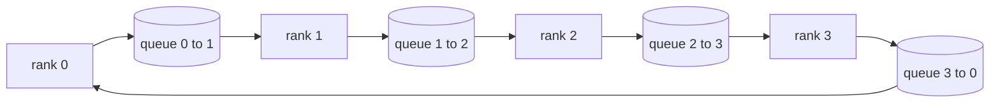

# 集合通信原语从零实现

> 撑起分布式训练的四个集合通信操作是 allreduce、broadcast、allgather 和 reduce_scatter。训练框架提供的所有其他原语都是这四个的包装。在 `multiprocessing.Queue` 网格上把它们各构建一遍、对着参考实现验证，本路线剩下的课程就只是管线组装。

> **【中文解读】** 本课在 CPU 上用多进程队列网格重建分布式训练的地基：四个集合通信原语 + 环/树拓扑的带宽账。每个原语都与 `torch.distributed`（gloo 后端）的输出做字节级比对。把这四个吃透，后面五课（DDP、ZeRO、流水线并行、分片检查点、端到端）就只是管线组装。

> **【拓展：分布式训练路线→为什么从集合通信开始】** 本课是 Phase 19 分布式训练路线（76-81）的第一站。真实世界对应物是 NVIDIA NCCL：跑在 PCIe/NVLink 上、硬件卸载归约。读懂 NCCL 的关键不是 API，而是它底下的环/树拓扑选择——NCCL 自带的拓扑检测器对约 1 MB 以上的消息选环、以下选树，这正是本课表格里"按消息大小选拓扑"的工程化版本。Horovod 论文（2018）让 ring allreduce 成为大模型训练的常识，其每 rank 通信量 2(N-1)/N 的结论是本课要亲手证明的。

> 🔗 **【前置】** 学本课前请先掌握：(1) 19·42-49 训练端到端路线——尤其是 47（检查点）与 48（分布式训练概览），理解单进程训练循环；(2) 多进程编程基础：`multiprocessing.Queue` 的生产者-消费者语义；(3) 大 O 记号与带宽/延迟的基本权衡。

**类型：** 动手实践
**语言：** Python
**前置条件：** Phase 19 Track C 第 42-49 课
**预计用时：** 约 90 分钟

## 学习目标

- 实现两遍式环 allreduce（先 reduce-scatter 再 allgather），并证明每 rank 通信量是每元素 2(N-1)/N 字节。
- 在 `multiprocessing.Queue` 上的点对点发送之上构建 broadcast、allgather 和 reduce_scatter。
- 把每个原语与相同输入下的 `torch.distributed` gloo 参考实现互相验证。
- 能基于集群形态、延迟下限和带宽上限为"环还是树"的选择做辩护。

## 问题引入

> **【中文解读】** 本节算一笔带宽账：朴素 allreduce 每排名 O(N)，环把它压到与集群规模无关的 2T(N-1)/N，树在小 N 高延迟下用 log2(N) 跳取胜。选错拓扑，最慢的 GPU 主宰每步时间。

N 个 rank 上的朴素 allreduce 会把张量发 N 份给 root、再广播 N 份回来。每 rank 带宽按 O(N) 增长，root 成为瓶颈，墙钟下限是最慢链路乘 N。环 allreduce 把它摊平成 2(N-1) 个大小为 T/N 的块，于是每 rank 字节降到 2T(N-1)/N，与集群规模无关。树 allreduce 在小 N 和高延迟链路上胜出，因为深度是 log2(N) 跳而不是 2(N-1)。为集群形态选错拓扑，最慢的 GPU 就主宰每步时间。

你在本路线里读到的每个分布式训练框架都依赖这四个原语。PyTorch DDP 用每个参数桶一次 allreduce 同步梯度。ZeRO 用 reduce_scatter 给优化器状态分片、用 allgather 广播更新后的参数。FSDP 把整个前向变成 allgather 加 reduce_scatter。流水线并行需要 broadcast 把激活传过阶段组。如果你实现不了这四个集合通信，你就无法推理：训练为什么卡住、梯度不匹配为什么出现在 rank 3、换拓扑后流水线气泡为什么翻倍。

## 核心概念

> **【中文解读】** 环 allreduce 两遍：reduce-scatter（N-1 步，结束时 rank r 持有第 r 块的完整和）+ allgather（再 N-1 步，完成的块绕环轮转）。原语账本表是后续课程反复引用的依据。



### 两遍式环 allreduce

把张量均分成索引为 0..N-1 的 N 块。每个 rank 拥有等于自己 rank 号的那块。第一遍 reduce-scatter 跑 N-1 步。在第 s 步，rank r 把第 (r - s) mod N 块发给 rank (r + 1) mod N，并从 rank (r - 1) mod N 收第 (r - s - 1) mod N 块，把收到的块累加进本地副本。N-1 步之后，rank r 拥有第 r 块的完整和。第二遍 allgather 再跑 N-1 步，把完成的块绕环轮转，直到每个 rank 持有每一块的完整和。

| 原语 | 每 rank 字节 | 步数 | 适用场景 |
|------|---------------|-------|-------------|
| Ring allreduce | 2T(N-1)/N | 2(N-1) | 大 T、粗管道同构集群 |
| Tree allreduce | T log2(N) | 2 log2(N) | 小 T 或高延迟链路 |
| Broadcast | T | log2(N) 树 | 参数初始化、标量配置 |
| Allgather | T(N-1)/N | N-1 | 分片前向、ZeRO 解分片 |
| Reduce_scatter | T(N-1)/N | N-1 | ZeRO 梯度分片 |

### 队列网格作为 NCCL 的替身

> **【中文解读】** 每条环边一条队列：单生产者-单消费者的有序点对点投递。归约在用户态、付 Python 开销，但线格式与 NCCL 完全一致——在队列版本上推理正确性，集群行为随之成立。

NCCL 跑在 PCIe 和 NVLink 上，归约由硬件卸载。CPU 上你没有这些。每条环边一条 `multiprocessing.Queue` 给你单生产者、单消费者的有序点对点投递。归约发生在用户态，所以你要付 Python 的开销，但线格式与 NCCL 环 allreduce 完全相同。在队列版本上推理正确性，集群行为随之成立。

### 对着 gloo 验证

> **【中文解读】** 每个原语都配一个与 gloo 比对的单元测试，偏差超过 float32 epsilon 即失败。对参考实现做验证不可谈判——没有它，原语"看起来正确"直到真实训练第 10000 步才暴露。

每个原语都配一个单元测试：把它的输出与用 gloo 后端初始化的 `torch.distributed` 在同一张量、同一 world size 下的输出比对。如果你的环 allreduce 与 gloo 的偏差超过 float32 epsilon，测试失败。对参考实现做验证是不可谈判的；没有它，原语会一直"看起来正确"，直到真实训练运行到第 10000 步。

```figure
ci-ring-allreduce
```

## 动手实现

> **【中文解读】** Mesh 接环、ring_allreduce 两遍、broadcast 对数树、allgather 轮转、reduce_scatter 取前半、_gloo_reference 字节级比对。运行输出验证表 + 逐 rank 字节计数器。

`code/main.py` 实现了：

- `Mesh` 类，把 N 个 `multiprocessing.Queue` 接成环，并为每个 rank 暴露 `send(dst, tensor)` 和 `recv(src)`。
- `ring_allreduce(mesh, rank, world_size, tensor)`，跑两遍式算法。
- `broadcast(mesh, rank, world_size, tensor, src)`，走对数树。
- `allgather(mesh, rank, world_size, tensor)`，用 N-1 次轮转。
- `reduce_scatter(mesh, rank, world_size, tensor)`，取 allreduce 的前半。
- `_gloo_reference(op, world_size, tensor)`，把同一输入过一遍 gloo 后端的 `torch.distributed`，做字节相等比对。

运行：

```bash
python3 code/main.py
```

输出：逐原语的验证表（比对队列网格与 gloo 的输出），随后是逐 rank 字节计数器，证明 2T(N-1)/N 的伸缩律。

## 生产中的模式

> **【中文解读】** 装桶（免 N 倍延迟下限）、通信与计算重叠（反向未结束就发起 allreduce）、按消息大小选拓扑（>1 MB 环、<1 MB 树）——三条模式把原语炼到能上生产。

三条模式足以把原语加固到可上线。

**allreduce 之前先把梯度装桶。** 十亿参数模型有几万个梯度张量。每张量一次 allreduce 要把延迟下限付 N 次。DDP 把梯度装进约 25 MB 的桶，每桶只发起一次 allreduce；小张量搭大张量的便车。不装桶，延迟开销就会主宰每一步。

**通信与计算重叠。** 反向传播按逆序逐层计算梯度。最后一层的梯度一就绪，就立刻发起它的 allreduce，同时下一层继续计算。PyTorch DDP 用桶就绪钩子接线。网络有余量时，这个重叠能把可见通信时间砍半。

**按消息大小选环或树，而不是按信仰。** NCCL 自带拓扑检测器：约 1 MB 以上的消息选环，以下选树。交叉点是带宽对延迟：1 MB 以上，带宽项 2T(N-1)/N 主导、环赢；1 MB 以下，log2(N) 跳数赢。硬编码单一拓扑会在错误的消息尺寸上损失吞吐。

## 用框架实现

生产用法：

- **PyTorch DDP。** 反向传播后对装桶的梯度调 `dist.all_reduce`。桶大小可调；默认 25 MB 对 100G 以太网合理。
- **DeepSpeed ZeRO。** 发 reduce_scatter 给梯度分片、发 allgather 在前向前重建完整参数。本课的原语正是 ZeRO 发出的调用。
- **FSDP。** 前向以 allgather 解分片该层开始，计算，再用 reduce_scatter 归约并丢弃解分片副本。同一组原语，不同的调度。

## 产出物

在第 77-81 课里复用队列网格原语。第 77 课把 allreduce 接进 DDP。第 78 课把 reduce_scatter 接进 ZeRO。第 79 课把 broadcast 接进流水线激活。第 81 课把四个全部组合进端到端演示。

## 练习题

1. 加一个树 allreduce 变体，按消息大小在环和树之间切换。测量交叉点。
2. 加一个 `recv_timeout_ms`，让卡住的 rank 报出截止时间错误，而不是永远挂起。
3. 把 `multiprocessing.Queue` 换成 TCP socket 实现这四个原语。同样的测试，真实的网络。
4. 加一个带宽插桩钩子，让逐 rank 字节计数器写 JSONL 日志。
5. 在 4 个 rank 上对 1KB、1MB、16MB 的张量比较环与树的墙钟时间。用实验为交叉点做辩护。

## 术语速查表

| 术语 | 人们常说的 | 实际含义 |
|------|----------------|------------------------|
| Allreduce | "跨 rank 求和" | 调用后每个 rank 持有相同的归约结果张量 |
| Ring（环） | "快的那个拓扑" | N-1 个大小 T/N 的块绕环流动两圈 |
| Tree（树） | "对数的那个拓扑" | 归约沿二叉树进行；深度是 log2(N) 跳 |
| Allgather | "拼接分片" | 每个 rank 最终持有其他所有 rank 的分片 |
| Reduce_scatter | "把和拆开" | 每个 rank 最终只持有其中一块的和 |
| Bucket（桶） | "融合小张量" | 把 N 次小 allreduce 合并成一次大的 |

## 延伸阅读

- [PyTorch Distributed: NCCL collectives](https://pytorch.org/docs/stable/distributed.html#collective-functions) — 官方集合通信 API 入口
- [Horovod ring allreduce paper](https://arxiv.org/abs/1802.05799) — 让 ring allreduce 成为大规模训练常识的工程论文
- [NCCL topology and algorithm selection](https://docs.nvidia.com/deeplearning/nccl/user-guide/docs/index.html) — 环/树自动切换的官方说明
- [Patarasuk and Yuan, Bandwidth optimal allreduce algorithms](https://www.cs.fsu.edu/~xyuan/paper/09jpdc.pdf) — 2(N-1)/N 结论的原始出处
- Phase 10 第 05 课——分布式训练总览
- Phase 19 第 77 课——在这些原语之上接线的 DDP
