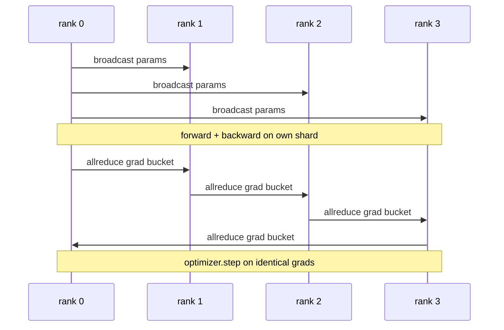

# Data Parallel DDP From Scratch | 数据并行 DDP 从零实现

> DistributedDataParallel is a hook on top of allreduce. Wrap a model, broadcast the initial parameters from rank 0 so every rank starts identical, install a backward hook on every parameter that issues an allreduce of the gradient, and the rest is gradient descent. The whole pattern is 200 lines.

> **【中文解读】** DistributedDataParallel（DDP）本质上是 allreduce 之上的一组钩子：构造时把初始参数从 rank 0 广播出去，保证每个 rank 起点一致；再给每个参数装一个反向钩子，对梯度发起 allreduce；剩下的就是普通的梯度下降。整个模式只要约 200 行。本课在 CPU + gloo 上从零复刻它，并用"单进程逐 rank 顺序训练 ↔ DDP 四 rank 训练"的逐步参数等价测试证明梯度同步正确。

> **【拓展：分布式训练路线→把 76 课的原语变成训练系统】** 本课是分布式训练路线（76-81）的第二站：76 课实现了集合通信原语，本课把 allreduce + broadcast 接成可训练的数据并行循环，78 课 ZeRO 用 reduce_scatter 替换逐参数 allreduce、79 课流水线并行、81 课端到端组装。真实世界对应物是 PyTorch 官方 DDP——工业界大模型预训练的默认起点（Megatron-LM、HuggingFace Accelerate 底下都是它）。本课的"桶化 + 通信重叠"正是官方 DDP 性能的秘密所在。

> 🔗 **【前置】** 学本课前请先掌握：(1) 19·76（集合通信原语从零实现）——allreduce 与 broadcast 的语义和带宽账；(2) 19·42-46 训练端到端路线——单进程训练循环、梯度累积、混合精度；(3) PyTorch 基础：`nn.Module`、`loss.backward()`、优化器 step。

**Type:** Build | **类型:** 动手实践
**Languages:** Python | **语言:** Python
**Prerequisites:** Phase 19 Track C lessons 42-49 | **前置知识:** Phase 19 Track C 第 42-49 课
**Time:** ~90 min | **时间:** 约 90 分钟

## Learning Objectives | 学习目标

- Wire a `DistributedDataParallel`-shaped wrapper that broadcasts initial parameters and allreduces gradients after backward.
  中文翻译：接线一个 `DistributedDataParallel` 形状的包装器：广播初始参数、反向传播后 allreduce 梯度。
- Spawn N CPU ranks with `torch.multiprocessing.spawn` over the gloo backend with file-based rendezvous.
  中文翻译：用 `torch.multiprocessing.spawn` 在 gloo 后端上、以基于文件的会合方式派生 N 个 CPU rank。
- Prove gradient-sync correctness by training the same model on the same data sequentially and showing per-step parameter equivalence.
  中文翻译：用同一模型在同一数据上顺序训练，逐步展示参数等价，从而证明梯度同步的正确性。
- Defend the use of buckets (gradient fusion) and overlap (comm during backward) as the two changes that turn a working DDP into a production DDP.
  中文翻译：为"桶化（梯度融合）与重叠（反向期间通信）是把能跑的 DDP 变成生产级 DDP 的两处改动"做辩护。

## The Problem | 问题引入

> **【中文解读】** 本节讲数据并行的动机与两条失败模式。动机：120 亿参数 + 12 GB 激活放不进一张消费级 GPU，即便放得下也要训练数周——数据并行把 batch 切到 N 个 rank，各算各自分片的前向/反向，每步把梯度求和，N 份副本保持一致。失败模式一：不同步梯度，N 份副本第 2 步就发散，那不是"一个模型学了更多数据"，而是 N 个恰好共享初始权重的独立模型。失败模式二：同步做得差（逐参数 allreduce、无重叠、无桶化），网络成瓶颈、GPU 等网线。DDP 的手艺就是让梯度同步相对计算几乎免费。

A 1-billion-parameter model with 12 GB of activations does not fit on one consumer GPU. Even when it fits, training takes weeks. Data parallel splits the batch across N ranks, each rank computes the forward and backward on its shard, and at every step every rank's gradients are summed so all N copies stay identical. The summed gradient is what the optimiser steps on.

> 一个有 120 亿参数、12 GB 激活的模型放不进单张消费级 GPU。就算放得下，训练也要数周。数据并行把 batch 切分到 N 个 rank，每个 rank 在自己的分片上算前向和反向，并且每一步把所有 rank 的梯度求和，让全部 N 份副本保持一致。求和后的梯度就是优化器赖以 step 的东西。

Without gradient sync, the N replicas diverge by step 2. The model is not "one model trained on more data" anymore, it is N separate models that happen to share initial weights. With gradient sync done badly (one allreduce per parameter, no overlap, no bucketing) the network is the bottleneck and the GPUs idle waiting for the wire. The craft of DDP is making the gradient sync nearly free relative to compute. The canonical PyTorch DDP achieves that by bucketing gradients, overlapping allreduce with the next layer's backward, and using NCCL on NVLink. We can do all three on CPU with gloo and learn the same lessons.

> 不做梯度同步，N 份副本到第 2 步就发散。模型不再是"用更多数据训练的一个模型"，而是 N 个恰好共享初始权重的独立模型。梯度同步做得差（每个参数一次 allreduce、无重叠、无桶化）时，网络成为瓶颈，GPU 闲着等网线。DDP 的手艺在于让梯度同步相对计算几乎免费。权威的 PyTorch DDP 靠梯度桶化、allreduce 与下一层反向重叠、以及在 NVLink 上用 NCCL 达成这一点。我们可以在 CPU 上用 gloo 做全部三件事，学到同样的教训。

## The Concept | 核心概念

> **【中文解读】** DDP 只需要三个集合通信动作：初始化时从 rank 0 broadcast 参数（保证起点一致）、反向后对每份梯度 allreduce（优化器 step 在均值梯度上）、有时 broadcast 缓冲区（BatchNorm 运行统计量保持同步）。序列图给出完整一轮：broadcast → 各自前向反向 → 梯度桶沿环 allreduce → 所有 rank 在相同梯度上 optimizer.step。



### The three operations DDP needs

| Stage | Collective | Why |
|-------|-----------|-----|
| Init | broadcast from rank 0 | Every rank starts with the same parameters |
| After backward | allreduce of each grad | The mean gradient is what the optimiser steps on |
| Sometimes | broadcast of buffers | Batchnorm running stats stay synchronised |

> 表格翻译：初始化阶段——从 rank 0 broadcast——每个 rank 以相同参数起步；反向传播后——对每份梯度 allreduce——优化器 step 的是均值梯度；有时——broadcast 缓冲区——BatchNorm 运行统计量保持同步。

### Why mean and not sum

> **【中文解读】** allreduce-SUM 再除以 world_size 得到均值梯度。均值对 world_size 不变：单 rank 调好的学习率在四 rank 上照用，因为每步梯度量级不变。不除的 SUM 逼你每次改集群规模都重调学习率。DDP 包装 SUM 并做除法；本课照做。

Allreduce-SUM divided by world_size gives the mean gradient. The mean is invariant to world_size: a learning rate tuned at one rank works at four ranks because the per-step gradient magnitude does not change. Allreduce-SUM without the division forces you to retune the learning rate every time you change cluster size. DDP wraps the SUM and divides; do the same in the lesson.

> allreduce-SUM 除以 world_size 得到均值梯度。均值对 world_size 不变：在单 rank 上调好的学习率放到四个 rank 上依然有效，因为每步梯度量级没有变化。不做除法的 allreduce-SUM 会逼你每次改变集群规模都重调学习率。DDP 包装 SUM 并做除法；本课照做。

### Why bucket gradients

> **【中文解读】** 一个 Transformer 有几千个参数张量。逐张量 allreduce 要把 gloo 延迟下限付几千次。DDP 把梯度组成约 25 MB 的桶、每桶一次 allreduce：线上总字节不变，但延迟被桶摊薄。本课的小模型把所有梯度装进一个桶；重要的是结构能迁移到真实模型。

A transformer has thousands of parameter tensors. One allreduce per tensor pays the gloo latency floor thousands of times. DDP groups gradients into ~25 MB buckets and issues one allreduce per bucket. The same total bytes move across the wire but the latency is amortised over the bucket. For the lesson's tiny model we group everything into one bucket; the structure is what carries across.

> 一个 Transformer 有几千个参数张量。每张量一次 allreduce 要把 gloo 延迟下限付几千次。DDP 把梯度组成约 25 MB 的桶，每桶只发起一次 allreduce。线上移动的总字节相同，但延迟被摊薄到桶上。对本课的微型模型，我们把全部梯度装进一个桶；能迁移到真实模型的是这个结构。

### Why pin the seed

> **【中文解读】** 种子纪律是隐秘的坑：每个 rank 必须 `torch.manual_seed(seed + rank)` 用于洗牌、`torch.manual_seed(seed)` 用于参数初始化。共享种子 = 每个 rank 看到相同 batch 顺序（数据并行失效）；参数用 rank 专属种子 = 初始参数相差 float epsilon，梯度同步再也保证不了副本一致。种子模式写错，参数等价测试第 1 步就挂。

Every rank must call `torch.manual_seed(seed + rank)` for shuffling but `torch.manual_seed(seed)` for parameter init. A single shared seed means every rank sees the same batch order (defeating data parallel); a rank-specific seed for params means initial parameters disagree by float epsilon and gradient sync no longer makes the replicas identical. Get the seed pattern right or the test for parameter equivalence fails on step 1.

> 每个 rank 必须为洗牌调用 `torch.manual_seed(seed + rank)`、为参数初始化调用 `torch.manual_seed(seed)`。单一共享种子意味着每个 rank 看到相同的 batch 顺序（数据并行失效）；参数用 rank 专属种子意味着初始参数相差 float epsilon，梯度同步无法再让副本保持一致。种子模式写不对，参数等价测试第 1 步就失败。

```figure
ci-ddp-grad-sync
```

## Build It | 动手实现

> **【中文解读】** 代码四件套：`MiniMLP`（3 层 MLP，秒级收敛又足以暴露接线）；`DistributedDataParallel(model, world_size)`（构造时 broadcast 参数，`sync_grads` 把 allreduce 求和后的梯度除以 world_size）；`worker`（完整训练循环：gloo 初始化、前向、反向、同步、step）；`_reference_single_process_loop`（单进程顺序走同样的 batch，供测试做逐步字节级参数等价比对）。运行输出逐 step 对比表：单进程与 4 rank DDP 的 loss 曲线和参数校验和一致到 float epsilon——这就是梯度同步正确的证明。

`code/main.py` implements:

> `code/main.py` 实现了：

- `MiniMLP`: a 3-layer MLP small enough to converge in seconds, large enough to expose the wiring.
  中文翻译：`MiniMLP`：3 层 MLP，小到几秒收敛，大到能暴露接线问题。
- `DistributedDataParallel(model, world_size)`: broadcasts params at construct time, returns a wrapper whose `sync_grads` divides accumulated allreduce-summed grads by world_size.
  中文翻译：`DistributedDataParallel(model, world_size)`：构造时广播参数，返回一个包装器，其 `sync_grads` 把 allreduce 累加求和后的梯度除以 world_size。
- `worker(rank, world_size, ...)`: full training loop with `torch.distributed` init over gloo, forward, backward, sync, step.
  中文翻译：`worker(rank, world_size, ...)`：完整训练循环——gloo 上的 `torch.distributed` 初始化、前向、反向、同步、step。
- `_reference_single_process_loop(...)`: trains the same model on the same data sequentially on one rank, used by the test for byte-equal parameter equivalence after each step.
  中文翻译：`_reference_single_process_loop(...)`：在单 rank 上用同一数据顺序训练同一模型，供测试做每步之后字节级相等的参数等价比对。

Run it:

> 运行：

```bash
python3 code/main.py
```

Output: a per-step training table comparing single-process loss and parameter checksum to the DDP run on 4 ranks. The two paths produce identical loss curves to float epsilon, proving the gradient sync is correct.

> 输出：一张逐 step 训练表，对比单进程的 loss 和参数校验和与 4 rank DDP 运行的结果。两条路径产生到 float epsilon 为止一致的 loss 曲线，证明梯度同步是正确的。

## Production patterns in the wild | 生产中的模式

> **【中文解读】** 三条把 DDP 炼到能上生产的模式：(1) 找出未使用参数——条件性跳过的前向路径（提前退出、MoE 路由）让部分参数没有梯度，但 DDP 的桶就绪钩子仍会等它们，allreduce 死锁；`find_unused_parameters=True` 让 DDP 归约前先看哪些参数有梯度，代价是每步一次图遍历；(2) 静态图优化——前向跨步稳定时 `static_graph=True` 预计算桶调度，每步省几毫秒、一万步下来可观；(3) 梯度累积要小心——K 个微批次累积不同步是 10 倍吞吐提升，DDP 的 `no_sync()` 上下文管理器暂停反向后 allreduce，忘掉它就把 allreduce 白做 K 次。

Three patterns harden DDP enough to ship.

> 三条模式足以把 DDP 加固到可上线。

**Find unused parameters.** Some forward paths skip parameters conditionally (early exit, mixture-of-experts router). The skipped parameters have no gradient, but DDP's bucket-ready hook still waits for them and the allreduce deadlocks. `find_unused_parameters=True` tells DDP to look at which params got gradients before reducing. The cost is a graph walk per step, so leave it off unless your forward branches.

> **找出未使用参数。** 一些前向路径会有条件地跳过参数（提前退出、混合专家路由器）。被跳过的参数没有梯度，但 DDP 的桶就绪钩子仍然等它们，allreduce 就死锁了。`find_unused_parameters=True` 告诉 DDP 在归约前先看哪些参数拿到了梯度。代价是每步一次图遍历，所以除非你的前向有分支，否则别开。

**Static graph optimisation.** When the forward is stable across steps, `static_graph=True` lets DDP precompute the bucket schedule. The optimisation matters at scale: precomputing saves a few ms per step which compounds across 10000 steps.

> **静态图优化。** 当前向跨步稳定时，`static_graph=True` 让 DDP 预计算桶调度。这个优化在规模上很重要：预计算每步省下几毫秒，在一万步上复利累积。

**Gradient accumulation needs care.** Accumulating gradients over K microbatches without syncing each microbatch is a 10x throughput win. DDP exposes `no_sync()` as a context manager that pauses the post-backward allreduce. Forget the manager and you allreduce K times for nothing; the throughput drops to the floor.

> **梯度累积需要小心。** 跨 K 个微批次累积梯度、不逐微批次同步，是 10 倍的吞吐提升。DDP 把 `no_sync()` 暴露为暂停反向后 allreduce 的上下文管理器。忘掉这个管理器，你就白白 allreduce 了 K 次；吞吐跌回谷底。

## Use It | 用框架实现

Production patterns:

> 生产用法：

- **PyTorch DDP.** The canonical implementation. `torch.nn.parallel.DistributedDataParallel(model)` wires bucketing, overlap, and the no_sync context.
  中文翻译：**PyTorch DDP。** 权威实现。`torch.nn.parallel.DistributedDataParallel(model)` 接好了桶化、重叠和 no_sync 上下文。
- **HuggingFace Accelerate.** Adds a launcher that handles `torchrun` env vars and the model wrap. Same DDP under the hood.
  中文翻译：**HuggingFace Accelerate。** 加了一个处理 `torchrun` 环境变量和模型包装的启动器。底层是同一个 DDP。
- **Megatron-LM data parallel.** Combines DDP with tensor parallel for large models; the data-parallel piece is the same allreduce-after-backward pattern.
  中文翻译：**Megatron-LM 数据并行。** 为大模型把 DDP 与张量并行组合；数据并行那一份就是同一个"反向后 allreduce"模式。

## Ship It | 产出物

Lesson 78 (ZeRO sharding) replaces the per-parameter allreduce with reduce_scatter so each rank only stores its shard of the optimiser state. Lesson 81 composes DDP with ZeRO into the end-to-end demo.

> 第 78 课（ZeRO 分片）用 reduce_scatter 替换逐参数 allreduce，让每个 rank 只存优化器状态的分片。第 81 课把 DDP 与 ZeRO 组合进端到端演示。

## Exercises | 练习题

1. Add gradient buckets of configurable size and measure the speedup vs one-allreduce-per-parameter on a deeper model.
   中文翻译：加可配置大小的梯度桶，在更深的模型上测量相对"每参数一次 allreduce"的加速。
2. Implement `no_sync()` as a context manager and verify gradient accumulation matches a single-process baseline over K microbatches.
   中文翻译：把 `no_sync()` 实现为上下文管理器，验证 K 个微批次上的梯度累积与单进程基线一致。
3. Add a `find_unused_parameters` mode where the forward sometimes skips one of the MLP layers; without the flag the run should deadlock.
   中文翻译：加一个 `find_unused_parameters` 模式，让前向偶尔跳过某一 MLP 层；不开这个标志运行应当死锁。
4. Replace gloo with `torch.distributed.barrier()`-only synchronisation to feel the difference between allreduce-based and barrier-based sync.
   中文翻译：把 gloo 换成只用 `torch.distributed.barrier()` 的同步，体会基于 allreduce 与基于 barrier 的同步的差异。
5. Measure the gradient-sync overhead as a fraction of step time for batch sizes 1, 16, 256 and explain the scaling.
   中文翻译：测量 batch 为 1、16、256 时梯度同步占每步时间的比例，并解释其伸缩规律。

## Key Terms | 术语速查表

| Term | What people say | What it actually means |
|------|----------------|------------------------|
| DDP | "Data parallel" | Wrapper that broadcasts params and allreduces grads each step |
| Bucket | "Fuse grads" | Group N small allreduces into one large one |
| Overlap | "Hide comm" | Issue allreduce while later layers still computing backward |
| no_sync | "Accumulate" | Skip the post-backward allreduce for gradient accumulation |
| find_unused | "Branchy forward" | Detect parameters with no grad before reducing |

> 术语对照：DDP=数据并行包装器（每步广播参数、allreduce 梯度）、Bucket=桶（把 N 次小 allreduce 组成一次大的）、Overlap=重叠（后面的层还在算反向时就发起 allreduce）、no_sync=梯度累积时跳过反向后的 allreduce、find_unused=归约前检测没有梯度的参数（分支前向）。

## Further Reading | 延伸阅读

- [PyTorch DistributedDataParallel docs](https://pytorch.org/docs/stable/generated/torch.nn.parallel.DistributedDataParallel.html)
  中文翻译：PyTorch DistributedDataParallel 官方文档
- [PyTorch DDP internals tutorial](https://pytorch.org/tutorials/intermediate/ddp_tutorial.html)
  中文翻译：PyTorch DDP 内部机制教程——桶化与重叠钩子的官方讲解
- [Li et al, PyTorch Distributed: Experiences on Accelerating Data Parallel Training](https://arxiv.org/abs/2006.15704)
  中文翻译：Li 等人的 PyTorch Distributed 论文——官方 DDP 设计经验
- Phase 19 Lesson 76 - the collectives DDP is built on
  中文翻译：Phase 19 第 76 课——DDP 赖以构建的集合通信原语
- Phase 19 Lesson 78 - ZeRO sharding replaces the per-param allreduce with reduce_scatter
  中文翻译：Phase 19 第 78 课——ZeRO 分片用 reduce_scatter 替换逐参数 allreduce
