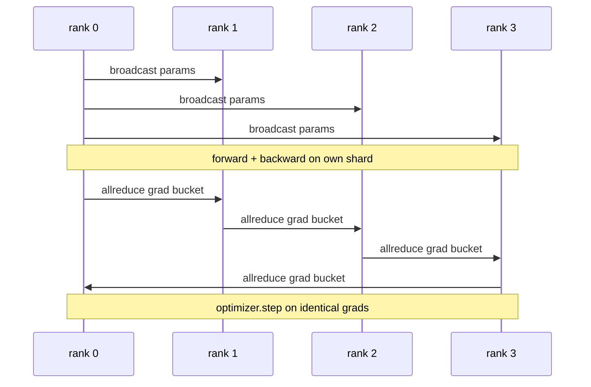

# 数据并行 DDP 从零实现

> DistributedDataParallel 是 allreduce 之上的一组钩子。包装一个模型，把初始参数从 rank 0 广播出去让每个 rank 起点一致，给每个参数装一个对梯度发起 allreduce 的反向钩子，剩下的就是梯度下降。整个模式 200 行。

> **【中文解读】** DDP 的三个动作：构造时 broadcast 参数、反向后 allreduce 梯度、（有时）broadcast 缓冲区。本课在 CPU + gloo 上从零复刻，用"单进程顺序训练 ↔ 4 rank DDP"的逐步参数等价测试证明梯度同步正确。桶化与通信重叠是把能跑的 DDP 变成生产级 DDP 的两处关键改动。

> **【拓展：分布式训练路线→把 76 课的原语变成训练系统】** 本课是分布式训练路线（76-81）的第二站：76 课实现集合通信原语，本课把 allreduce + broadcast 接成可训练的数据并行循环，78 课 ZeRO 用 reduce_scatter 替换逐参数 allreduce、79 课流水线并行、81 课端到端组装。真实世界对应物是 PyTorch 官方 DDP——工业界大模型预训练的默认起点（Megatron-LM、HuggingFace Accelerate 底下都是它）。

> 🔗 **【前置】** 学本课前请先掌握：(1) 19·76（集合通信原语从零实现）——allreduce 与 broadcast 的语义和带宽账；(2) 19·42-46 训练端到端路线——单进程训练循环、梯度累积、混合精度；(3) PyTorch 基础：`nn.Module`、`loss.backward()`、优化器 step。

**类型：** 动手实践
**语言：** Python
**前置条件：** Phase 19 Track C 第 42-49 课
**预计用时：** 约 90 分钟

## 学习目标

- 接线一个 `DistributedDataParallel` 形状的包装器：广播初始参数、反向传播后 allreduce 梯度。
- 用 `torch.multiprocessing.spawn` 在 gloo 后端上、以基于文件的会合方式派生 N 个 CPU rank。
- 用同一模型在同一数据上顺序训练，逐步展示参数等价，从而证明梯度同步的正确性。
- 为"桶化（梯度融合）与重叠（反向期间通信）是把能跑的 DDP 变成生产级 DDP 的两处改动"做辩护。

## 问题引入

> **【中文解读】** 动机：大模型放不进单卡、训练要数周，数据并行把 batch 切到 N 个 rank、每步把梯度求和。两条失败模式：不同步（第 2 步就发散成 N 个独立模型）、同步得差（网络成瓶颈、GPU 等网线）。

一个有 120 亿参数、12 GB 激活的模型放不进单张消费级 GPU。就算放得下，训练也要数周。数据并行把 batch 切分到 N 个 rank，每个 rank 在自己的分片上算前向和反向，并且每一步把所有 rank 的梯度求和，让全部 N 份副本保持一致。求和后的梯度就是优化器赖以 step 的东西。

不做梯度同步，N 份副本到第 2 步就发散。模型不再是"用更多数据训练的一个模型"，而是 N 个恰好共享初始权重的独立模型。梯度同步做得差（每个参数一次 allreduce、无重叠、无桶化）时，网络成为瓶颈，GPU 闲着等网线。DDP 的手艺在于让梯度同步相对计算几乎免费。权威的 PyTorch DDP 靠梯度桶化、allreduce 与下一层反向重叠、以及在 NVLink 上用 NCCL 达成这一点。我们可以在 CPU 上用 gloo 做全部三件事，学到同样的教训。

## 核心概念

> **【中文解读】** 一轮 DDP：broadcast 参数 → 各自前向反向 → 梯度桶沿环 allreduce → 所有 rank 在相同梯度上 optimizer.step。三个集合通信动作见下表。



### DDP 需要的三个操作

| 阶段 | 集合通信 | 原因 |
|-------|-----------|-----|
| 初始化 | 从 rank 0 broadcast | 每个 rank 以相同参数起步 |
| 反向后 | 对每份梯度 allreduce | 优化器 step 的是均值梯度 |
| 有时 | broadcast 缓冲区 | BatchNorm 运行统计量保持同步 |

### 为什么是均值而不是求和

> **【中文解读】** 均值对 world_size 不变：单 rank 调好的学习率换集群规模照用；SUM 不除就得每次重调学习率。

allreduce-SUM 除以 world_size 得到均值梯度。均值对 world_size 不变：在单 rank 上调好的学习率放到四个 rank 上依然有效，因为每步梯度量级没有变化。不做除法的 allreduce-SUM 会逼你每次改变集群规模都重调学习率。DDP 包装 SUM 并做除法；本课照做。

### 为什么给梯度装桶

> **【中文解读】** 逐张量 allreduce 要付几千次延迟下限；25 MB 桶把延迟摊薄，总字节不变。本课小模型全装一个桶，能迁移的是结构。

一个 Transformer 有几千个参数张量。每张量一次 allreduce 要把 gloo 延迟下限付几千次。DDP 把梯度组成约 25 MB 的桶，每桶只发起一次 allreduce。线上移动的总字节相同，但延迟被摊薄到桶上。对本课的微型模型，我们把全部梯度装进一个桶；能迁移到真实模型的是这个结构。

### 为什么钉死种子

> **【中文解读】** 洗牌用 seed + rank、参数初始化用同一个 seed。共享种子 = 相同 batch 顺序（数据并行失效）；参数种子分 rank = 初始权重差 float epsilon，梯度同步救不回来。

每个 rank 必须为洗牌调用 `torch.manual_seed(seed + rank)`、为参数初始化调用 `torch.manual_seed(seed)`。单一共享种子意味着每个 rank 看到相同的 batch 顺序（数据并行失效）；参数用 rank 专属种子意味着初始参数相差 float epsilon，梯度同步无法再让副本保持一致。种子模式写不对，参数等价测试第 1 步就失败。

```figure
ci-ddp-grad-sync
```

## 动手实现

> **【中文解读】** 四件套：MiniMLP、DDP 包装器（broadcast + sync_grads 除以 world_size）、worker 训练循环、单进程参考循环。运行输出逐 step 对比表——两条路径的 loss 曲线一致到 float epsilon，梯度同步即正确。

`code/main.py` 实现了：

- `MiniMLP`：3 层 MLP，小到几秒收敛，大到能暴露接线问题。
- `DistributedDataParallel(model, world_size)`：构造时广播参数，返回一个包装器，其 `sync_grads` 把 allreduce 累加求和后的梯度除以 world_size。
- `worker(rank, world_size, ...)`：完整训练循环——gloo 上的 `torch.distributed` 初始化、前向、反向、同步、step。
- `_reference_single_process_loop(...)`：在单 rank 上用同一数据顺序训练同一模型，供测试做每步之后字节级相等的参数等价比对。

运行：

```bash
python3 code/main.py
```

输出：一张逐 step 训练表，对比单进程的 loss 和参数校验和与 4 rank DDP 运行的结果。两条路径产生到 float epsilon 为止一致的 loss 曲线，证明梯度同步是正确的。

## 生产中的模式

> **【中文解读】** 找未使用参数（防分支前向死锁）、静态图优化（预计算桶调度）、梯度累积配 no_sync（否则白做 K 次 allreduce）——三条模式把 DDP 炼到能上生产。

三条模式足以把 DDP 加固到可上线。

**找出未使用参数。** 一些前向路径会有条件地跳过参数（提前退出、混合专家路由器）。被跳过的参数没有梯度，但 DDP 的桶就绪钩子仍然等它们，allreduce 就死锁了。`find_unused_parameters=True` 告诉 DDP 在归约前先看哪些参数拿到了梯度。代价是每步一次图遍历，所以除非你的前向有分支，否则别开。

**静态图优化。** 当前向跨步稳定时，`static_graph=True` 让 DDP 预计算桶调度。这个优化在规模上很重要：预计算每步省下几毫秒，在一万步上复利累积。

**梯度累积需要小心。** 跨 K 个微批次累积梯度、不逐微批次同步，是 10 倍的吞吐提升。DDP 把 `no_sync()` 暴露为暂停反向后 allreduce 的上下文管理器。忘掉这个管理器，你就白白 allreduce 了 K 次；吞吐跌回谷底。

## 用框架实现

生产用法：

- **PyTorch DDP。** 权威实现。`torch.nn.parallel.DistributedDataParallel(model)` 接好了桶化、重叠和 no_sync 上下文。
- **HuggingFace Accelerate。** 加了一个处理 `torchrun` 环境变量和模型包装的启动器。底层是同一个 DDP。
- **Megatron-LM 数据并行。** 为大模型把 DDP 与张量并行组合；数据并行那一份就是同一个"反向后 allreduce"模式。

## 产出物

第 78 课（ZeRO 分片）用 reduce_scatter 替换逐参数 allreduce，让每个 rank 只存优化器状态的分片。第 81 课把 DDP 与 ZeRO 组合进端到端演示。

## 练习题

1. 加可配置大小的梯度桶，在更深的模型上测量相对"每参数一次 allreduce"的加速。
2. 把 `no_sync()` 实现为上下文管理器，验证 K 个微批次上的梯度累积与单进程基线一致。
3. 加一个 `find_unused_parameters` 模式，让前向偶尔跳过某一 MLP 层；不开这个标志运行应当死锁。
4. 把 gloo 换成只用 `torch.distributed.barrier()` 的同步，体会基于 allreduce 与基于 barrier 的同步的差异。
5. 测量 batch 为 1、16、256 时梯度同步占每步时间的比例，并解释其伸缩规律。

## 术语速查表

| 术语 | 人们常说的 | 实际含义 |
|------|----------------|------------------------|
| DDP | "数据并行" | 每步广播参数、allreduce 梯度的包装器 |
| Bucket（桶） | "融合梯度" | 把 N 次小 allreduce 组成一次大的 |
| Overlap（重叠） | "藏起通信" | 后面的层还在算反向时就发起 allreduce |
| no_sync | "累积" | 梯度累积时跳过反向后的 allreduce |
| find_unused | "分支前向" | 归约前检测没有梯度的参数 |

## 延伸阅读

- [PyTorch DistributedDataParallel docs](https://pytorch.org/docs/stable/generated/torch.nn.parallel.DistributedDataParallel.html) — 官方 DDP 文档
- [PyTorch DDP internals tutorial](https://pytorch.org/tutorials/intermediate/ddp_tutorial.html) — 桶化与重叠钩子的官方讲解
- [Li et al, PyTorch Distributed: Experiences on Accelerating Data Parallel Training](https://arxiv.org/abs/2006.15704) — 官方 DDP 设计经验论文
- Phase 19 第 76 课——DDP 赖以构建的集合通信原语
- Phase 19 第 78 课——ZeRO 分片用 reduce_scatter 替换逐参数 allreduce
