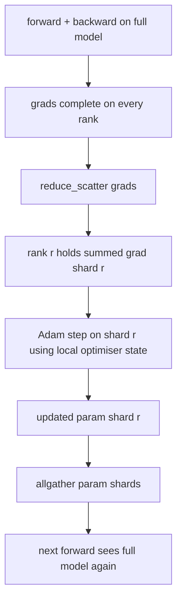

# ZeRO Optimizer State Sharding | ZeRO 优化器状态分片

> Adam stores two moment estimates per parameter, both in float32. A 7B-parameter model carries 56 GB of optimiser state. ZeRO stage 1 shards that across N ranks; each rank owns 1/N of the optimiser. After the local step the updated parameter shards broadcast back, every rank reconstructs the full model, and the next step begins. The win is a linear memory drop on the largest single allocation in the training stack.

> **【中文解读】** 本课实现 ZeRO stage 1：把优化器状态（Adam 一阶矩、二阶矩、fp32 主副本）按 rank 分片到 N 份，每张卡只持有 1/N。反传完成后不再 allreduce 整条梯度，而是 reduce_scatter——每个 rank 只收到自己那片梯度的求和结果；本 rank 用自己的优化器状态分片执行 Adam 步，再把更新后的参数分片 allgather 回去，所有 rank 重建完整模型进入下一步。收益是训练栈中最大的一块显存在每卡上线性下降，而每步通信量与 DDP 相同。

> **【拓展：显存墙→ZeRO 三级分片→FSDP】** 训练大模型的第一瓶颈往往不是算力而是显存：混合精度 + Adam 下每个参数约 16 字节（fp16 参数与梯度共 4 字节，fp32 主副本与两个矩共 12 字节），7B 模型单卡需 112 GB。ZeRO（DeepSpeed，2019）把"每卡全量复制"拆成三级：stage 1 分优化器状态、stage 2 再分梯度、stage 3 连参数也分——PyTorch FSDP 的 `FULL_SHARD` 本质就是 ZeRO-3。本课从零实现 stage 1，它是"几乎免费"的一级：带宽不涨、显存线性降。

> 🔗 **【前置】** 学本课前请先掌握：(1) Phase 19 · 76——reduce_scatter/allgather 等集合通信原语，本课的 `step()` 直接建立在其上；(2) Phase 19 · 77——vanilla DDP 的 allreduce 梯度同步，本课是它的显存优化版；(3) Adam 优化器的一阶矩/二阶矩概念。后续衔接：lesson 80 用本课的分片状态做检查点，lesson 81 把 DDP+ZeRO 组装成端到端训练。

**Type:** Build | **类型:** 动手构建
**Languages:** Python | **语言:** Python
**Prerequisites:** Phase 19 Track C lessons 42-49 | **前置知识:** Phase 19 Track C 课程 42-49
**Time:** ~90 min | **时间:** 约 90 分钟

## Learning Objectives | 学习目标

- Shard optimiser state (first moment, second moment, fp32 master copy) across N ranks so each rank owns 1/N.
  中文翻译：把优化器状态（一阶矩、二阶矩、fp32 主副本）分片到 N 个 rank，使每个 rank 只持有 1/N。
- Use reduce_scatter to deliver each rank only its shard's gradient sum, then allgather to broadcast the updated parameter shards back.
  中文翻译：用 reduce_scatter 让每个 rank 只收到自己分片的梯度求和，再用 allgather 把更新后的参数分片广播回去。
- Compute the memory savings table for stage 1, stage 2, stage 3 against vanilla DDP.
  中文翻译：对照 vanilla DDP 计算 stage 1、stage 2、stage 3 的显存节省表。
- Defend the choice of stage 1 vs stage 2 vs stage 3 on model size and bandwidth budget.
  中文翻译：基于模型规模和带宽预算论证该选 stage 1、stage 2 还是 stage 3。

## The Problem | 问题引入

> **【中文解读】** 本节算清"钱花在哪"。vanilla DDP 在每个 rank 上全量复制参数、梯度和优化器状态；7B 混合精度模型每 rank 要 14+14+28=56 GB，其中优化器状态是最大项，也是最容易分片的一项——它只在 optimizer step 时被触碰，前向和反传都用不到。ZeRO-1 的巧思在于用 reduce_scatter 替换 allreduce：带宽代价不变（allreduce 本来就等价于 reduce_scatter + allgather），优化器显存却除以 N。

Vanilla DDP replicates everything: parameters, gradients, and optimiser state are present in full on every rank. For a 7B-parameter model in fp16 that means 14 GB of parameters, 14 GB of gradients, and 28 GB of optimiser state per rank. The optimiser state is the largest term and the easiest to shard because it is only touched during the step, not during forward or backward.

> vanilla DDP 把一切全量复制：参数、梯度、优化器状态在每个 rank 上都完整存在。对 fp16 的 7B 参数模型，这意味着每 rank 14 GB 参数、14 GB 梯度、28 GB 优化器状态。优化器状态是最大的一项，也是最容易分片的一项，因为它只在 step 期间被触碰，前向和反传都用不到。

ZeRO stage 1 shards the optimiser state. Each rank holds 1/N of the Adam moments. After backward, instead of allreducing the full gradient and stepping locally, ZeRO reduce_scatters so each rank receives only its shard's summed gradient. The rank applies the optimiser step to its shard of the master parameters. The updated parameter shards then allgather back so every rank has the full model for the next forward. The optimiser memory drops by N. The wire traffic per step is the same as DDP: one reduce_scatter plus one allgather equals one allreduce by bandwidth. Memory wins, throughput holds.

> ZeRO stage 1 分片优化器状态。每个 rank 持有 1/N 的 Adam 矩。反传之后，ZeRO 不再 allreduce 完整梯度再本地步进，而是 reduce_scatter，让每个 rank 只收到自己分片的求和梯度。该 rank 对自己的主参数分片执行优化器步。更新后的参数分片再 allgather 回去，让每个 rank 为下一次前向持有完整模型。优化器显存降为 1/N。每步线上流量与 DDP 相同：一次 reduce_scatter 加一次 allgather 在带宽上等于一次 allreduce。显存赢了，吞吐不丢。

## The Concept | 核心概念



### Stages of ZeRO

> **【中文解读】** 这张表是本课的账本：DDP 什么都不分，每 rank 显存 = 参数 + 梯度 + 优化器全量；ZeRO-1 只分优化器状态；ZeRO-2 再分梯度（需要梯度分片累积逻辑，但带宽不变）；ZeRO-3 连参数也分（即 FSDP），代价是每层前向和反传都要 allgather。选型经验：优化器状态占显存大头，stage 1 是最便宜的胜利；参数显存也撑不住时才上 stage 2/3，用通信换显存。本课完整实现 stage 1。

| Stage | What is sharded | Memory per rank | Comm per step |
|-------|----------------|------------------|---------------|
| DDP | nothing | params + grads + optim | 1x allreduce |
| ZeRO-1 | optimiser state | params + grads + optim/N | 1x reduce_scatter + 1x allgather |
| ZeRO-2 | optim + grads | params + grads/N + optim/N | 1x reduce_scatter + 1x allgather |
| ZeRO-3 | optim + grads + params | params/N + grads/N + optim/N | 1x allgather per layer + 1x reduce_scatter per layer |

Stage 1 is the cheapest win because optimiser state dominates the budget. Stage 2 needs gradient-shard accumulation logic but the bandwidth is the same. Stage 3 (FSDP) pays per-layer comm for every forward and backward, gaining the parameter-shard memory drop. The lesson implements stage 1 in full.

> Stage 1 是最便宜的胜利，因为优化器状态主导显存预算。Stage 2 需要梯度分片累积逻辑，但带宽相同。Stage 3（FSDP）为每次前向和反传支付逐层通信，换取参数分片带来的显存下降。本课完整实现 stage 1。

### The memory math, real numbers

> **【中文解读】** 混合精度 + Adam 下每个参数的显存构成：fp16 参数 2 字节、fp16 梯度 2 字节（前向/反传需要全量），fp32 主副本、一阶矩、二阶矩各 4 字节（只有优化器用，可以分片）。vanilla 合计 16P 字节；ZeRO-1 变成 4P + 12P/N。N=8 时 16P→5.5P（降 65%），N=64 时降到 4.19P（降 74%）——收益随 N 递增但逐渐饱和，下限是 4P。

For a model with P parameters trained with Adam in mixed precision:

| Term | Vanilla | ZeRO-1 | Why |
|------|---------|--------|-----|
| fp16 params | 2P bytes | 2P bytes | needed for forward |
| fp16 grads | 2P bytes | 2P bytes | needed for backward |
| fp32 master copy | 4P bytes | 4P/N bytes | only the optim uses it |
| fp32 first moment | 4P bytes | 4P/N bytes | only the optim uses it |
| fp32 second moment | 4P bytes | 4P/N bytes | only the optim uses it |
| Total | 16P bytes | 4P + 12P/N bytes |   |

At N=8: vanilla 16P, ZeRO-1 5.5P, a 65% drop. At N=64: vanilla 16P, ZeRO-1 4.19P, a 74% drop.

> N=8 时：vanilla 16P，ZeRO-1 5.5P，下降 65%。N=64 时：vanilla 16P，ZeRO-1 4.19P，下降 74%。

### Why reduce_scatter beats allreduce-then-shard

> **【中文解读】** 为什么用 reduce_scatter 而不是"先 allreduce 再切片"：allreduce 让每个 rank 都拿到完整的求和梯度，但对 rank r 来说其中 (N-1)/N 的规约结果是白算的。reduce_scatter 精确投递每个 rank 自己拥有的那片；每 rank 字节数与 allreduce 相同（allreduce 本来就是 reduce_scatter + allgather），只是后一半被稍后的参数分片 allgather 顶替。净线上流量与 DDP 完全一致，显存却被切开了。

Allreduce gives every rank the full summed gradient. If you only need shard r, the (N-1)/N of the gradient that was reduced is wasted on rank r. Reduce_scatter delivers exactly the shard each rank owns; the per-rank bytes are the same as allreduce (since allreduce is reduce_scatter + allgather) but the second half is replaced by the parameter-shard allgather later. Net wire is identical to DDP, memory is divided.

> Allreduce 给每个 rank 完整的求和梯度。如果你只需要分片 r，那么其中 (N-1)/N 的规约结果在 rank r 上是被浪费的。reduce_scatter 精确投递每个 rank 拥有的分片；每 rank 字节数与 allreduce 相同（因为 allreduce 就是 reduce_scatter + allgather），只是后一半换成了稍后的参数分片 allgather。净线上流量与 DDP 完全相同，显存却被除开了。

```figure
cd-zero-shard
```

## Build It | 动手构建

> **【中文解读】** 代码四件套：`flatten_params`/`unflatten_into` 把整个模型的参数打包成一个连续 fp32 向量——扁平布局让"按 rank 分片"退化成一次简单的切片；`ZeroOptimizer` 持有本 rank 的主副本与 Adam 矩分片；`step()` 对扁平梯度做 reduce_scatter、对本 rank 分片执行 Adam、再 allgather 更新后的参数；demo 用 4 个 gloo 进程对 3 层 MLP 训练 20 步，打印逐步 loss 和与 vanilla DDP 对照的显存表。重点看两个不变量：各 rank 最终参数范数一致（同步正确），优化器分片字节数 = 总量的 1/N（分片正确）。

`code/main.py` implements:

- `flatten_params(module)` and `unflatten_into(module, flat)` that pack a model's parameters into one contiguous tensor and unpack back. The flat layout is what makes sharding by rank a simple slice.
- `ZeroOptimizer(model, world_size, rank, lr)` that owns the rank's shard of the master copy and Adam moments.
- `step()` that runs reduce_scatter on the flat gradient, applies Adam to the rank's shard, and allgathers the updated parameters back.
- A demo that trains a 3-layer MLP for 20 steps and prints the per-step memory budget alongside a vanilla DDP baseline.

Run it:

```bash
python3 code/main.py
```

Output: per-step loss and the memory table that shows ZeRO-1 holds 1/N of the optimiser state on each rank versus DDP's full copy.

> 输出：每步 loss，以及一张显存表——它显示 ZeRO-1 让每个 rank 只持有 1/N 的优化器状态，而 DDP 持有全量副本。

## Production patterns in the wild | 生产中的实战模式

> **【中文解读】** 三条实战经验：(1) 分片检查点是刚需——ZeRO 的优化器状态散落在各 rank，检查点必须记录归属关系，lesson 80 专门解决这件事；(2) ZeRO 天生是混合精度技术，被分片的就是 fp32 主副本，不用混合精度等于白交显存税却没有 fp16 前向的收益；(3) stage 1 近乎免费——带宽与 DDP 相同、显存随 N 线性降，唯一成本是优化器分片的簿记，生产栈默认 stage 1，参数显存也成问题时才上 stage 2/3。

Three patterns harden ZeRO enough to ship.

> 三条模式让 ZeRO 足以投入生产。

**Sharded checkpointing matters.** ZeRO-1's optimiser state is split across ranks; the checkpoint has to record which rank owns what. Lesson 80 builds the sharded checkpoint manifest that resumes a ZeRO run on the same world size. Without it the saved state is unreadable at restart.

> **分片检查点很重要。** ZeRO-1 的优化器状态分散在各 rank；检查点必须记录哪个 rank 拥有什么。Lesson 80 构建的分片检查点清单能在相同 world size 下恢复 ZeRO 运行。没有它，保存的状态在重启时无法读取。

**Mixed precision is the point.** ZeRO is a mixed-precision technique; the fp32 master copy is what is sharded. Running ZeRO without mixed precision pays the memory tax on the fp32 master without the corresponding fp16 forward win. Production runs always pair ZeRO with autocast or bf16 weights.

> **混合精度才是意义所在。** ZeRO 是混合精度技术；被分片的就是 fp32 主副本。不用混合精度跑 ZeRO，等于为 fp32 主副本交了显存税却拿不到 fp16 前向的收益。生产运行总是把 ZeRO 与 autocast 或 bf16 权重配对使用。

**Stage 1 is a near-free win.** The comm is identical to DDP by bandwidth. The memory savings are linear in N. The only cost is the bookkeeping for the optimiser shard. Production stacks default to stage 1 unless the parameter shard memory is also a problem; then stage 2 or 3 trades comm for memory.

> **Stage 1 是近乎免费的胜利。** 带宽上通信与 DDP 完全相同。显存节省随 N 线性增长。唯一成本是优化器分片的簿记。生产栈默认 stage 1，除非参数分片显存也成问题；那时 stage 2 或 3 用通信换显存。

## Use It | 用框架实现

> **【中文解读】** 手工实现与生产框架的对应关系：DeepSpeed ZeRO 是参考实现；PyTorch FSDP 是原生等价物（`SHARD_GRAD_OP` 对应 ZeRO-2，`FULL_SHARD` 对应 ZeRO-3）；HuggingFace Accelerate 用统一配置封装前两者。学完本课再读它们的配置项，每个字段都能对上自己写过的代码。

Production patterns:

- **DeepSpeed ZeRO.** The reference implementation. `deepspeed_config.json` selects stage 1/2/3 and partition sizes.
  中文翻译：**DeepSpeed ZeRO**——参考实现，`deepspeed_config.json` 选择 stage 1/2/3 和分区大小。
- **PyTorch FSDP.** The PyTorch-native equivalent. `ShardingStrategy.SHARD_GRAD_OP` is ZeRO-2; `FULL_SHARD` is ZeRO-3.
  中文翻译：**PyTorch FSDP**——PyTorch 原生等价物，`ShardingStrategy.SHARD_GRAD_OP` 就是 ZeRO-2，`FULL_SHARD` 就是 ZeRO-3。
- **HuggingFace Accelerate.** Wraps both DeepSpeed and FSDP under a uniform config.
  中文翻译：**HuggingFace Accelerate**——用统一配置同时封装 DeepSpeed 和 FSDP。

## Ship It | 产出物

Lesson 79 (pipeline parallel) is the orthogonal sharding axis: instead of sharding optimiser state across the same model, pipeline shards layers across ranks. Lesson 81 composes DDP + ZeRO on the end-to-end demo.

> Lesson 79（流水线并行）是正交的分片轴：它不是把同一个模型的优化器状态分片，而是把层分片到各 rank。Lesson 81 在端到端 demo 上组合 DDP + ZeRO。

## Exercises | 练习题

1. Extend to ZeRO-2 by sharding gradients: each rank only stores the gradient for its shard, achieved by zeroing out the non-shard portion after backward.
   中文翻译：扩展到 ZeRO-2——分片梯度：每个 rank 只存自己分片的梯度，做法是反传后把非本分片部分清零。
2. Add a memory profiler that prints actual fp32 byte usage on rank 0 versus the formula prediction.
   中文翻译：加一个显存剖析器，打印 rank 0 上实际 fp32 字节数与公式预测的对照。
3. Measure the per-step wall-clock time of vanilla DDP versus ZeRO-1 and decompose into forward, backward, comm.
   中文翻译：测量 vanilla DDP 与 ZeRO-1 的每步墙钟时间，并分解为前向、反传、通信三部分。
4. Implement gradient clipping under ZeRO-1: the L2 norm must be computed across all shards via allreduce of the local norm squared.
   中文翻译：在 ZeRO-1 下实现梯度裁剪：L2 范数必须通过对本地范数平方做 allreduce、跨全部分片计算。
5. Implement a "naive ZeRO" with allreduce instead of reduce_scatter, measure the wire-time difference. Defend the reduce_scatter choice with numbers.
   中文翻译：实现一个用 allreduce 代替 reduce_scatter 的"朴素 ZeRO"，测量线上时间差异，用数字论证 reduce_scatter 的选择。

## Key Terms | 术语速查表

| Term | What people say | What it actually means |
|------|----------------|------------------------|
| ZeRO-1 | "Shard the optimiser" | Each rank holds 1/N of fp32 master + Adam moments |
| ZeRO-2 | "Shard grads too" | Each rank also drops the non-shard gradients after reduce_scatter |
| ZeRO-3 | "Shard params" | Each rank holds 1/N of fp16 params; allgather per layer in forward |
| Master copy | "fp32 weights" | The high-precision parameter copy the optimiser updates |
| Reduce_scatter | "Split the sum" | Deliver each rank only its shard's summed gradient |

## Further Reading | 延伸阅读

- [Rajbhandari et al, ZeRO: Memory Optimizations Toward Training Trillion Parameter Models](https://arxiv.org/abs/1910.02054)
  中文翻译：ZeRO 论文原典——三级分片的划分方法与通信量分析
- [DeepSpeed ZeRO documentation](https://www.deepspeed.ai/tutorials/zero/)
  中文翻译：DeepSpeed ZeRO 官方文档——stage 配置与生产用法
- [PyTorch FSDP documentation](https://pytorch.org/docs/stable/fsdp.html)
  中文翻译：PyTorch FSDP 官方文档——ZeRO-3 的原生等价实现
- Phase 19 Lesson 76 - the reduce_scatter and allgather this lesson stands on
  中文翻译：Phase 19 Lesson 76——本课立足的 reduce_scatter 与 allgather 原语
- Phase 19 Lesson 80 - sharded checkpointing the ZeRO state must use
  中文翻译：Phase 19 Lesson 80——ZeRO 状态必须使用的分片检查点
