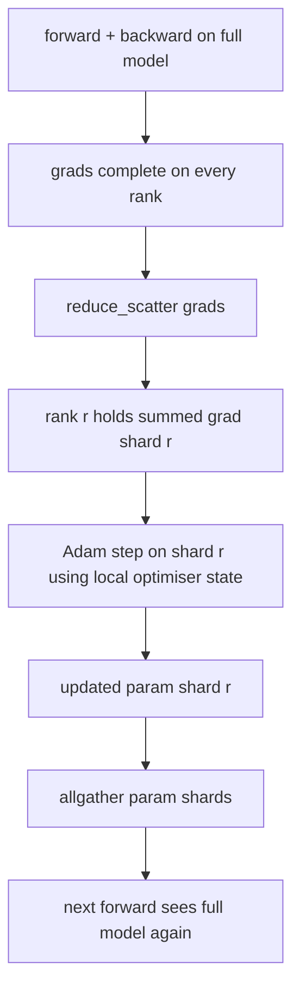

# ZeRO 优化器状态分片

> Adam 为每个参数保存两个矩估计，都是 float32。一个 7B 参数模型要背着 56 GB 优化器状态。ZeRO stage 1 把它分片到 N 个 rank；每个 rank 只拥有 1/N 的优化器。本地步进完成后，更新过的参数分片广播回去，每个 rank 重建完整模型，下一步开始。收益是训练栈中最大单块显存在每卡上线性下降。

> **【中文解读】** 本课实现 ZeRO stage 1：把优化器状态（Adam 一阶矩、二阶矩、fp32 主副本）按 rank 分片，每卡只持有 1/N。关键机制是用 reduce_scatter 替代 allreduce——每个 rank 只收到自己那片梯度的求和结果，本地完成 Adam 步后把参数分片 allgather 回去。学完本课你应能算清三级 ZeRO 的显存账、写出一个可运行的 stage 1 优化器、并论证生产中该选哪一级。

> **【拓展：显存墙→ZeRO 三级分片→FSDP】** 训练大模型的第一瓶颈往往不是算力而是显存：混合精度 + Adam 下每个参数约 16 字节（fp16 参数与梯度共 4 字节，fp32 主副本与两个矩共 12 字节），7B 模型单卡需 112 GB。ZeRO（DeepSpeed，2019）把"每卡全量复制"拆成三级：stage 1 分优化器状态、stage 2 再分梯度、stage 3 连参数也分——PyTorch FSDP 的 `FULL_SHARD` 本质就是 ZeRO-3。本课从零实现 stage 1，它是"几乎免费"的一级：带宽不涨、显存线性降。

> 🔗 **【前置】** 学本课前请先掌握：(1) Phase 19 · 76——reduce_scatter/allgather 等集合通信原语，本课的 `step()` 直接建立在其上；(2) Phase 19 · 77——vanilla DDP 的 allreduce 梯度同步，本课是它的显存优化版；(3) Adam 优化器的一阶矩/二阶矩概念。后续衔接：lesson 80 用本课的分片状态做检查点，lesson 81 把 DDP+ZeRO 组装成端到端训练。

**类型：** 动手构建
**语言：** Python
**前置条件：** Phase 19 Track C 课程 42-49
**预计用时：** 约 90 分钟

## 学习目标

- 把优化器状态（一阶矩、二阶矩、fp32 主副本）分片到 N 个 rank，使每个 rank 只持有 1/N。
- 用 reduce_scatter 让每个 rank 只收到自己分片的梯度求和，再用 allgather 把更新后的参数分片广播回去。
- 对照 vanilla DDP 计算 stage 1、stage 2、stage 3 的显存节省表。
- 基于模型规模和带宽预算论证该选 stage 1、stage 2 还是 stage 3。

## 问题引入

> **【中文解读】** 本节算清"钱花在哪"：vanilla DDP 全量复制三样东西，优化器状态是最大项、也最容易分片——只有 optimizer step 碰它。ZeRO-1 用 reduce_scatter 换 allreduce，带宽不变，优化器显存除以 N。

vanilla DDP 把一切全量复制：参数、梯度、优化器状态在每个 rank 上都完整存在。对 fp16 的 7B 参数模型，这意味着每 rank 14 GB 参数、14 GB 梯度、28 GB 优化器状态。优化器状态是最大的一项，也是最容易分片的一项，因为它只在 step 期间被触碰，前向和反传都用不到。

ZeRO stage 1 分片优化器状态。每个 rank 持有 1/N 的 Adam 矩。反传之后，ZeRO 不再 allreduce 完整梯度再本地步进，而是 reduce_scatter，让每个 rank 只收到自己分片的求和梯度。该 rank 对自己的主参数分片执行优化器步。更新后的参数分片再 allgather 回去，让每个 rank 为下一次前向持有完整模型。优化器显存降为 1/N。每步线上流量与 DDP 相同：一次 reduce_scatter 加一次 allgather 在带宽上等于一次 allreduce。显存赢了，吞吐不丢。

## 核心概念



### ZeRO 的三级

> **【中文解读】** 这张表是本课的账本：从 DDP 什么都不分，到 ZeRO-3 全分。每升一级，显存再降一块，通信模式变一次。stage 1 与 stage 2 的每步通信完全相同；stage 3 的通信从"每步两次"变成"每层两次"。

| 阶段 | 分片什么 | 每 rank 显存 | 每步通信 |
|-------|----------------|------------------|---------------|
| DDP | 什么都不分 | 参数 + 梯度 + 优化器 | 1 次 allreduce |
| ZeRO-1 | 优化器状态 | 参数 + 梯度 + 优化器/N | 1 次 reduce_scatter + 1 次 allgather |
| ZeRO-2 | 优化器 + 梯度 | 参数 + 梯度/N + 优化器/N | 1 次 reduce_scatter + 1 次 allgather |
| ZeRO-3 | 优化器 + 梯度 + 参数 | 参数/N + 梯度/N + 优化器/N | 每层 1 次 allgather + 每层 1 次 reduce_scatter |

Stage 1 是最便宜的胜利，因为优化器状态主导显存预算。Stage 2 需要梯度分片累积逻辑，但带宽相同。Stage 3（FSDP）为每次前向和反传支付逐层通信，换取参数分片带来的显存下降。本课完整实现 stage 1。

### 显存数学，真实数字

> **【中文解读】** 记住这条公式：vanilla 16P 字节，ZeRO-1 是 4P + 12P/N。可分片的三项（主副本 + 两个矩）合计 12 字节/参数，不可分片的两项（fp16 参数与梯度）合计 4 字节/参数。N 越大越省，但下限是 4P。

对混合精度 + Adam 训练的 P 参数模型：

| 项 | Vanilla | ZeRO-1 | 原因 |
|------|---------|--------|-----|
| fp16 参数 | 2P 字节 | 2P 字节 | 前向需要 |
| fp16 梯度 | 2P 字节 | 2P 字节 | 反传需要 |
| fp32 主副本 | 4P 字节 | 4P/N 字节 | 只有优化器用 |
| fp32 一阶矩 | 4P 字节 | 4P/N 字节 | 只有优化器用 |
| fp32 二阶矩 | 4P 字节 | 4P/N 字节 | 只有优化器用 |
| 合计 | 16P 字节 | 4P + 12P/N 字节 |   |

N=8 时：vanilla 16P，ZeRO-1 5.5P，下降 65%。N=64 时：vanilla 16P，ZeRO-1 4.19P，下降 74%。

### 为什么 reduce_scatter 胜过 allreduce-再切片

> **【中文解读】** allreduce 给每个 rank 完整求和梯度，但 rank r 只需要自己那片——其余 (N-1)/N 的规约是白算的。reduce_scatter 精确投递；allreduce 本来就等价于 reduce_scatter + allgather，所以每 rank 字节数不变，只是后一半换成了稍后的参数分片 allgather。净流量与 DDP 相同，显存被除开。

Allreduce 给每个 rank 完整的求和梯度。如果你只需要分片 r，那么其中 (N-1)/N 的规约结果在 rank r 上是被浪费的。reduce_scatter 精确投递每个 rank 拥有的分片；每 rank 字节数与 allreduce 相同（因为 allreduce 就是 reduce_scatter + allgather），只是后一半换成了稍后的参数分片 allgather。净线上流量与 DDP 完全相同，显存却被除开了。

```figure
cd-zero-shard
```

## 动手构建

> **【中文解读】** 代码的关键设计是"扁平布局"：把全部参数拼成一个连续 fp32 向量后，按 rank 分片就是一次切片。demo 用 4 个 gloo 进程跑 20 步，验证两件事：各 rank 最终参数范数一致（同步正确）、优化器分片字节数 = 总量的 1/N（分片正确）。

`code/main.py` 实现：

- `flatten_params(module)` 和 `unflatten_into(module, flat)`：把模型参数打包进一个连续张量，再解包回去。扁平布局让按 rank 分片退化成一次简单的切片。
- `ZeroOptimizer(model, world_size, rank, lr)`：持有本 rank 的主副本分片和 Adam 矩。
- `step()`：对扁平梯度跑 reduce_scatter，对本 rank 分片执行 Adam，再 allgather 更新后的参数。
- 一个 demo：训练 3 层 MLP 20 步，打印逐步显存预算，并对照 vanilla DDP 基线。

运行：

```bash
python3 code/main.py
```

输出：每步 loss，以及一张显存表——它显示 ZeRO-1 让每个 rank 只持有 1/N 的优化器状态，而 DDP 持有全量副本。

## 生产中的实战模式

> **【中文解读】** 分片检查点是刚需（lesson 80 解决）；ZeRO 必须配混合精度（分片的就是 fp32 主副本）；stage 1 近乎免费，生产默认从它开始。

三条模式让 ZeRO 足以投入生产。

**分片检查点很重要。** ZeRO-1 的优化器状态分散在各 rank；检查点必须记录哪个 rank 拥有什么。Lesson 80 构建的分片检查点清单能在相同 world size 下恢复 ZeRO 运行。没有它，保存的状态在重启时无法读取。

**混合精度才是意义所在。** ZeRO 是混合精度技术；被分片的就是 fp32 主副本。不用混合精度跑 ZeRO，等于为 fp32 主副本交了显存税却拿不到 fp16 前向的收益。生产运行总是把 ZeRO 与 autocast 或 bf16 权重配对使用。

**Stage 1 是近乎免费的胜利。** 带宽上通信与 DDP 完全相同。显存节省随 N 线性增长。唯一成本是优化器分片的簿记。生产栈默认 stage 1，除非参数分片显存也成问题；那时 stage 2 或 3 用通信换显存。

## 用框架实现

> **【中文解读】** DeepSpeed ZeRO 是参考实现；PyTorch FSDP 是原生等价物（`SHARD_GRAD_OP` 即 ZeRO-2，`FULL_SHARD` 即 ZeRO-3）；HuggingFace Accelerate 用统一配置封装前两者。手工实现过 stage 1 之后，这些框架的配置项不再是黑盒。

生产模式：

- **DeepSpeed ZeRO**——参考实现，`deepspeed_config.json` 选择 stage 1/2/3 和分区大小。
- **PyTorch FSDP**——PyTorch 原生等价物，`ShardingStrategy.SHARD_GRAD_OP` 就是 ZeRO-2，`FULL_SHARD` 就是 ZeRO-3。
- **HuggingFace Accelerate**——用统一配置同时封装 DeepSpeed 和 FSDP。

## 产出物

Lesson 79（流水线并行）是正交的分片轴：它不是把同一个模型的优化器状态分片，而是把层分片到各 rank。Lesson 81 在端到端 demo 上组合 DDP + ZeRO。

## 练习题

1. 扩展到 ZeRO-2——分片梯度：每个 rank 只存自己分片的梯度，做法是反传后把非本分片部分清零。
2. 加一个显存剖析器，打印 rank 0 上实际 fp32 字节数与公式预测的对照。
3. 测量 vanilla DDP 与 ZeRO-1 的每步墙钟时间，并分解为前向、反传、通信三部分。
4. 在 ZeRO-1 下实现梯度裁剪：L2 范数必须通过对本地范数平方做 allreduce、跨全部分片计算。
5. 实现一个用 allreduce 代替 reduce_scatter 的"朴素 ZeRO"，测量线上时间差异，用数字论证 reduce_scatter 的选择。

## 术语速查表

| 英文 | 人们常说的 | 实际含义 |
|------|----------------|------------------------|
| ZeRO-1 | "分片优化器" | 每个 rank 持有 1/N 的 fp32 主副本 + Adam 矩 |
| ZeRO-2 | "梯度也分片" | reduce_scatter 后每个 rank 还会丢弃非本分片的梯度 |
| ZeRO-3 | "参数也分片" | 每个 rank 持有 1/N 的 fp16 参数；前向中逐层 allgather |
| 主副本（master copy） | "fp32 权重" | 优化器更新的高精度参数副本 |
| reduce_scatter | "把和切开" | 只给每个 rank 投递它自己分片的求和梯度 |

## 延伸阅读

- [Rajbhandari et al, ZeRO: Memory Optimizations Toward Training Trillion Parameter Models](https://arxiv.org/abs/1910.02054) — ZeRO 论文原典：三级分片的划分方法与通信量分析
- [DeepSpeed ZeRO documentation](https://www.deepspeed.ai/tutorials/zero/) — DeepSpeed ZeRO 官方文档：stage 配置与生产用法
- [PyTorch FSDP documentation](https://pytorch.org/docs/stable/fsdp.html) — PyTorch FSDP 官方文档：ZeRO-3 的原生等价实现
- Phase 19 Lesson 76 — 本课立足的 reduce_scatter 与 allgather 原语
- Phase 19 Lesson 80 — ZeRO 状态必须使用的分片检查点
