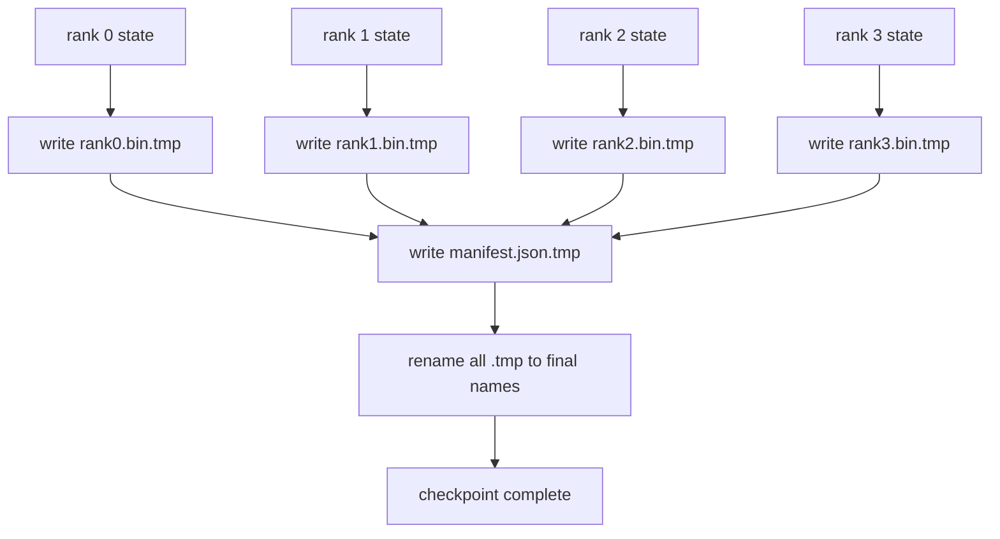

# Sharded Checkpoint and Atomic Resume | 分片检查点与原子恢复

> A 70B-parameter training job is paused by a node failure every few hours. The checkpoint format decides whether you lose 30 minutes or 30 hours. A sharded checkpoint writes every rank's shard in parallel and records ownership in a manifest. Resume loads each rank's shard from its own file, reconstructs the state on the same world size, and the optimiser steps as if nothing happened. Atomic write keeps a half-finished checkpoint from poisoning the next resume.

> **【中文解读】** 本课解决分布式训练的"生命线"问题——检查点。70B 级训练任务每隔几小时就会被一次节点故障打断，检查点格式决定你损失 30 分钟还是 30 小时。分片检查点让每个 rank 并行写自己的分片文件，用一份清单（manifest）记录归属；恢复时各 rank 从自己的文件装载、在相同 world size 下重建状态，优化器若无其事地继续步进。原子写（先写 .tmp 再 rename）保证写到一半的检查点永远不会毒害下一次恢复。

> **【拓展：单文件时代的痛→分片+清单成为业界标准】** 单进程时代的检查点就是一个大文件；到了多卡训练，"把所有状态聚到 rank 0 再写一个文件"把 TB 级数据压进一张网卡，写一次可能比训练一小时还久。DeepSpeed、PyTorch `torch.distributed.checkpoint`、NeMo 全部转向"每 rank 一个文件 + JSON 清单 + sha256 校验"的形态，PyTorch 官方甚至为跨 world size 恢复引入了 Planner 机制。本课从零实现这一整套契约，并把三种失败模式（改 world size、分片数不符、写一半崩溃）变成可测试的断言。

> 🔗 **【前置】** 学本课前请先掌握：(1) lesson 78——ZeRO 优化器状态分片，本课保存的正是这种"每个 rank 持有 1/N"的状态；(2) POSIX 文件系统语义（rename 的原子性、fsync 的作用）；(3) sha256 摘要的基本用法。后续衔接：lesson 81 的端到端 demo 在第 10 步保存分片检查点并验证字节级相等的恢复。

**Type:** Build | **类型:** 动手构建
**Languages:** Python | **语言:** Python
**Prerequisites:** Phase 19 Track C lessons 42-49 | **前置知识:** Phase 19 Track C 课程 42-49
**Time:** ~90 min | **时间:** 约 90 分钟

## Learning Objectives | 学习目标

- Save a multi-rank checkpoint as a per-rank shard file plus a manifest that records which rank owns what.
  中文翻译：把多 rank 检查点保存为每 rank 一个分片文件，外加一份记录哪个 rank 拥有什么的清单。
- Use the atomic write pattern (write to a temp path then rename) so a crash mid-write never produces a half-finished checkpoint.
  中文翻译：使用原子写模式（先写临时路径再 rename），使写到一半的崩溃绝不产生半个检查点。
- Resume from the manifest, verifying byte-equal state for both fp16 parameters and the ZeRO optimiser state on every rank.
  中文翻译：从清单恢复，逐 rank 验证 fp16 参数和 ZeRO 优化器状态都字节级相等。
- Defend the manifest schema against the three failure modes: world-size change, shard count mismatch, and partial write.
  中文翻译：让清单 schema 能防住三种失败模式：world size 变化、分片数不匹配、部分写入。

## The Problem | 问题引入

> **【中文解读】** 本节算"汇聚写"的账：vanilla 检查点要把所有参数和优化器状态聚到 rank 0、写进单个文件——70B 模型就是 1.1 TB 数据挤一张网卡，其余 rank 全在空等，IO 带宽等于最慢那张卡的网络链路。真实集群上这一步可能比之前一小时的训练还久，等于一天存不下一个检查点。分片检查点把方向反过来：每个 rank 并行写自己的文件，聚合带宽随集群扩展；1 TB 检查点从单 rank 4 小时变成 64 rank 4 分钟。清单还附带一份"不兼容恢复"的契约：world size 变了可检测、写了一半可检测，装载路径可以响亮失败而不是悄悄用脏数据。

A vanilla checkpoint reads all parameters and optimiser state into rank 0, gathers, and writes a single file. For a 70B model that is 1.1 TB of state through one rank's network port. The write blocks every other rank because they idle waiting for the gather. The IO bandwidth is the slowest single GPU's network link, not the aggregate. On a real cluster the gather-then-write step can take longer than the previous training hour, which means the job ships less than one checkpoint per training day.

> vanilla 检查点把所有参数和优化器状态读进 rank 0，gather 之后写单个文件。对 70B 模型，这是 1.1 TB 的状态挤过一个 rank 的网络端口。其他每个 rank 都被这次写阻塞，因为它们空等 gather 完成。IO 带宽是最慢的那块 GPU 的网络链路，而不是聚合带宽。在真实集群上，gather-再-写这一步可能比之前一小时的训练还久，这意味着这个任务一个训练日存不下一个检查点。

Sharded checkpoints flip the pattern: every rank writes its own shard to its own file in parallel. The manifest records which rank owned which shard so resume can put each shard back where it came from. The aggregate write bandwidth scales with the cluster. A 1 TB checkpoint that took 4 hours through one rank takes 4 minutes through 64 ranks. Plus the manifest gives you a contract for incompatible resumes: world-size change is detectable, partial writes are detectable, and the load path can fail loudly rather than silently using stale data.

> 分片检查点把这个模式反过来：每个 rank 并行把自己的分片写进自己的文件。清单记录哪个 rank 拥有哪个分片，恢复时能把每个分片放回原处。聚合写带宽随集群扩展。单 rank 要 4 小时的 1 TB 检查点，64 个 rank 只要 4 分钟。另外清单给不兼容的恢复提供了一份契约：world size 变化可检测、部分写入可检测，装载路径可以响亮地失败，而不是悄悄用脏数据。

## The Concept | 核心概念



### Manifest schema

> **【中文解读】** 清单是检查点的"目录页"。三个字段是承重墙：`world_size` 让不同规模的重启响亮失败而不是悄悄损坏；每个分片的 `sha256` 抓住部分写入或损坏；每分片的 `param_shard_offset` 和 `param_shard_numel` 让装载器能把扁平参数张量按正确位置拼回去。加上 `step`、`wall_clock_seconds`、`schema_version`，一份 JSON 就成了恢复契约的全部真相来源。

```json
{
  "world_size": 4,
  "step": 1234,
  "wall_clock_seconds": 4521,
  "shards": [
    {"rank": 0, "path": "rank0.bin", "sha256": "...", "param_shard_offset": 0, "param_shard_numel": 65536},
    {"rank": 1, "path": "rank1.bin", "sha256": "...", "param_shard_offset": 65536, "param_shard_numel": 65536}
  ],
  "schema_version": 1
}
```

Three fields are load-bearing. `world_size` makes a resume on a different size loudly fail rather than silently corrupt. `sha256` per shard catches partial or corrupted writes. `param_shard_offset` and `param_shard_numel` per shard let the loader reconstruct the flat parameter tensor at the correct position.

> 三个字段是承重的。`world_size` 让不同规模上的恢复响亮失败而不是悄悄损坏。每分片的 `sha256` 抓住部分写入或损坏的写入。每分片的 `param_shard_offset` 和 `param_shard_numel` 让装载器在正确位置重建扁平参数张量。

### Atomic write

> **【中文解读】** 原子写的标准动作：每个分片写到 `<name>.tmp`，清单写到 `manifest.json.tmp`，逐个 fsync，然后 rename。同一文件系统内的 POSIX rename 是原子的——要么新文件完整在场，要么旧文件还是旧的。最终 rename 之前崩溃，上一个检查点仍是"现役"版本；没有原子写，崩溃可能留下半个分片加一份指向它的完好清单，恢复时优化器状态就被污染了。

The standard pattern: write every shard to `<name>.tmp`, write the manifest to `manifest.json.tmp`, fsync each, then rename. POSIX rename within the same filesystem is atomic; either the new file is fully present or the old one is. A crash before the final rename leaves the previous checkpoint as the live one. Without atomic write a crash can leave a partial shard with a present manifest that points at it, and the load corrupts the optimiser state on resume.

> 标准模式：把每个分片写到 `<name>.tmp`，把清单写到 `manifest.json.tmp`，逐个 fsync，然后 rename。同一文件系统内的 POSIX rename 是原子的；要么新文件完整在场，要么旧文件还是旧的。最终 rename 之前崩溃，上一个检查点仍是现役版本。没有原子写，崩溃可能留下半个分片外加一份指向它的在场清单，恢复时装载就会损坏优化器状态。

### Three failure modes the schema must defend against

> **【中文解读】** 把失败模式写成表格是为了变成测试用例：world size 变了（N=8 的恢复去读 N=4 的清单）→ 清单里的 world_size 不匹配、响亮失败；分片数不符（rank*.bin 文件比清单少）→ 枚举分片、逐个验证存在；部分写入（分片文件写到一半截断）→ 装载时 sha256 校验。每种防御都在坏装载的早期拒绝它——替代方案是 100 步之后 loss 变 NaN 时才暴露的静默损坏。

| Failure | Symptom | Defence |
|---------|---------|---------|
| World-size change | resume on N=8 with manifest from N=4 | world_size mismatch in manifest, fail loudly |
| Shard count mismatch | resume sees fewer rank*.bin files than shards in manifest | enumerate shards, verify every one exists |
| Partial write | shard file truncated mid-flush | sha256 verification on load |

Each defence rejects the bad load early; the alternative is silent corruption that surfaces 100 steps later when loss goes to NaN.

> 每种防御都在早期拒绝坏的装载；替代方案是静默损坏，在 100 步之后 loss 变 NaN 时才浮出水面。

### Why per-rank files, not one big file

Concurrent write to one file via `O_APPEND` works on POSIX for byte-aligned writes, but in practice the offsets within one shard span MB-sized regions and the locking dominates. Per-rank files have no contention and benefit from striping when the underlying filesystem is parallel (Lustre, GPFS). Production stacks (DeepSpeed, FSDP, NeMo) all use per-rank files for that reason.

> 通过 `O_APPEND` 并发写单个文件在 POSIX 上对字节对齐的写是可行的，但实践中单个分片内的偏移跨越 MB 级区域，锁开销占主导。每 rank 一个文件没有争用，并且在底层文件系统是并行文件系统（Lustre、GPFS）时还能吃到条带化的好处。生产栈（DeepSpeed、FSDP、NeMo）都因为这个原因使用每 rank 文件。

```figure
ci-sharded-checkpoint
```

## Build It | 动手构建

> **【中文解读】** 代码是一条完整的"保存-恢复-防错"链：`ShardManifest` dataclass 持有 schema 并支持 JSON 序列化；`save_sharded` 用临时路径 + rename 的原子模式逐 rank 写二进制状态、最后写清单；`load_sharded` 读清单、逐分片验 sha256、返回每 rank 的状态字典。demo 走三幕：字节级相等的往返验证、错误的 world size 被拒、篡改分片被 sha256 抓住——三种失败模式全部变成可运行断言，外加一个保留最近 5 份的轮转演示。

`code/main.py` implements:

- `ShardManifest` dataclass with the schema above plus `to_json`/`from_json`.
- `save_sharded(state_dict_per_rank, dir, step)` that writes every rank's binary state to its own file using the atomic temp-then-rename pattern, then writes the manifest.
- `load_sharded(dir, expected_world_size)` that reads the manifest, verifies each shard's sha256, and returns per-rank state dicts.
- A round-trip test: build per-rank state, save, load, assert byte-equal.

Run it:

```bash
python3 code/main.py
```

Output: 4 shard files plus manifest written, then reloaded with byte-equal verification.

> 输出：写入 4 个分片文件加清单，然后重新装载并做字节级相等的验证。

## Production patterns in the wild | 生产中的实战模式

> **【中文解读】** 三条生产经验：(1) 异步写——检查点写线程化让训练继续，屏障挪到"下一个检查点开始前必须上一个已完成"，DeepSpeed 的 `async_io` 就是这么做的；(2) 两级存储——先写本地 NVMe（快），再异步上传 S3/GCS（持久），清单带本地路径、上传清单带远端路径；(3) 轮转——保留最近 K 份（通常 3-5），不轮转磁盘会在运行中写满、下一次保存直接失败。本课保持同步写，是为了让每一步都看得见。

Three patterns harden the checkpoint enough to ship.

> 三条模式让检查点足以投入生产。

**Async write.** Production stacks issue the checkpoint write on a separate thread or process so training continues. The barrier is at next checkpoint: do not start the next save until the previous one is complete. DeepSpeed's `async_io` flag does exactly this. The lesson keeps the write synchronous so the steps are visible.

> **异步写。** 生产栈把检查点写放到单独的线程或进程上，训练得以继续。屏障在下一个检查点：上一个没完成就不开始下一次保存。DeepSpeed 的 `async_io` 标志做的正是这件事。本课保持同步写，好让每一步看得见。

**Local fast disk first, then async upload.** Write to local NVMe (fast) then async-upload to S3 or GCS. The two-tier pattern keeps the in-cluster checkpoint fast for resume while shipping a durable copy off-cluster for archive. The manifest carries the local path; an upload manifest carries the remote path.

> **先写本地快速盘，再异步上传。** 先写到本地 NVMe（快）再异步上传到 S3 或 GCS。两级模式让集群内检查点对恢复保持快速，同时往集群外发一份持久副本做归档。清单携带本地路径；上传清单携带远端路径。

**Rotation matters.** Production runs keep the last K checkpoints (typically 3-5) and rotate the oldest. Without rotation the disk fills mid-run and the next checkpoint fails. With rotation the next save deletes the oldest first, freeing the budget.

> **轮转很重要。** 生产运行保留最近 K 份检查点（通常 3-5）并轮转掉最旧的。不轮转，磁盘会在运行中途写满，下一次检查点直接失败。有轮转，下一次保存先删最旧的，腾出预算。

## Use It | 用框架实现

> **【中文解读】** 三个生产框架与本课实现的对应：DeepSpeed 的 `save_checkpoint(tag=step)` 写每 rank 文件加一个指向活跃 tag 的 `latest` 文件；PyTorch 的 `torch.distributed.checkpoint` 用 `Planner` 决定每 rank 布局来保存分片状态；NeMo 用统一的 `save_to_checkpoint` API 封装前两者并附加元数据。

Production patterns:

- **DeepSpeed checkpointing.** `deepspeed.save_checkpoint(tag=step)` writes per-rank files and a `latest` file pointing at the active tag.
  中文翻译：**DeepSpeed 检查点**——`deepspeed.save_checkpoint(tag=step)` 写每 rank 文件，外加一个指向活跃 tag 的 `latest` 文件。
- **PyTorch FSDP checkpointing.** `torch.distributed.checkpoint` saves sharded state with a `Planner` that decides per-rank layout.
  中文翻译：**PyTorch FSDP 检查点**——`torch.distributed.checkpoint` 用决定每 rank 布局的 `Planner` 保存分片状态。
- **NeMo.** Wraps DeepSpeed and FSDP with a uniform `save_to_checkpoint` API that adds metadata.
  中文翻译：**NeMo**——用统一的 `save_to_checkpoint` API 封装 DeepSpeed 和 FSDP，并附加元数据。

## Ship It | 产出物

Lesson 81 saves a sharded checkpoint of the end-to-end DDP+ZeRO run and reloads it on the same world size to prove the resume contract holds.

> Lesson 81 为端到端 DDP+ZeRO 运行保存分片检查点，并在相同 world size 上重新装载，证明恢复契约成立。

## Exercises | 练习题

1. Add async write: kick off the save in a thread and let training continue. Block the next save until the previous one completes.
   中文翻译：加异步写：把保存丢进线程让训练继续，下一次保存前阻塞直到上一次完成。
2. Add a `last_5_steps` rotation: keep the 5 most recent checkpoints, delete the oldest before saving a new one.
   中文翻译：加一个 `last_5_steps` 轮转：保留最近 5 份检查点，保存新的之前删掉最旧的。
3. Add a CRC-only fast verification path for the inner-loop reload (rotation rolls a checkpoint into being the new active one without full sha256).
   中文翻译：为内循环重载加一条仅 CRC 的快速校验路径（轮转让一份检查点成为新现役时无需完整 sha256）。
4. Add a cross-world-size load: shard rebalance from N=4 to N=8 by reading the manifest, concatenating, and re-sharding.
   中文翻译：加跨 world size 装载：读清单、拼接、重新分片，实现 N=4 到 N=8 的分片再均衡。
5. Add an upload to a fake S3 (a second directory) and write the upload manifest. Defend the two-tier storage policy.
   中文翻译：加上传到假 S3（第二个目录）并写上传清单，论证两级存储策略。

## Key Terms | 术语速查表

| Term | What people say | What it actually means |
|------|----------------|------------------------|
| Sharded checkpoint | "Per-rank save" | Each rank writes its own shard file in parallel |
| Manifest | "Index" | JSON file recording shard paths, offsets, and sha256 |
| Atomic write | "tmp then rename" | Write to .tmp then POSIX rename so a crash leaves the previous file live |
| Partial write | "Truncated shard" | A crash during write produces a corrupt shard; sha256 catches it |
| Rotation | "Keep last K" | Delete oldest checkpoint before writing new one to bound disk usage |

## Further Reading | 延伸阅读

- [DeepSpeed checkpointing](https://deepspeed.readthedocs.io/en/latest/model-checkpointing.html)
  中文翻译：DeepSpeed 检查点官方文档——分片保存/恢复与 async_io
- [PyTorch torch.distributed.checkpoint](https://pytorch.org/docs/stable/distributed.checkpoint.html)
  中文翻译：PyTorch 分布式检查点文档——Planner 机制与跨 world size 恢复
- [POSIX rename atomicity](https://pubs.opengroup.org/onlinepubs/9699919799/functions/rename.html)
  中文翻译：POSIX 规范 rename 条目——原子写依据的权威来源
- Phase 19 Lesson 78 - the ZeRO state this checkpoint is shaped to save
  中文翻译：Phase 19 Lesson 78——本检查点为之塑形的 ZeRO 状态
- Phase 19 Lesson 81 - the end-to-end demo round-trips the saved state
  中文翻译：Phase 19 Lesson 81——端到端 demo 对保存状态做往返验证
