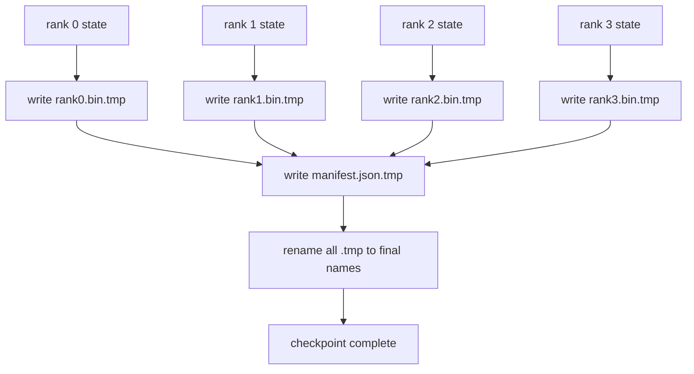

# 分片检查点与原子恢复

> 一个 70B 参数训练任务每隔几小时就被节点故障打断一次。检查点格式决定你损失 30 分钟还是 30 小时。分片检查点让每个 rank 并行写自己的分片，并用清单记录归属。恢复时每个 rank 从自己的文件装载分片，在相同 world size 下重建状态，优化器若无其事地继续步进。原子写保证写到一半的检查点不会毒害下一次恢复。

> **【中文解读】** 本课解决分布式训练的"生命线"问题——检查点。三个关键词：分片（每 rank 并行写自己的文件，聚合带宽随集群扩展）、清单（JSON 记录归属、偏移和 sha256，构成恢复契约）、原子写（先写 .tmp 再 rename，崩溃永远留下上一个完好版本）。学完本课你应能实现完整的保存-恢复-防错链，并把三种失败模式变成可测试的断言。

> **【拓展：单文件时代的痛→分片+清单成为业界标准】** 单进程时代的检查点就是一个大文件；到了多卡训练，"把所有状态聚到 rank 0 再写一个文件"把 TB 级数据压进一张网卡，写一次可能比训练一小时还久。DeepSpeed、PyTorch `torch.distributed.checkpoint`、NeMo 全部转向"每 rank 一个文件 + JSON 清单 + sha256 校验"的形态，PyTorch 官方甚至为跨 world size 恢复引入了 Planner 机制。本课从零实现这一整套契约。

> 🔗 **【前置】** 学本课前请先掌握：(1) lesson 78——ZeRO 优化器状态分片，本课保存的正是这种"每个 rank 持有 1/N"的状态；(2) POSIX 文件系统语义（rename 的原子性、fsync 的作用）；(3) sha256 摘要的基本用法。后续衔接：lesson 81 的端到端 demo 在第 10 步保存分片检查点并验证字节级相等的恢复。

**类型：** 动手构建
**语言：** Python
**前置条件：** Phase 19 Track C 课程 42-49
**预计用时：** 约 90 分钟

## 学习目标

- 把多 rank 检查点保存为每 rank 一个分片文件，外加一份记录哪个 rank 拥有什么的清单。
- 使用原子写模式（先写临时路径再 rename），使写到一半的崩溃绝不产生半个检查点。
- 从清单恢复，逐 rank 验证 fp16 参数和 ZeRO 优化器状态都字节级相等。
- 让清单 schema 能防住三种失败模式：world size 变化、分片数不匹配、部分写入。

## 问题引入

> **【中文解读】** 本节算"汇聚写"的账：1.1 TB 状态挤一张网卡、其余 rank 空等、一个训练日存不下一个检查点。分片检查点把方向反过来：并行写 + 清单契约 + 响亮失败。

vanilla 检查点把所有参数和优化器状态读进 rank 0，gather 之后写单个文件。对 70B 模型，这是 1.1 TB 的状态挤过一个 rank 的网络端口。其他每个 rank 都被这次写阻塞，因为它们空等 gather 完成。IO 带宽是最慢的那块 GPU 的网络链路，而不是聚合带宽。在真实集群上，gather-再-写这一步可能比之前一小时的训练还久，这意味着这个任务一个训练日存不下一个检查点。

分片检查点把这个模式反过来：每个 rank 并行把自己的分片写进自己的文件。清单记录哪个 rank 拥有哪个分片，恢复时能把每个分片放回原处。聚合写带宽随集群扩展。单 rank 要 4 小时的 1 TB 检查点，64 个 rank 只要 4 分钟。另外清单给不兼容的恢复提供了一份契约：world size 变化可检测、部分写入可检测，装载路径可以响亮地失败，而不是悄悄用脏数据。

## 核心概念



### 清单 schema

> **【中文解读】** 清单是检查点的"目录页"。三个承重字段：`world_size`（不同规模的重启响亮失败）、每分片 `sha256`（抓住部分写入/损坏）、`param_shard_offset` + `param_shard_numel`（装载器按正确位置拼回扁平参数张量）。

```json
{
  "world_size": 4,
  "step": 1234,
  "wall_clock_seconds": 4521,
  "shards": [
    {"rank": 0, "path": "rank0.bin", "sha256": "...", "param_shard_offset": 0, "param_shard_numel": 65536},
    {"rank": 1, "path": "rank1.bin", "sha256": "...", "param_shard_offset": 65536, "param_shard_numel": 65536}
  ],
  "schema_version": 1
}
```

三个字段是承重的。`world_size` 让不同规模上的恢复响亮失败而不是悄悄损坏。每分片的 `sha256` 抓住部分写入或损坏的写入。每分片的 `param_shard_offset` 和 `param_shard_numel` 让装载器在正确位置重建扁平参数张量。

### 原子写

> **【中文解读】** 标准动作：每分片写 .tmp、清单写 .tmp、逐个 fsync、然后 rename。同一文件系统内 POSIX rename 是原子的——要么新文件完整在场，要么旧文件还是旧的。最终 rename 前崩溃，上一个检查点仍是现役版本；没有原子写，崩溃会留下半个分片加一份指向它的完好清单，恢复时装载就损坏优化器状态。

标准模式：把每个分片写到 `<name>.tmp`，把清单写到 `manifest.json.tmp`，逐个 fsync，然后 rename。同一文件系统内的 POSIX rename 是原子的；要么新文件完整在场，要么旧文件还是旧的。最终 rename 之前崩溃，上一个检查点仍是现役版本。没有原子写，崩溃可能留下半个分片外加一份指向它的在场清单，恢复时装载就会损坏优化器状态。

### schema 必须防住的三种失败模式

> **【中文解读】** 把失败模式写成表格是为了变成测试用例。每种防御都在坏装载的早期拒绝它；替代方案是 100 步之后 loss 变 NaN 时才暴露的静默损坏。

| 失败 | 症状 | 防御 |
|---------|---------|---------|
| world size 变化 | 用 N=4 的清单在 N=8 上恢复 | 清单 world_size 不匹配，响亮失败 |
| 分片数不匹配 | 恢复时 rank*.bin 文件比清单里的分片少 | 枚举分片，逐个验证存在 |
| 部分写入 | 分片文件在 flush 中途被截断 | 装载时 sha256 校验 |

每种防御都在早期拒绝坏的装载；替代方案是静默损坏，在 100 步之后 loss 变 NaN 时才浮出水面。

### 为什么是每 rank 一个文件，而不是一个大文件

通过 `O_APPEND` 并发写单个文件在 POSIX 上对字节对齐的写是可行的，但实践中单个分片内的偏移跨越 MB 级区域，锁开销占主导。每 rank 一个文件没有争用，并且在底层文件系统是并行文件系统（Lustre、GPFS）时还能吃到条带化的好处。生产栈（DeepSpeed、FSDP、NeMo）都因为这个原因使用每 rank 文件。

```figure
ci-sharded-checkpoint
```

## 动手构建

> **【中文解读】** 代码是一条完整的"保存-恢复-防错"链：`ShardManifest` 持有 schema，`save_sharded` 原子写，`load_sharded` 验 sha256 后返回每 rank 状态。demo 走三幕：字节级相等的往返、错误 world size 被拒、篡改分片被 sha256 抓住，外加保留最近 5 份的轮转演示。

`code/main.py` 实现：

- `ShardManifest` dataclass：上面的 schema，外加 `to_json`/`from_json`。
- `save_sharded(state_dict_per_rank, dir, step)`：用临时路径 + rename 的原子模式把每个 rank 的二进制状态写进自己的文件，然后写清单。
- `load_sharded(dir, expected_world_size)`：读清单、逐分片验证 sha256、返回每 rank 的状态字典。
- 一个往返测试：构造每 rank 状态、保存、装载、断言字节级相等。

运行：

```bash
python3 code/main.py
```

输出：写入 4 个分片文件加清单，然后重新装载并做字节级相等的验证。

## 生产中的实战模式

> **【中文解读】** 异步写（保存线程化，屏障挪到下一个检查点）、两级存储（本地 NVMe + 异步上传 S3/GCS）、轮转（保留最近 K 份，防磁盘写满）。

三条模式让检查点足以投入生产。

**异步写。** 生产栈把检查点写放到单独的线程或进程上，训练得以继续。屏障在下一个检查点：上一个没完成就不开始下一次保存。DeepSpeed 的 `async_io` 标志做的正是这件事。本课保持同步写，好让每一步看得见。

**先写本地快速盘，再异步上传。** 先写到本地 NVMe（快）再异步上传到 S3 或 GCS。两级模式让集群内检查点对恢复保持快速，同时往集群外发一份持久副本做归档。清单携带本地路径；上传清单携带远端路径。

**轮转很重要。** 生产运行保留最近 K 份检查点（通常 3-5）并轮转掉最旧的。不轮转，磁盘会在运行中途写满，下一次检查点直接失败。有轮转，下一次保存先删最旧的，腾出预算。

## 用框架实现

> **【中文解读】** DeepSpeed 写每 rank 文件加 `latest` 指针；PyTorch `torch.distributed.checkpoint` 用 `Planner` 决定布局；NeMo 统一封装前两者。本课手工实现的契约与它们一一对应。

生产模式：

- **DeepSpeed 检查点**——`deepspeed.save_checkpoint(tag=step)` 写每 rank 文件，外加一个指向活跃 tag 的 `latest` 文件。
- **PyTorch FSDP 检查点**——`torch.distributed.checkpoint` 用决定每 rank 布局的 `Planner` 保存分片状态。
- **NeMo**——用统一的 `save_to_checkpoint` API 封装 DeepSpeed 和 FSDP，并附加元数据。

## 产出物

Lesson 81 为端到端 DDP+ZeRO 运行保存分片检查点，并在相同 world size 上重新装载，证明恢复契约成立。

## 练习题

1. 加异步写：把保存丢进线程让训练继续，下一次保存前阻塞直到上一次完成。
2. 加一个 `last_5_steps` 轮转：保留最近 5 份检查点，保存新的之前删掉最旧的。
3. 为内循环重载加一条仅 CRC 的快速校验路径（轮转让一份检查点成为新现役时无需完整 sha256）。
4. 加跨 world size 装载：读清单、拼接、重新分片，实现 N=4 到 N=8 的分片再均衡。
5. 加上传到假 S3（第二个目录）并写上传清单，论证两级存储策略。

## 术语速查表

| 英文 | 人们常说的 | 实际含义 |
|------|----------------|------------------------|
| Sharded checkpoint（分片检查点） | "每 rank 保存" | 每个 rank 并行写自己的分片文件 |
| Manifest（清单） | "索引" | 记录分片路径、偏移和 sha256 的 JSON 文件 |
| Atomic write（原子写） | "先 tmp 再 rename" | 写到 .tmp 再 POSIX rename，崩溃时旧文件仍是现役 |
| Partial write（部分写入） | "被截断的分片" | 写入中途崩溃产生损坏分片；sha256 能抓住 |
| Rotation（轮转） | "保留最近 K 份" | 写新检查点前删最旧的，约束磁盘用量 |

## 延伸阅读

- [DeepSpeed checkpointing](https://deepspeed.readthedocs.io/en/latest/model-checkpointing.html) — DeepSpeed 检查点官方文档：分片保存/恢复与 async_io
- [PyTorch torch.distributed.checkpoint](https://pytorch.org/docs/stable/distributed.checkpoint.html) — PyTorch 分布式检查点文档：Planner 机制与跨 world size 恢复
- [POSIX rename atomicity](https://pubs.opengroup.org/onlinepubs/9699919799/functions/rename.html) — POSIX 规范 rename 条目：原子写依据的权威来源
- Phase 19 Lesson 78 — 本检查点为之塑形的 ZeRO 状态
- Phase 19 Lesson 81 — 端到端 demo 对保存状态做往返验证
