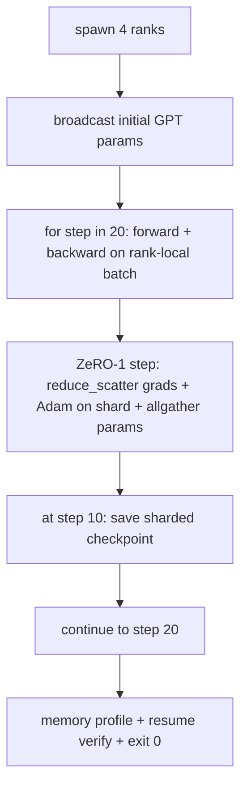

# End-to-End Distributed Training | 端到端分布式训练

> Lessons 76 through 80 each built one piece. This is the assembly: a tiny GPT trained across 4 simulated ranks with DDP for gradient sync, ZeRO-1 for optimiser-state sharding, and a sharded checkpoint at the halfway mark. The demo runs 20 steps, self-terminates, prints a loss curve plus a memory profile, and writes a resumable checkpoint.

> **【中文解读】** 本课是分布式训练路线的总装：lesson 76 的集合通信、77 的 DDP、78 的 ZeRO-1、80 的分片检查点，在这里拼成一个完整训练循环——4 个模拟 rank 上训练一个微型 GPT，DDP 负责梯度同步，ZeRO-1 分片优化器状态，第 10 步写分片检查点。demo 跑 20 步后自终止，打印 loss 曲线 + 每 rank 显存画像，并验证检查点可恢复。四个不变量是验收标准：loss 单调下降、各 rank 参数范数一致、优化器显存等于 12P/N、检查点字节级相等重载。

> **【拓展：总装是工程能力的分水岭】** 每个组件单测通过不代表系统能跑——这是软件工程的通病，在分布式训练里尤其致命：组合错了，症状是 loss 发散、检查点拒绝恢复、或显存该降反升。真实团队在采纳 DeepSpeed 之前要建的正是这个"迷你版子系统"：用 gloo 在 CPU 上把 DDP+ZeRO+检查点的组合行为验证清楚，再搬到真集群。Phase 17（基础设施与生产）是这个方向的下一站。

> 🔗 **【前置】** 学本课前请先掌握：(1) lesson 76——gloo 后端与 file rendezvous；(2) lesson 77——初始参数 broadcast 的 DDP 同步；(3) lesson 78——reduce_scatter + Adam 分片 + allgather 的 ZeRO-1 步；(4) lesson 80——分片检查点与原子写。本课不引入新机制，只证明四者可组合。

**Type:** Build | **类型:** 动手构建
**Languages:** Python | **语言:** Python
**Prerequisites:** Phase 19 Track C lessons 42-49 | **前置知识:** Phase 19 Track C 课程 42-49
**Time:** ~90 min | **时间:** 约 90 分钟

## Learning Objectives | 学习目标

- Compose DDP (lesson 77) plus ZeRO-1 (lesson 78) plus sharded checkpoints (lesson 80) into one training loop.
  中文翻译：把 DDP（lesson 77）+ ZeRO-1（lesson 78）+ 分片检查点（lesson 80）组合进一个训练循环。
- Train a 2-layer transformer language model on a small synthetic corpus for 20 steps across 4 simulated ranks.
  中文翻译：在小型合成语料上、跨 4 个模拟 rank、把一个 2 层 Transformer 语言模型训练 20 步。
- Print a per-step loss table, a per-rank memory profile, and a checkpoint manifest that resumes byte-equal on the same world size.
  中文翻译：打印逐步 loss 表、每 rank 显存画像，以及能在相同 world size 上字节级相等恢复的检查点清单。
- Defend the composition: each piece is independently testable in earlier lessons and this lesson proves they compose.
  中文翻译：论证这个组合：每个部件在前面的课程里可独立测试，本课证明它们可以组合。

## The Problem | 问题引入

> **【中文解读】** 毕业项目的意义是"证明零件能装在一起"。76 到 80 每课各自带测试、各自成立；但真实训练同时用到所有原语——组合错了，loss 发散、检查点拒绝恢复、或每 rank 显存该缩反涨。本课的端到端 demo 用四个不变量验证组合正确性：(a) 20 步内 loss 在浮点噪声下单调下降；(b) 每步每个 rank 的参数范数相同；(c) 每 rank 优化器显存等于 ZeRO-1 公式 12P/N 字节；(d) 第 10 步的检查点重启后字节级相等重载。demo 自终止：20 步、单命令、退出码 0。

A capstone is the proof that the pieces fit together. Lesson 76 implemented collectives. Lesson 77 wrapped them into DDP. Lesson 78 sharded optimiser state with reduce_scatter. Lesson 79 analysed pipeline. Lesson 80 saved a sharded checkpoint. Each lesson stood alone with its own test. A real training run uses every primitive at once; if the composition is wrong, the loss diverges, the checkpoint refuses to resume, or the per-rank memory grows when it should shrink.

> 毕业项目就是"零件能拼在一起"的证明。Lesson 76 实现了集合通信。Lesson 77 把它们包成 DDP。Lesson 78 用 reduce_scatter 分片优化器状态。Lesson 79 分析了流水线。Lesson 80 保存了分片检查点。每课独立成立、各有测试。真实的训练运行同时用到每个原语；如果组合错了，loss 发散、检查点拒绝恢复、或者每 rank 显存该缩的时候反而涨。

This lesson runs the end-to-end demo and verifies four invariants: (a) the loss decreases monotonically across the 20 steps within float noise, (b) every rank holds the same parameter norm at every step, (c) the per-rank optimiser memory equals the ZeRO-1 formula 12P/N bytes, and (d) the checkpoint at step 10 reloads byte-equal at restart. The demo self-terminates: 20 steps, single command, exit 0.

> 本课运行端到端 demo 并验证四个不变量：(a) 20 步内 loss 在浮点噪声下单调下降；(b) 每步每个 rank 持有相同的参数范数；(c) 每 rank 优化器显存等于 ZeRO-1 公式 12P/N 字节；(d) 第 10 步的检查点重启后字节级相等重载。demo 自终止：20 步、单命令、退出码 0。

## The Concept | 核心概念



### The mini GPT

> **【中文解读】** 模型刻意做小：2 个 Transformer 块、嵌入维 32、4 个注意力头、词表 64、序列长 16、batch 4，几千个参数。大到能踩遍每条接线决策（多头注意力走标准掩码路径、LayerNorm 有权重要同步、LM 头是独立回词表的线性投影），小到 20 步 × 4 个 CPU rank 几秒跑完。

The model is small on purpose: 2 transformer blocks, embed dim 32, 4 attention heads, vocab 64, sequence length 16, batch 4. A few thousand parameters. Big enough to exercise every wiring decision (multi-head attention runs the standard masked path; LayerNorm has weights to sync; the LM head is a separate linear projection back to the vocab). Small enough that 20 steps on 4 CPU ranks finish in seconds.

> 模型刻意做小：2 个 Transformer 块、嵌入维 32、4 个注意力头、词表 64、序列长 16、batch 4，共几千个参数。大到能踩遍每条接线决策（多头注意力走标准掩码路径；LayerNorm 有权重要同步；LM 头是单独投影回词表的线性层），小到 20 步在 4 个 CPU rank 上几秒跑完。

### The composition rules

> **【中文解读】** 组合的分工表是本课的核心设计：DDP broadcast 只在构造时同步一次初始参数；ZeRO-1 step 每步调用一次、取代 optimizer.step；分片检查点在第 10 步由 rank 0 经 allgather 收齐后写入；训练循环只管前向、反传、记 loss。循环本身不知道 reduce_scatter 或 rendezvous 文件的存在——ZeRO 和检查点模块暴露窄接口，循环只做组装。

| Lesson piece | What it owns | What it leaves to the loop |
|--------------|--------------|----------------------------|
| DDP broadcast | Initial parameter sync | One call at construct time |
| ZeRO-1 step | Gradient sync, master copy update, parameter broadcast | One call per step replacing optimiser.step |
| Sharded checkpoint | Persist per-rank state, manifest with sha256 | Called on rank 0 with state collected via allgather |
| Training loop | Forward, backward, loss logging | Calls the three above in order |

The loop does not know about reduce_scatter or rendezvous files. The ZeRO and checkpoint modules expose narrow interfaces that the loop composes.

> 循环不知道 reduce_scatter 或 rendezvous 文件的存在。ZeRO 和检查点模块暴露窄接口，由循环来组装。

### Why a tiny GPT and not just an MLP

> **【中文解读】** lesson 77 的 MLP 只够验证梯度同步；微型 GPT 多验证三件事：独立的 LM 头（本课为清晰起见不做权重共享，完整 GPT 通常把 LM 头与词嵌入绑定）、softmax+交叉熵损失（比 MSE 多得多数值边界情况）、以及"嵌入→注意力→MLP"的非对称前向。毕业设计还停在 MLP 就检验不出组合能否正确处理 LayerNorm 和嵌入层的梯度形状。

The MLP from lesson 77 was sufficient to verify gradient sync. A tiny GPT adds three things: a separate LM head over the vocab (in this lesson, untied for clarity; full GPT typically ties the head to the token embedding), softmax+cross-entropy as the loss (more numerical edge cases than MSE), and an asymmetric forward (embeddings then attention then MLP per layer). Sticking with an MLP for the capstone would hide whether the composition handles LayerNorm or the embedding layer's grad shape correctly.

> lesson 77 的 MLP 足够验证梯度同步。微型 GPT 增加三件事：词表上的独立 LM 头（本课为清晰起见不做权重绑定；完整 GPT 通常把头部与 token 嵌入绑定）、softmax+交叉熵损失（比 MSE 有更多数值边界情况）、以及非对称前向（先嵌入、再注意力、每层再 MLP）。毕业设计继续用 MLP 会掩盖组合能否正确处理 LayerNorm 或嵌入层梯度形状的问题。

### Self-terminating means exit 0

The loop runs a fixed 20 steps and exits. No `while True`, no human intervention, no resume from external state. A capstone you can leave running unattended and find a complete log when it finishes is a capstone that proves the system is wired correctly. If any piece deadlocks the demo never returns and the test rig catches it.

> 循环跑固定 20 步然后退出。没有 `while True`，没有人工干预，不从外部状态恢复。一个能无人值守运行、跑完留下完整日志的毕业项目，才是证明系统接线正确的毕业项目。任何部件死锁，demo 就再也不会返回，测试装置会抓住它。

```figure
ci-distributed-assembly
```

## Build It | 动手构建

> **【中文解读】** 代码把四课的部件拼成一课：`MiniGPT`（2 层带掩码自注意力的 Transformer + 独立 LM 头）、`make_corpus`（确定性下一 token 预测数据）、`_train_worker`（每个 rank 一份：broadcast 初始化、跑循环、调 ZeRO step、第 10 步写分片检查点）、`verify_resume`（主运行后在进程内重载第 10 步检查点，断言保存的主分片与内存快照逐字节相等）。成功时最后一行是 RESUME VERIFIED。

`code/main.py` implements:

- `MiniGPT`: 2-layer transformer with masked self-attention and a separate LM head.
- `make_corpus(seed, total_tokens)`: deterministic next-token-prediction data.
- `_train_worker`: spawned per rank; broadcasts init params, runs the loop, calls ZeRO step, writes the sharded checkpoint at step 10.
- `verify_resume`: after the main run, reloads the step-10 checkpoint in-process and asserts the saved master shards match the in-memory snapshot byte-for-byte.
- `main`: orchestrates the whole demo, prints the loss table, the memory profile, and the verification result.

Run it:

```bash
python3 code/main.py
```

Output: a 20-row loss table, a 4-row per-rank memory profile, a checkpoint manifest, and a "RESUME VERIFIED" line on success.

> 输出：一张 20 行的 loss 表、一份 4 行的每 rank 显存画像、一份检查点清单，以及成功时的 "RESUME VERIFIED" 一行。

## Production patterns in the wild | 生产中的实战模式

> **【中文解读】** 三条把组合推向生产的经验：(1) 按分钟而非按步数做检查点——步时随序列长度和微批次数波动，10 分钟一存的节奏对不同规模模型等价；(2) 及早发现发散——反传后加 NaN 守卫和 loss 尖峰检测器，一步涨 2 倍以上就回滚到上一个检查点，别让优化器走进退化态；(3) 跨 rank 聚合显存画像——真实运行各 rank 显存不同（最大流水线阶段的 rank 激活更多），生产日志记 max + mean。

Three patterns finish the composition for real runs.

> 三条模式为真实运行收尾这个组合。

**Checkpoint every K minutes, not every K steps.** Step time varies with seq length and microbatch count. A 10-minute checkpoint cadence catches the same compute regardless of model size. The lesson uses step-based for simplicity; production uses wall-clock-based.

> **每 K 分钟存一次检查点，而不是每 K 步。** 步时随序列长度和微批次数变化。10 分钟一次的检查点节奏无论模型多大都覆盖相同的计算量。本课为简单起见按步数；生产用墙钟时间。

**Detect divergence early.** Production runs add a NaN guard after backward and a loss-spike detector; if loss jumps by more than 2x in one step, roll back to the previous checkpoint instead of letting the optimiser march into a degenerate state. The lesson's loss curve is smooth so the guard is unused but the hook stays.

> **及早检测发散。** 生产运行在反传后加 NaN 守卫和 loss 尖峰检测器；如果 loss 一步跳涨超过 2 倍，回滚到上一个检查点，而不是让优化器大步走进退化状态。本课的 loss 曲线平滑所以守卫没用到，但钩子留着。

**Aggregate the memory profile across ranks.** Per-rank memory differs by rank in real runs (rank with the largest pipeline stage holds more activations). Production logs the max across ranks plus the mean; the lesson prints per-rank to show the formula matches.

> **跨 rank 聚合显存画像。** 真实运行中每 rank 显存各不相同（持最大流水线阶段的 rank 激活更多）。生产日志记录跨 rank 的最大值加均值；本课打印每 rank 的值以显示公式吻合。

## Use It | 用框架实现

> **【中文解读】** 本课的组合就是 DeepSpeed 形态的缩影：DeepSpeed 在一份配置下组合 DDP + ZeRO + 流水线 + 激活检查点；PyTorch FSDP 是原生等价物（`SHARD_GRAD_OP` 即 ZeRO-2）；NeMo 和 Megatron-LM 为最大的模型再加张量并行，组合形状不变。

Production patterns:

- **DeepSpeed.** Combines DDP + ZeRO + pipeline + activation checkpointing under one config. The lesson's composition is the DeepSpeed shape in miniature.
  中文翻译：**DeepSpeed**——在一份配置下组合 DDP + ZeRO + 流水线 + 激活检查点。本课的组合是 DeepSpeed 形态的缩影。
- **PyTorch FSDP.** The native equivalent. `FullyShardedDataParallel` with `ShardingStrategy.SHARD_GRAD_OP` is ZeRO-2.
  中文翻译：**PyTorch FSDP**——原生等价物，`FullyShardedDataParallel` 配 `ShardingStrategy.SHARD_GRAD_OP` 就是 ZeRO-2。
- **NeMo and Megatron-LM.** Add tensor parallel for the very largest models; otherwise the composition is the same shape.
  中文翻译：**NeMo 和 Megatron-LM**——为最大的模型再加张量并行；除此之外组合形状相同。

## Ship It | 产出物

The full track ends here. The 6 lessons together are the distributed-training subsystem a real team would build before adopting DeepSpeed; the abstraction has been proven against gloo and the failure modes have been exercised. Phase 17 (infrastructure and production) is the place to take this to a real cluster.

> 完整路线到此收束。这 6 课合起来就是真实团队在采纳 DeepSpeed 之前会自建的分布式训练子系统；抽象已在 gloo 上验证、失败模式也已演练。Phase 17（基础设施与生产）是把它搬上真实集群的下一站。

## Exercises | 练习题

1. Add a tensor-parallel split of the attention head and verify the loss matches the single-rank baseline. Two ranks: half the heads per rank, allreduce of the attention output.
   中文翻译：加注意力头的张量并行切分，验证 loss 与单 rank 基线一致。两个 rank：每 rank 一半头，注意力输出做 allreduce。
2. Add gradient accumulation across 4 microbatches and prove the gradient equals the gradient of one big batch.
   中文翻译：跨 4 个微批次加梯度累积，证明梯度等于一个大 batch 的梯度。
3. Add a resume-from-step-10 path that actually continues training to step 20 and produces the same final loss as the original run.
   中文翻译：加一条"从第 10 步恢复"的路径，真正继续训练到第 20 步，并产出与原运行相同的最终 loss。
4. Add a metrics export (loss, grad norm, step time) to JSONL so the run can be visualised after the fact.
   中文翻译：把指标（loss、梯度范数、步时）导出为 JSONL，让运行事后可以可视化。
5. Add a NaN guard that rolls back to the previous checkpoint on a loss spike, and force a spike with a one-step LR multiplier to exercise the rollback.
   中文翻译：加一个在 loss 尖峰时回滚到上一检查点的 NaN 守卫，并用单步学习率放大器强制制造尖峰来演练回滚。

## Key Terms | 术语速查表

| Term | What people say | What it actually means |
|------|----------------|------------------------|
| End-to-end | "Wire it all up" | One run composes every piece, not a unit test per piece |
| Memory profile | "GB per rank" | Bytes held on each rank for params, grads, optimiser state |
| Resume contract | "Save and load" | Per-rank state byte-equal after a checkpoint round-trip |
| Self-terminating | "Bounded run" | Fixed step count, exit 0 on completion, no human in the loop |

## Further Reading | 延伸阅读

- [DeepSpeed end-to-end training tutorial](https://www.deepspeed.ai/getting-started/)
  中文翻译：DeepSpeed 端到端训练入门——本课组合的产品化形态
- [PyTorch FSDP advanced tutorial](https://pytorch.org/tutorials/intermediate/FSDP_advanced_tutorial.html)
  中文翻译：PyTorch FSDP 进阶教程——原生分片数据并行的生产用法
- [Megatron-LM training script reference](https://github.com/NVIDIA/Megatron-LM)
  中文翻译：Megatron-LM 训练脚本参考——3D 并行的完整工程实现
- Phase 19 Lessons 76-80 - each piece this lesson composes
  中文翻译：Phase 19 Lesson 76-80——本课组合的每一个部件
- Phase 17 - moving the composition to a real cluster
  中文翻译：Phase 17——把这套组合搬上真实集群
