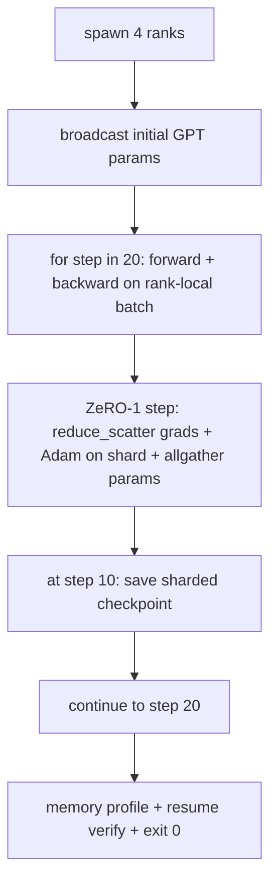

# 端到端分布式训练

> Lesson 76 到 80 各自造了一个零件。本课是总装：跨 4 个模拟 rank 训练一个微型 GPT——DDP 做梯度同步，ZeRO-1 分片优化器状态，中途写分片检查点。demo 跑 20 步、自终止，打印 loss 曲线加显存画像，并写出可恢复的检查点。

> **【中文解读】** 本课是分布式训练路线的总装课：把集合通信、DDP、ZeRO-1、分片检查点拼成一个完整训练循环。四个不变量是验收标准：loss 单调下降、各 rank 参数范数一致、优化器显存等于 12P/N、检查点字节级相等重载。学完本课你应能独立组装一套"迷你 DeepSpeed"并解释每个部件的边界。

> **【拓展：总装是工程能力的分水岭】** 每个组件单测通过不代表系统能跑——在分布式训练里尤其致命：组合错了，症状是 loss 发散、检查点拒绝恢复、或显存该降反升。真实团队在采纳 DeepSpeed 之前要建的正是这个"迷你版子系统"：用 gloo 在 CPU 上把 DDP+ZeRO+检查点的组合行为验证清楚，再搬到真集群。Phase 17（基础设施与生产）是这个方向的下一站。

> 🔗 **【前置】** 学本课前请先掌握：(1) lesson 76——gloo 后端与 file rendezvous；(2) lesson 77——初始参数 broadcast 的 DDP 同步；(3) lesson 78——reduce_scatter + Adam 分片 + allgather 的 ZeRO-1 步；(4) lesson 80——分片检查点与原子写。本课不引入新机制，只证明四者可组合。

**类型：** 动手构建
**语言：** Python
**前置条件：** Phase 19 Track C 课程 42-49
**预计用时：** 约 90 分钟

## 学习目标

- 把 DDP（lesson 77）+ ZeRO-1（lesson 78）+ 分片检查点（lesson 80）组合进一个训练循环。
- 在小型合成语料上、跨 4 个模拟 rank、把一个 2 层 Transformer 语言模型训练 20 步。
- 打印逐步 loss 表、每 rank 显存画像，以及能在相同 world size 上字节级相等恢复的检查点清单。
- 论证这个组合：每个部件在前面的课程里可独立测试，本课证明它们可以组合。

## 问题引入

> **【中文解读】** 毕业项目的意义是"证明零件能装在一起"。四条不变量把"组合正确"从感觉变成断言：(a) loss 单调下降、(b) 各 rank 参数范数一致、(c) 优化器显存 = 12P/N、(d) 检查点字节级相等重载。

毕业项目就是"零件能拼在一起"的证明。Lesson 76 实现了集合通信。Lesson 77 把它们包成 DDP。Lesson 78 用 reduce_scatter 分片优化器状态。Lesson 79 分析了流水线。Lesson 80 保存了分片检查点。每课独立成立、各有测试。真实的训练运行同时用到每个原语；如果组合错了，loss 发散、检查点拒绝恢复、或者每 rank 显存该缩的时候反而涨。

本课运行端到端 demo 并验证四个不变量：(a) 20 步内 loss 在浮点噪声下单调下降；(b) 每步每个 rank 持有相同的参数范数；(c) 每 rank 优化器显存等于 ZeRO-1 公式 12P/N 字节；(d) 第 10 步的检查点重启后字节级相等重载。demo 自终止：20 步、单命令、退出码 0。

## 核心概念



### 微型 GPT

> **【中文解读】** 模型刻意做小：几千个参数，但大到能踩遍每条接线决策（掩码多头注意力、带权重的 LayerNorm、独立 LM 头），小到 20 步 × 4 个 CPU rank 几秒跑完。

模型刻意做小：2 个 Transformer 块、嵌入维 32、4 个注意力头、词表 64、序列长 16、batch 4，共几千个参数。大到能踩遍每条接线决策（多头注意力走标准掩码路径；LayerNorm 有权重要同步；LM 头是单独投影回词表的线性层），小到 20 步在 4 个 CPU rank 上几秒跑完。

### 组合规则

> **【中文解读】** 分工表是本课的核心设计：DDP broadcast 构造时同步一次；ZeRO-1 step 每步一次、取代 optimizer.step；分片检查点第 10 步由 rank 0 经 allgather 收齐后写入；训练循环只管前向、反传、记 loss。循环不知道 reduce_scatter 或 rendezvous 文件的存在——模块暴露窄接口，循环只做组装。

| 课程部件 | 它负责什么 | 留给循环什么 |
|--------------|--------------|----------------------------|
| DDP broadcast | 初始参数同步 | 构造时调用一次 |
| ZeRO-1 step | 梯度同步、主副本更新、参数广播 | 每步一次，取代 optimiser.step |
| 分片检查点 | 持久化每 rank 状态、带 sha256 的清单 | rank 0 上调用，状态经 allgather 收齐 |
| 训练循环 | 前向、反传、loss 记录 | 按顺序调用上面三者 |

循环不知道 reduce_scatter 或 rendezvous 文件的存在。ZeRO 和检查点模块暴露窄接口，由循环来组装。

### 为什么是微型 GPT 而不只是 MLP

> **【中文解读】** MLP 只够验证梯度同步；微型 GPT 多验证三件事：独立 LM 头、softmax+交叉熵的数值边界、非对称前向。毕业设计还停在 MLP 就检验不出组合能否正确处理 LayerNorm 和嵌入层的梯度形状。

lesson 77 的 MLP 足够验证梯度同步。微型 GPT 增加三件事：词表上的独立 LM 头（本课为清晰起见不做权重绑定；完整 GPT 通常把头部与 token 嵌入绑定）、softmax+交叉熵损失（比 MSE 有更多数值边界情况）、以及非对称前向（先嵌入、再注意力、每层再 MLP）。毕业设计继续用 MLP 会掩盖组合能否正确处理 LayerNorm 或嵌入层梯度形状的问题。

### 自终止意味着退出码 0

> **【中文解读】** 工程纪律：固定 20 步、跑完即退，没有 `while True`、不用人盯。能无人值守跑完并留下完整日志的毕业项目，才证明系统接线正确；任何部件死锁，demo 就不返回，测试装置会抓住它。

循环跑固定 20 步然后退出。没有 `while True`，没有人工干预，不从外部状态恢复。一个能无人值守运行、跑完留下完整日志的毕业项目，才是证明系统接线正确的毕业项目。任何部件死锁，demo 就再也不会返回，测试装置会抓住它。

```figure
ci-distributed-assembly
```

## 动手构建

> **【中文解读】** `MiniGPT`（2 层带掩码自注意力 + 独立 LM 头）、`make_corpus`（确定性数据）、`_train_worker`（每 rank：broadcast 初始化、循环、ZeRO step、第 10 步写检查点）、`verify_resume`（重载第 10 步检查点并断言与内存快照逐字节相等）。成功时最后一行是 RESUME VERIFIED。

`code/main.py` 实现：

- `MiniGPT`：2 层 Transformer，带掩码自注意力和独立 LM 头。
- `make_corpus(seed, total_tokens)`：确定性的下一 token 预测数据。
- `_train_worker`：每个 rank 启动一份；broadcast 初始参数、跑循环、调 ZeRO step、第 10 步写分片检查点。
- `verify_resume`：主运行之后在进程内重载第 10 步检查点，断言保存的主分片与内存快照逐字节相等。
- `main`：编排整个 demo，打印 loss 表、显存画像和验证结果。

运行：

```bash
python3 code/main.py
```

输出：一张 20 行的 loss 表、一份 4 行的每 rank 显存画像、一份检查点清单，以及成功时的 "RESUME VERIFIED" 一行。

## 生产中的实战模式

> **【中文解读】** 按分钟而非按步数做检查点（步时随序列长度波动）；及早发现发散（NaN 守卫 + loss 尖峰检测，一步涨 2 倍就回滚）；跨 rank 聚合显存画像（记 max + mean）。

三条模式为真实运行收尾这个组合。

**每 K 分钟存一次检查点，而不是每 K 步。** 步时随序列长度和微批次数变化。10 分钟一次的检查点节奏无论模型多大都覆盖相同的计算量。本课为简单起见按步数；生产用墙钟时间。

**及早检测发散。** 生产运行在反传后加 NaN 守卫和 loss 尖峰检测器；如果 loss 一步跳涨超过 2 倍，回滚到上一个检查点，而不是让优化器大步走进退化状态。本课的 loss 曲线平滑所以守卫没用到，但钩子留着。

**跨 rank 聚合显存画像。** 真实运行中每 rank 显存各不相同（持最大流水线阶段的 rank 激活更多）。生产日志记录跨 rank 的最大值加均值；本课打印每 rank 的值以显示公式吻合。

## 用框架实现

> **【中文解读】** 本课的组合就是 DeepSpeed 形态的缩影；FSDP 是原生等价物；NeMo/Megatron-LM 再加张量并行，形状不变。

生产模式：

- **DeepSpeed**——在一份配置下组合 DDP + ZeRO + 流水线 + 激活检查点。本课的组合是 DeepSpeed 形态的缩影。
- **PyTorch FSDP**——原生等价物，`FullyShardedDataParallel` 配 `ShardingStrategy.SHARD_GRAD_OP` 就是 ZeRO-2。
- **NeMo 和 Megatron-LM**——为最大的模型再加张量并行；除此之外组合形状相同。

## 产出物

完整路线到此收束。这 6 课合起来就是真实团队在采纳 DeepSpeed 之前会自建的分布式训练子系统；抽象已在 gloo 上验证、失败模式也已演练。Phase 17（基础设施与生产）是把它搬上真实集群的下一站。

## 练习题

1. 加注意力头的张量并行切分，验证 loss 与单 rank 基线一致。两个 rank：每 rank 一半头，注意力输出做 allreduce。
2. 跨 4 个微批次加梯度累积，证明梯度等于一个大 batch 的梯度。
3. 加一条"从第 10 步恢复"的路径，真正继续训练到第 20 步，并产出与原运行相同的最终 loss。
4. 把指标（loss、梯度范数、步时）导出为 JSONL，让运行事后可以可视化。
5. 加一个在 loss 尖峰时回滚到上一检查点的 NaN 守卫，并用单步学习率放大器强制制造尖峰来演练回滚。

## 术语速查表

| 英文 | 人们常说的 | 实际含义 |
|------|----------------|------------------------|
| End-to-end（端到端） | "全部接起来" | 一次运行组合所有部件，而不是每部件一个单测 |
| Memory profile（显存画像） | "每 rank 多少 GB" | 每个 rank 为参数、梯度、优化器状态持有的字节数 |
| Resume contract（恢复契约） | "保存和加载" | 检查点往返后每 rank 状态字节级相等 |
| Self-terminating（自终止） | "有界运行" | 固定步数，完成即退出码 0，无人工介入 |

## 延伸阅读

- [DeepSpeed end-to-end training tutorial](https://www.deepspeed.ai/getting-started/) — DeepSpeed 端到端训练入门：本课组合的产品化形态
- [PyTorch FSDP advanced tutorial](https://pytorch.org/tutorials/intermediate/FSDP_advanced_tutorial.html) — PyTorch FSDP 进阶教程：原生分片数据并行的生产用法
- [Megatron-LM training script reference](https://github.com/NVIDIA/Megatron-LM) — Megatron-LM 训练脚本参考：3D 并行的完整工程实现
- Phase 19 Lesson 76-80 — 本课组合的每一个部件
- Phase 17 — 把这套组合搬上真实集群
