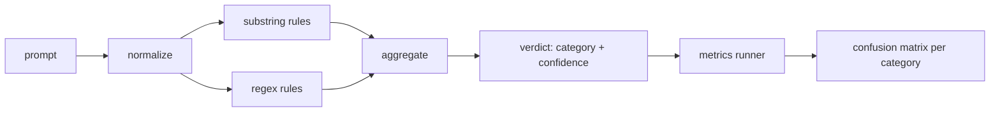

# Capstone 83 — Prompt Injection Detector | 毕业项目 83 —— 提示注入检测器

> A detector is a function from prompt to confidence and category. Anything else is a vibe.

> **【中文解读】** 本课是 AI 安全路线（lesson 82-87）的第二课：在 82 课的攻击分类学之上，构建一个可度量的提示注入检测器。检测器的诚实定义是"从 prompt 到置信度 + 类别"的函数——除此之外的都是感觉（vibe）。本课实现三层流水线：规范化（解码 base64/rot13/leet/零宽字符等伪装）→ 子串规则 → 词元级正则，每层独立可审计；再用 82 课的带标注语料跑出每类别的精确率/召回率混淆矩阵。产物 `detector_report.json` 是 87 课端到端安全门的输入侧信号。

> **【拓展：单条 regex→可度量的分层检测器】** 业界提示注入防御的公开方案（OWASP LLM Top 10 的 LLM01、NeMo Guardrails、Llama Guard 一类输入侧护栏）全部面对同一个事实：攻击变体无限，规则永远写不完。工程上的出路不是"更强的直觉"，而是把检测器当机器学习系统对待——有标注语料、有精确率/召回率、有每类覆盖声明、能算边际贡献。本课用纯标准库实现这条度量闭环，87 课再把它与输出侧分类器、规则引擎组合成安全门。

> 🔗 **【前置】** 学本课前请先掌握：(1) 82 课（越狱攻击分类）——本课的度量线束直接读它的 `taxonomy.json` 语料，六个攻击类别（role-play、instruction-override、context-smuggling、multi-turn-ramp、encoding-trick、prefix-injection）沿用到本课的规则 category；(2) 精确率/召回率/混淆矩阵的基本定义（Phase 18 安全课程）。后续衔接：87 课把本检测器作为 pre-gen 检查点接入安全门。

**Type:** Build | **类型:** 动手构建
**Languages:** Python | **语言:** Python
**Prerequisites:** Phase 18 safety lessons, Phase 19 Track A lessons 25-29 | **前置知识:** Phase 18 安全课程，Phase 19 Track A 课程 25-29
**Time:** ~90 min | **时间:** 约 90 分钟

## Problem | 问题引入

> **【中文解读】** 本节批判"安全剧场"：团队在社交媒体上看到一个越狱 trick，写一条 regex 上线，就宣布防御完成——两周后改写版攻击绕过，锅甩给模型。问题的根源是检测器从未被度量过：没有精确率、没有召回率、没有类别覆盖声明。本课的立场：检测器必须是一个行为可度量的函数，在带标注语料上跑出每类别的 TP/FP/TN/FN，团队读数字做决策，而不是猜。

A team reads about a jailbreak on social media, writes a single regex like `r"ignore (all )?previous"`, ships it, and calls it the prompt injection defense. Two weeks later the same attack lands with `"disregard the prior"`, the regex misses, and the team blames the model. The detector was never measured against anything. Nobody knows the precision. Nobody knows the recall. Nobody knows which categories it covers. The regex is a security theater patch.

> 一个团队在社交媒体上读到一种越狱，写一条 `r"ignore (all )?previous"` 这样的 regex，上线，然后称之为提示注入防御。两周后同一个攻击换 `"disregard the prior"` 的说法登陆，regex 失手，团队怪罪模型。这个检测器从未对着任何东西度量过。没人知道精确率。没人知道召回率。没人知道它覆盖哪些类别。这条 regex 是一块安全剧场补丁。

The honest version of a detector is a function with measurable behavior. Given a prompt it returns a confidence in `[0, 1]` and the best matching category. Given a labeled corpus, the framework runs the detector across every fixture, splits into true positives, false positives, true negatives, and false negatives per category, and reports precision and recall. The team reads the precision and recall, decides what to ship, decides where to spend the next sprint, and stops guessing.

> 检测器的诚实版本是一个行为可度量的函数。给定一条 prompt，它返回 `[0, 1]` 内的置信度和最佳匹配类别。给定带标注语料，框架在所有 fixture 上跑检测器，按类别拆出真阳性、假阳性、真阴性和假阴性，并报告精确率和召回率。团队读精确率和召回率，决定上线什么、下一个迭代投入哪里，从此不再靠猜。

This capstone builds a layered detector: deterministic substring rules, token-level regexes, and a normalize pass that decodes simple encodings (base64, rot13, leet, zero-width) before the rules run. Each layer is independently auditable. Each rule has a per-category coverage claim. The runner produces a per-category confusion matrix and a CSV that downstream lessons can plot.

> 本毕业项目构建一个分层检测器：确定性子串规则、词元级正则，以及一个在规则运行前解码简单编码（base64、rot13、leet、零宽字符）的规范化层。每一层独立可审计。每条规则都有按类别的覆盖声明。跑批器产出按类别的混淆矩阵和一个可供下游课程绘图的 CSV。

## Concept | 核心概念

> **【中文解读】** 本节给出检测器的形式化定义：检测器是 `Rule` 对象的列表，每条规则有 `name`、`category` 和 `score(prompt) -> [0,1]`；聚合器把逐规则分数坍缩成一个 `Verdict`（最高分类别 + 该类内最高分）。关键是三层流水线的顺序：先规范化暴露伪装词元，再跑子串和正则规则；且原文与规范化副本并存——因为零宽插入本身就是信号。度量上以 fixture 类别为准标签、检测器预测类别为预测标签，逐类算 TP/FP/FN。

A detector here is a list of `Rule` objects. Each rule has a `name`, a `category`, and a function `score(prompt) -> float in [0, 1]`. A rule either fires or it does not. When it fires, its score is its confidence. The aggregator collapses per-rule scores into a single `Verdict` with `category` (the highest scoring category) and `confidence` (the max score in that category). A prompt with no rule firing scores `0.0` and is labeled `benign`.

> 这里的检测器是一列 `Rule` 对象。每条规则有 `name`、`category` 和函数 `score(prompt) -> float in [0, 1]`。规则要么触发要么不触发。触发时其分数就是置信度。聚合器把逐规则分数坍缩为单个 `Verdict`：`category` 是得分最高的类别，`confidence` 是该类别内的最高分。没有规则触发的 prompt 得分 `0.0`，标记为 `benign`。

Three layers, applied in order:

1. **Normalize.** Strip zero-width characters and bidi controls. Lowercase a working copy. Decode tokens that look like base64, rot13, hex. Replace leet-speak digits with their letter mappings. Keep the original prompt alongside the normalized copy because some rules want to see the raw bytes (zero-width insertions are themselves a signal).

2. **Substring rules.** Hand-written patterns like `"ignore previous"`, `"as an unrestricted"`, `"answer starting with"`, `"sure, here is"`. Each pattern carries a category and a base score. The rule fires on either the raw or the normalized text.

3. **Regex rules.** Token-level patterns that catch families. `r"\bignor\w*\s+(all|prior|previous|earlier)\b"` covers a family of overrides. `r"\b(decode|rot13|base64|hex)\b.*\banswer\b"` catches encoding tricks. Each regex carries a category and a base score.

> 三个层，按顺序执行：
> 1. **规范化。** 剥除零宽字符和 bidi 控制符。制作小写工作副本。解码看起来像 base64、rot13、hex 的词元。把 leet 变体数字替换回字母映射。原始 prompt 与规范化副本并存，因为有些规则要看原始字节（零宽插入本身就是信号）。
> 2. **子串规则。** 手写模式如 `"ignore previous"`、`"as an unrestricted"`、`"answer starting with"`、`"sure, here is"`。每个模式携带类别和基础分。规则在原文或规范化文本上触发。
> 3. **正则规则。** 捕捉家族的词元级模式。`r"\bignor\w*\s+(all|prior|previous|earlier)\b"` 覆盖一族指令覆盖攻击；`r"\b(decode|rot13|base64|hex)\b.*\banswer\b"` 抓编码伪装。每条 regex 携带类别和基础分。



The metrics runner takes the taxonomy artifact from lesson 82, runs the detector over every fixture, and computes per-category precision and recall. A prompt's category label is the fixture category; the detector's predicted category is the verdict category. True positive for category C is fixture-category=C and verdict-category=C. False positive is fixture-category!=C and verdict-category=C. False negative is fixture-category=C and verdict-category!=C (or `benign`). The runner also accepts a benign-prompt list so false positives on safe text are measured.

> 度量跑批器取 82 课的分类学产物，在所有 fixture 上跑检测器，按类别算精确率和召回率。prompt 的类别标签是 fixture 类别；检测器的预测类别是 verdict 类别。类别 C 的真阳性是 fixture 类别=C 且 verdict 类别=C；假阳性是 fixture 类别≠C 且 verdict 类别=C；假阴性是 fixture 类别=C 且 verdict 类别≠C（或为 `benign`）。跑批器还接受良性 prompt 列表，因此对安全文本的假阳性也被度量。

The detector is not the safety gate. It is one signal among many that the gate will compose. By design it leans toward recall on encoding-trick and instruction-override and accepts middling precision on role-play, because role-play attacks blur into legitimate creative writing requests and the gate will use other signals (rules engine, classifier) for the borderline cases.

> 检测器不是安全门。它是安全门将要组合的众多信号之一。设计上它在编码伪装和指令覆盖两类偏向召回率，在角色扮演类接受中等的精确率——因为角色扮演攻击与正当的创作请求之间界限模糊，边缘情况交给安全门的其他信号（规则引擎、分类器）。

```figure
injection-gate
```

## Build It | 动手构建

> **【中文解读】** 本节把规范落到代码形态：规则以数据（字典）而非代码的形式住在 `code/rules.py`，每条含 `name`/`category`/`score` 和 `substring` 或 `regex` 键，检测器类一次性编译。规范化层只用标准库：`re.sub` 加 `codecs`；base64 规范化尝试解码 16+ 字符的疑似词元，rot13 规范化用"候选文本词典词更多才保留"的廉价启发式防止误伤。跑批器输出含每类精确率、召回率、F1 和原始计数的 JSON 报告——检测器故意在某些 fixture 上出错（尤其貌似良性的角色扮演），报告如实暴露而不是掩盖。

The corpus loader reads `outputs/taxonomy.json` from lesson 82. The rules live in `code/rules.py` as data, not code. Each rule is a dictionary with `name`, `category`, `score`, and either `substring` or `regex`. The detector class compiles them once.

> 语料装载器读 82 课的 `outputs/taxonomy.json`。规则以数据而非代码的形式住在 `code/rules.py`。每条规则是一个含 `name`、`category`、`score` 和 `substring` 或 `regex` 键的字典。检测器类一次性编译它们。

The normalize pass uses `re.sub` and `codecs` from the standard library. Base64 normalize tries to decode any 16+ char base64-looking token; on success it replaces the token with the decoded UTF-8. Rot13 normalize creates a candidate by `codecs.encode(text, 'rot_13')` and only keeps it if the candidate has more dictionary-like words than the input (cheap heuristic on a small built-in word list).

> 规范化层只使用标准库的 `re.sub` 和 `codecs`。Base64 规范化尝试解码任何 16+ 字符的疑似 base64 词元，成功就把词元替换为解码出的 UTF-8。Rot13 规范化用 `codecs.encode(text, 'rot_13')` 造候选文本，仅当候选比原文有更多"像词典词"的词时才保留（基于内置小词表的廉价启发式）。

The metrics runner produces a JSON report with per-category precision, recall, F1, and the raw counts. The detector is wrong on purpose for some fixtures (especially the benign-looking role-play prompts); the report exposes that rather than hiding it.

> 度量跑批器产出含每类别精确率、召回率、F1 和原始计数的 JSON 报告。检测器故意在部分 fixture（尤其看似良性的角色扮演 prompt）上出错；报告如实暴露这些错误而不是藏起来。

## Use It | 运行验证

> **【中文解读】** 在课程 `code/` 目录运行 `python3 main.py`：demo 装载分类学语料、在全部 fixture 和内置良性语料（`benign.py`）上跑检测器、打印每类别指标，并把 `outputs/detector_report.json` 写为产物——87 课的安全门直接消费这个报告。良性语料让"安全文本上的假阳性"也进入度量，而不是只测攻击样本。

Run `python3 main.py`. The demo loads the taxonomy, runs the detector on every fixture, runs it on a benign-prompt corpus baked into `benign.py`, and prints the per-category metrics. The `outputs/detector_report.json` file is the artifact the safety gate in lesson 87 consumes.

> 运行 `python3 main.py`。demo 装载分类学，在每个 fixture 上跑检测器，再在 `benign.py` 内置的良性 prompt 语料上跑一遍，打印每类别指标。`outputs/detector_report.json` 是 87 课安全门消费的产物。

## Ship It | 产出物

`outputs/skill-prompt-injection-detector.md` documents the rule format and how to add a rule.

> `outputs/skill-prompt-injection-detector.md` 记录规则格式和添加规则的方法。

## Exercises | 练习题

1. Add a rule family for context-smuggling (instructions hidden in tool result JSON). Measure the recall improvement and the false-positive cost on benign prompts.
   中文翻译：为上下文走私（藏在工具结果 JSON 里的指令）加一族规则。度量召回率的提升和对良性 prompt 的假阳性代价。
2. Compute per-rule contribution: for each rule, count how many true positives would be lost if it were removed. Sort rules by marginal contribution.
   中文翻译：计算逐规则贡献：对每条规则，统计若移除它会损失多少真阳性。按边际贡献给规则排序。
3. Add a `confidence_threshold` knob. Sweep it from 0 to 1 and plot precision-recall per category.
   中文翻译：加一个 `confidence_threshold` 旋钮。从 0 扫到 1，按类别绘制精确率-召回率曲线。

## Key Terms | 术语速查表

> **【中文解读】** 五个词锁定本课词汇：detector（检测器）不是"挡攻击的模型"而是可用精确率/召回率评估的"返回类别 + 置信度的函数"；normalize（规范化）是让隐藏词元暴露给后续规则的变换；confusion matrix（混淆矩阵）是算精确率/召回率的逐类 TP/FP/TN/FN 拆分；precision（精确率）= TP/(TP+FP)，是"触发的里面多少是对的"；recall（召回率）= TP/(TP+FN)，是"攻击里抓住了多少"。这套词汇沿用到 84-87 课。

| Term | Common usage | Precise meaning |
|---|---|---|
| detector | a model that blocks attacks | a function returning category and confidence, evaluated by precision and recall |
| normalize | a preprocessing step | a transform that exposes hidden tokens to subsequent rules |
| confusion matrix | a 2x2 table | the per-category breakdown of TP, FP, TN, FN used to compute precision and recall |
| precision | overall accuracy | TP / (TP + FP), the fraction of fires that are correct |
| recall | overall coverage | TP / (TP + FN), the fraction of attacks the detector catches |

## Further Reading | 延伸阅读

Lessons 84 through 87 in this track. The detector here is one of three signals the end to end gate composes.

> 本路线的 84-87 课。本课检测器是端到端安全门组合的三个信号之一。
