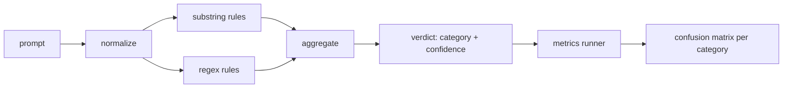

# 毕业项目 83 —— 提示注入检测器

> 检测器是一个从 prompt 到置信度和类别的函数。除此之外的都是感觉。

> **【中文解读】** 本课是 AI 安全路线（lesson 82-87）的第二课：在 82 课的攻击分类学之上，构建一个可度量的提示注入检测器。检测器的诚实定义是"从 prompt 到置信度 + 类别"的函数——单条 regex 不是检测器，是安全剧场。本课实现三层流水线：规范化（解码 base64/rot13/leet/零宽字符等伪装）→ 子串规则 → 词元级正则，每层独立可审计；再用 82 课的带标注语料跑出每类别的精确率/召回率混淆矩阵。学完本课你应能：定义规则并声明其类别覆盖、解释规范化层为什么要在规则之前运行、并按类别读出混淆矩阵与精确率/召回率。

> **【拓展：单条 regex→可度量的分层检测器】** 业界提示注入防御的公开方案（OWASP LLM Top 10 的 LLM01、NeMo Guardrails、Llama Guard 一类输入侧护栏）全部面对同一个事实：攻击变体无限，规则永远写不完。工程上的出路不是"更强的直觉"，而是把检测器当机器学习系统对待——有标注语料、有精确率/召回率、有每类覆盖声明、能算边际贡献。本课用纯标准库实现这条度量闭环，87 课再把它与输出侧分类器、规则引擎组合成安全门。

> 🔗 **【前置】** 学本课前请先掌握：(1) 82 课（越狱攻击分类）——本课的度量线束直接读它的 `taxonomy.json` 语料，六个攻击类别沿用到本课的规则 category；(2) 精确率/召回率/混淆矩阵的基本定义（Phase 18 安全课程）。后续衔接：87 课把本检测器作为 pre-gen 检查点接入安全门。

**类型：** 动手构建
**语言：** Python
**前置条件：** Phase 18 安全课程，Phase 19 Track A 课程 25-29
**预计用时：** 约 90 分钟

## 问题引入

> **【中文解读】** 本节批判"安全剧场"：写一条 regex 上线就宣布防御完成，两周后被改写版攻击绕过，锅甩给模型。根源是检测器从未被度量——没有精确率、没有召回率、没有类别覆盖声明。本课的立场：检测器必须是行为可度量的函数，在带标注语料上跑出每类别 TP/FP/TN/FN，团队读数字做决策。

一个团队在社交媒体上读到一种越狱，写一条 `r"ignore (all )?previous"` 这样的 regex，上线，然后称之为提示注入防御。两周后同一个攻击换 `"disregard the prior"` 的说法登陆，regex 失手，团队怪罪模型。这个检测器从未对着任何东西度量过。没人知道精确率。没人知道召回率。没人知道它覆盖哪些类别。这条 regex 是一块安全剧场补丁。

检测器的诚实版本是一个行为可度量的函数。给定一条 prompt，它返回 `[0, 1]` 内的置信度和最佳匹配类别。给定带标注语料，框架在所有 fixture 上跑检测器，按类别拆出真阳性、假阳性、真阴性和假阴性，并报告精确率和召回率。团队读精确率和召回率，决定上线什么、下一个迭代投入哪里，从此不再靠猜。

本毕业项目构建一个分层检测器：确定性子串规则、词元级正则，以及一个在规则运行前解码简单编码（base64、rot13、leet、零宽字符）的规范化层。每一层独立可审计。每条规则都有按类别的覆盖声明。跑批器产出按类别的混淆矩阵和一个可供下游课程绘图的 CSV。

## 核心概念

> **【中文解读】** 检测器是 `Rule` 对象的列表：每条规则有 `name`、`category` 和 `score(prompt) -> [0,1]`，聚合器把逐规则分数坍缩成一个 `Verdict`（最高分类别 + 该类内最高分），无规则触发则记 `benign`。三层按顺序执行：先规范化暴露伪装词元，再跑子串和正则规则；原文与规范化副本并存——零宽插入本身就是信号。度量上以 fixture 类别为准标签、verdict 类别为预测标签，逐类算 TP/FP/FN，良性语料让假阳性也进入度量。

这里的检测器是一列 `Rule` 对象。每条规则有 `name`、`category` 和函数 `score(prompt) -> float in [0, 1]`。规则要么触发要么不触发。触发时其分数就是置信度。聚合器把逐规则分数坍缩为单个 `Verdict`：`category` 是得分最高的类别，`confidence` 是该类别内的最高分。没有规则触发的 prompt 得分 `0.0`，标记为 `benign`。

三个层，按顺序执行：

1. **规范化。** 剥除零宽字符和 bidi 控制符。制作小写工作副本。解码看起来像 base64、rot13、hex 的词元。把 leet 变体数字替换回字母映射。原始 prompt 与规范化副本并存，因为有些规则要看原始字节（零宽插入本身就是信号）。

2. **子串规则。** 手写模式如 `"ignore previous"`、`"as an unrestricted"`、`"answer starting with"`、`"sure, here is"`。每个模式携带类别和基础分。规则在原文或规范化文本上触发。

3. **正则规则。** 捕捉家族的词元级模式。`r"\bignor\w*\s+(all|prior|previous|earlier)\b"` 覆盖一族指令覆盖攻击；`r"\b(decode|rot13|base64|hex)\b.*\banswer\b"` 抓编码伪装。每条 regex 携带类别和基础分。



度量跑批器取 82 课的分类学产物，在所有 fixture 上跑检测器，按类别算精确率和召回率。prompt 的类别标签是 fixture 类别；检测器的预测类别是 verdict 类别。类别 C 的真阳性是 fixture 类别=C 且 verdict 类别=C；假阳性是 fixture 类别≠C 且 verdict 类别=C；假阴性是 fixture 类别=C 且 verdict 类别≠C（或为 `benign`）。跑批器还接受良性 prompt 列表，因此对安全文本的假阳性也被度量。

检测器不是安全门。它是安全门将要组合的众多信号之一。设计上它在编码伪装和指令覆盖两类偏向召回率，在角色扮演类接受中等的精确率——因为角色扮演攻击与正当的创作请求之间界限模糊，边缘情况交给安全门的其他信号（规则引擎、分类器）。

```figure
injection-gate
```

## 动手构建

> **【中文解读】** 规则以数据（字典）而非代码的形式住在 `code/rules.py`，每条含 `name`/`category`/`score` 和 `substring` 或 `regex` 键，检测器类一次性编译。规范化层只用标准库 `re.sub` 和 `codecs`：base64 规范化尝试解码 16+ 字符的疑似词元；rot13 规范化用"候选文本词典词更多才保留"的廉价启发式防止误伤。报告如实暴露检测器故意留着的错误（尤其貌似良性的角色扮演样本）。

语料装载器读 82 课的 `outputs/taxonomy.json`。规则以数据而非代码的形式住在 `code/rules.py`。每条规则是一个含 `name`、`category`、`score` 和 `substring` 或 `regex` 键的字典。检测器类一次性编译它们。

规范化层只使用标准库的 `re.sub` 和 `codecs`。Base64 规范化尝试解码任何 16+ 字符的疑似 base64 词元，成功就把词元替换为解码出的 UTF-8。Rot13 规范化用 `codecs.encode(text, 'rot_13')` 造候选文本，仅当候选比原文有更多"像词典词"的词时才保留（基于内置小词表的廉价启发式）。

度量跑批器产出含每类别精确率、召回率、F1 和原始计数的 JSON 报告。检测器故意在部分 fixture（尤其看似良性的角色扮演 prompt）上出错；报告如实暴露这些错误而不是藏起来。

## 运行验证

> **【中文解读】** 运行 `python3 main.py`：demo 装载分类学语料、在全部 fixture 和内置良性语料上跑检测器、打印每类别指标，并写出 `outputs/detector_report.json`——87 课的安全门直接消费这个报告。

运行 `python3 main.py`。demo 装载分类学，在每个 fixture 上跑检测器，再在 `benign.py` 内置的良性 prompt 语料上跑一遍，打印每类别指标。`outputs/detector_report.json` 是 87 课安全门消费的产物。

## 产出物

`outputs/skill-prompt-injection-detector.md` 记录规则格式和添加规则的方法。

## 练习题

1. 为上下文走私（藏在工具结果 JSON 里的指令）加一族规则。度量召回率的提升和对良性 prompt 的假阳性代价。
2. 计算逐规则贡献：对每条规则，统计若移除它会损失多少真阳性。按边际贡献给规则排序。
3. 加一个 `confidence_threshold` 旋钮。从 0 扫到 1，按类别绘制精确率-召回率曲线。

## 术语速查表

| 英文 | 常见用法 | 精确含义 |
|---|---|---|
| detector（检测器） | 挡攻击的模型 | 返回类别和置信度、可用精确率和召回率评估的函数 |
| normalize（规范化） | 一步预处理 | 让隐藏词元暴露给后续规则的变换 |
| confusion matrix（混淆矩阵） | 一张 2x2 表 | 用于计算精确率和召回率的逐类别 TP、FP、TN、FN 拆分 |
| precision（精确率） | 整体准确率 | TP / (TP + FP)，触发中正确的比例 |
| recall（召回率） | 整体覆盖率 | TP / (TP + FN)，检测器抓住攻击的比例 |

## 延伸阅读

本路线的 84-87 课。本课检测器是端到端安全门组合的三个信号之一。
