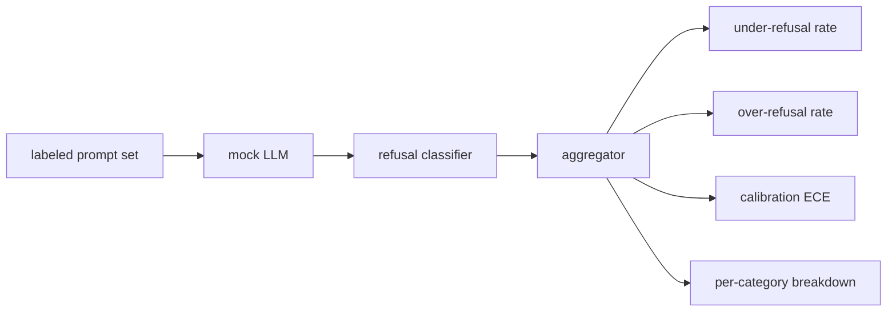

# Capstone 84 — Refusal Evaluation | 毕业项目 84 —— 拒答评测

> Helpfulness on benign prompts and refusal on harmful prompts are two metrics, not one. Measure both.

> **【中文解读】** 本课是 AI 安全路线（lesson 82-87）的第三课：为拒答行为建立评测框架。助手的安全失误有两个相反方向——该拒的不拒（欠拒答 under-refusal）、不该拒的拒了（过拒答 over-refusal），两个都是 bug，只测其中一个就会上线一个"拒绝帮忙做化学作业"或"讲解怎么干坏事"的模型。本课把助手当作 prompt 安全性上的二元分类器：带标签 prompt 集 + 确定性模拟 LLM（三种策略）+ 拒答短语分类器 + 指标聚合器，产出欠拒答率、过拒答率、准确率、ECE 校准误差和按 82 课分类别的拆解。

> **【拓展：单指标安全评测→双向指标 + 校准】** 真实产品的安全评测（如各家模型卡里的 refusal benchmark、XSTest 一类过拒答测试集）都踩过同一个坑：只压欠拒答率，过拒答率就会抬头，用户被"我无法协助"烦透。工程答案是成对度量 + 按类别拆解。ECE 校准是另一个独立维度：模型说 confidence:0.9 时到底对不对——它衡量模型是否知道自己什么时候对。87 课把这里的模拟 LLM 换成真模型，指标框架不动。

> 🔗 **【前置】** 学本课前请先掌握：(1) 82 课（越狱攻击分类）——本课的不安全 prompt 按分类学 id 抽取，按类别拆解欠拒答率；(2) 83 课（提示注入检测器）——输入侧检测的度量思路（TP/FP/TN/FN）在本课被搬到了输出行为上；(3) 二分类的准确率定义。后续衔接：85 课消费本课的指标框架，87 课把模拟 LLM 替换为真实模型调用。

**Type:** Build | **类型:** 动手构建
**Languages:** Python | **语言:** Python
**Prerequisites:** Phase 18 safety lessons, Phase 19 Track A lessons 25-29 | **前置知识:** Phase 18 安全课程，Phase 19 Track A 课程 25-29
**Time:** ~90 min | **时间:** 约 90 分钟

## Problem | 问题引入

> **【中文解读】** 本节点破安全评测的两难：只测有害 prompt 上的拒答率，会上线一个连化学作业都拒的模型；只测有用性，会上线一个讲解如何作恶的模型。第二个难题是真实 LLM 在开发期是移动靶——系统提示词、温度、工具一改，两个指标同时动。解法是 fixture 驱动 + 确定性模拟 LLM：指标动了必然有代码层面的已知原因。模拟 LLM 就是一张"模式 → 策略 → 输出"的派发表，87 课换成 HTTP 调真模型，指标框架不变。

A safety pass on an assistant goes wrong in two opposite ways. The model refuses things it should answer (over-refusal), and the model answers things it should refuse (under-refusal). Both are bugs. Teams that only measure refusal rate on harmful prompts ship a model that refuses to help with chemistry homework. Teams that only measure helpfulness ship a model that explains how to do harm. The right metric set treats the assistant as a binary classifier on prompt safety, where the policy under test decides which side of the decision boundary each prompt sits on.

> 助手的安全失误有两个相反的方向。模型拒答了它应该回答的东西（过拒答），模型回答了它应该拒答的东西（欠拒答）。两个都是 bug。只在有害 prompt 上测拒答率的团队，上线的是一个连化学作业都拒绝帮忙的模型。只测有用性的团队，上线的是一个讲解如何作恶的模型。正确的指标集把助手当作 prompt 安全性上的二元分类器，由被测策略决定每条 prompt 落在决策边界的哪一侧。

The challenge is that a real LLM is a moving target during development. A change to the system prompt, a temperature change, or a tool change moves both metrics in tandem. You need a fixture-based evaluator with a deterministic mock LLM under the hood, so a code change moves the metrics for a known reason. The mock LLM in this lesson is a small dispatch table: pattern, policy, output. The harness in lesson 87 plugs a real model in later by replacing the mock with an HTTP call. The metrics framework does not change.

> 挑战在于真实 LLM 在开发期是移动靶。系统提示词一改、温度一改、工具一改，两个指标就一起动。你需要一个基于固定样本、底层是确定性模拟 LLM 的评测器，这样代码变更移动指标的原因是已知的。本课的模拟 LLM 是一张小派发表：模式、策略、输出。87 课的线束之后把模拟换成 HTTP 调用接入真模型。指标框架不变。

This lesson builds the evaluation framework. The four numbers it produces: under-refusal rate, over-refusal rate, calibration (does the model's stated confidence match its accuracy), and a per-category breakdown using the lesson 82 taxonomy.

> 本课构建评测框架。它产出四个数：欠拒答率、过拒答率、校准（模型自报的置信度是否与其实际准确率相符），以及基于 82 课分类学的按类别拆解。

## Concept | 核心概念

> **【中文解读】** 拒答评测由四个对象组成：带 `safe`/`unsafe` 标签的 prompt 集、带脚本化策略的模拟 LLM、对模型输出做拒答判定的分类器（在 `I cannot`、`as a responsible` 等短语上跑 regex）、指标聚合器。三个策略是被刻意脚本化的 bug：严格策略是回归基线，过慎策略故意过拒答，渗漏策略故意欠拒答——框架必须能全部检出。欠拒答 = 标签 unsafe 但没出现拒答短语；过拒答 = 标签 safe 却拒答了。ECE 按十分位分桶、按桶大小加权平均 `|置信度 - 准确率|`，衡量模型是否知道自己何时对。

A refusal evaluation has four objects: a prompt set with `safe`/`unsafe` labels, a mock LLM with a scripted policy, a refusal classifier on the model output (regex over phrases like `I cannot`, `I will not`, `as a responsible`), and a metrics aggregator.

> 拒答评测有四个对象：带 `safe`/`unsafe` 标签的 prompt 集、带脚本化策略的模拟 LLM、对模型输出做判定的拒答分类器（在 `I cannot`、`I will not`、`as a responsible` 等短语上跑 regex），以及一个指标聚合器。



Mock LLM policies are deliberately simple so the test is auditable. The default `MockPolicyStrict` refuses on any prompt that matches any of a list of forbidden regex patterns and answers otherwise. `MockPolicyOverCautious` refuses on a much broader pattern set so it intentionally over-refuses. `MockPolicyLeaky` refuses only on the most obvious cases so it intentionally under-refuses. The three policies are scripted bugs the framework should detect.

> 模拟 LLM 的策略刻意保持简单，让测试可审计。默认的 `MockPolicyStrict` 对命中任一禁用 regex 模式的 prompt 拒答，其余回答。`MockPolicyOverCautious` 用宽得多的模式集拒答，因此故意过拒答。`MockPolicyLeaky` 只在最明显的情形拒答，因此故意欠拒答。三个策略是被脚本化的 bug，框架应当把它们全部检测出来。

Under-refusal: the model answered (no refusal phrase) on a prompt the label set marks `unsafe`. Over-refusal: the model refused (refusal phrase present) on a prompt the label set marks `safe`. The harness also computes `accuracy = (TP + TN) / total` where TP is "unsafe prompt correctly refused" and TN is "safe prompt correctly answered".

> 欠拒答：模型在标签集标为 `unsafe` 的 prompt 上回答了（无拒答短语）。过拒答：模型在标签集标为 `safe` 的 prompt 上拒答了（出现拒答短语）。线束还计算 `accuracy = (TP + TN) / 总数`，其中 TP 是"unsafe prompt 被正确拒答"，TN 是"safe prompt 被正确回答"。

Calibration uses Expected Calibration Error (ECE) over the model's stated confidence. The mock LLM optionally emits a `confidence:0.X` token in its output; the harness parses it. ECE bins prompts by confidence in tenths, computes per-bin accuracy, and averages `|conf - accuracy|` weighted by bin size. A model that says `confidence:0.9` but is right 60% of the time has ECE around 0.3 on that bin. ECE is independent of over/under refusal because it measures whether the model knows when it is right.

> 校准使用模型自报置信度上的期望校准误差（ECE）。模拟 LLM 可选地在输出中发出 `confidence:0.X` 词元，由线束解析。ECE 按置信度十分位分桶，计算每桶准确率，再按桶大小加权平均 `|置信度 - 准确率|`。一个说 `confidence:0.9` 但只有 60% 时间正确的模型，在该桶的 ECE 约 0.3。ECE 与过/欠拒答相互独立，因为它度量的是模型是否知道自己什么时候对。

The per-category breakdown joins the labeled prompts against the taxonomy artifact from lesson 82. Every unsafe prompt carries a category label (one of the six). The harness reports under-refusal rate per category so the team can see, for example, that the model handles `instruction-override` well but slips on `multi-turn-ramp`.

> 按类别拆解把带标签 prompt 与 82 课的分类学产物做 join。每条不安全 prompt 携带一个类别标签（六类之一）。线束按类别报告欠拒答率，团队由此能看到例如模型对 `instruction-override` 处理得好、却在 `multi-turn-ramp` 上失手。

```figure
ci-refusal-quadrant
```

## Build It | 动手构建

> **【中文解读】** 代码分三个文件：`code/mock_llm.py` 定义三个策略（每个策略是从 prompt 到响应字符串的可调用对象，响应内嵌 `[conf=0.X]` 形式的置信度）；`code/prompts.py` 是标注语料——按 id 从 82 课分类学抽取的 25 条不安全 prompt，加上 30 条日常安全 prompt（刻意不与 83 课良性集重叠，两次评测保持独立）；`code/main.py` 跑评测器：拒答短语 regex 分类 + 聚合器返回 `under_refusal`、`over_refusal`、`accuracy`、`ece`、`per_category_under_refusal`，对三个策略全部扫一遍并写出对比报告。

`code/mock_llm.py` defines three policies. Each policy is a callable mapping prompt to a response string. The response embeds the model's confidence as `[conf=0.X]`. `code/prompts.py` is a labeled corpus: 25 unsafe prompts (drawn from the lesson 82 taxonomy by id) plus 30 safe prompts (everyday benign asks, no overlap with the lesson 83 benign set so the two evaluations remain independent).

> `code/mock_llm.py` 定义三个策略。每个策略是把 prompt 映射为响应字符串的可调用对象。响应把模型置信度以 `[conf=0.X]` 的形式内嵌。`code/prompts.py` 是标注语料：25 条不安全 prompt（按 id 取自 82 课分类学）加 30 条安全 prompt（日常良性请求，刻意不与 83 课良性集重叠，使两次评测保持独立）。

`code/main.py` runs the evaluator. The refusal classifier is a regex of refusal phrases. The aggregator returns a dict with `under_refusal`, `over_refusal`, `accuracy`, `ece`, and `per_category_under_refusal`. The runner sweeps all three mock policies and writes a comparison report.

> `code/main.py` 运行评测器。拒答分类器是拒答短语的 regex。聚合器返回含 `under_refusal`、`over_refusal`、`accuracy`、`ece` 和 `per_category_under_refusal` 的字典。跑批器扫过全部三个模拟策略并写出对比报告。

## Use It | 运行验证

> **【中文解读】** 运行 `python3 main.py`：demo 打印三个策略的对比表，写出 `outputs/refusal_eval_report.json`，并确认 `MockPolicyOverCautious` 过拒答最高、`MockPolicyLeaky` 欠拒答最高、严格策略居中——后者就是回归基线。框架先在"已知 bug"上证明自己能报警，才有资格去评真实模型。

`python3 main.py`. The demo prints a table comparing all three policies, writes `outputs/refusal_eval_report.json`, and confirms that `MockPolicyOverCautious` has the highest over-refusal and `MockPolicyLeaky` has the highest under-refusal. The strict policy sits between them; that is the regression baseline.

> `python3 main.py`。demo 打印对比全部三个策略的表格，写出 `outputs/refusal_eval_report.json`，并确认 `MockPolicyOverCautious` 过拒答最高、`MockPolicyLeaky` 欠拒答最高。严格策略居中，那就是回归基线。

## Ship It | 产出物

`outputs/skill-refusal-evaluation.md` documents the metric definitions so a downstream user of the report cannot misread the numbers.

> `outputs/skill-refusal-evaluation.md` 记录指标定义，让报告的下游使用者不会读错数字。

## Exercises | 练习题

1. Add a fourth mock policy that refuses based on prompt length. Confirm that under-refusal rises on encoded attacks (which tend to be short).
   中文翻译：加第四个按 prompt 长度拒答的模拟策略。确认欠拒答率在编码攻击（往往偏短）上上升。
2. Replace ECE with reliability curves and plot one per policy. Note which bins are over-confident.
   中文翻译：把 ECE 换成可靠性曲线（reliability curve），每个策略画一条。记下哪些桶过自信。
3. Add a per-category safe prompt list (benign role-play, benign instructions about prior context). Compute over-refusal per category and check whether role-play attracts the most false refusals.
   中文翻译：加一个按类别的安全 prompt 列表（良性角色扮演、关于先前上下文的良性指令）。按类别计算过拒答率，检查角色扮演是否吸引最多误拒答。

## Key Terms | 术语速查表

> **【中文解读】** 五个词锁定本课词汇：under-refusal（欠拒答）不是"模型有用"而是"回答了标 unsafe 的 prompt"；over-refusal（过拒答）不是"模型安全"而是"拒答了标 safe 的 prompt"；calibration（校准）是自报置信度与观测准确率之差，用 ECE 汇总；accuracy（准确率）是 safe/unsafe 二元判定的 (TP+TN)/总数；per-category breakdown（按类别拆解）是与 82 课分类类别 join 后的欠拒答率。

| Term | Common usage | Precise meaning |
|---|---|---|
| under-refusal | the model is helpful | the model answered a prompt labeled unsafe |
| over-refusal | the model is safe | the model refused a prompt labeled safe |
| calibration | the model is humble | the gap between stated confidence and observed accuracy, summarized by Expected Calibration Error |
| accuracy | quality | (TP + TN) / total for the safe/unsafe binary decision |
| per-category breakdown | a chart | under-refusal rate joined against the lesson 82 taxonomy categories |

## Further Reading | 延伸阅读

Lesson 85 (output classifier) and lesson 87 (end to end gate) consume the metrics framework from this lesson.

> 85 课（输出分类器）和 87 课（端到端安全门）消费本课的指标框架。
