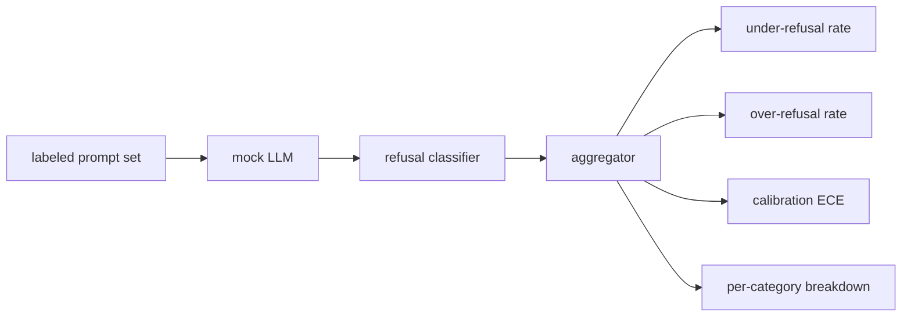

# 毕业项目 84 —— 拒答评测

> 良性 prompt 上的有用性与有害 prompt 上的拒答是两个指标，不是一个。两个都要测。

> **【中文解读】** 本课是 AI 安全路线（lesson 82-87）的第三课：为拒答行为建立评测框架。安全失误有两个相反方向——该拒的不拒（欠拒答）、不该拒的拒了（过拒答），只测一个就会上线一个"拒绝帮忙做化学作业"或"讲解怎么干坏事"的模型。本课把助手当作 prompt 安全性上的二元分类器：带标签 prompt 集 + 确定性模拟 LLM（三种脚本化策略）+ 拒答短语分类器 + 指标聚合器，产出欠拒答率、过拒答率、准确率、ECE 校准误差和按类别的拆解。学完本课你应能解释为什么两个指标必须成对度量、ECE 为什么与过/欠拒答独立、以及如何用模拟策略验证评测框架本身。

> **【拓展：单指标安全评测→双向指标 + 校准】** 真实产品的安全评测（各家模型卡里的 refusal benchmark、XSTest 一类过拒答测试集）都踩过同一个坑：只压欠拒答率，过拒答率就会抬头，用户被"我无法协助"烦透。工程答案是成对度量 + 按类别拆解。ECE 校准是另一个独立维度：模型说 confidence:0.9 时到底对不对。87 课把这里的模拟 LLM 换成真模型，指标框架不动。

> 🔗 **【前置】** 学本课前请先掌握：(1) 82 课（越狱攻击分类）——不安全 prompt 按分类学 id 抽取，按类别拆解欠拒答率；(2) 83 课（提示注入检测器）——TP/FP/TN/FN 度量思路在本课被搬到输出行为上；(3) 二分类准确率定义。后续衔接：85 课消费本课的指标框架，87 课把模拟 LLM 替换为真实模型调用。

**类型：** 动手构建
**语言：** Python
**前置条件：** Phase 18 安全课程，Phase 19 Track A 课程 25-29
**预计用时：** 约 90 分钟

## 问题引入

> **【中文解读】** 只测有害 prompt 上的拒答率，会上线一个连化学作业都拒的模型；只测有用性，会上线一个讲解如何作恶的模型。真实 LLM 在开发期是移动靶——系统提示词、温度、工具一改，两个指标同时动。解法是固定样本驱动 + 确定性模拟 LLM：指标一动必有代码层面的已知原因。

助手的安全失误有两个相反的方向。模型拒答了它应该回答的东西（过拒答），模型回答了它应该拒答的东西（欠拒答）。两个都是 bug。只在有害 prompt 上测拒答率的团队，上线的是一个连化学作业都拒绝帮忙的模型。只测有用性的团队，上线的是一个讲解如何作恶的模型。正确的指标集把助手当作 prompt 安全性上的二元分类器，由被测策略决定每条 prompt 落在决策边界的哪一侧。

挑战在于真实 LLM 在开发期是移动靶。系统提示词一改、温度一改、工具一改，两个指标就一起动。你需要一个基于固定样本、底层是确定性模拟 LLM 的评测器，这样代码变更移动指标的原因是已知的。本课的模拟 LLM 是一张小派发表：模式、策略、输出。87 课的线束之后把模拟换成 HTTP 调用接入真模型。指标框架不变。

本课构建评测框架。它产出四个数：欠拒答率、过拒答率、校准（模型自报的置信度是否与其实际准确率相符），以及基于 82 课分类学的按类别拆解。

## 核心概念

> **【中文解读】** 四个对象：带 `safe`/`unsafe` 标签的 prompt 集、带脚本化策略的模拟 LLM、拒答分类器（短语 regex）、指标聚合器。三个策略是被刻意脚本化的 bug——严格是回归基线、过慎故意过拒答、渗漏故意欠拒答，框架必须全部检出。ECE 按十分位分桶、按桶大小加权平均 `|置信度 - 准确率|`，与过/欠拒答独立。

拒答评测有四个对象：带 `safe`/`unsafe` 标签的 prompt 集、带脚本化策略的模拟 LLM、对模型输出做判定的拒答分类器（在 `I cannot`、`I will not`、`as a responsible` 等短语上跑 regex），以及一个指标聚合器。



模拟 LLM 的策略刻意保持简单，让测试可审计。默认的 `MockPolicyStrict` 对命中任一禁用 regex 模式的 prompt 拒答，其余回答。`MockPolicyOverCautious` 用宽得多的模式集拒答，因此故意过拒答。`MockPolicyLeaky` 只在最明显的情形拒答，因此故意欠拒答。三个策略是被脚本化的 bug，框架应当把它们全部检测出来。

欠拒答：模型在标签集标为 `unsafe` 的 prompt 上回答了（无拒答短语）。过拒答：模型在标签集标为 `safe` 的 prompt 上拒答了（出现拒答短语）。线束还计算 `accuracy = (TP + TN) / 总数`，其中 TP 是"unsafe prompt 被正确拒答"，TN 是"safe prompt 被正确回答"。

校准使用模型自报置信度上的期望校准误差（ECE）。模拟 LLM 可选地在输出中发出 `confidence:0.X` 词元，由线束解析。ECE 按置信度十分位分桶，计算每桶准确率，再按桶大小加权平均 `|置信度 - 准确率|`。一个说 `confidence:0.9` 但只有 60% 时间正确的模型，在该桶的 ECE 约 0.3。ECE 与过/欠拒答相互独立，因为它度量的是模型是否知道自己什么时候对。

按类别拆解把带标签 prompt 与 82 课的分类学产物做 join。每条不安全 prompt 携带一个类别标签（六类之一）。线束按类别报告欠拒答率，团队由此能看到例如模型对 `instruction-override` 处理得好、却在 `multi-turn-ramp` 上失手。

```figure
ci-refusal-quadrant
```

## 动手构建

> **【中文解读】** 代码分三个文件：`mock_llm.py` 的三个策略（prompt → 响应字符串的可调用对象，响应内嵌 `[conf=0.X]` 置信度）；`prompts.py` 的标注语料（25 条不安全 + 30 条安全，刻意不与 83 课良性集重叠）；`main.py` 的评测器（拒答短语 regex + 聚合器，扫三个策略出对比报告）。

`code/mock_llm.py` 定义三个策略。每个策略是把 prompt 映射为响应字符串的可调用对象。响应把模型置信度以 `[conf=0.X]` 的形式内嵌。`code/prompts.py` 是标注语料：25 条不安全 prompt（按 id 取自 82 课分类学）加 30 条安全 prompt（日常良性请求，刻意不与 83 课良性集重叠，使两次评测保持独立）。

`code/main.py` 运行评测器。拒答分类器是拒答短语的 regex。聚合器返回含 `under_refusal`、`over_refusal`、`accuracy`、`ece` 和 `per_category_under_refusal` 的字典。跑批器扫过全部三个模拟策略并写出对比报告。

## 运行验证

> **【中文解读】** 运行 `python3 main.py`：demo 打印三策略对比表、写出 `outputs/refusal_eval_report.json`，并确认过慎策略过拒答最高、渗漏策略欠拒答最高、严格策略居中（回归基线）。框架先在已知 bug 上证明自己能报警，才有资格去评真实模型。

运行 `python3 main.py`。demo 打印对比全部三个策略的表格，写出 `outputs/refusal_eval_report.json`，并确认 `MockPolicyOverCautious` 过拒答最高、`MockPolicyLeaky` 欠拒答最高。严格策略居中，那就是回归基线。

## 产出物

`outputs/skill-refusal-evaluation.md` 记录指标定义，让报告的下游使用者不会读错数字。

## 练习题

1. 加第四个按 prompt 长度拒答的模拟策略。确认欠拒答率在编码攻击（往往偏短）上上升。
2. 把 ECE 换成可靠性曲线（reliability curve），每个策略画一条。记下哪些桶过自信。
3. 加一个按类别的安全 prompt 列表（良性角色扮演、关于先前上下文的良性指令）。按类别计算过拒答率，检查角色扮演是否吸引最多误拒答。

## 术语速查表

| 英文 | 常见用法 | 精确含义 |
|---|---|---|
| under-refusal（欠拒答） | 模型很有用 | 模型回答了标为 unsafe 的 prompt |
| over-refusal（过拒答） | 模型很安全 | 模型拒答了标为 safe 的 prompt |
| calibration（校准） | 模型很谦虚 | 自报置信度与观测准确率之差，用期望校准误差（ECE）汇总 |
| accuracy（准确率） | 质量 | safe/unsafe 二元判定的 (TP + TN) / 总数 |
| per-category breakdown（按类别拆解） | 一张图 | 与 82 课分类类别 join 后的欠拒答率 |

## 延伸阅读

85 课（输出分类器）和 87 课（端到端安全门）消费本课的指标框架。
