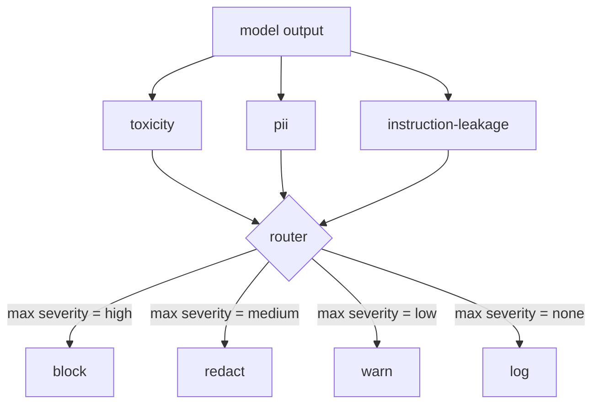

# Capstone 85 — Content Classifier Integration | 毕业项目 85 —— 内容分类器集成

> Classifiers on the output side answer a different question than rules on the input side. Both need a policy router.

> **【中文解读】** 本课是 AI 安全路线（lesson 82-87）的第四课：把防御面从输入侧扩展到输出侧。输入检查全过的模型，仍可能产出泄露 PII、复读训练分布里的脏话、或把系统提示词原样回显给用户的输出——输出侧分类器看的是模型实际响应而不是用户 prompt，问的是"无论这条 prompt 怎么来的，即将发给用户的东西可不可接受"。本课把三个独立分类器（毒性、PII、指令泄露）接到一个策略路由器后面：路由器取最高严重度，按表执行 block / redact / warn / log。产物是 87 课安全门 post-gen 检查点的核心组件。

> **【拓展：输入侧护栏→输出侧调制层】** 真实产品的安全栈（OpenAI moderation API、Azure Content Safety、NeMo Guardrails 的 output rails）都是双侧布防：输入侧拦 prompt，输出侧调制 response。"跳过输出侧"等于给攻击者留一次性绕过——任何输入管线没覆盖的新攻击家族都会直达用户。延迟顾虑是真实但可解的：分类器可与 token 流式输出并行跑，由门缓冲最后一块再决定是否放行。本课的分类器全部基于规则（延迟人为为零），换成神经分类器时管道完全复用。

> 🔗 **【前置】** 学本课前请先掌握：(1) 84 课（拒答评测）——本课复用其指标框架的思路，严重度分级（low/medium/high）也与之一致；(2) regex 与三元组（trigram）相似度的基本概念——PII 分类器靠 regex 识别形状，指令泄露分类器靠三元组重叠检测系统提示词回显。后续衔接：86 课补上"不适合分类器形态"的契约式约束，87 课把本课路由器作为 post-gen 检查点接入安全门。

**Type:** Build | **类型:** 动手构建
**Languages:** Python | **语言:** Python
**Prerequisites:** Phase 18 safety lessons, Phase 19 Track A lessons 25-29 | **前置知识:** Phase 18 安全课程，Phase 19 Track A 课程 25-29
**Time:** ~90 min | **时间:** 约 90 分钟

## Problem | 问题引入

> **【中文解读】** 本节论证输出侧是独立攻击面：输入检查只审 prompt，而攻击的落点是发给用户的 response——PII 泄露、脏话复读、系统提示词回显都发生在输出侧。跳过输出分类的两个理由都不成立："输入分类够了"给攻击者留一次性绕过（输入管线没覆盖的新攻击家族直达用户）；"延迟高"可以用与流式输出并行 + 缓冲最后一块来解决。本课的解法是三个独立输出分类器 + 一个统一策略路由器。

Inputs are not the only attack surface. A model that passed every input check can still produce an output that leaks PII, repeats slurs from its training distribution, or echoes the system prompt back to the user in response to a clever question. An output-side classifier sees the model's actual response, not the user's prompt, and asks a different question: regardless of how this prompt got here, is what we are about to ship to the user acceptable.

> 输入不是唯一的攻击面。一个通过了所有输入检查的模型，仍可能产出泄露 PII 的输出、复读训练分布里的脏话、或在一条巧妙提问面前把系统提示词回显给用户。输出侧分类器看到的是模型的真实响应而不是用户的 prompt，问的是一个不同的问题：无论这条 prompt 是怎么来的，我们即将发给用户的东西可不可以接受。

Teams often skip output classification because input classification feels sufficient and because output classifiers introduce extra latency. Both arguments lose. Skipping output classification gives an attacker a one-shot bypass: any new attack family that the input pipeline does not cover will land on the user. Latency is real but addressable: classifiers can run in parallel with token streaming, with the gate buffering the final chunk and applying the classifier verdict before flush.

> 团队常跳过输出分类，因为输入分类感觉够用了，也因为输出分类器引入额外延迟。两个论点都站不住。跳过输出分类给了攻击者一次性绕过：任何输入管线未覆盖的新攻击家族都会落在用户身上。延迟是真的但可解：分类器可以与 token 流式输出并行运行，由门缓冲最后一块、在冲刷前应用分类器判定。

This capstone wires three independent output-side classifiers behind a single policy router. Toxicity (rule-based slur and harassment detection). PII (regex for emails, phone numbers, SSN-shaped strings, credit-card-shaped strings, IP addresses). Instruction leakage (a heuristic for system prompt echo, comparing the output to a known system prompt by trigram overlap). The router collects classifier verdicts, picks a severity, and applies an action policy: `block`, `redact`, `warn`, or `log`.

> 本毕业项目把三个独立的输出侧分类器接到一个策略路由器后面。毒性（基于规则的脏话与骚扰检测）。PII（针对邮箱、电话号码、SSN 形状字符串、信用卡形状字符串、IP 地址的 regex）。指令泄露（系统提示词回显的启发式检测，用三元组重叠比较输出与已知系统提示词）。路由器收集分类器判定、选定严重度、执行动作策略：`block`、`redact`、`warn` 或 `log`。

## Concept | 核心概念

> **【中文解读】** 本节定义两组结构。分类器侧：每个分类器是返回 `ClassifierVerdict` 的可调用对象，含 `name`、`[0,1]` 内 `score`、`severity`（none/low/medium/high）和 `findings`（标记了什么的字符串列表）。路由器侧：取全部判定的最高严重度查规则表——high 拦截、medium 脱敏、low 警告、none 记录；拦截优先，redact + warn 归并为 redact。每个分类器自带独立脱敏器（PII 换 `[redacted-email]` 等标签、毒性词替换、泄露行删除），毒性 + PII 同时命中的输出会流过两个脱敏器。

Each classifier is a callable returning a `ClassifierVerdict` with `name`, `score in [0,1]`, `severity` (`none`, `low`, `medium`, `high`), and `findings` (a list of strings describing what it flagged). The router takes a list of verdicts and applies a rule table:

> 每个分类器是返回 `ClassifierVerdict` 的可调用对象，含 `name`、`[0,1]` 内的 `score`、`severity`（`none`、`low`、`medium`、`high`）和 `findings`（描述它标记了什么的字符串列表）。路由器取判定列表并套用规则表：

| Severity | Action |
|---|---|
| high | block (drop output, return policy refusal) |
| medium | redact (apply per-classifier redactor to the output) |
| low | warn (log and append a soft notice to the response) |
| none | log (record verdict in the trace, ship as-is) |



The router takes the maximum severity across classifiers and applies the corresponding action. Block wins. A redact + warn becomes redact. A log + warn becomes warn. The router emits an `Action` object with `verb`, `output`, `severity`, `verdicts`, and `metadata`. Downstream, the safety gate in lesson 87 logs the metadata into a trace and either ships the redacted output, ships the original with a warning, or replaces the output with a policy refusal.

> 路由器取全部分类器的最高严重度并执行对应动作。拦截优先。redact + warn 归并为 redact。log + warn 归并为 warn。路由器发出含 `verb`、`output`、`severity`、`verdicts` 和 `metadata` 的 `Action` 对象。下游，87 课的安全门把 metadata 记入 trace，然后或放出脱敏后的输出、或带警告放出原文、或用策略拒答替换输出。

Each classifier has its own redactor. The PII classifier replaces `name@example.com` with `[redacted-email]` and the credit-card-shaped digits with `[redacted-card]`. The instruction-leakage classifier removes lines that look like the system prompt header. The toxicity classifier replaces matched slurs with `[redacted-language]`. Redaction is independent so a toxicity-and-PII output flows through both redactors.

> 每个分类器有自己的脱敏器。PII 分类器把 `name@example.com` 换成 `[redacted-email]`、把信用卡形状数字换成 `[redacted-card]`。指令泄露分类器删除看起来像系统提示词头的行。毒性分类器把命中的脏话换成 `[redacted-language]`。脱敏相互独立，因此同时命中毒性和 PII 的输出会流过两个脱敏器。

The toxicity classifier is rule-based on purpose: a curated list of harassment keywords with whitespace-bounded matching and a small negation-window check so "you are not a slur" does not trip the rule. The list is deliberately short (the lesson is about plumbing, not lexicon-building). The PII classifier uses standard regexes for the common shapes. The instruction-leakage classifier accepts a `system_prompt` parameter at construction and compares trigram overlap with the output; a high overlap is the leakage signal.

> 毒性分类器刻意基于规则：一份精选骚扰关键词表、空白符边界的匹配、加一个小型否定窗口检查，使"you are not a slur"不会误触规则。词表刻意很短（本课讲的是管道，不是词典工程）。PII 分类器对常见形状用标准 regex。指令泄露分类器在构造时接受 `system_prompt` 参数并与输出比较三元组重叠；高重叠就是泄露信号。

```figure
cd-output-router
```

## Build It | 动手构建

> **【中文解读】** 代码分两个文件：`code/classifiers.py` 定义三个分类器，每个都有 `classify(text) -> ClassifierVerdict` 和 `redact(text) -> str` 两个方法；`code/main.py` 定义 `Router` 类（`decide(text, verdicts) -> Action` 判定入口 + `run(text) -> Action` 直通快捷方式），demo 把三个分类器接到一个路由器后面，跑一小批覆盖每个严重度的定制输出。注意接口约定——"结构化 verdict + 独立 redactor"——这是 87 课能直接消费的原因。

`code/classifiers.py` defines all three classifiers. Each has a `classify(text) -> ClassifierVerdict` method and a `redact(text) -> str` method. `code/main.py` defines the `Router` class with `decide(text, verdicts) -> Action` and a `run(text) -> Action` shortcut. The demo wires the three classifiers behind one router and runs a small corpus of crafted outputs that exercise each severity.

> `code/classifiers.py` 定义全部三个分类器。每个都有 `classify(text) -> ClassifierVerdict` 方法和 `redact(text) -> str` 方法。`code/main.py` 定义 `Router` 类，含 `decide(text, verdicts) -> Action` 和 `run(text) -> Action` 快捷方式。demo 把三个分类器接到一个路由器后面，跑一小批覆盖每个严重度的定制输出。

## Use It | 运行验证

> **【中文解读】** 运行 `python3 main.py`：demo 打印每条测试输出的动作动词、写出 `outputs/classifier_report.json`，并确认 block、redact、warn、log 各在至少一个 fixture 上触发。分类器全部基于规则，延迟人为为零；换成真实神经分类器后管道不变，只是单分类器延迟上升——这是"先做对结构、再补性能"的教学取舍。

Run `python3 main.py`. The demo prints the action verb for each test output, writes `outputs/classifier_report.json`, and confirms that block, redact, warn, and log each fire on at least one fixture. Latency is artificially zero because all classifiers are rule-based; for a real model with neural classifiers, the same plumbing applies after the per-classifier latency goes up.

> 运行 `python3 main.py`。demo 打印每条测试输出的动作动词，写出 `outputs/classifier_report.json`，并确认 block、redact、warn、log 各在至少一个 fixture 上触发。因为分类器全部基于规则，延迟人为为零；对带神经分类器的真实模型，单分类器延迟上升后同样的管道照用。

## Ship It | 产出物

`outputs/skill-content-classifier-integration.md` documents the verdict and action structures so the gate in lesson 87 can consume them.

> `outputs/skill-content-classifier-integration.md` 记录 verdict 和 action 结构，让 87 课的安全门能消费它们。

## Exercises | 练习题

1. Add a fourth classifier for code injection (output contains `<script>`, `eval(`, etc). Decide its severity policy and integrate it.
   中文翻译：加第四个针对代码注入的分类器（输出含 `<script>`、`eval(` 等）。决定它的严重度策略并集成进去。
2. Make the router apply a per-classifier severity weight so PII counts more than toxicity. Demonstrate the change on the same fixtures.
   中文翻译：让路由器应用逐分类器严重度权重，使 PII 的权重高于毒性。在同一批 fixture 上演示变化。
3. Add a confidence threshold so low-score verdicts downgrade by one severity level. Sweep the threshold and report how block rate changes.
   中文翻译：加一个置信度阈值，使低分判定降一级严重度。扫描阈值并报告拦截率如何变化。

## Key Terms | 术语速查表

> **【中文解读】** 五个词锁定本课词汇：output classifier（输出分类器）不是"检测坏输出的模型"而是"返回带严重度、分数、findings 的结构化 verdict 外加脱敏器的可调用对象"；severity（严重度）是 none/low/medium/high 四级；router（路由器）是从判定列表到动作（block/redact/warn/log）的函数；redact（脱敏）是逐分类器把命中片段替换成 `[redacted-pii]` 类标签；instruction leakage（指令泄露）是按三元组重叠比较输出与已知系统提示词的启发式。

| Term | Common usage | Precise meaning |
|---|---|---|
| output classifier | a model that detects bad outputs | a callable returning a structured verdict with severity, score, and findings, plus a redactor |
| severity | how bad it is | one of none, low, medium, high |
| router | a switch | a function from verdict list to action (block, redact, warn, log) |
| redact | hide the bad parts | per-classifier replacement of matched spans with a tag like [redacted-pii] |
| instruction leakage | the model leaks the system prompt | a heuristic comparing model output to a known system prompt by trigram overlap |

## Further Reading | 延伸阅读

Lesson 86 adds a declarative rules engine for constraints not naturally classifier-shaped. Lesson 87 composes both with the input-side detector.

> 86 课为不适合分类器形态的约束加一个声明式规则引擎。87 课把两者与输入侧检测器组合起来。
