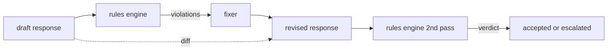

# Capstone 86 — Constitutional Rules Engine | 毕业项目 86 —— 宪法规则引擎

> A rule is a name, a predicate, and an explanation. Anything missing one of those three is a vibe, not a rule.

> **【中文解读】** 本课是 AI 安全路线（lesson 82-87）的第五课：用声明式规则引擎表达"分类器不擅长"的契约式约束。分类器覆盖"可识别的失败"（毒性、PII），规则引擎覆盖"合同式的失败"——"含代码的响应必须以可运行块或明确假设收尾"、"每次拒答必须给出下一步"。一条规则 = 名称 + 谓词 + 解释，缺一个是感觉不是规则。宪法放在 YAML 文件里随代码进版本控制、走独立评审。本课的另一半是修订：引擎标记违规后，修复器（fixer）产出修订响应，引擎二次评审确认，并给出结构化 diff。87 课把本引擎与检测器、分类器组合成安全门。

> **【拓展：Constitutional AI→宪法式规则的工程形态】** "宪法式（constitutional）"一词来自 Constitutional AI：把行为约束写成显式原则集，而非隐式地埋进微调数据。本课把它落到工程可操作的形态——原则变成 YAML 谓词规则，可评审、可版本化、可逐条测。真实系统里，NeMo Guardrails 的 Colang 流程约束、各家企业的 LLM 使用规范（acceptable-use policy）落地检查，都是"约束文件 + 评审流程"的路数。规则引擎只做局部编辑；结构性重写属于单独的"拒答并求助"层。

> 🔗 **【前置】** 学本课前请先掌握：(1) 85 课（内容分类器集成）——严重度三级（low/medium/high）沿用，85 课的 high 分类器判定和本课 high 规则违规在下游等价；(2) regex 谓词与 YAML/JSON 数据格式基础。后续衔接：87 课把本引擎作为 post-gen 检查点与分类器路由器并列接入安全门，fixer 在 redact 动作里被调用。

**Type:** Build | **类型:** 动手构建
**Languages:** Python, YAML | **语言:** Python、YAML
**Prerequisites:** Phase 18 safety lessons, Phase 19 Track A lessons 25-29 | **前置知识:** Phase 18 安全课程，Phase 19 Track A 课程 25-29
**Time:** ~90 min | **时间:** 约 90 分钟

## Problem | 问题引入

> **【中文解读】** 本节划定分类器与规则引擎的分工：分类器覆盖可识别失败（毒性、PII 有形状可循），规则引擎覆盖契约式失败（"每次拒答必须给下一步"是对响应的谓词判断，不是模式识别）。这类约束的正确载体是声明式文件——宪法（YAML）随代码进版本控制、走独立评审，非工程师也能读懂。规则用 `all_of`/`any_of`/`not_` 组合谓词，一条规则可表达"含代码则必须以可运行块收尾且不得引用内部库"。另一半是修订闭环：草稿 → 引擎标违规 → 修复器改 → 引擎二次确认，外加逐行结构化 diff 供人工审计。

Classifiers cover the recognizable failures. Rules engines cover the contractual ones. A team writing a coding assistant wants a constraint like "every response that contains code must end in either a runnable block or a stated assumption." A team running a customer support bot wants "every refusal must offer a next step." These constraints are not natural classifier targets. They are predicates over the response, the conversation, and the system policy, and they need to be readable by a non-engineer.

> 分类器覆盖可识别的失败。规则引擎覆盖契约式的失败。写编程助手的团队想要"每个含代码的响应必须以可运行块或明确假设收尾"这样的约束。跑客服机器人的团队想要"每次拒答必须提供下一步"。这些约束不是天然的分类器目标。它们是对响应、对话和系统策略的谓词，而且需要让非工程师也能读懂。

The honest representation is a declarative file. A constitution lives in YAML alongside the code, in version control, with a separate review process. Each rule has a `name`, a `predicate`, a `severity`, and an `explanation` template. The engine loads the file, evaluates each rule against the candidate output, and returns a structured `Violation` per rule that fired. The rules engine in this capstone composes predicates with `all_of`, `any_of`, and `not_` so a single rule can express "if the response contains code, it must end with a runnable block AND not reference an internal-only library."

> 诚实的表达是声明式文件。宪法以 YAML 的形式与代码同住版本库、走独立评审流程。每条规则有 `name`、`predicate`、`severity` 和 `explanation` 模板。引擎装载文件、对候选输出逐条求值、为每条触发的规则返回结构化 `Violation`。本毕业项目的规则引擎用 `all_of`、`any_of` 和 `not_` 组合谓词，使单条规则能表达"若响应含代码，则必须以可运行块收尾且不得引用内部专用库"。

The other half of the lesson is revision. A rule engine that only blocks is half-built. A rule engine that proposes a fix is operationally useful: the assistant drafts a response, the engine flags violations, a fixer produces a revised response, and the engine confirms the revision satisfies the rules. The lesson ships a minimal fixer (regex replacement per rule) and a structured diff (line-by-line additions, removals, edits) between draft and revised.

> 本课的另一半是修订。只会拦截的规则引擎只建了一半。能提出修复的规则引擎才有运营价值：助手起草响应、引擎标记违规、修复器产出修订响应、引擎确认修订满足规则。本课附带一个最小修复器（逐规则的 regex 替换）和草稿与修订之间的结构化 diff（逐行的增、删、改）。

## Concept | 核心概念

> **【中文解读】** 本节定义规则语法与执行模型：先评估 `applies_when`（适用条件），不适用则记 `not_applicable`——引擎显式求值过的规则和根本没跑的规则在报告里可区分；适用则评估 `must`，产出 `pass` 或 `violation`。原子谓词有六个（contains_regex、ends_with 等），组合算子 `all_of`/`any_of`/`not_` 递归求值、`any_of` 短路。修复器是声明式操作表（append_if_missing 等），刻意只做局部编辑；diff 是 add/remove/edit 的 `Change` 记录列表，供下游网关记入日志供人工审计。



A rule has the shape

> 一条规则长这样

```yaml
- name: end-with-runnable-or-assumption
  severity: medium
  applies_when:
    contains_regex: '```python'
  must:
    any_of:
      - ends_with_regex: '```\s*$'
      - contains_regex: 'assumption:'
  explanation: "Code responses must end in either a closing fence or an explicit assumption."
  fix:
    append_if_missing: "\n\nAssumption: example inputs are valid."
```

Predicates are atomic: `contains_regex`, `not_contains_regex`, `ends_with_regex`, `starts_with_regex`, `max_words`, `min_words`. Compositions are `all_of`, `any_of`, `not_`. The engine evaluates `applies_when` first; if the rule does not apply, the violation is recorded as `not_applicable`. Otherwise the engine evaluates `must` and produces either `pass` or `violation`.

> 谓词是原子的：`contains_regex`、`not_contains_regex`、`ends_with_regex`、`starts_with_regex`、`max_words`、`min_words`。组合算子是 `all_of`、`any_of`、`not_`。引擎先求值 `applies_when`；规则不适用则记为 `not_applicable`。否则引擎求值 `must`，产出 `pass` 或 `violation`。

Severities are `low`, `medium`, `high`, mirroring lesson 85. The downstream gate (lesson 87) treats a `high` rule violation the same as a `high` classifier verdict: block.

> 严重度为 `low`、`medium`、`high`，与 85 课对齐。下游网关（87 课）把 `high` 规则违规与 `high` 分类器判定同等对待：拦截。

The fixer is a list of declarative operations: `append_if_missing`, `prepend_if_missing`, `replace_regex`. Each operation maps a rule by name to a transform. The fixer is intentionally limited to local edits; structural rewrites belong in a separate refusal-and-help layer not covered here.

> 修复器是一列声明式操作：`append_if_missing`、`prepend_if_missing`、`replace_regex`。每个操作按名称把规则映射到一个变换。修复器刻意限于局部编辑；结构性重写属于本课未覆盖的单独"拒答并求助"层。

The diff is computed against the original and the revised. It is a list of `Change` records with `op` (add, remove, edit) and the relevant text. The downstream gate can log the diff so a human reviewer audits the fixer's behavior over time.

> diff 在原文与修订之间计算。它是一列带 `op`（add、remove、edit）和相关文本的 `Change` 记录。下游网关可以把 diff 记入日志，让人工评审者随时间审计修复器的行为。

```figure
cd-constitution-loop
```

## Build It | 动手构建

> **【中文解读】** 代码分三块：`code/rules.yml` 是宪法本体；`code/main.py` 的装载器在 PyYAML 可用时读 YAML、否则走 JSON 路径（课程测试两条路径都验）；`Engine`、`Fixer` 类和 `diff` 函数也在 `main.py`，组合谓词递归求值、`any_of` 短路。出厂宪法六条规则覆盖三类约束：格式类（拒答给建议、代码块收尾、引用要括注）、内容类（示例不得含 PII、不得泄内部库名）、长度类（800 词上限）。严重度分布刻意分层，供 87 课的聚合表消费。

`code/rules.yml` holds the constitution. The loader in `code/main.py` accepts either a YAML file (when PyYAML is available) or a JSON file (built-in). The lesson ships a `rules.yml` that the lesson tests parse by both code paths. `code/main.py` defines the `Engine` and `Fixer` classes and a `diff` function. Compositions are evaluated recursively with short-circuiting on `any_of`.

> `code/rules.yml` 装着宪法。`code/main.py` 的装载器既接受 YAML 文件（PyYAML 可用时）也接受 JSON 文件（内置）。本课附带的 `rules.yml` 被课程测试用两条代码路径各解析一遍。`code/main.py` 定义 `Engine` 和 `Fixer` 类以及一个 `diff` 函数。组合谓词递归求值，`any_of` 短路。

The constitution as shipped:

> 出厂宪法：

- `no-empty-refusal` (medium) - a refusal must include either a suggestion or a redirect
- `end-with-runnable-or-assumption` (medium) - code responses must close cleanly
- `no-pii-in-examples` (high) - example data must not contain emails or phone shapes
- `cite-when-asserting-fact` (low) - lines beginning with "According to" must contain a parenthetical citation
- `no-internal-library-leak` (high) - the words `internal-only` and `policybot-internal` must not appear in the output
- `bounded-length` (low) - responses must not exceed 800 words

> - `no-empty-refusal`（medium）——拒答必须包含建议或转向
> - `end-with-runnable-or-assumption`（medium）——代码响应必须干净收尾
> - `no-pii-in-examples`（high）——示例数据不得含邮箱或电话形状
> - `cite-when-asserting-fact`（low）——以 "According to" 开头的行必须带括注引用
> - `no-internal-library-leak`（high）——输出中不得出现 `internal-only` 和 `policybot-internal`
> - `bounded-length`（low）——响应不得超过 800 词

## Use It | 运行验证

> **【中文解读】** 运行 `python3 main.py`：demo 把三个草稿响应跑过引擎、打印违规、跑修复器、打印 diff、写出 `outputs/rules_report.json`。一个 fixture 的草稿没有代码块，对应规则在报告里显式记为 `not_applicable`——团队由此看到引擎确实评估过它，而不是悄悄跳过。这个区分是审计的关键。

`python3 main.py`. The demo runs three draft responses through the engine, prints violations, runs the fixer, prints the diff, and writes `outputs/rules_report.json`. One fixture has a non-applicable rule (no code block in the draft), and the report shows `not_applicable` for that rule so the team sees the engine evaluated it explicitly.

> `python3 main.py`。demo 把三个草稿响应跑过引擎、打印违规、跑修复器、打印 diff，并写出 `outputs/rules_report.json`。一个 fixture 有一条不适用的规则（草稿里没有代码块），报告对该规则显示 `not_applicable`，让团队看到引擎显式评估过它。

## Ship It | 产出物

`outputs/skill-constitutional-rules-engine.md` documents the rule grammar and the fixer operations.

> `outputs/skill-constitutional-rules-engine.md` 记录规则文法和修复器操作。

## Exercises | 练习题

1. Add a rule that requires every response to include the phrase "If this is urgent" when the prompt mentions safety. Use composition.
   中文翻译：加一条规则——当 prompt 提到安全时，要求每个响应包含短语 "If this is urgent"。用组合算子实现。
2. Replace the regex fixer with a templating fixer that takes named slots. Demonstrate one rule rewritten under the new design.
   中文翻译：把 regex 修复器换成接受命名槽位的模板修复器。演示一条规则在新设计下的改写。
3. Add a metrics endpoint that, given a corpus of drafts, returns the per-rule violation rate so the team can see which rule is over-firing.
   中文翻译：加一个指标端点——给定草稿语料，返回逐规则违规率，让团队看到哪条规则过度触发。

## Key Terms | 术语速查表

> **【中文解读】** 五个词锁定本课词汇：constitution（宪法）不是模糊的政策文档而是带谓词、严重度、解释的 YAML 规则文件；predicate（谓词）是从文本到布尔的原子或组合（all_of/any_of/not_）可调用对象；violation（违规）是带规则名、严重度、解释、命中片段的结构化记录；fixer（修复器）不是微调模型而是逐规则确定性的草稿→修订变换；diff 是 add/remove/edit 操作的结构化列表。

| Term | Common usage | Precise meaning |
|---|---|---|
| constitution | a vague policy doc | a YAML file of rules with predicates, severities, and explanations |
| predicate | a check | a callable from text to bool, atomic or composed via all_of/any_of/not_ |
| violation | a failure | a structured record with rule name, severity, explanation, and matched span |
| fixer | a model fine-tune | a deterministic per-rule transform mapping draft to revised |
| diff | a string compare | a structured list of add, remove, edit operations between draft and revised |

## Further Reading | 延伸阅读

Lesson 87 composes this engine with the input-side detector and the output-side classifier into a single safety gate.

> 87 课把本引擎与输入侧检测器、输出侧分类器组合成单个安全门。
