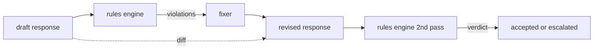

# 毕业项目 86 —— 宪法规则引擎

> 一条规则 = 名称 + 谓词 + 解释。缺了这三者之一的是感觉，不是规则。

> **【中文解读】** 本课是 AI 安全路线（lesson 82-87）的第五课：用声明式规则引擎表达"分类器不擅长"的契约式约束。分类器覆盖可识别失败（毒性、PII），规则引擎覆盖契约式失败——"含代码的响应必须以可运行块或明确假设收尾"、"每次拒答必须给出下一步"。宪法放在 YAML 文件里随代码进版本控制、走独立评审。本课的另一半是修订闭环：引擎标记违规、修复器产出修订、引擎二次确认，外加结构化 diff。学完本课你应能读懂并编写规则文法、解释 `applies_when` 与 `must` 的两段式求值、并设计带审计 trail 的自动修复流程。

> **【拓展：Constitutional AI→宪法式规则的工程形态】** "宪法式（constitutional）"一词来自 Constitutional AI：把行为约束写成显式原则集，而非隐式埋进微调数据。本课把它落到工程可操作的形态——原则变成 YAML 谓词规则，可评审、可版本化、可逐条测。真实系统里，NeMo Guardrails 的 Colang 流程约束、各家企业的 LLM 使用规范落地检查，都是"约束文件 + 评审流程"的路数。规则引擎只做局部编辑；结构性重写属于单独的"拒答并求助"层。

> 🔗 **【前置】** 学本课前请先掌握：(1) 85 课（内容分类器集成）——严重度三级沿用，85 课的 high 分类器判定和本课 high 规则违规在下游等价；(2) regex 谓词与 YAML/JSON 数据格式基础。后续衔接：87 课把本引擎作为 post-gen 检查点接入安全门，fixer 在 redact 动作里被调用。

**类型：** 动手构建
**语言：** Python、YAML
**前置条件：** Phase 18 安全课程，Phase 19 Track A 课程 25-29
**预计用时：** 约 90 分钟

## 问题引入

> **【中文解读】** 分类器与规则引擎分工：可识别失败归分类器（有形状可循），契约式失败归规则引擎（对响应的谓词判断）。正确载体是声明式文件——宪法（YAML）随代码进版本控制，非工程师也能读懂。规则用 `all_of`/`any_of`/`not_` 组合谓词；修订闭环让引擎不止拦截还能修复，diff 供人工审计。

分类器覆盖可识别的失败。规则引擎覆盖契约式的失败。写编程助手的团队想要"每个含代码的响应必须以可运行块或明确假设收尾"这样的约束。跑客服机器人的团队想要"每次拒答必须提供下一步"。这些约束不是天然的分类器目标。它们是对响应、对话和系统策略的谓词，而且需要让非工程师也能读懂。

诚实的表达是声明式文件。宪法以 YAML 的形式与代码同住版本库、走独立评审流程。每条规则有 `name`、`predicate`、`severity` 和 `explanation` 模板。引擎装载文件、对候选输出逐条求值、为每条触发的规则返回结构化 `Violation`。本毕业项目的规则引擎用 `all_of`、`any_of` 和 `not_` 组合谓词，使单条规则能表达"若响应含代码，则必须以可运行块收尾且不得引用内部专用库"。

本课的另一半是修订。只会拦截的规则引擎只建了一半。能提出修复的规则引擎才有运营价值：助手起草响应、引擎标记违规、修复器产出修订响应、引擎确认修订满足规则。本课附带一个最小修复器（逐规则的 regex 替换）和草稿与修订之间的结构化 diff（逐行的增、删、改）。

## 核心概念

> **【中文解读】** 规则语法与执行模型：先评估 `applies_when`（不适用记 `not_applicable`），适用再评估 `must`（产出 `pass` 或 `violation`）。原子谓词六个，组合算子递归求值、`any_of` 短路。修复器是声明式操作表，刻意只做局部编辑；diff 是 add/remove/edit 的 `Change` 记录列表，供人工审计修复器随时间的行为。



一条规则长这样

```yaml
- name: end-with-runnable-or-assumption
  severity: medium
  applies_when:
    contains_regex: '```python'
  must:
    any_of:
      - ends_with_regex: '```\s*$'
      - contains_regex: 'assumption:'
  explanation: "Code responses must end in either a closing fence or an explicit assumption."
  fix:
    append_if_missing: "\n\nAssumption: example inputs are valid."
```

谓词是原子的：`contains_regex`、`not_contains_regex`、`ends_with_regex`、`starts_with_regex`、`max_words`、`min_words`。组合算子是 `all_of`、`any_of`、`not_`。引擎先求值 `applies_when`；规则不适用则记为 `not_applicable`。否则引擎求值 `must`，产出 `pass` 或 `violation`。

严重度为 `low`、`medium`、`high`，与 85 课对齐。下游网关（87 课）把 `high` 规则违规与 `high` 分类器判定同等对待：拦截。

修复器是一列声明式操作：`append_if_missing`、`prepend_if_missing`、`replace_regex`。每个操作按名称把规则映射到一个变换。修复器刻意限于局部编辑；结构性重写属于本课未覆盖的单独"拒答并求助"层。

diff 在原文与修订之间计算。它是一列带 `op`（add、remove、edit）和相关文本的 `Change` 记录。下游网关可以把 diff 记入日志，让人工评审者随时间审计修复器的行为。

```figure
cd-constitution-loop
```

## 动手构建

> **【中文解读】** `code/rules.yml` 是宪法本体；`code/main.py` 的装载器在 PyYAML 可用时读 YAML、否则走 JSON 路径（测试两条都验）；`Engine`、`Fixer`、`diff` 也在 `main.py`。出厂宪法六条规则覆盖三类约束：格式类（拒答给建议、代码块收尾、引用括注）、内容类（示例无 PII、不泄内部库名）、长度类（800 词上限）。

`code/rules.yml` 装着宪法。`code/main.py` 的装载器既接受 YAML 文件（PyYAML 可用时）也接受 JSON 文件（内置）。本课附带的 `rules.yml` 被课程测试用两条代码路径各解析一遍。`code/main.py` 定义 `Engine` 和 `Fixer` 类以及一个 `diff` 函数。组合谓词递归求值，`any_of` 短路。

出厂宪法：

- `no-empty-refusal`（medium）——拒答必须包含建议或转向
- `end-with-runnable-or-assumption`（medium）——代码响应必须干净收尾
- `no-pii-in-examples`（high）——示例数据不得含邮箱或电话形状
- `cite-when-asserting-fact`（low）——以 "According to" 开头的行必须带括注引用
- `no-internal-library-leak`（high）——输出中不得出现 `internal-only` 和 `policybot-internal`
- `bounded-length`（low）——响应不得超过 800 词

## 运行验证

> **【中文解读】** 运行 `python3 main.py`：demo 把三个草稿跑过引擎、打印违规、跑修复器、打印 diff、写出 `outputs/rules_report.json`。一个草稿没有代码块，对应规则显式记为 `not_applicable`——团队看到引擎确实评估过它，而不是悄悄跳过。这个区分是审计的关键。

运行 `python3 main.py`。demo 把三个草稿响应跑过引擎、打印违规、跑修复器、打印 diff，并写出 `outputs/rules_report.json`。一个 fixture 有一条不适用的规则（草稿里没有代码块），报告对该规则显示 `not_applicable`，让团队看到引擎显式评估过它。

## 产出物

`outputs/skill-constitutional-rules-engine.md` 记录规则文法和修复器操作。

## 练习题

1. 加一条规则——当 prompt 提到安全时，要求每个响应包含短语 "If this is urgent"。用组合算子实现。
2. 把 regex 修复器换成接受命名槽位的模板修复器。演示一条规则在新设计下的改写。
3. 加一个指标端点——给定草稿语料，返回逐规则违规率，让团队看到哪条规则过度触发。

## 术语速查表

| 英文 | 常见用法 | 精确含义 |
|---|---|---|
| constitution（宪法） | 一份模糊的政策文档 | 带谓词、严重度、解释的 YAML 规则文件 |
| predicate（谓词） | 一个检查 | 从文本到布尔的原子或经 all_of/any_of/not_ 组合的可调用对象 |
| violation（违规） | 一次失败 | 带规则名、严重度、解释、命中片段的结构化记录 |
| fixer（修复器） | 一次模型微调 | 逐规则确定性的草稿→修订变换 |
| diff（差异） | 一次字符串比较 | 草稿与修订之间 add、remove、edit 操作的结构化列表 |

## 延伸阅读

87 课把本引擎与输入侧检测器、输出侧分类器组合成单个安全门。
