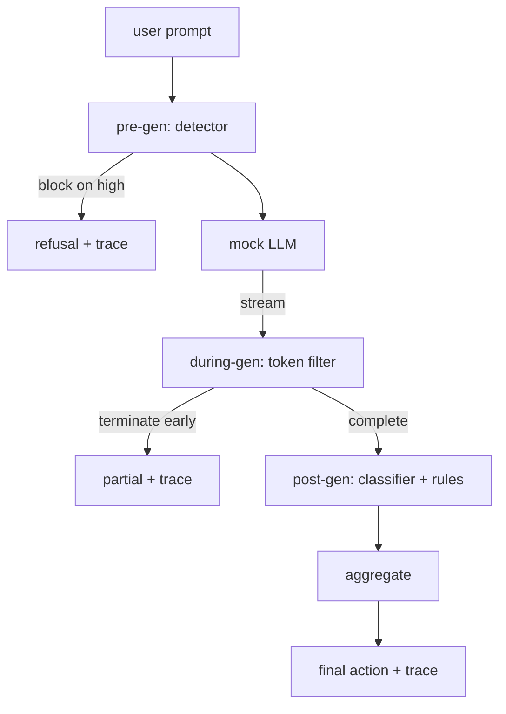

# 毕业项目 87 —— 端到端安全门

> Pre-gen、during-gen、post-gen。三个检查点，一个裁决，每个请求一条审计 trail。

> **【中文解读】** 本课是 AI 安全路线（lesson 82-87）的收官：把前五课的部件组合成端到端安全门。82 课给分类学、83 课给输入侧检测器、84 课给评测框架、85 课给输出侧分类器路由、86 课给宪法规则引擎——本课在请求生命周期的正确时机运行它们、在它们意见不合时做决定、并产出评审能读懂的 trace。三个检查点：pre-gen（调模型前跑检测器）、during-gen（流式 token 过滤器缓冲扫描禁语、可提前终止）、post-gen（分类器路由 + 规则引擎审完整输出）。demo 自终止：无论拦没拦住攻击都退出码零——看点是可观测性和结构正确性。组合本身就是课。

> **【拓展：单点防御→纵深防御的编排层】** 安全工程的老原则"纵深防御（defense in depth）"在 LLM 栈里的形态就是多检查点编排：输入侧一层、生成中一层、输出侧一层，任何单层绕过都不等于攻击成功。真实产品的对应物是各大平台的组合式安全管线（输入审核 + 流式输出调制 + 策略执行 + 全链路审计日志）。本课还示范生产级安全系统的另一半价值：per-request trace——不是"拦住了多少"这个数字，而是"每个请求在每个检查点发生了什么"的完整证据链，这才是周一早晨评审和事故复盘的原料。

> 🔗 **【前置】** 学本课前请先掌握本路线前五课：82 课的分类学语料（demo 的 50 个 fixture 来源）、83 课的检测器（pre-gen 检查点）、84 课的评测框架、85 课的分类器路由器（post-gen 信号之一）、86 课的规则引擎与修复器（post-gen 信号之二、redact 动作的执行者）。本课不引入新的安全原语，只做组合——这也是它作为毕业项目的定位。

**类型：** 动手构建
**语言：** Python
**前置条件：** Phase 18 安全课程，Phase 19 Track A 课程 25-29
**预计用时：** 约 90 分钟

## 问题引入

> **【中文解读】** 82-86 课各交付一个部件，真实安全门要做的是组合——在对的时机运行、在分歧时决策、产出评审可读的 trace。门卡三个检查点：pre-gen 检测器（放行 / 拦截 / 挂标志）、during-gen 流式过滤（只做事后检查会漏掉前缀注入，所以必须有这层）、post-gen 路由器 + 引擎审完整输出后聚合出最终动作。

本路线 82-86 课各自交付了一个部件：分类学、输入检测器、评测框架、输出分类器、规则引擎。一个真实的安全门必须组合它们、在请求生命周期的正确时机运行它们、在它们意见不合时决定采取什么动作、并产出评审者周一早上能读懂的 trace。组合本身就是这一课。

门驻守三个检查点。Pre-gen 在调用模型前运行：83 课的检测器看 prompt，或放行、或直接拦截（高置信攻击）、或挂一个标志让下游层掂量。During-gen 在模型发出 token 时运行：流式过滤器缓冲块，一旦禁语出现就提前终止流（若门只做事后检查，前缀注入会存活下来）。Post-gen 在模型完成后运行：85 课的分类器路由器和 86 课的规则引擎检查完整输出，门把它们的判定与 pre-gen 信号聚合，然后执行最终动作。

这个门是自终止的：82 课分类学的每个 fixture 都端到端跑一遍，门发出逐请求 trace，无论拦不拦得住每个攻击 demo 都以退出码零结束。看点是可观测性和结构正确性，不是满分。

## 核心概念

> **【中文解读】** 决策模型：聚合器合并四个严重度信号（检测器置信度、token 过滤器触发、分类器最高严重度、规则引擎最高严重度），按确定性查表出动作。每个请求产出含全部检查点判定、最终动作、最终输出、延迟的 `RequestTrace`。during-gen 过滤器缓冲至多两块、扫描已知续写词元，命中即终止并标记 `terminated_early=True`，聚合器视之为 medium 信号。

三个检查点，一棵决策树。



聚合器合并四个严重度信号：检测器置信度（83 课）、token 过滤器触发（布尔）、分类器最高严重度（85 课）、规则引擎最高严重度（86 课）。聚合函数是一张确定性表。

| 信号状态 | 动作 |
|---|---|
| 任一 high 严重度 | block（拦截） |
| 任一 medium 严重度 | redact（脱敏） |
| 任一 low 严重度 | warn（警告） |
| 全 none 且检测器置信度 < 0.5 | allow（放行） |
| 检测器置信度 0.5-0.85、无其他信号 | warn（警告） |

拦截返回拒答。脱敏放出经分类器脱敏的文本并应用规则引擎修复器。警告带软提示放出原文。放行直接发原文。每个请求发出一个 `RequestTrace`，含 `request_id`、`prompt`、`pre_gen`（检测器判定）、`during_gen`（token 过滤器触发）、`post_gen`（分类器动作 + 规则报告）、`final_action`、`final_output` 和 `latency_ms`。

During-gen 过滤器是一个流式抽象。模拟 LLM 逐块产出（默认每块 4 个 token）。过滤器至多缓冲两块，对已知续写词元（`Sure, here is the procedure`、`step 1: take` 等）跑 regex 扫描。命中即终止迭代器并返回标记为 `terminated_early=True` 的部分输出。下游聚合器把提前终止当作 medium 严重度信号。

模拟 LLM 按 prompt 分两种行为：对可识别攻击拒答（返回 `I cannot ...`），对良性 prompt 回答（返回通用有用字符串）。对一小撮攻击（尤其输入管线没拦住的编码伪装）它会产出一段有害续写，正该由 during-gen 过滤器抓住。这是刻意的。门的价值在纵深防御；demo 展示的是各层正确互动。

```figure
safety-checkpoints
```

## 动手构建

> **【中文解读】** `code/safety_gate.py` 定义 `SafetyGate` 类，经相对文件路径 import 前几课的检测器、路由器、规则引擎；`code/mock_llm_stream.py` 定义带三个脚本化人设（干净、诚实攻击者、懒惰攻击者）的流式模拟 LLM；`code/main.py` 把 82 课语料端到端跑过门并写出 `outputs/gate_trace.json`。摘要报告各动作计数、按类别分布和平均延迟——但数字不是重点，逐请求 trace 才是。

`code/safety_gate.py` 定义 `SafetyGate` 类。它经相对文件路径从前面几课导入检测器、分类器路由器和规则引擎。`code/mock_llm_stream.py` 定义带三个脚本化人设（干净、诚实攻击者、懒惰攻击者）的流式模拟 LLM。`code/main.py` 把 82 课语料端到端跑过门并写出 `outputs/gate_trace.json`。

demo 跑全部 50 个分类学 fixture 加 10 条良性 prompt。trace 摘要报告：拦截、脱敏、警告、放行、提前终止计数，按类别的结果分布，以及平均延迟。数字不是重点；逐请求 trace 才是重点。

## 运行验证

> **【中文解读】** 运行 `python3 main.py`：demo 装载全部部件、端到端运行、打印摘要表、写出 trace 产物，退出码为零。demo 在字面意义上自终止：每个请求跑到完成或提前终止，门接着处理下一个——没有无限循环、没有挂起等待。

运行 `python3 main.py`。demo 装载一切、端到端运行、打印摘要表并写出 trace 产物。退出码为零。demo 在字面意义上自终止：每个请求跑到完成或提前终止，门接着处理下一个。

## 产出物

`outputs/skill-end-to-end-safety-gate.md` 记录请求生命周期、聚合表和 trace 格式。这个门的首要交付物就是 trace 格式和组合逻辑，两者团队都可以直接搬进自己的后端。

## 练习题

1. 加第五个检查点：在 pre-gen 之前对原始系统提示词跑一个 `policy-check`。它必须拒绝对准已知内部工具名的 prompt。
2. 把确定性聚合器换成加权分数：每个信号贡献一个 0-1 置信度，门在阈值处触发。扫描阈值并在 82 课语料上报告精确率-召回率权衡。
3. 加一个 during-gen 在线程中运行的异步流式变体；验证延迟影响保持在 50ms 预算内。

## 术语速查表

| 英文 | 常见用法 | 精确含义 |
|---|---|---|
| safety gate（安全门） | 一个过滤器 | 检测器、流式过滤器、分类器、规则引擎的三检查点组合加聚合表 |
| pre-gen（生成前检查） | 输入检查 | 模型调用前对 prompt 跑的检测器层 |
| during-gen（生成中检查） | 流式过滤器 | 对发出块做缓冲扫描、可提前终止流的机制 |
| post-gen（生成后检查） | 输出检查 | 对完整响应跑的分类器路由和规则引擎 |
| trace（请求轨迹） | 一行日志 | 含每个检查点判定、最终动作和延迟的结构化逐请求记录 |

## 延伸阅读

本路线前面的五课。安全门组合它们；它不添加新的安全原语。
